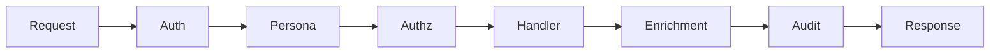

# Middleware Reference

Middleware processes requests and responses in a chain. Each middleware can inspect, modify, or short-circuit requests before they reach tool handlers, and can process responses on the way back.

## Middleware Chain



Requests flow through middleware from outer to inner, and responses flow back from inner to outer.

## Interface

```go
type Middleware func(next Handler) Handler

type Handler func(ctx context.Context, req mcp.CallToolRequest) (*mcp.CallToolResult, error)
```

Middleware wraps a handler and returns a new handler that can:

1. Inspect the request before calling `next`
2. Short-circuit by returning without calling `next`
3. Modify the request before passing to `next`
4. Inspect or modify the response after `next` returns
5. Handle errors from `next`

## Platform Context

The platform context carries request-scoped data through the chain:

```go
type PlatformContext struct {
    UserContext  *auth.UserContext
    Persona      *persona.Persona
    ToolkitKind  string
    ToolkitName  string
    ToolName     string
    RequestID    string
    StartTime    time.Time
}

// Get context from request context
pc := middleware.GetPlatformContext(ctx)

// Set context in request context
ctx = middleware.WithPlatformContext(ctx, pc)
```

## Built-in Middleware

### Authentication Middleware

Validates credentials and sets user context.

```go
func AuthMiddleware(
    oidcValidator *auth.OIDCValidator,
    apiKeyValidator *auth.APIKeyValidator,
) Middleware
```

**Behavior:**

1. Extracts Bearer token from request
2. Attempts OIDC validation if token looks like JWT
3. Falls back to API key validation
4. Sets `UserContext` in platform context
5. Returns 401 if validation fails

### Persona Middleware

Maps user roles to persona.

```go
func PersonaMiddleware(
    registry *persona.Registry,
    defaultPersona string,
) Middleware
```

**Behavior:**

1. Gets user context from platform context
2. Finds persona matching user roles
3. Falls back to default persona if no match
4. Sets `Persona` in platform context

### Authorization Middleware

Checks if persona allows the requested tool.

```go
func AuthzMiddleware() Middleware
```

**Behavior:**

1. Gets persona from platform context
2. Checks tool name against allow/deny patterns
3. Returns 403 if tool is denied

### Semantic Enrichment Middleware

Adds cross-service context to results.

```go
func SemanticEnrichmentMiddleware(
    semanticProvider semantic.Provider,
    queryProvider query.Provider,
    storageProvider storage.Provider,
    cfg EnrichmentConfig,
) Middleware
```

**Behavior:**

1. Calls the tool handler
2. Checks toolkit kind (trino, datahub, s3)
3. Fetches relevant context from providers
4. Appends enrichment to result content

### Audit Middleware

Logs tool calls for compliance.

```go
func AuditMiddleware(logger audit.Logger) Middleware
```

**Behavior:**

1. Records request start time
2. Calls the tool handler
3. Logs request details asynchronously
4. Does not block the response

## Chain Configuration

```go
chain := middleware.NewChain()

// Add middleware in order (outermost first)
chain.Use(middleware.AuthMiddleware(oidcValidator, apiKeyValidator))
chain.Use(middleware.PersonaMiddleware(registry, "default"))
chain.Use(middleware.AuthzMiddleware())
// ... handler executes here ...
chain.Use(middleware.SemanticEnrichmentMiddleware(semantic, query, storage, cfg))
chain.Use(middleware.AuditMiddleware(logger))
```

## Writing Custom Middleware

### Basic Pattern

```go
func MyMiddleware() middleware.Middleware {
    return func(next middleware.Handler) middleware.Handler {
        return func(ctx context.Context, req mcp.CallToolRequest) (*mcp.CallToolResult, error) {
            // Before: inspect or modify request
            log.Printf("Tool call: %s", req.Params.Name)

            // Call next handler
            result, err := next(ctx, req)

            // After: inspect or modify response
            if err != nil {
                log.Printf("Tool error: %v", err)
            }

            return result, err
        }
    }
}
```

### Request Modification

```go
func AddMetadataMiddleware(metadata map[string]string) middleware.Middleware {
    return func(next middleware.Handler) middleware.Handler {
        return func(ctx context.Context, req mcp.CallToolRequest) (*mcp.CallToolResult, error) {
            // Modify request arguments
            var args map[string]any
            json.Unmarshal(req.Params.Arguments, &args)

            for k, v := range metadata {
                args[k] = v
            }

            modified, _ := json.Marshal(args)
            req.Params.Arguments = modified

            return next(ctx, req)
        }
    }
}
```

### Short-Circuit

```go
func RateLimitMiddleware(limiter *RateLimiter) middleware.Middleware {
    return func(next middleware.Handler) middleware.Handler {
        return func(ctx context.Context, req mcp.CallToolRequest) (*mcp.CallToolResult, error) {
            pc := middleware.GetPlatformContext(ctx)

            if !limiter.Allow(pc.UserContext.Subject) {
                // Short-circuit: don't call next
                return mcp.NewToolResultError("rate limit exceeded"), nil
            }

            return next(ctx, req)
        }
    }
}
```

### Response Modification

```go
func TimingMiddleware() middleware.Middleware {
    return func(next middleware.Handler) middleware.Handler {
        return func(ctx context.Context, req mcp.CallToolRequest) (*mcp.CallToolResult, error) {
            start := time.Now()

            result, err := next(ctx, req)

            if result != nil && !result.IsError {
                // Append timing to result
                timing := map[string]any{
                    "execution_time_ms": time.Since(start).Milliseconds(),
                }
                timingJSON, _ := json.Marshal(timing)
                result.Content = append(result.Content, &mcp.TextContent{
                    Text: string(timingJSON),
                })
            }

            return result, err
        }
    }
}
```

### Error Handling

```go
func ErrorWrapperMiddleware() middleware.Middleware {
    return func(next middleware.Handler) middleware.Handler {
        return func(ctx context.Context, req mcp.CallToolRequest) (*mcp.CallToolResult, error) {
            result, err := next(ctx, req)

            if err != nil {
                // Convert Go error to tool error
                return mcp.NewToolResultError(fmt.Sprintf("Internal error: %v", err)), nil
            }

            return result, nil
        }
    }
}
```

### Conditional Middleware

```go
func ConditionalMiddleware(condition func(req mcp.CallToolRequest) bool, mw middleware.Middleware) middleware.Middleware {
    return func(next middleware.Handler) middleware.Handler {
        wrappedHandler := mw(next)

        return func(ctx context.Context, req mcp.CallToolRequest) (*mcp.CallToolResult, error) {
            if condition(req) {
                return wrappedHandler(ctx, req)
            }
            return next(ctx, req)
        }
    }
}

// Usage: only apply logging to trino tools
chain.Use(ConditionalMiddleware(
    func(req mcp.CallToolRequest) bool {
        return strings.HasPrefix(req.Params.Name, "trino_")
    },
    LoggingMiddleware(),
))
```

## Middleware Order

Order matters. Common patterns:

```go
// Authentication/Authorization first
chain.Use(AuthMiddleware(...))
chain.Use(PersonaMiddleware(...))
chain.Use(AuthzMiddleware())

// Request validation/transformation
chain.Use(ValidationMiddleware())
chain.Use(TransformMiddleware())

// Tool handler executes here

// Response processing
chain.Use(EnrichmentMiddleware(...))
chain.Use(TimingMiddleware())

// Logging/audit last
chain.Use(AuditMiddleware(...))
```

## Best Practices

**Keep middleware focused:**
Each middleware should do one thing. Compose multiple middleware for complex behavior.

**Don't swallow errors:**
Either return errors or handle them completely. Don't log and ignore.

**Use context for data:**
Pass request-scoped data via context, not global variables.

**Be careful with modification:**
Modifying requests or responses can make debugging difficult. Log changes.

**Consider performance:**
Middleware runs on every request. Expensive operations should be asynchronous or cached.

**Handle panics:**
Consider recovery middleware for production:

```go
func RecoveryMiddleware() middleware.Middleware {
    return func(next middleware.Handler) middleware.Handler {
        return func(ctx context.Context, req mcp.CallToolRequest) (result *mcp.CallToolResult, err error) {
            defer func() {
                if r := recover(); r != nil {
                    err = fmt.Errorf("panic: %v", r)
                    result = mcp.NewToolResultError("internal error")
                }
            }()
            return next(ctx, req)
        }
    }
}
```
