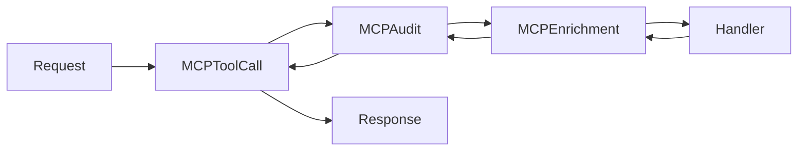

# Middleware Reference

Middleware processes requests and responses at the MCP protocol level. Each middleware intercepts `tools/call` requests before they reach tool handlers, and can process responses on the way back.

## Middleware Architecture



Middleware is registered via `server.AddReceivingMiddleware()` and executes in registration order for requests, reverse order for responses.

## MCP Middleware Interface

```go
// MCP middleware signature from the go-sdk
type Middleware func(next MethodHandler) MethodHandler

type MethodHandler func(ctx context.Context, method string, req Request) (Result, error)
```

## Platform Context

The platform context carries request-scoped data through the middleware:

```go
type PlatformContext struct {
    RequestID    string
    UserID       string
    UserEmail    string
    UserClaims   map[string]any
    Roles        []string
    PersonaName  string
    ToolName     string
    ToolkitKind  string
    ToolkitName  string
    Connection   string
    Authorized   bool
    AuthzError   string
}

// Get context from request context
pc := middleware.GetPlatformContext(ctx)

// Set context in request context
ctx = middleware.WithPlatformContext(ctx, pc)
```

## Built-in Middleware

### MCPToolCallMiddleware

Handles authentication and authorization at the MCP protocol level.

```go
func MCPToolCallMiddleware(
    authenticator Authenticator,
    authorizer Authorizer,
) mcp.Middleware
```

**Behavior:**

1. Only intercepts `tools/call` requests (passes through other methods)
2. Extracts tool name from request parameters
3. Creates PlatformContext with request ID and tool info
4. Runs authenticator to identify user
5. Runs authorizer to check tool access
6. Returns error result if auth fails, otherwise proceeds

### MCPAuditMiddleware

Logs tool calls for compliance and debugging.

```go
func MCPAuditMiddleware(logger AuditLogger) mcp.Middleware
```

**Behavior:**

1. Only intercepts `tools/call` requests
2. Records start time
3. Calls next handler
4. Gets PlatformContext (set by MCPToolCallMiddleware)
5. Builds audit event with timing, user, tool, parameters
6. Logs asynchronously (does not block response)

### MCPSemanticEnrichmentMiddleware

Adds cross-service context to tool results.

```go
func MCPSemanticEnrichmentMiddleware(
    semanticProvider semantic.Provider,
    queryProvider query.Provider,
    storageProvider storage.Provider,
    cfg EnrichmentConfig,
) mcp.Middleware
```

**Behavior:**

1. Only intercepts `tools/call` requests
2. Calls next handler to get result
3. Skips enrichment if result is error
4. Determines toolkit kind from tool name prefix (`trino_`, `datahub_`, `s3_`)
5. Calls appropriate enrichment function based on toolkit
6. Appends semantic context to result content

## Enrichment Configuration

```go
type EnrichmentConfig struct {
    EnrichTrinoResults          bool  // Add DataHub metadata to Trino results
    EnrichDataHubResults        bool  // Add Trino query availability to DataHub results
    EnrichS3Results             bool  // Add DataHub metadata to S3 results
    EnrichDataHubStorageResults bool  // Add S3 availability to DataHub results
}
```

## Middleware Registration

Middleware is registered in the platform during setup:

```go
// In platform.go finalizeSetup()

// 1. Auth/Authz middleware
p.mcpServer.AddReceivingMiddleware(
    middleware.MCPToolCallMiddleware(p.authenticator, p.authorizer),
)

// 2. Audit middleware (if enabled)
if p.config.Audit.Enabled {
    p.mcpServer.AddReceivingMiddleware(
        middleware.MCPAuditMiddleware(p.auditLogger),
    )
}

// 3. Semantic enrichment middleware (if any enrichment enabled)
if needsEnrichment {
    p.mcpServer.AddReceivingMiddleware(
        middleware.MCPSemanticEnrichmentMiddleware(
            p.semanticProvider,
            p.queryProvider,
            p.storageProvider,
            middleware.EnrichmentConfig{...},
        ),
    )
}
```

## Interfaces

### Authenticator

```go
type Authenticator interface {
    Authenticate(ctx context.Context) (*UserInfo, error)
}

type UserInfo struct {
    UserID   string
    Email    string
    Claims   map[string]any
    Roles    []string
    AuthType string // "oidc", "apikey", etc.
}
```

### Authorizer

```go
type Authorizer interface {
    IsAuthorized(ctx context.Context, userID string, roles []string, toolName string) (bool, string)
}
```

### AuditLogger

```go
type AuditLogger interface {
    Log(ctx context.Context, event AuditEvent) error
}

type AuditEvent struct {
    Timestamp    time.Time
    RequestID    string
    UserID       string
    UserEmail    string
    Persona      string
    ToolName     string
    ToolkitKind  string
    ToolkitName  string
    Connection   string
    Parameters   map[string]any
    Success      bool
    ErrorMessage string
    DurationMS   int64
}
```

## Best Practices

**Use MCP protocol-level middleware:**
All middleware should implement `mcp.Middleware` and be registered via `AddReceivingMiddleware()`.

**Check method type:**
Only intercept `tools/call` for tool-specific middleware. Pass through other methods unchanged.

**Use PlatformContext:**
Pass request-scoped data via PlatformContext, not global variables.

**Log asynchronously:**
Audit and logging middleware should not block the response.

**Handle errors gracefully:**
Return MCP error results rather than Go errors for client-facing failures.
