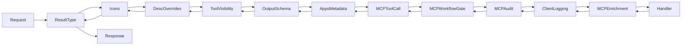

# Middleware Reference

Middleware processes requests and responses at the MCP protocol level. Each middleware intercepts `tools/call` requests before they reach tool handlers, and can process responses on the way back.

## Middleware Architecture


```mermaid
graph LR
    Request --> ResultType
    ResultType --> Icons
    Icons --> DescOverrides
    DescOverrides --> ToolVisibility
    ToolVisibility --> OutputSchema
    OutputSchema --> AppsMetadata
    AppsMetadata --> MCPToolCall
    MCPToolCall --> MCPWorkflowGate
    MCPWorkflowGate --> MCPAudit
    MCPAudit --> ClientLogging
    ClientLogging --> MCPEnrichment
    MCPEnrichment --> Handler
    Handler --> MCPEnrichment
    MCPEnrichment --> ClientLogging
    ClientLogging --> MCPAudit
    MCPAudit --> MCPWorkflowGate
    MCPWorkflowGate --> MCPToolCall
    MCPToolCall --> AppsMetadata
    AppsMetadata --> OutputSchema
    OutputSchema --> ToolVisibility
    ToolVisibility --> DescOverrides
    DescOverrides --> Icons
    Icons --> ResultType
    ResultType --> Response
```

The platform registers up to eleven middleware layers. Execution flows left-to-right for requests and right-to-left for responses. `ResultType` is the outermost layer and types every result the chain hands back; the canonical list, with each layer's ordering dependencies, is `receivingMiddlewareChain` in `pkg/platform/middleware_chain.go`.

## MCP Middleware Interface

```go
// MCP middleware signature from the go-sdk
type Middleware func(next MethodHandler) MethodHandler

type MethodHandler func(ctx context.Context, method string, req Request) (Result, error)
```

## AddReceivingMiddleware Ordering

`server.AddReceivingMiddleware()` wraps the current handler, making each newly-added middleware the **outermost** layer. The **last** middleware added runs **first**.

To achieve the desired execution order, middleware must be added innermost-first:

```go
// Desired execution: Visibility → Apps → Auth → WorkflowGate → Audit → Enrichment → handler
// Add order (innermost first):
server.AddReceivingMiddleware(enrichment)    // innermost
server.AddReceivingMiddleware(audit)
server.AddReceivingMiddleware(workflowGate)  // search-first gate (#787)
server.AddReceivingMiddleware(auth)          // outermost for tools/call
server.AddReceivingMiddleware(apps)          // apps metadata
server.AddReceivingMiddleware(visibility)    // overall outermost (if configured)
```

This ordering is critical for context propagation. Go's `context.WithValue` creates a new context. Values set in an outer middleware (like `PlatformContext` set by Auth) are visible to inner middleware (like Audit), but not the other way around.

## Platform Context

The platform context carries request-scoped data through the middleware:

```go
type PlatformContext struct {
    // Request identification
    RequestID   string
    StartTime   time.Time

    // User information
    UserID      string
    UserEmail   string
    UserClaims  map[string]any
    Roles       []string
    PersonaName string

    // Tool information
    ToolName    string
    ToolkitKind string
    ToolkitName string
    Connection  string

    // Authorization
    Authorized  bool
    AuthzError  string

    // Results (populated after handler)
    Success      bool
    ErrorMessage string
    Duration     time.Duration
}

// Get context from request context
pc := middleware.GetPlatformContext(ctx)

// Set context in request context
ctx = middleware.WithPlatformContext(ctx, pc)
```

## Built-in Middleware

### MCPToolCallMiddleware

Handles authentication, authorization, and toolkit metadata lookup at the MCP protocol level. Creates the `PlatformContext` that all inner middleware depends on.

```go
func MCPToolCallMiddleware(
    authenticator Authenticator,
    authorizer Authorizer,
    toolkitLookup ToolkitLookup,
) mcp.Middleware
```

**Behavior:**

1. Only intercepts `tools/call` requests (passes through other methods)
2. Extracts tool name from request parameters
3. Creates PlatformContext with request ID and tool name
4. Looks up toolkit metadata (kind, name, connection) via `ToolkitLookup`
5. Runs authenticator to identify user (populates UserID, Email, Roles)
6. Runs authorizer to check tool access (populates PersonaName, Authorized)
7. Resolves the explicit session handle (issue #792) via the optional `SessionResolver`: extracts the `session_id` argument, validates it against the session store (must exist, be unexpired, and belong to the same authenticated identity), adopts it onto `PlatformContext.SessionID`, and strips it before the handler runs. When handles are required, only a valid `platform_info`-minted handle satisfies the requirement; a transport-level `Mcp-Session-Id` (or the stdio sentinel) is not accepted as a fallback (issue #800), because it is the churning per-call value the handle exists to replace. A missing handle on a gated tool yields `SESSION_REQUIRED`; an unknown, expired, or cross-identity handle yields `SESSION_EXPIRED`. When handles are enabled but not required, a handle-less call falls back to the transport session.
8. Returns error result if auth or session resolution fails, otherwise proceeds

The `toolkitLookup` parameter is optional; if `nil`, toolkit metadata fields remain empty. The session resolver is supplied via `ToolCallConfig.SessionResolver` and is a valid `nil` no-op when explicit handles are disabled.

### MCPAuditMiddleware

Logs tool calls for compliance and debugging. See [Audit Logging](../server/audit.md) for full documentation.

```go
func MCPAuditMiddleware(logger AuditLogger) mcp.Middleware
```

**Behavior:**

1. Only intercepts `tools/call` requests
2. Records start time
3. Calls next handler
4. Gets PlatformContext (set by MCPToolCallMiddleware)
5. Builds audit event with timing, user, tool, and parameter data
6. Logs asynchronously in a goroutine (does not block response)

If PlatformContext is `nil` (auth middleware didn't run or middleware is misordered), audit logging is skipped with a warning.

### MCPWorkflowGateMiddleware

Enforces the search-first hard gate (issue #787): a query tool call is **refused** until a discovery tool (`search`, by default) has been called at least once in the session.

```go
func MCPWorkflowGateMiddleware(tracker *SessionWorkflowTracker) mcp.Middleware
```

**Behavior:**

1. Only intercepts `tools/call` requests
2. If the tool is not a gated query tool, or the scope has already performed discovery, the call proceeds unchanged
3. Otherwise the middleware short-circuits with a `SEARCH_REQUIRED` error result and **never invokes the tool handler**, so the query does not execute
4. Once `search` has been called once in a scope, subsequent query tool calls by that scope proceed with no further check (see **User-scoped discovery signal** below)

Modeled on `MCPSessionGateMiddleware`: it is positioned inner to `MCPToolCallMiddleware` (so `PlatformContext` is populated and the current call is recorded on the tracker) and outer to audit/enrichment (so a blocked call never reaches those layers). Enabled by default; disabled only when `workflow.require_search: false` leaves the tracker unconfigured. The former `MCPRuleEnforcementMiddleware` (a warn-after-execution mechanism) and the static `tuning.rules.require_datahub_check` hint have been removed.

**User-scoped discovery signal:** discovery is tracked per **`PlatformContext.DiscoveryScopeKey`**: a genuinely distinct authenticated user identity when known (`user:<id>`), falling back to the session ID (`session:<id>`), and empty (ungateable, fail-open) when neither exists. Keying on the user rather than the raw session ID is deliberate: some MCP clients (notably claude.ai's web connector) open a **new MCP session for every tool call**, so a session-keyed gate would record `search` under one throwaway session and check the follow-up query under a different one, a 100% false `SEARCH_REQUIRED` even though the agent did search. Scoping to the user makes a single `search` open the gate for that user's subsequent per-call sessions. Only a *distinct* identity is used: the shared `anonymous`/`noop` identity assigned when auth is disabled is not distinct (every caller shares one `UserID`), so those callers fall back to the per-session key rather than collapsing onto one global scope. The tradeoff is that, for authenticated users, discovery is per-user-recent rather than strictly per-session, so a stable-session client's second conversation can inherit the first's discovery within the sliding window; this is acceptable for a workflow-quality nudge. A deployment with authentication disabled falls back to per-session gating for every caller; if such a deployment is also behind a client that opens a new session per tool call, there is no stable identity to gate on and the gate should be disabled (`workflow.require_search: false`).

**Replica-shared discovery state (#789):** the per-scope "has performed discovery" signal lives in a `searchgate.Store`. When a database is configured the tracker uses the Postgres store (`pkg/searchgate/postgres`), so discovery recorded on one replica is visible to a query handled by another; without a database it uses an in-memory store, which is correct only for single-replica deployments. Semantics:

- **Single source of truth:** the shared store is authoritative; the tracker holds no replica-local "discovered" bit that could diverge from it, so the gate is consistent across replicas.
- **Sliding window:** ongoing query activity by a discovered session refreshes the shared record (store writes throttled to at most once per half of the session timeout), so a long active session is not re-gated mid-workflow.
- **Write resilience:** a failed discovery write persists nothing (there is no divergent local state); a forced discovery write always re-attempts, so the agent's next `search` retries persistence once writes recover.
- **Fail-open on read error (deliberate):** the gate decision follows the read. A total store outage (reads fail) fails open (allows queries, logged) rather than blocking every one, since the gate is a workflow quality guard, not a security boundary.
- **Fail-closed on write outage (deliberate):** a store that accepts reads but rejects writes leaves discovery un-persisted, so the read returns not-discovered and the caller is gated (`SEARCH_REQUIRED`) until writes recover. This is intentional: failing open on a write error would let one caller's transient write blip open the gate for everyone. If queries must proceed during a store-write outage, disable the gate (`workflow.require_search: false`).

### MCPResultTypeMiddleware

Guarantees that every `tools/call`, `prompts/get` and `resources/read` result carries the `resultType` the negotiated MCP protocol revision requires (issues #1382, #1383). Revision `2026-07-28` requires the field on every such result; a client on that revision rejects a result without it as invalid, and whatever the result said is lost.

```go
func MCPResultTypeMiddleware() mcp.Middleware
```

The SDK stamps `resultType: "complete"` on a result inside its own method handler, which is the innermost layer of the chain. A middleware that builds a result of its own never passes that layer: a refusal short-circuited by the gates (authz, session handle, search-first, purpose, rate limit), the error contract's normalized replacement of a bare error result, and a managed resource read all answer with a fresh result the SDK never typed. This middleware is therefore registered outermost, so it sees the final result whatever built it, and applies the SDK's own rule: for a session negotiated at `2026-07-28` or later the result is complete unless it carries input requests, and for an older client the field is left unset, exactly as the SDK leaves it.

### MCPOutputSchemaMiddleware

Opens the top level of every output schema a `tools/list` response advertises (issue #1381), so the schema admits the keys the platform adds to a tool's `structuredContent` after the tool's own handler has returned: the `{error}` envelope the error contract substitutes on failure, the `call_reference` appended to a data call, and the context blocks semantic enrichment mirrors in.

```go
func MCPOutputSchemaMiddleware() mcp.Middleware
```

A toolkit that registers a typed handler with no explicit output schema (mcp-trino did before v1.4.0) gets one inferred from its Go struct, and jsonschema-go closes every struct-derived object with `additionalProperties: false` and a `required` list; a client validating against that schema discarded every Trino result. The decorator gives each advertised object schema the same contract `middleware.OpenToolOutputSchema` gives the platform-owned tools: `additionalProperties` allowed, nothing required, and the error envelope documented under `error`. Nested schemas are untouched, the server's registry is never mutated (the listed `Tool` is replaced with a copy), and the SDK still validates a handler's own structured output against the schema it inferred, inside the handler wrapper and before any middleware runs. A tool that declares a non-object schema, or none, is listed as it is.

### MCPSessionHandleSchemaMiddleware

Advertises the explicit session handle (issue #792) by injecting a `session_id` string property into every tool's input schema on `tools/list` responses, except the init tool (`platform_info`, which mints the handle and takes no `session_id`).

```go
func MCPSessionHandleSchemaMiddleware(initTool string) mcp.Middleware
```

A list decorator like `ToolMetadataMiddleware`: it replaces each `Tool` in the response with a shallow copy carrying the augmented schema, so neither the server's shared tool registry nor upstream toolkits (mcp-trino, mcp-datahub, mcp-s3, gateway-proxied tools) are ever modified. Any schema representation (`*jsonschema.Schema`, `json.RawMessage`, or a map) is normalized via a JSON round-trip. Registered only when `sessions.handles.enabled` is on. The complementary extraction, validation, and stripping happens inside `MCPToolCallMiddleware` (see step 7 above).

### MCPDescriptionOverrideMiddleware

Replaces tool descriptions in `tools/list` responses to inject workflow guidance (e.g., "call datahub_search first"). Built-in overrides for `trino_query` and `trino_execute` are always active; config overrides take precedence.

```go
func MCPDescriptionOverrideMiddleware(overrides map[string]string) mcp.Middleware
```

**Behavior:**

1. Only intercepts `tools/list` responses
2. For each tool in the response, replaces its description if a matching override exists
3. Non-matching tools are unchanged

### MCPSemanticEnrichmentMiddleware

Adds cross-service context to tool results.

```go
func MCPSemanticEnrichmentMiddleware(
    semanticProvider semantic.Provider,
    queryProvider query.Provider,
    storageProvider storage.Provider,
    cfg EnrichmentConfig,
    memoryProvider MemoryProvider,
    pageProvider ...KnowledgePageProvider,
) mcp.Middleware
```

**Behavior:**

1. Only intercepts `tools/call` requests
2. Calls next handler to get result
3. Skips enrichment if result is error
4. Skips the export tools (`trino_export`, `api_export`, ...), whose result is asset metadata rather than rows: enriching it would describe the source tables the response does not contain
5. Determines toolkit kind from tool name prefix (`trino_`, `datahub_`, `s3_`)
6. Calls appropriate enrichment function based on toolkit
7. Appends semantic context to result content, and merges it into the structured result

### Blocks appended to a structured result

Semantic enrichment, the proven queries a describe carries, and the call
reference each append a JSON text block and merge the same block into
`structuredContent`, so a client that renders only structured output receives
them beside what the tool returned.

The merge happens only into a structured result the tool's own handler set, and
only when that result is a JSON object. A handler that returned none keeps its
response as it wrote it: a structured result synthesized from the appended
blocks alone is not context added to the tool's output, it is the tool's output
replaced by the platform's additions, and a structured-output client then reads
a response containing nothing it called the tool for.

`trino_export` is the tool this rule was written against. While it registered
through the untyped `Server.AddTool` path the SDK wrote no structured result,
so its payload (`asset_id`, `portal_url`, `row_count`, `size_bytes`) was a text
block and the appended `call_reference` arrived as a second text block beside
it; a client that concatenates text blocks handed the agent two JSON documents
run together (#1589). It now registers through the generic `mcp.AddTool` with
a typed output, as `api_export` does, so the SDK writes its output as the
structured result and the appended blocks merge into that one object. The rule
still applies wherever a response has no object to merge into: a
gateway-proxied tool whose upstream answered in text keeps its `call_reference`
in content only, as does a tool whose structured result is an array.

#### Tools on the untyped registration path

Every first-party tool registers through the generic `mcp.AddTool`, which
validates arguments against the input schema and writes the handler's output as
the structured result. `TestUntypedToolRegistrationInventory` (`verify_test.go`)
scans `pkg/`, `internal/` and `cmd/` for a registration through the untyped
`Server.AddTool` and fails on any that is not listed with a reason. The list:

| Registration | Reason |
|---|---|
| `pkg/toolkits/gateway/toolkit.go`, the forwarder for each tool an upstream MCP server exposes | The input schema and result shape are the upstream's, discovered at connect time; there is no Go type to register an output as. The forwarder relays the upstream's structured result when the upstream sends one. |

### MCPToolVisibilityMiddleware

Filters `tools/list` responses to hide tools that don't match configured allow/deny patterns. This reduces LLM token usage for deployments that only use a subset of toolkits. Only registered when patterns are configured.

```go
func MCPToolVisibilityMiddleware(allow, deny []string) mcp.Middleware
```

**Behavior:**

1. Only intercepts `tools/list` responses (passes through all other methods including `tools/call`)
2. Calls next handler to get the full tool list
3. Filters tools using `filepath.Match` patterns
4. No patterns configured = all tools visible
5. Allow only = only matching tools pass
6. Deny only = all tools pass except denied
7. Both = allow first, then deny removes from that set

This is a **visibility filter**, not a security boundary. Persona-level tool filtering via MCPToolCallMiddleware continues to gate `tools/call` independently.

### MCPIconMiddleware

Injects config-driven icons into `tools/list`, `resources/templates/list`, and `prompts/list` responses. Upstream toolkits provide default icons; this middleware allows deployers to override or add custom icons via configuration.

```go
func MCPIconMiddleware(cfg IconsMiddlewareConfig) mcp.Middleware
```

**Behavior:**

1. Intercepts list responses (`tools/list`, `resources/templates/list`, `prompts/list`)
2. Matches tools/resources/prompts by name or URI
3. Appends configured icons to matching entries
4. Passes through all other methods unchanged

Registered by default (`icons.enabled` defaults to `true`); set `icons.enabled: false` to disable.

### MCPClientLoggingMiddleware

Sends server-to-client log messages via the MCP `logging/setLevel` protocol. Reports enrichment decisions, timing data, and platform diagnostics. Zero overhead if the client hasn't called `setLevel`.

**Behavior:**

1. Only active for `tools/call` requests
2. Sends log messages using the server session's `LoggingMessage` method
3. Messages include enrichment details, query timing, and semantic cache hits
4. No-op if the client hasn't subscribed via `logging/setLevel`

Registered by default (`client_logging.enabled` defaults to `true`); set `client_logging.enabled: false` to disable.

### ToolMetadataMiddleware (MCP Apps)

Injects `_meta.ui` fields into `tools/list` responses for tools that have associated MCP Apps.

```go
func ToolMetadataMiddleware(reg *mcpapps.Registry) mcp.Middleware
```

**Behavior:**

1. Intercepts `tools/list` responses (not `tools/call`)
2. For each tool with an associated MCP App, adds UI metadata to the response

## Enrichment Configuration

```go
type EnrichmentConfig struct {
    EnrichTrinoResults          bool  // Add DataHub metadata to Trino results
    EnrichDataHubResults        bool  // Add Trino query availability to DataHub results
    EnrichS3Results             bool  // Add DataHub metadata to S3 results
    EnrichDataHubStorageResults bool  // Add S3 availability to DataHub results
}
```

## Middleware Registration

Middleware is registered in `platform.go` `finalizeSetup()`. The add order is innermost-first because `AddReceivingMiddleware` makes each call the new outermost layer:

```go
// 1. Semantic enrichment (innermost) - enriches responses
if needsEnrichment {
    p.mcpServer.AddReceivingMiddleware(
        middleware.MCPSemanticEnrichmentMiddleware(
            p.semanticProvider, p.queryProvider, p.storageProvider, enrichCfg,
        ),
    )
}

// 2. Audit - logs tool calls (reads PlatformContext from Auth)
if p.config.Audit.IsToolCallLoggingEnabled() {
    p.mcpServer.AddReceivingMiddleware(
        middleware.MCPAuditMiddleware(p.auditLogger),
    )
}

// 3. Search-first gate - refuses query tools until search is called (#787).
//    Short-circuits a blocked call before audit/enrichment; outer to Audit.
if p.workflowTracker != nil {
    p.mcpServer.AddReceivingMiddleware(
        middleware.MCPWorkflowGateMiddleware(p.workflowTracker),
    )
}

// 4. Auth/Authz - creates PlatformContext (must be outer to Audit and gate)
p.mcpServer.AddReceivingMiddleware(
    middleware.MCPToolCallMiddleware(p.authenticator, p.authorizer, p.toolkitRegistry),
)

// 5. MCP Apps metadata
if p.mcpAppsRegistry != nil && p.mcpAppsRegistry.HasApps() {
    p.mcpServer.AddReceivingMiddleware(
        mcpapps.ToolMetadataMiddleware(p.mcpAppsRegistry),
    )
}

// 6. Tool visibility (overall outermost, only if patterns configured)
if len(p.config.Tools.Allow) > 0 || len(p.config.Tools.Deny) > 0 {
    p.mcpServer.AddReceivingMiddleware(
        middleware.MCPToolVisibilityMiddleware(p.config.Tools.Allow, p.config.Tools.Deny),
    )
}
```

## Interfaces

### Authenticator

```go
type Authenticator interface {
    Authenticate(ctx context.Context) (*UserInfo, error)
}

type UserInfo struct {
    UserID   string
    Email    string
    Claims   map[string]any
    Roles    []string
    AuthType string // "oidc", "apikey", etc.
}
```

### Authorizer

```go
type Authorizer interface {
    // IsAuthorized checks if the user can use the tool.
    // Returns:
    //   - authorized: whether the user is authorized
    //   - personaName: the resolved persona name (for audit logging)
    //   - reason: reason for denial (empty if authorized)
    IsAuthorized(ctx context.Context, userID string, roles []string, toolName string) (authorized bool, personaName string, reason string)
}
```

### ToolkitLookup

```go
type ToolkitLookup interface {
    // GetToolkitForTool returns toolkit info (kind, name, connection) for a tool.
    // Returns found=false if the tool is not found in any registered toolkit.
    GetToolkitForTool(toolName string) (kind, name, connection string, found bool)
}
```

### AuditLogger

```go
type AuditLogger interface {
    Log(ctx context.Context, event AuditEvent) error
}

type AuditEvent struct {
    Timestamp    time.Time      `json:"timestamp"`
    RequestID    string         `json:"request_id"`
    UserID       string         `json:"user_id"`
    UserEmail    string         `json:"user_email"`
    Persona      string         `json:"persona"`
    ToolName     string         `json:"tool_name"`
    ToolkitKind  string         `json:"toolkit_kind"`
    ToolkitName  string         `json:"toolkit_name"`
    Connection   string         `json:"connection"`
    Parameters   map[string]any `json:"parameters"`
    Success      bool           `json:"success"`
    ErrorMessage string         `json:"error_message,omitempty"`
    DurationMS   int64          `json:"duration_ms"`
}
```

## Best Practices

**Understand `AddReceivingMiddleware` wrapping:**
Each call makes the new middleware the outermost layer. Add innermost middleware first. If middleware B reads context values set by middleware A, then A must be outer to B (added after B).

**Check method type:**
Only intercept `tools/call` for tool-specific middleware. Pass through other methods unchanged.

**Use PlatformContext:**
Pass request-scoped data via PlatformContext, not global variables.

**Log asynchronously:**
Audit and logging middleware should not block the response.

**Handle errors gracefully:**
Return MCP error results rather than Go errors for client-facing failures.
