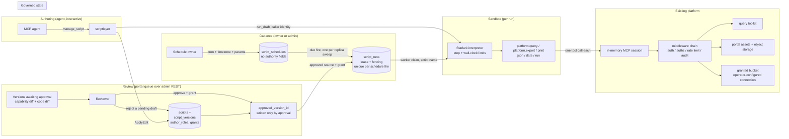

# Managed Scripts: Security Model

This document is the threat model for managed scripts: what the feature adds to
the platform's attack surface, what it deliberately does not, and where the
residual risk sits. It is the security counterpart to the platform-wide
[Threat Model](../security/threat-model.md), which this document assumes rather
than repeats, and it is revised in step with the feature: every change to the
managed-scripts surface updates it in the same change.

Every claim below carries a package or file citation a reviewer can check
against the source. Where a protection does not exist, this document says so.

Reviewed at the state of the tree that introduced external delivery: an approved
version may write output to a bucket an operator configured, at an address bound
to the version by its approval. The revision before it introduced the review
surface — the queue of versions awaiting a decision, the capability and code
diffs a reviewer reads, the rejection of a pending draft, and the alert an
unworked queue raises — and the ones before that the script domain and the
authoring loop, then approved execution (the capability grant, the script
principal, the run queue, and `run_script`), then worker mode, then cron
scheduling.

## What a managed script is

A managed script is a small Starlark program the platform stores, versions, and
governs, so that a process whose logic is already solved (a KPI report, a
recurring export) can be re-run without re-deriving it through a model. Scripts
are authored by an agent through the `manage_script` MCP tool, executed by an
embedded interpreter, and constrained to a small, enumerable set of host
functions.

The state of the feature at this revision:

- A script can be created, edited, validated, and dry-run.
- A version can be **approved**, which binds the capability set that version may
  use and points the execution gate at it. Approval is the load-bearing control
  of everything below, and it now has a human surface: a review queue in the
  portal that shows what a reviewer is agreeing to before they agree to it (see
  [Review is a surface, not an API call](#review-is-a-surface-not-an-api-call)).
- An approved version executes on demand through `run_script`: the tool queues a
  run and a worker on some replica executes it, unattended, as the script's own
  principal.
- An approved version also executes on a **cron schedule**. A schedule is a row
  saying when; a materializer on every worker replica turns a due schedule into
  a run row, and the same worker executes it under the same grant. There is
  still no scheduler process, and a schedule grants nothing (see
  [Schedules](#schedules-cadence-and-nothing-else)).
- An approved run **writes**: `platform.export` persists a portal asset version,
  or — where the approval bound a bucket destination — delivers the same bytes
  to an operator-configured bucket (see
  [Delivery: leaving the platform](#delivery-leaving-the-platform)). A draft run
  still writes nothing wherever it is addressed: it serializes the output with
  the same formatter an approved run would, and reports the shape and size that
  produced without storing it (`internal/platform/scriptrun/host.go`,
  `hostState.export`, `persistOrPreview`, `FormatOutput`).

## The claim this feature makes about authority

**A managed script can never do what the person who wrote it could not do.**

That is a structural property, not a policy, and it holds across both execution
paths.

**A draft run authenticates as the caller.** `run_draft` reads the caller's own
identity off the `PlatformContext` of the `manage_script` call that reached it
and injects exactly that identity into the run's session
(`internal/platform/scriptlayer/rundraft.go`, `connectAuthorSession`). A caller
can do nothing through `run_draft` that they could not do by calling the same
tools directly. The proof is an integration test against the real assembled
server asserting that the audit row for a script's query carries the author's
user id, email, and persona
(`internal/platform/scriptlayer/rundraft_integration_test.go`,
`TestIntegration_DraftRunCarriesTheAuthorIdentityAndIsAudited`).

**An approved run authenticates as `script:<name>`, carrying the roles the
version's AUTHOR held.** An unattended run happens with nobody present — no
token, no session, no live identity to resolve — so the authority it presents
has to have been captured earlier. It is captured from the author, at the moment
they write the version (`pkg/script/version.go`, `Author`;
`internal/platform/scriptlayer/scriptlayer.go`, `callerAuthor`), stored on the
immutable version row (`script_versions.author_roles`), and copied into the
grant by the approval itself (`internal/platform/scriptstore/approve.go`,
`ApproveVersion`). **The approval request cannot name roles.** A reviewer
decides what a script may *reach*; they cannot decide what authority it holds.

Both paths cross the full middleware chain. Each host call is one MCP tool call
over a per-run in-memory session against the assembled server
(`internal/platform/scriptrun/session.go`, `SessionCaller.CallTool`), so
authentication, persona and connection authorization, rate limiting, and audit
all apply exactly as they do to an agent's call. None of it is re-implemented,
which is what keeps it from drifting.

What approved execution DOES add, and what this document does not minimize:

- **Standing authority.** The roles a version captured keep working after the
  author stops working — over a weekend, and after they leave. That is inherent
  to unattended automation, and the controls over it are the approval gate, the
  script lifecycle (disable, deprecate, supersede — each refused by the gate at
  execution time), and audit.
- **Definer rights.** Anyone who can *see* a script can run it, and it runs with
  its own authority rather than theirs, so its output can reach a caller who
  could not have produced it. Visibility is therefore the control: a global
  script is runnable by everyone who can see it, and scope is part of what a
  reviewer approves.

  Because visibility is the control, widening WHERE a script can be seen is a
  security-relevant change even when it grants nothing. A script is reachable
  from `search` and `fetch` (`mcp:script:<id>`), from a prompt that references
  it, and from the portal's own script pages, in addition to `manage_script
  list`. Each of those surfaces
  applies the script's own scope rule as a store predicate rather than a filter
  over the answer, so a caller sees exactly the set `manage_script list` would
  show them and nothing more: a personal script belonging to somebody else has
  neither a hit, nor a fetchable document, nor a resolvable reference from a
  prompt. Discovery reports; it grants nothing. Finding a script says it exists
  and what it takes, and running it is still `run_script` under the execution
  gate and the grant its approval bound. What the surfaces return is the
  script's contract — name, description, owner, typed parameters, approval
  state, cadence, last successful run — never its source, which stays behind
  `manage_script get`, the review surface, and the portal script page's version
  history, all three of which are the owner's and the administrator's.

`middleware.SourceScript` is a label on a call, not a capability. It records how
the call arrived so audit can separate populations, and it selects three
behaviors described below; it grants nothing (`pkg/middleware/mcp.go`).

## Assets

| Asset | Why it matters |
|---|---|
| Script source and its version history | Executable code under governance; the artifact a reviewer approves |
| `scripts.approved_version_id` | The execution gate. The one pointer that decides what the platform executes on its own |
| `script_versions.author_roles` | The authority ceiling an approval may bind. Whoever can write a version decides what approving it can grant |
| `script_versions.grants` | What an approved version may reach: roles, connections, capabilities, destinations |
| Data reachable through `platform.query` | Whatever the running identity's persona and connections allow |
| Run records (`script_runs`) | Parameters, timings, output ids, and the log a run printed; readable by the script's owner, an administrator, and whoever requested that particular run |
| Output assets | Portal assets a run writes, with the script principal as owner and the script's owner as the accountable person |
| Delivered objects | Data an approved run writes out of the platform, into the bucket and prefix its grant names, where the platform's own access controls no longer apply |
| Run logs | Bounded free text a script chooses to emit; may echo queried data |
| Connection credentials | Never reachable from a script; held by the platform and used by the toolkit |

## Actors

| Actor | Capability at this revision |
|---|---|
| Script author (any authenticated caller) | Creates and edits their own personal scripts; runs drafts as themselves |
| Admin persona | The above at every scope, plus scope and lifecycle changes |
| Reviewer (admin portal or API) | Approves a version, binding the connections and capabilities it may use and the addresses its output may be written to, and rejects a pending draft; cannot widen its authority beyond the version author's roles |
| Schedule owner (the script's owner at any scope, or an admin) | Sets the cadence, timezone, and bound parameters of a script's schedule, and turns it on or off, from `manage_script` or from the portal; grants nothing |
| Script principal (`script:<name>`) | Exists only inside an approved run; holds the grant bound at approval and nothing else |
| The script itself | Only the host functions listed below, only through the running identity |

## Trust boundaries

A schedule sits outside both boundaries below. It writes a run row and nothing
else; the gate and the grant still decide what that row may execute.

Two boundaries matter. The first is between the interpreter and the platform: a
script reaches the outside world only by calling a host function, and every host
function crosses the middleware chain as the running identity. There is no other
edge out of the interpreter — including the delivery edge, which is a tool call
on an operator-configured connection like any other.

The second is the execution gate. Everything to the left of it is authoring,
where a script is inert; everything to the right runs with nobody watching. One
pointer, written by one action, separates them.

## Controls

### The execution gate

`scripts.approved_version_id` is the whole of it. The runner loads code from
that pointer and from nothing else, and one action writes it
(`internal/platform/scriptstore/approve.go`, `ApproveVersion`) inside one
transaction under the script row lock, which also stamps the approval, binds the
grant, applies an approved draft onto the live record, and supersedes the other
pending drafts — so the code being served and the code being executed cannot
diverge.

The gate is re-read at execution, not merely at queueing (`pkg/script/run.go`,
`RefuseRun`). Between a run being requested and a worker picking it up, a script
can be disabled, deprecated, superseded, or re-approved onto a different
version; each of those refuses the run rather than executing a version whose
approval has moved. One function decides this for every path into execution, so
a second producer of runs cannot arrive with a slightly different idea of what
is executable.

The edit funnel is the other half: once a version is approved, a change to a
script's substance becomes a pending draft rather than an edit to what executes
(`pkg/script/edit.go`, `RequiresReview`), and the store re-validates that under
the row lock so an edit racing an approval is refused rather than applied.

### A personal script is approved for its owner

One case does not go through a reviewer. A script at `personal` scope, whose
version was written by the person who owns it, is approved on save
(`internal/platform/scriptauto`, `pkg/script/autoapprove.go`). Its entire
audience is its author, and the roles an approved run presents are copied from
that author and refused from the approval request, so asking an administrator to
approve it was asking a person to authorize somebody against themselves.

**It mints a grant; it does not skip one.** `Grants.Validate` refuses an empty
roles list and a nil grant makes every `allow*` check in the host facade
short-circuit to permit, so an approval with nothing bound would be worse than
no approval. The grant is derived from the same static read of the source the
review route checks a reviewer's grant against (`scriptrun.Validate`):

- capabilities and connections are what the code names;
- a `portal` destination resolves to the canonical portal address;
- any other destination resolves to the address the script's currently approved
  version already pins, because where a bucket destination points is a person's
  decision and nothing in the source states it. A destination with no pinned
  address goes to review, so the FIRST delivery to a bucket is reviewed and a
  reviewer pins the address; the owner's later edits are approved against it.

**Anything unreadable goes to review.** A source that does not parse, one that
computes its connection or destination instead of naming it, an author holding
no roles, and a connection the author's own persona cannot reach are each
refused (`script.DeriveGrants`, `script.RefuseUnreachable`), and the refusal is
returned to the person who pressed save, naming what stopped it. The version
then sits in the review queue exactly where it sat before this path existed.
The decision is taken BEFORE the edit is written (`AutoApprover.Consider`),
which is what keeps a declined edit out of the state where the live row is ahead
of the version the gate names and nothing lists it as waiting. The verdict is
carried into the write (`UpdateWithVersion`'s `ungated`) rather than re-derived
under the row lock, so the store's gate re-validation still refuses every edit
the funnel deferred, including one racing an approval.

**The gate stays intact where it is still doing work.**

- An edit written by anybody other than the owner is not covered. An
  administrator editing another person's script is the author of what they
  wrote, and their roles are what the version would capture, so that edit goes
  to review. Two things hold that, at different distances: the funnel offers
  automatic approval only the version an edit PRODUCED — an edit that moved no
  versioned field produces none, and the version the live row already carries
  was written by somebody at some other time — and the store refuses outright to
  approve automatically any version whose author does not own the personal
  script (`scriptstore/approve.go`, `autoApprovable`). The second is where the
  roles are actually read, which is why the invariant lives there rather than
  only in the caller.
- Widening scope off `personal` withdraws the automatic approval: the execution
  pointer is cleared and the version's stamp and grant are removed, inside the
  same transaction as the scope change (`scriptstore/approve.go`,
  `withdrawAutoApproval`), which returns it to the review queue. An approval a
  PERSON made survives the change — they decided, and widening the audience does
  not un-decide it.
- A script is its owner's to delete. `manage_script delete` refuses a script
  with an approved version in favour of deprecating it, because it may be
  executing on a schedule for somebody — except where the caller IS that
  somebody. Every personal script now carries an approval on save, so keeping
  that refusal would have left an owner unable to delete anything they wrote,
  and the remedy it names (deprecating) is an administrator's action. Deleting
  takes the script's schedule and history with it, and nobody else could see it,
  run it, or notice it go.
- An automatic approval is recorded as one. `script_versions.auto_approved`
  separates the owner's authorship from somebody's decision, the run's audit
  event carries `approval=auto`, and the contract document, the version history
  and the review surfaces all say plainly that nobody reviewed it.

What this accepts is stated in [residual risks](#residual-risks) 11 and 12: an
unattended run on standing authority, and egress to a bucket on a cadence, each
with one person involved. Both remain bounded by the author's persona, which the
middleware chain enforces independently of the grant, and by the audit record of
every run.

### Review is a surface, not an API call

The gate above is only as good as the decision behind it, and a decision made
by POSTing a JSON grant is a decision made without seeing what it covers. The
portal's Scripts page (`ui/src/pages/scripts/`, over
`internal/httpserver/scripthttp`) is where that decision is made instead.

**The queue is what is not executing.** A version is waiting when it is a
pending draft, or when it is the live version of a script that has never had
one approved (`internal/platform/scriptstore/review.go`,
`pendingReviewQuery`). A personal script its owner wrote is approved on save and
so is never in the queue; one whose grant could not be read off its source is,
which is the only way a personal script reaches a reviewer. The second case matters: a brand-new script's only
version is recorded `applied`, so a queue built on version status alone would
show nothing waiting while the script sat unrunnable. The queue holds one row
per script — approving any version supersedes that script's other pending
drafts, so competing drafts are one decision, not several.

A script the execution gate would refuse anyway is excluded, on the same list
the gate refuses on (`pkg/script/run.go`, `RefuseRun`): disabled, deprecated,
or superseded. Approving one changes nothing, and nothing could clear it — a
disabled script's unapproved live version is not a draft, so it cannot be
rejected either, and it would sit in the queue and in every alert forever.
Re-enabling the script brings its decision back, which is the state where
approving it means something again.

**Both halves of the diff come from one read.** The review endpoint returns the
version, what a static read of its source reaches for, what the current grant
does not cover, the validator's findings, and the version the execution gate
points at today: its grant, its approval stamp, and the unified diff from its
source to this one (`internal/httpserver/scripthttp/review.go`,
`baselineFor`). Assembling that from two requests would let an approval landing
between them show a reviewer a change measured against code that is no longer
the baseline, which is the one thing a review must not get wrong. A gate
pointing at a version that cannot be read omits the comparison rather than
reporting the version as a first approval — the opposite of the truth.

**What the surface refuses to imply.** Roles are shown and are not editable,
because the approval copies them from the version's author and the request
cannot carry them; a control that offered them would advertise an escalation
path that does not exist. A widening is stated rather than left to be inferred
from three lists. A version whose source computes a connection name is reported
as unreadable in that respect rather than shown a list that quietly omits it.

**Rejecting decides nothing about what runs.** It marks a pending draft
rejected and leaves the live script and its approved version untouched
(`internal/platform/scriptstore/review.go`, `RejectVersion`), and the status
predicate is in the UPDATE rather than in a read before it, so a draft approved
or superseded in between is refused rather than relabelled. Only a draft can be
rejected: the live version of a never-approved script is also awaiting review,
but rejecting it would mark the code the script is serving as rejected while it
kept being served, and declining it means leaving it unapproved, which is
already its state.

**A rollback is a review, not an exception.** Any version can be approved from
the history, which points the gate back at it and reapplies its snapshot to the
live row. The surface offers it rather than hiding it, because the alternative
to a visible rollback is an operator editing the database.

**An unworked queue is reported.** The same scheduled check that watches the
knowledge review queue watches this one, over its own settings section,
thresholds, and recipients (`internal/platform/reviewalert`, `ScriptTarget`).
It is one implementation for both queues rather than a copy per queue, and the
single-winner conditional claim is per queue key, so one queue's cooldown never
silences the other. What it counts is what the review surface lists — the same
query — so the number in the email is the number an operator finds when they
open the queue.

### Reading is a surface too, and it grants nothing

The review surface above is an administrator's. The people who own the
automations are frequently not administrators, and until the portal's own
script pages existed (`ui/src/pages/scripts/MyScriptsPage.tsx` and
`ScriptDetailPage.tsx`, over `internal/httpserver/scripthttp`'s portal routes)
they could read their own scripts only by asking an agent to call a tool.

The surface writes five things, and none of them is an authority.

A script's cadence, by the person who owns it
(`internal/httpserver/scripthttp/portalschedule.go`), which carries nothing: the
gate and the grant are re-read at every fire.

A script's SOURCE (`portalsource.go`), which crosses `script.ApplyEdit` — the
one gate every mutation surface crosses — so an edit to a script with an
approved version becomes a draft awaiting review and the approved version keeps
running until somebody approves the change. The version records the roles its
editor held, which is the ceiling on what approving it can ever grant.

A run of the APPROVED version, asked for by its owner (`portalrun.go`). It
queues exactly what `run_script` queues and adds no path into execution: the run
is executed by a worker under the script principal, with the grant its approval
bound, and whether one is admitted at all is `script.RefuseNewRun`'s answer —
the same one `run_script` obeys and the contract document reports — so this
route cannot run what those two call unrunnable. The run's `trigger` records
`portal` rather than `tool`, which is a label on who asked and not a difference
in what executed.

A DRAFT run of an edit, executed as the caller (`portaldraft.go`, over
`internal/platform/scriptdraft`). This is discussed on its own below.

What a script SAYS about itself — its display name, its markdown description,
the category it is filed under and its tags (`portaledit.go`, #1369). This
one is worth being explicit about, because "it changes the record and needs no
review" is the shape a widening usually hides in. It is not one: none of the
four is an input to any decision the platform makes. The execution gate is an
approved version id, the grant is bound to that version, and visibility is scope
plus owner — a description cannot move any of them. `script.RequiresReview` keys
on the source and the parameter contract alone, so this applies to the live row
directly, and the version that is executing is untouched. The edit still crosses
`script.ApplyEdit` like every other mutation and is captured as a version, so
what a script claimed to do at the time one of its runs ran is still on record.
The route is the owner's and the administrator's, answering not-yours and
does-not-exist identically, as every other owner route does.

Approving a version and the grant that approval binds stay on the admin API
behind admin authentication, and no portal route can approve, reject, or widen
anything. Widening
who can READ a script is still a security-relevant change, for the reason stated
above under definer rights, so the rules are stated exactly.

**Who a caller is, before who may read.** Every rule below compares an owner
with a caller, so the identity being compared has to be specific to one person.
It is the caller's email; their user id when the credential carries no email,
which an OIDC token without an `email` claim does not; and the name
`anonymous` only when no identity was presented at all, which is the
single-caller deployment with no authenticator. Collapsing the second case onto
the third would make every email-less caller the same owner, and a personal
script is exactly as private as that comparison is specific. A script whose
owner cannot be established matches nobody but an administrator.

**Three tiers, one rule each, applied by every surface.**

| What | Who | Why |
|---|---|---|
| That a script exists, and its contract: name, owner, typed parameters, approval state, cadence, and the outputs of its last successful run | Anyone the scope rules admit (`Script.VisibleTo`) | This is what makes a script discoverable and usable, and it is what `search`, `fetch`, and a prompt reference already serve |
| Its source, the capability grant bound to each version, its run history, and the values its schedule BINDS | The script's owner, and administrators | The source and the grant are the material a review is made of; a run's log is free text the script printed while holding ITS grant and may echo rows the reader has no access to of their own; a schedule's bindings are what the owner configured this automation to ask about, which the cadence itself does not reveal |
| One run in particular | The above, plus whoever requested that run | The result was handed to them when they asked for it, so a run id they hold stays followable |
| Setting, re-timing, pausing, and resuming its cadence | The script's owner, and administrators | A cadence is not an authority: the gate and the grant are re-read at every fire, so re-timing reaches nothing new (`Schedules`, below) |

The listing applies the first rule as a store predicate rather than as a filter
over the answer, exactly as `search` does; a script the caller may not see never
reaches the response. The second and third rules answer "not yours" and "no such
script" identically, so the difference cannot be used to learn that something
exists. An administrator is unrestricted here, which is the same authority the
admin API already gives them.

A row the caller does not own is projected to what that caller is entitled to
(`reportableScript`, `reportableSchedule`): the source is dropped, because
reading the code is what the version history is for and that is the owner's;
and the cadence keeps its expression, zone, and next fire but not the values
every fire binds, because the cadence is in the contract document every surface
serves and the bindings are the owner's.

**The listing asks about nothing it may not report.** Each script's most recent
run is fetched for the OWNED rows only, in one query, so the row a caller is not
entitled to is not read and then discarded. A listing that cannot reach the
schedule store or the run store still lists the scripts, with those columns
empty: a page that fails whole over a decoration is worse than a page that says
less.

**A run's outputs are named, and only some are offered.** An output written to
the portal links to the asset version it produced; an object delivered to a
granted bucket names its bucket and key and is not a link, because the platform
wrote those bytes and does not hold them. The delivered copy is evidence of a
delivery, not a way to read it back.

**What is embedded is the contract, never the source.** A script's description
card is embedded off the request path by the scripts consumer of the shared
index-jobs framework (`internal/platform/scriptindex`), so a script is found by
what it does and not only by the words it was named with. The text is
`script.IndexText`: the title, the description, the parameter names, the tags,
and the one line stating whether anything will execute it. It is exactly the
first tier of the table above, and it is the same text a caller is shown as the
search snippet.

The source is excluded because it belongs to a narrower tier. There is one
vector per script row, stored inline as prompts and memory store theirs, and one
vector cannot be split along a line that admits the contract to everyone the
scope rules admit and the source only to the owner and to administrators. A
vector built partly from source would let code a caller may not read decide how
their results rank, which is the objection that reclassified a run log as
owner-only: a log is free text the script printed under ITS grant. Ranking is a
read, and a read of the source by proxy is still a read of the source.

Nothing is widened by the index. The store applies the same scope predicate to
both the semantic and the lexical arm before ranking, so a script the caller
cannot see reaches neither, and a hit still says only that a script exists and
what it takes.

**`show_scripts` performs no data work.** It is presentation-only, following the
`show_prompts` split for the same reason: an app is rendered in response to a
tool call, and tool calls are made by agents, so a presentation surface attached
to the tool an agent uses for its own work would put a page in front of a user
every time the agent read a script. It returns a confirmation and, where the
deployment has been configured with its public address, a link to the pages; it
carries no script data, which is also what keeps it useless to an agent as a
source of one (`internal/platform/scriptlayer/show.go`).

### Checking an edit: validate, and a draft run as yourself

An author could edit a script in the portal and could not find out whether what
they wrote worked. The two mechanisms that answer that existed and were
reachable only from an agent session; both are now on the editor (#1364).

**Validate** (`POST /api/v1/portal/scripts/{id}/validate`) is a static read.
It parses the source, reports the capabilities, connections and destinations it
reaches and the findings against it, and executes nothing, stores nothing, and
touches no record. It is `scriptrun.Validate`, the same function the review
surface builds its capability diff from, so an author and a reviewer are shown
the same reading of the same code.

**A draft run** (`POST /api/v1/portal/scripts/{id}/dry-run`) executes the edit.
It introduces no authority, and the reason is structural rather than a promise:
the run opens an in-memory MCP session carrying the CALLER's own identity, so
every platform call it makes is authenticated, authorized, rate limited and
audited exactly as the same call typed by that person directly would be. There
is nothing reachable through it that its caller could not already reach by
calling the tools themselves.

It is deliberately not a way around the execution gate:

- It persists nothing. `platform.export` previews — it serializes the rows to
  measure them and writes none of them — so no asset is versioned and no object
  is delivered, wherever the output was addressed.
- It runs under the draft limits, which are tighter than an approved run's.
- It never reads or sets the approved-version pointer, and it cannot approve,
  reject, or widen anything.
- It is refused for a script taken out of service (`script.RefuseDraftRun`),
  since a draft run is the only execution path an unapproved script has and
  without that check "disabled" would disable nothing.
- Source that does not parse is refused before the interpreter is involved.

The identity is copied from the authenticated portal caller — user id, email,
roles, and the auth type the request actually arrived with — and never
synthesized. Both the tool and the portal go through one implementation
(`internal/platform/scriptdraft`), so there is one definition of what a draft run
is and the two surfaces cannot drift.

**How many run at once is bounded.** A run holds a Starlark heap the interpreter
cannot cap, so the number executing concurrently is the one lever that bounds
the memory a pathological script can reach; the approved-run worker takes that
lever by executing one run at a time per replica. A draft has no queue in front
of it and is now reachable from a form in a browser rather than only from a tool
call, so the runner holds a small fixed number of execution slots and a request
that cannot get one within a few seconds is refused as busy rather than queued.
The bound is small rather than one because an author iterating is interactive
work: serializing every author in a deployment behind a single interpreter would
make the loop unusable for the second person to press the button.

**The account kept of a draft run.** A dry run still persists nothing it
PRODUCED; what is stored is the account of one having happened: the run id (which
is also its session id, so the audit rows the run wrote are reachable from it),
who ran it, when, how it ended, the bounded log it captured, and the shape of the
outputs it would have written. The account is keyed by the SHA-256 of the source
that executed rather than by a version id, because an author dry-runs an edit
before saving it — matching by source digest links the account to whichever
version later carries that exact code, in either order, and to no other.

It exists for the reviewer. Approving a version is agreeing to run code
unattended, and until now nobody could tell whether the author had ever run it.
The review drawer shows the account beside the version, and states its absence
plainly: a version nobody dry-ran is code that first executes unattended.

The account is owner-and-admin reading like every other run record, and it is
bounded at write: an author keeps the newest handful of accounts per script, so
an afternoon of iteration cannot grow the table without limit.

### Schedules: cadence, and nothing else

A schedule confers no authority. It names when an already-approved version runs
and with which parameters, and every other property of that run — which code
executes, which roles it presents, which connections and host functions it may
reach — comes from the approval, which a schedule cannot touch. Setting one is
therefore an owner-or-admin action rather than a reviewer's, at every scope
(`internal/platform/scriptlayer/schedules.go`, `schedulable`, and
`internal/httpserver/scripthttp/portalschedule.go` for the portal's copy of the
same rule).

**That rule is deliberately weaker than the edit rule, and only in one
direction.** Changing what a script DOES crosses `editable`, which confines a
non-admin to their personal scripts and sends the result back through review.
Changing WHEN it runs crosses ownership alone, because the execution gate and
the capability grant are re-read at every fire: re-timing a global or persona
script cannot make it reach anything it could not already reach, and requiring
an administrator for it would mean the owner of a shared report cannot pause
their own report. A caller who may SEE a script but does not own it is refused;
on the portal that refusal is the same answer as "no such script", because there
the difference is a status code a caller could probe with.

The consequences are worth stating explicitly, because "scheduled" sounds like a
privilege:

- A schedule on a script with no approved version fires nothing. The
  materializer asks `script.RefuseRun` before it writes a run, and the worker
  asks it again before executing one (`internal/platform/scriptexec/
  scheduler.go`, `buildRun`).
- A schedule cannot name roles, connections, capabilities, or destinations.
  There is no field for them in either surface, and a scheduled run resolves its
  authority from the version's grant exactly as a `run_script` run does.
- Approving a **different** version changes what the schedule executes, which is
  the intent: the schedule points at the script's gate, not at a version. A
  version whose approval is withdrawn stops being executed by the schedule at
  its next fire.
- A schedule whose bound parameters no longer satisfy the approved version's
  contract fires nothing and records the fire as missed, rather than executing
  with values the contract does not admit.
- A **paused** schedule reports no next fire, on every surface that serves one.
  The stored due time survives the pause, because resuming picks up the fire it
  was parked on; reporting it while paused would tell an operator reading the
  unattended inventory that a schedule nobody has re-enabled is about to run
  (`pkg/script/schedule.go`, `Schedule.DueAt`).

One thing the platform does decide on its own, and it is deliberately narrow: a
schedule whose cron expression no longer parses is DISABLED, because walking an
uncomputable row every half minute forever is worse than a state its owner can
see. A schedule whose TIMEZONE cannot be loaded is not touched — the zone
database is compiled into the binary, so that fault belongs to the build and
would otherwise retire every non-UTC schedule at once, with nothing to re-enable
them (`internal/platform/scriptexec/scheduler.go`, `refuseCadence`).

Schedule mutations are recorded twice: the row carries `created_by` and
`updated_by`, stamped with whoever made the change on whichever surface they
made it, and a change made through `manage_script` is an audited tool call like
any other. Deleting a schedule is not possible — disabling is the retirement
path — so the record of what produced a run is not removable independently of
the script itself.

**What a schedule does add is unattended repetition**, and that is a real
property: a script that queries a large table costs that query every day rather
than once. The controls on it are the ones execution already has — the
capability grant, the connection allowlist, the step and result limits, one run
at a time per replica — plus two of scheduling's own: the one-fire-a-minute
floor (`pkg/script/schedule.go`, `MinFireInterval`), and the overlap policy,
which refuses to start a second run of a schedule while its previous run is
still going. The second is the load-bearing one: without it a script slower than
its own cadence would accumulate concurrent runs indefinitely.

The single-fire guarantee is a unique index on `script_runs (schedule_id,
fire_time)`, not a lock or a leader (migration `000100_script_schedules.up.sql`).
It is keyed on `fire_time` rather than `scheduled_for` deliberately: an
infrastructure retry moves `scheduled_for`, which would take a run out from
under a key built on it and let a second materializer insert a duplicate for the
same fire.

### Grants: what an approved version may reach

A grant is bound to a version at approval and carries four lists
(`pkg/script/grants.go`):

| Axis | Meaning | Enforced by |
|---|---|---|
| `roles` | The authority the run presents. Copied from the version's author; not accepted from the approval request | The authorization middleware, which resolves them to a persona exactly as for a person |
| `connections` | Which named connections the script may query | The host facade, and independently the persona's connection rules |
| `capabilities` | Which host bindings the script may call | The host facade |
| `destinations` | Where output may be written, each one a resolved address rather than a label | The host facade, and — for a destination outside the platform — independently the persona's connection rules |

Three properties are deliberate:

- **No wildcards, anywhere.** A reviewer must be able to read a grant and know
  exactly what was approved; `*` would make the review a formality.
- **Deny by default.** An empty list grants nothing, so a version approved with
  no destinations may compute and not write — a useful, safe state rather than
  an accident (`hostState.allowDestination`).
- **An unnamed connection is refused.** `platform.query` without a connection
  would resolve to whichever connection the deployment defaults to, which is a
  connection no approval named and which can change underneath an approved
  script (`hostState.allowConnection`).
- **A destination carries its address.** A grant that recorded only the name a
  script writes would leave what that name means in configuration the reviewer
  cannot see at approval time, and an operator could repoint it afterwards
  without anyone approving anything. The connection, bucket, and prefix are
  bound to the version (`pkg/script/destination.go`), so repointing a
  destination is a new grant and a new approval.

Enforcement is layered, and neither layer is load-bearing alone. The host facade
refuses an ungranted call inside the interpreter, with a message naming what was
granted, so an author reads why their script stopped. The middleware chain
enforces the persona the run's roles resolve to, independently of the grant and
whatever it says. An integration test proves both by removing one at a time
(`internal/platform/scriptlayer/execution_integration_test.go`,
`TestIntegration_UngrantedConnectionIsRefusedAtBothLayers`).

An approval is also refused when the grant does not cover what a static read of
the source shows the code calling (`internal/httpserver/scripthttp`,
`refuseUnreachableGrant`): approving a script that will refuse itself on its
first query is not a governance decision anybody meant to make.

### Delivery: leaving the platform

A version approved with a bucket destination may write output to a bucket an
operator configured. It is the sharpest data-movement surface in the feature,
which is why it lands after the review surface: no destination grant can exist
without having passed a capability diff a human read.

**There is no arbitrary egress to have.** A script names a destination and
nothing else: it supplies no endpoint, no credential, no bucket, and no host
name, and there is no host binding that opens a socket. The only network a
script can reach is the set of connections the operator configured the platform
with, and within that set, only the one its approval named. A script cannot
address a bucket the platform does not already hold credentials for, because
there is nowhere in the language or the grant to put such an address.

The write itself is **one ordinary platform tool call** — `s3_put_object` over
the run's own in-memory MCP session (`internal/platform/scriptexec/deliver.go`)
— rather than a private route to object storage. That is what makes the second
enforcement layer real rather than claimed:

- the **facade** refuses a destination the version's grant does not name, inside
  the interpreter, before anything is issued (`hostState.resolveDestination`);
- the **middleware** then authorizes that call against the persona the script's
  roles resolve to, exactly as it would for a person, so a destination whose
  connection that persona does not hold is refused even though the grant named
  it. The middleware is the authority of record either way.

Both are proved by removing one at a time
(`internal/platform/scriptlayer/execution_integration_test.go`,
`TestIntegration_UndeclaredDestinationIsRefusedAtBothLayers`).

Three further properties bound what a delivery can do:

- **The prefix is the boundary.** The script chooses the object key beneath the
  granted prefix; a key that is absolute, contains `..`, or is otherwise shaped
  to climb out of the prefix is refused rather than cleaned up and written
  somewhere else (`pkg/script.ValidateObjectKey`). Refusing rather than
  rewriting is deliberate: a traversal quietly normalized away is a refusal
  nobody was told about.
- **Exactly once per run, per destination, and one object per key.** An output
  name may be written once to each destination, so one result can refresh a
  portal asset and be delivered to a bucket, while a second write to the same
  place fails rather than silently keeping one of two results. Two outputs may
  not land on one object either — distinct names can produce one key, and one
  key can simply be named twice — because the second write would replace the
  first in a bucket the platform cannot read back while the run recorded both as
  delivered (`internal/platform/scriptexec/export.go`, `refuseRepeat`;
  `deliver.go`, `objectAddress`). A run reclaimed after its worker died does not
  deliver a second time: each output is recorded as it lands.
- **Every delivery is audited** under the script principal, on the connection it
  wrote over, in the run's session — the same rows every other capability call
  writes — and recorded on the run with its destination, bucket, key, and size.
  The audited arguments record the address, not the payload: an argument value
  over 16KB is stored as its size instead of its content
  (`pkg/middleware/mcp_audit.go`, `boundValue`), so a delivered report does not
  put a second copy of itself in the audit table on every scheduled fire.
- **The destination and the key must be NAMED arguments.** A destination passed
  by position would be invisible to the static read the capability diff is built
  from, and the review surface would then state positively that a script writing
  to a bucket writes to the portal. Both the validator and the engine refuse the
  shape, because a capability diff that is quietly wrong is worse than one that
  is refused.

The residual exposure is the one the approval exists to weigh: an approved
script delivers the data its query returns to the place its grant names, on
whatever cadence its schedule fires, until someone changes it. That is the
feature, and the control on it is the capability diff a reviewer reads before
binding the destination.

### The script principal

An approved run authenticates as `script:<name>`
(`pkg/script/script.go`, `Principal`), injected with
`middleware.WithPreAuthenticatedUser` and tagged `middleware.AuthTypeScript`
(`internal/platform/scriptexec/runner.go`, `connect`). It is a distinct
principal for every gate, rate limiter, and audit row, so a governed automation
and the person who owns it are never confused for one another; the owner's
address rides alongside on the same call, which is what keeps a run attributable
to an accountable human.

The principal holds no authority of its own. Its roles are the grant's roles,
and the middleware resolves them to a persona exactly as it does for a person —
so the persona, not the grant struct, is the authority of record.

### The run queue: leases, fencing, and exactly-once output

Runs are claimed with the queue shape the platform already uses elsewhere: an
`UPDATE ... FOR UPDATE SKIP LOCKED` that marks the row running, counts the
attempt, and stamps a lease (`internal/platform/scriptstore/runs.go`, `Claim`).
Crashed-worker recovery is part of the claim predicate — a lease that expired
makes the row claimable again — so there is no reaper and no leader election,
and every replica can run a worker.

Two properties protect a reclaimed run:

- **Fencing.** Every write against a run carries the lease it was taken under
  (`leaseClause`), so a worker whose run was reclaimed writes to nothing and is
  told so, rather than overwriting the result of the worker that took over.
- **No double-write.** A run records each output as it lands, and a reclaimed
  run reads that record and skips what it already produced
  (`internal/platform/scriptexec/export.go`, `Export`). Output identity is
  stable — one asset per (script, output name), a new version per run — so a
  recurring report accumulates versions rather than assets.

Retry classification is decided by **where** a failure happened, never by
reading an error message (`internal/platform/scriptexec/worker.go`, `attempt`).
Everything outside the interpreter — opening the run's session, reading the
script or its version — is the platform's own fault and is retried with backoff
under a small attempt budget. Everything the interpreter reports is final: a
Starlark error on the same inputs reproduces exactly, and a script that has
already queried or written must not be replayed on the chance that its last call
was a transient fault. A query engine being unreachable therefore fails a run
rather than retrying it, because from outside the interpreter it is
indistinguishable from bad SQL — and guessing between them by matching strings
would trade a visible failure for a silent double-write.

### Isolating execution from serving

Which replica executes a run is a security control, not only a capacity one.
`scripts.worker.enabled` (`*bool`, default on) decides whether a replica claims
from the queue. Left alone, one process serves and executes, which is the right
shape for the deployments most platforms start as. Set false, the replica keeps
serving MCP and portal traffic and enqueueing runs, and never claims; a separate
deployment of the same binary with the worker on executes them.

What that buys is blast-radius containment for the one limit the interpreter
does not enforce. There is no hard per-script memory cap (see [Resource limits,
stated honestly](#resource-limits-stated-honestly)), so a pathological approved
script pushes on the memory of whichever pod runs it. On a combined pod that
pressure lands on the process an agent is talking to; on a split deployment the
worst case is a restarted worker, while sessions, the portal, and the admin API
are untouched — and the run itself is not lost, because a killed worker's lease
expires and another claims it.

The worker adds no attack surface of its own: it accepts no request and takes
work only from the queue, and its calls go through the same assembled MCP
server, the same middleware chain, and the same grant they would on a combined
pod. The pod is the same binary, so it still starts the HTTP listener and its
health and metrics endpoints — what changes is that a worker deployment needs no
Service and no Ingress, so nothing routes to it. Reachability, not the process,
is what shrinks: the pod running unattended code is the one pod nothing outside
the cluster can address.

Two things do not move with the worker. `run_draft` stays in process on whatever
replica the author is talking to: it is bounded interactive authoring under the
author's own identity, not queue work. And the approval gate is unchanged —
a worker executes `approved_version_id` and nothing else, so where a run
executes never affects what may execute.

Shutdown is bounded on both sides. A draining worker stops claiming
immediately, gives a run in flight a short capped window out of the shutdown
budget — a few seconds, and never more than half of what is left, because that
budget belongs to every component the lifecycle stops — and releases anything
that does not finish back onto the queue rather than recording a verdict on it (`internal/platform/scriptexec/worker.go`,
`Stop`). A released run is claimable at once and its recorded outputs are not
written twice, so a rolling deploy neither strands a lease until it expires nor
kills a run mid-write.

### Audit under the script principal

Two kinds of row, joined by one key:

- The per-capability tool-call rows the middleware already writes, carrying
  `user_id = script:<name>`, the owner's email, `source = script`, and the run
  id as the session.
- One `script_run` lifecycle event per run
  (`pkg/audit/event.go`, `EventTypeScriptRun`), written off the execution path
  following the `prompt_serve` pattern, carrying the script, its id, the version,
  the run id, the owner, the trigger, who requested it, and the attempt.

Both carry the run id as their session id, so a run and every call it made join
on one key. Audit failures are logged and never fail a run.

The arguments an audit row captures are bounded: a value over 16KB is stored as
its size rather than its content (`pkg/middleware/mcp_audit.go`, `boundValue`).
An audit row records what was called, not what was carried, and without the
bound a script delivering a report would write a copy of that report into the
audit table on every fire — a second copy of data whose access is governed
somewhere else. A query, a prompt, or a path is far inside the bound and is
recorded whole.

### The language is the sandbox

Starlark is the engine because determinism and isolation are properties of the
language rather than of a blocklist the platform must maintain
(`internal/platform/scriptrun/scriptrun.go`). Starlark has no ambient clock, no
randomness, no filesystem, no network, and no module system; iteration order is
specified. A script can affect the world only through bindings the host chooses
to predeclare, and the predeclared set is exactly `platform`, `json`, `date`,
and `run` (`predeclared`, and `isPredeclaredName` in `validate.go`, which is the
same list validation checks against).

Two dialect switches are deliberately off:

- `while` and recursion, because both are unbounded control flow whose cost
  cannot be read off the source.

Two are deliberately on, and neither affects safety or determinism: top-level
control flow, and reassignment of a top-level name. Starlark's defaults for
those come from Bazel, where a file is a declaration loaded by other files; a
managed script is a procedure executed once, top to bottom, by one runner.

### Resource limits, stated honestly

| Limit | Mechanism | Where |
|---|---|---|
| CPU | Interpreter execution-step cap; a draft is capped tighter than an approved run, because somebody is waiting for a draft | `scriptrun.DraftMaxSteps`, `ApprovedMaxSteps` |
| Wall clock | Context deadline bridged to thread cancellation, covering time spent inside host calls | `scriptrun.DraftTimeout`, `ApprovedTimeout`, `watchCancel` |
| Result size | Hard row and byte caps on every `platform.query` result, with the row cap pushed down into the query | `scriptrun.DraftMaxRows`, `ApprovedMaxRows`, `DraftMaxResultBytes`, `hostState.queryResult` |
| Output size | Cap on one serialized output, matching the portal export ceiling and applied by the serializer, so a draft is refused on the same terms an approved run is | `scriptrun.MaxOutputBytes`, `FormatOutput` |
| Concurrency | One run at a time per replica, which is the only lever that bounds how much heap concurrent scripts can reach | `internal/platform/scriptexec/worker.go` |
| Blast radius | Which replicas execute at all, so the memory a script can reach belongs to a pod nothing is talking to | `scripts.worker.enabled` |
| Truncation | A result the engine truncated at the cap FAILS the run rather than being handed over as complete | `hostState.queryResult`, `truncated` |
| Log size | Bounded capture, head kept, tail dropped with a marker | `scriptrun.MaxLogBytes`, `logBuffer` |
| Outputs per run | Capped | `maxExports` |
| Source size | Capped before the parser sees it | `script.MaxSourceBytes` |

**There is no hard memory cap.** Neither starlark-go nor any comparable embedded
interpreter offers one, and this document does not pretend otherwise. A
pathological script can grow the process heap despite the step limit, because
allocation per step is unbounded. The mitigations in place are the step limit,
the wall-clock deadline, the host-side result caps, one run at a time per
replica, and `GOMEMLIMIT` at the process level.

The risk changed shape when execution became unattended: a pathological script
now runs where nobody is watching it, and by default on a replica that is also
serving. What stands between that and an out-of-memory condition is the approval
— the code was read by a human before it could run this way — plus the limits
above. It is recorded in [Residual risks](#residual-risks), and the control that
bounds what an out-of-memory condition costs is
[isolating execution from serving](#isolating-execution-from-serving).

### SQL parameters are bound, never spliced

`platform.query` takes `:name` placeholders and a `params` dict, and the host
renders each value as a typed SQL literal before the statement is sent
(`internal/platform/scriptrun/bind.go`, `bindSQL`). Strings are single-quoted
with embedded quotes doubled; a NUL byte is refused rather than escaped;
numbers, booleans, null, and lists of scalars each have one rendering; anything
else is refused.

Substitution is state-aware: a `:name` inside a string literal, a quoted
identifier, or a comment is text, and `::` is a cast rather than the start of a
placeholder. Getting that wrong in either direction is a defect — a rewritten
literal, or an unbound placeholder reaching the engine — so both directions are
covered by tests (`bind_test.go`).

Binding is offered because the alternative is worse. Without a bound list an
author builds an `IN` clause by joining strings, which is exactly the
concatenation this path exists to remove.

A write statement is refused before it becomes a tool call at all.
`platform.query` applies the query tool's own `IsWriteSQL` predicate rather than
a second definition of what a write is, so the two surfaces cannot come to
disagree about which statements they refuse
(`internal/platform/scriptrun/host.go`, `refuseWrite`). The refusal is raised
here rather than left to the tool because the tool's own message names
`trino_execute` as the place writes go, and no script can call it: the Starlark
surface is `platform.query` and `platform.export`. The engine that ultimately
executes the statement still applies its read-only interception behind both.
Binding is defense in depth on top of all of it, not a replacement for any of
it.

### A partial result is a failure, not a result

The row cap is pushed down as the query's own limit, so the engine stops at
exactly that many rows. That makes a length check useless as a truncation
signal, and the failure it would have caught is the worst kind: a script that
sums the first N rows of a larger result reports a wrong total with nothing in
the output to show that anything was missing. `platform.query` therefore reads
the query tool's own truncation flag and fails the run
(`internal/platform/scriptrun/host.go`, `truncated`). Silently wrong is the one
outcome the determinism contract exists to exclude, so it is worth a hard
failure and a message that says to aggregate in SQL.

### Credentials never live in a script

Connections are named; their credentials stay in platform connection
configuration exactly as they do for every toolkit. `validate` scans source for
credential-shaped literals (`internal/platform/scriptrun/validate.go`,
`secretPatterns`), and severity follows confidence:

- A pattern matching a specific credential FORMAT — a private-key header, an AWS
  access key id, a GitHub or Slack token, a JWT, a URL with inline credentials —
  is an **error** and blocks the save. Nothing else looks like those.
- A pattern matching a NAMING convention (`password = "..."`) is a **warning**.
  That string is a credential in Go source and an ordinary predicate inside a
  SQL string, and a text scanner cannot tell them apart; blocking would refuse
  to store a legitimate query with no way around it. It is surfaced for the
  reviewer instead.

A pattern scan finds what it recognizes and nothing more; it is a tripwire that
catches the paste, not a proof of absence.

### Unparseable source is never stored

`create` and `patch` both validate before writing (`commands.go`, `content.go`).
A script that does not parse is not a draft, it is a typo, and refusing it means
every stored version is one a reviewer could meaningfully read.

### The three `SourceScript` middleware behaviors

Each is a structural consequence of a script run being a per-run in-memory
session with no model in it. All three are pinned by tests in
`pkg/middleware/script_source_test.go`.

1. **Exempt from the session and search-first gates**
   (`isStatelessShimSource`). A script cannot perform the `platform_info`
   handshake and cannot perform a discovery step, because there is no model in
   a script run to do either — the same structural reason the portal tool runner
   and the gateway REST shim are exempt. What the search-first gate steers an
   agent toward happened when a person authored the script. The function fails
   closed: an unknown source is not exempt.
2. **An isolated per-run session identity** (`connectAuthorSession`, `runner.connect`,
   `mintIsolatedRunSessionID`, `DiscoveryScopeKey`). One run is one session: the
   run id is minted with its own prefix (`pkgsession.ScriptSessionPrefix`) and
   threaded onto the run's session context, so every platform call the run makes
   records that same id and the id the author is handed back is the id in the
   audit rows. A run can never advance or read the gate, provenance, or dedup
   state of the person it runs for. The tool-call middleware mints one as a
   fail-safe when a run arrives without one, keyed on "does not already carry a
   run id" rather than on "has no session id": on a stdio deployment the
   resolved id is the per-process `stdio` sentinel rather than empty, and an
   emptiness test would leave every script run there sharing one scope. On the
   degenerate path where minting fails, the scope is empty rather than the
   user's, so isolation holds.
3. **Enrichment is skipped** (`pkg/middleware/mcp_enrichment.go`). Enrichment
   appends cross-service context that varies with catalog state, which is
   precisely the variation the determinism contract promises a script will not
   see. It is also pure cost: a script consumes structured content.

None of that reaches `run_script`, which is an ordinary agent-facing tool and
exempt from nothing: it is authenticated and authorized as the agent calling it.
It is deliberately not on the search-first gate's list of query tools, because
the agent is not querying — it is asking the platform to execute code a person
wrote and a reviewer approved, and the discovery the gate steers toward happened
while that person was authoring it.

### Determinism, precisely

The contract is:

> Same script version + same parameters + same underlying data produce the same
> output.

It is not "identical forever." The warehouse changes between runs, and that is
the point of re-running. What the platform eliminates is every source of
variation it controls: no clock or randomness is reachable, the fire time is a
pinned value on `run.fire_time` rather than a clock read, enrichment is off, and
map keys are converted in sorted order so Go's randomized map iteration cannot
leak into a script's own output (`internal/platform/scriptrun/convert.go`).

Determinism is a security property here as well as a correctness one: it is what
makes a run explainable after the fact from its own record, and what makes
"never retry a script error" safe (a failure on the same inputs will recur, so
retrying only multiplies the cost).

## Threats and mitigations

| Threat | Mitigation | Citation |
|---|---|---|
| A script reaches data its runner may not see | Every host call crosses persona and connection authorization as the running identity | `rundraft.go`, `pkg/persona/filter.go` |
| A draft escalates beyond its runner | The run authenticates as the caller; no identity is synthesized | `connectAuthorSession` |
| An approval hands a script more access than its author had | The approval copies the version author's roles and refuses roles from the request | `approve.go`, `ApproveVersion` |
| An approved script reaches a connection nobody approved | The grant refuses it in the interpreter, and the persona refuses it in the middleware | `host.go`, `allowConnection`; `pkg/persona/filter.go` |
| An unnamed connection resolves to the deployment default | An approved run must name its connection | `host.go`, `allowConnection` |
| Code is swapped under a live approval | A substance edit to an approved script becomes a draft; the gate re-validates under the row lock | `pkg/script/edit.go`, `version.go` |
| A run executes a version whose approval has moved | The gate is re-read at execution, not trusted from the queue row | `pkg/script/run.go`, `RefuseRun` |
| A retired script keeps executing on a queued run | Disabled, deprecated, and superseded are each refused by the same gate | `RefuseRun` |
| A crashed worker's run is executed twice concurrently | Lease-based claiming, with every write fenced on the lease it was taken under | `runs.go`, `Claim`, `leaseClause` |
| A reclaimed run writes its output twice | The run records each output as it lands, keyed by output AND destination; a reclaimed run skips what it wrote | `scriptexec/export.go`, `alreadyWritten` |
| A script sends data to a bucket nobody approved | The grant refuses the destination in the interpreter, and the persona refuses the connection in the middleware | `host.go`, `resolveDestination`; `pkg/persona/filter.go` |
| A script addresses a bucket, endpoint, or credential of its own | There is no argument for one: a script names a granted destination, and the address comes from the approval | `pkg/script/destination.go` |
| An approved destination is repointed at another bucket without review | The connection, bucket, and prefix are bound to the version, and the review diff is taken over the address, not the name | `scriptGrants.ts`, `destinationKey` |
| A key climbs out of the prefix a destination was granted | An absolute key, a `..` segment, or an empty segment is refused rather than normalized away | `pkg/script.ValidateObjectKey` |
| A delivery leaves no trace | Each delivery is one audited tool call under the script principal, and is recorded on the run with its destination, bucket, key, and size | `scriptexec/deliver.go` |
| A transient fault silently replays a script that already wrote | Retry is classified by where the failure happened; nothing the interpreter reports is retried | `scriptexec/worker.go` |
| A caller reads the runs of a script that is not theirs | Run reads are the owner's, the administrator's, and the requester's own; every surface answers the same way for "not yours" and "no such run" | `scriptlayer/runs.go`, `runReadable`; `scripthttp/portal.go`, `ownedScript` |
| A script escapes the interpreter | No IO, filesystem, network, or module system is predeclared | `scriptrun.go`, `predeclared` |
| A script builds a statement out of untrusted values | Typed literal binding with a state-aware scanner | `bind.go` |
| A script writes through the query path | The write is refused before it becomes a tool call, by the query tool's own predicate, and the tool refuses it again | `host.go`, `refuseWrite` |
| A script carries an inline credential | Secret scan blocks it as an error at validate time | `validate.go`, `secretPatterns` |
| A script burns unbounded CPU or wall clock | Step limit and deadline, both bridged to interpreter cancellation | `scriptrun.go`, `Run` |
| A script pulls an unbounded result | Row and byte caps, row cap pushed into the query | `host.go`, `queryResult` |
| A script floods the log | Bounded capture with an explicit truncation marker, cut on a rune boundary | `host.go`, `logBuffer` |
| A script silently computes on a partial result | A truncated query result fails the run | `host.go`, `truncated` |
| A retired script keeps executing | `run_draft` refuses a disabled or superseded script | `rundraft.go`, `runnable` |
| An edit path skips the record checks | `create`, `update`, and `patch` all run `Script.Validate` on the final state | `commands.go`, `content.go` |
| A run pollutes its runner's session state | Per-run minted session identity | `pkg/middleware/mcp_session_handle.go` |
| A script edit slips past review | The edit funnel defers a substance change to a draft version once a version is approved, and refuses to mix it with unversioned changes | `pkg/script/edit.go` |
| A script's calls are invisible after the fact | Every host call is audited with the running identity and `source=script` | `pkg/middleware/audit.go` |
| A schedule is used to widen what a script may do | A schedule carries cadence, timezone, and parameters only; the gate and the grant are read at every fire | `scriptexec/scheduler.go`, `buildRun` |
| Several replicas fire the same schedule several times | A unique index on (schedule, fire time); racing materializers collapse to one run | migration `000100` |
| A schedule slower to run than to fire accumulates concurrent runs | One open run per schedule, enforced by a partial unique index; the skipped fire is recorded as a run | migration `000100`, `MaterializeRun` |
| Recovery from downtime floods the query engine with backlogged fires | Fire-once-latest: one run for the most recent fire, the rest counted on the schedule | `pkg/script/schedule.go`, `NextFire` |
| A schedule fires faster than the platform can serve | A one-fire-a-minute floor, checked when the cadence is set | `pkg/script/schedule.go`, `MinFireInterval` |
| A scheduled automation stops producing and nobody notices | A failed scheduled run mails the script's owner and the approving administrator | `scriptexec/notify.go`, `notifyFailure` |
| One bad night silences the alerts for every other automation | The alert's rate-limit key is the SCRIPT principal, not the recipient, so a repeatedly failing script is throttled and its neighbors are not | `scriptexec/notify.go`, `Payload.Actor` |
| A build without the zone database silently retires every non-UTC schedule | An unloadable timezone is logged and left alone; only an unparseable expression parks a schedule | `scriptexec/scheduler.go`, `refuseCadence` |
| A grant is widened without the reviewer seeing it | The review surface reads the proposed grant against the approved one per axis and states a widening explicitly | `ui/src/pages/scripts/scriptGrants.ts`, `widensAuthority` |
| A reviewer approves a change measured against stale code | The code diff and the approved grant come from one response, resolved from the gate at read time | `scripthttp/review.go`, `baselineFor` |
| A script waiting for approval is never noticed | An hourly check alerts the configured recipients once per cooldown window, counting the same rows the queue lists | `reviewalert/sources.go`, `ScriptSource` |
| One queue's cooldown silences another's alert | The re-alert claim is keyed by queue | migration `000101`, `claimSQL` |
| A version that is not a pending draft is relabelled rejected | The status predicate is in the UPDATE; an unaffected row is a conflict | `scriptstore/review.go`, `RejectVersion` |

## Non-goals

- **A script is not a privilege boundary.** A draft runs with its runner's
  authority and an approved run with the authority its approval bound. A person
  who should not reach a connection must not be granted it; a script will not
  add a second gate that saves a persona misconfiguration.
- **Running a script is not restricted separately from seeing it.** Anyone who
  can see a script can run it, and it runs with its own authority. Scope is the
  control, and it is part of what a reviewer approves. This is why a surface
  that widens who can SEE a script is reviewed as a security change even though
  it confers no new capability.
- **No content sanitization of outputs.** A run writes what the script produced;
  nothing inspects it for sensitive values before it becomes an asset or an
  object delivered to a bucket.
- **Delivered data is out of the platform's hands.** Once an object lands in a
  granted bucket, who reads it is that bucket's policy, not the platform's. The
  control is the approval that named the bucket.
- **The secret scan is not a proof.** It recognizes known credential shapes.
- **No content sanitization.** Data returned by a query and printed into a log
  is not scanned for anything.
- **No defense against a malicious admin.** As in the platform threat model.

## Residual risks

1. **No hard memory cap.** Described above under resource limits. Mitigated by
   the step limit, deadline, result caps, and `GOMEMLIMIT`; not eliminated. What
   bounds the damage rather than the allocation is
   [isolating execution from serving](#isolating-execution-from-serving):
   `scripts.worker.enabled: false` on the serving replicas plus a worker
   deployment of the same binary confines the pressure to pods nothing is
   talking to, so the worst case is a restarted worker and a reclaimed run. That
   is available today and is the recommended posture wherever scripts do real
   work. The remaining gap — an allocation ceiling the interpreter itself
   enforces — needs a WASM engine with a real memory bound.
2. **Approval is the load-bearing control, and a reviewer can still say yes
   without reading.** The surface that was missing now exists (see [Review is a
   surface, not an API call](#review-is-a-surface-not-an-api-call)): the queue,
   the capability diff against what the script holds today, the code diff
   against what it executes today, the validator's findings, and a stated
   widening. What remains is not a gap in the mechanism but the limit of any
   review control — the platform can show a reviewer what they are agreeing to
   and refuse a grant the code would outrun, and it cannot make them look. The
   compensating controls are that the authority a script can hold is capped at
   its author's, and that every approval is stamped with who made it.
3. **Approval is an API call, so "a human approved it" is policy, not
   mechanism.** The admin REST API is also reachable over MCP through the
   built-in `platform-admin` gateway connection, which means an agent holding
   the admin persona can call the approval endpoint. That is the platform's
   existing self-configuration posture rather than something scripts introduce
   (see the platform threat model's stance on a malicious or compromised
   admin), but it is worth stating plainly here: the control that stops a
   prompt-influenced agent from approving its own script is who holds the admin
   persona, not the shape of the endpoint.
4. **A version authored by an admin carries admin roles.** Roles are captured
   from whoever wrote the version, and an admin editing a shared script is the
   author of what they wrote. Approving that version binds those roles. The
   approval response and the version record both state the roles being bound, so
   the widening is visible rather than silent, but nothing refuses it: two
   deliberate admin actions can put a script on an admin's authority.
5. **Standing authority outlives the author.** The roles a version captured keep
   working after the person who held them stops. Disabling, deprecating, or
   superseding the script is what stops it, and each is enforced at execution.
6. **A schedule multiplies whatever an approval already permitted.** Approving a
   version answers "may this code run with this access"; a schedule turns that
   into every weekday morning, indefinitely, with nobody reading the result. The
   grant is unchanged and the gate still applies at every fire, but a reviewer
   assessing one execution is implicitly assessing a recurring one — and the
   schedule can be set afterwards, by the owner, without going back through
   review. That is deliberate (a cadence is not an authority, and requiring
   review to change a report from daily to weekly would be theatre), and the
   compensating visibility is that a schedule is listed with the script, its
   missed fires are on the row, and each fire is a run in the history.
7. **A computed connection or destination is not statically knowable.**
   `validate` reports `dynamic_connections` when a `platform.query` call
   computes its connection instead of naming one, and `dynamic_destinations`
   when a `platform.export` call computes its destination, so a reviewer is told
   the list is incomplete rather than shown a list that quietly omits an entry.
   The grant is still enforced at run time against whatever the call computes,
   so an unlisted name is refused; what the reviewer loses is the ability to
   read the full set before approving.

8. **A draft run has no per-request rate limit of its own.** The execution-slot
   bound above caps how many run at once and the draft limits cap what each one
   may consume, but nothing throttles how OFTEN an authenticated person may ask
   for one. The exposure is bounded by what a draft can reach — the caller's own
   access, through the same rate-limited, audited tool calls — so it is a cost
   control rather than an authority one, and the same was true of
   `manage_script run_draft` before a form existed.

9. **A dry run's log is stored, and a log is free text the script printed.**
   The account of a draft run keeps the bounded log that run captured, which may
   echo rows the run read under its CALLER's access. That is the same
   classification an approved run's log already carries, and the same audience:
   the script's owner and administrators. What is new is that the log now
   reaches a reviewer, who is an administrator, and that a person who dry-ran a
   script leaves a record of having done so. Neither widens who may read the
   underlying data, because a draft run reaches only what its caller already
   reaches.

10. **Delivery is standing egress on a schedule.** An approved script that
   delivers to a bucket keeps delivering, every fire, until someone changes it,
   and once an object lands the platform's access controls no longer govern who
   reads it. Nothing here is accidental — the destination is pinned to the
   version, the persona must hold the connection, and every delivery is audited
   — but the decision a reviewer makes when they bind a bucket destination is
   about a recurring flow of data out of the platform, not a single write. The
   compensating visibility is that the destination's full address is on the
   version, every delivered object is on the run record, and re-pointing it
   requires approving again.

11. **Standing authority with no second reader.** A personal script approved for
   its own owner runs unattended on the roles that owner held when they wrote
   the version, and nobody signed off on that. It is the same standing-authority
   exposure as risk 5, without the compensating fact that somebody looked once:
   the script keeps running on captured roles after the author's own access
   changes, and no review stamp records a decision because no decision was made.
   What bounds it is that the roles are the author's own and can never exceed
   them, that the persona those roles resolve to is enforced by the middleware at
   every call, that the script is invisible and uninvokable to everybody else,
   and that disabling, deprecating or superseding it stops it at execution.

12. **Egress with no second reader.** A personal script may deliver to a bucket
   on a cadence with one person involved, which is risk 10 without the review.
   It is bounded on the one axis that decides where the bytes go: the address is
   never derived from the source, only carried forward from an approval a person
   made, so the first delivery to any bucket is reviewed and re-pointing it is a
   re-approval. What the owner can change without a reviewer is WHAT is
   delivered, not WHERE.

## Maintenance contract

This document is revised in the same change as the code, not afterwards. Any
change that adds a host function, changes a limit, changes what identity a run
carries, adds an execution path, changes the grant model, changes where output
may go, changes who can see a script or through which surface, or changes the
approval model must update the corresponding section here. A change to the managed-scripts surface
that leaves this document untouched is incomplete.
