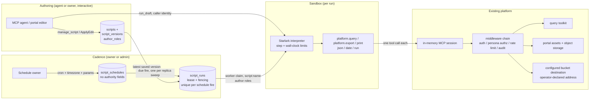

# Managed Scripts: Security Model

This document is the threat model for managed scripts: what the feature adds to
the platform's attack surface, what it deliberately does not, and where the
residual risk sits. It is the security counterpart to the platform-wide
[Threat Model](../security/threat-model.md), which this document assumes rather
than repeats, and it is revised in step with the feature: every change to the
managed-scripts surface updates it in the same change.

Every claim below carries a package or file citation a reviewer can check
against the source. Where a protection does not exist, this document says so.

Reviewed at the state of the tree that opened the tool surface (#1419): a
script calls any tool its author's persona authorizes, through
`platform.call`, and the persona filter is the only thing that refuses one. The
revision before it removed approval and grants (#1403), making a saved version
the version that runs, presenting the roles its author held at that save. The
revisions before those introduced external delivery, the review surface, the
script domain and the authoring loop, platform execution (the script principal,
the run queue, and `run_script`), worker mode, and cron scheduling.

## What a managed script is

A managed script is a small Starlark program the platform stores, versions, and
governs, so that a process whose logic is already solved (a KPI report, a
recurring export) can be re-run without re-deriving it through a model. Scripts
are authored by an agent through the `manage_script` MCP tool or by their owner
in the portal, and executed by an embedded interpreter whose every host binding
is one ordinary platform tool call.

The state of the feature at this revision:

- A script can be created, edited, validated, and dry-run.
- **A saved script runs.** `run_script`, the portal's run action, and a cron
  schedule all execute the script's latest saved version. There is no approval
  step, no review queue, and no state in which a script exists but nothing may
  execute it; the run gate refuses only a script taken out of service —
  disabled, deprecated, or superseded (`pkg/script/run.go`, `RefuseRun`).
- A run executes unattended, as the script's own principal, presenting the
  roles captured from the version's author at the save. Every call it makes is
  authorized by the persona filter at run time, exactly as an interactive
  session's call is.
- A run **calls the tools its author can call.** `platform.call(tool, args)`
  invokes any platform tool by name over the run's session; `platform.query`,
  `platform.export` and `platform.publish_data` are named helpers for the same
  mechanism with a constant. There is no script-side allowlist in front of any
  of them (`internal/platform/scriptrun/host.go`, `hostState.call`). What a run
  may reach is what the persona its captured roles resolve to may reach, at
  every call.
- A run **writes**: `platform.export` persists a portal asset version, or —
  where the deployment configures a bucket destination
  (`scripts.destinations`) — delivers the same bytes to an operator-configured
  bucket (see [Delivery: leaving the platform](#delivery-leaving-the-platform)).
  A draft run still writes nothing wherever it is addressed: it serializes the
  output with the same formatter a platform run would, and reports the shape
  and size that produced without storing it
  (`internal/platform/scriptrun/host.go`, `hostState.export`,
  `persistOrPreview`, `FormatOutput`).

## The claim this feature makes about authority

**A managed script can never do what the person who wrote it could not do.**

That is a structural property, not a policy, and it holds across both execution
paths.

**A draft run authenticates as the caller.** `run_draft` reads the caller's own
identity off the `PlatformContext` of the `manage_script` call that reached it
and injects exactly that identity into the run's session
(`internal/platform/scriptlayer/rundraft.go`, `connectAuthorSession`). A caller
can do nothing through `run_draft` that they could not do by calling the same
tools directly. The proof is an integration test against the real assembled
server asserting that the audit row for a script's query carries the author's
user id, email, and persona
(`internal/platform/scriptlayer/rundraft_integration_test.go`).

**A platform run authenticates as `script:<name>`, carrying the roles the
version's AUTHOR held.** An unattended run happens with nobody present — no
token, no session, no live identity to resolve — so the authority it presents
has to have been captured earlier. It is captured from the author, at the
moment they save the version (`pkg/script/version.go`, `Author`;
`internal/platform/scriptlayer/scriptlayer.go`, `callerAuthor`), stored on the
immutable version row (`script_versions.author_roles`), and presented by the
runner as the run's roles (`internal/platform/scriptexec/runner.go`,
`connect`). The middleware resolves them to a persona exactly as it does for a
human caller, so the persona — not any record on the script — is the authority
of record, and it is resolved fresh at every call: a persona change takes
effect on the next run without any script-side action.

Both paths cross the full middleware chain. Each host call is one MCP tool call
over a per-run in-memory session against the assembled server
(`internal/platform/scriptrun/session.go`, `SessionCaller.CallTool`), so
authentication, persona and connection authorization, rate limiting, and audit
all apply exactly as they do to an agent's call. None of it is re-implemented,
which is what keeps it from drifting. The one place the chain reads the
script principal's auth type is the rate limiter, which holds a platform run's
over-limit call rather than refusing it; the check is the same, and what
differs is what happens to a call that fails it. The persona filter is the entire
authorization boundary at run time; there is no second, script-specific
allowlist in front of it.

What platform execution DOES add, and what this document does not minimize:

- **Standing authority.** The roles a version captured keep working after the
  author stops working — over a weekend, and after they leave. That is inherent
  to unattended automation, and the controls over it are the script lifecycle
  (disable, deprecate, supersede — each refused by the run gate at execution
  time), the persona filter's live resolution of the captured roles, and audit.
- **Definer rights.** A script runs with the authority its executed version
  captured rather than with the caller's, so its output can reach somebody who
  could not have produced it. Ownership is therefore the control: a script is
  one person's, that person is who can run it, and moving it to somebody else
  is an administrator's action (#1404) that re-captures the run identity from
  the administrator making the move.

  Because ownership is the control, a transfer is a security-relevant change
  even though it grants nothing directly: the receiving owner can run the
  script, from the transfer on a run presents the transferring administrator's
  roles rather than the previous owner's, and the script's history moves with
  it — its run records and dry-run accounts, whose logs are free text those runs
  printed and may echo rows the new owner has no access to of their own. That is
  why the action is an administrator's and not something an owner can do to
  hand their work along. Transfers are
  recorded in the audit log as `script_transfer_owner` events of kind `admin`,
  naming the script and both ends of the move, whether they succeeded or were
  refused.

  Removing a script is the owner's and an administrator's, from the script's
  page in the portal or with `manage_script command=delete`. A delete made from
  the portal is recorded as a `script_delete` event of kind `admin` naming the
  script and the owner who lost it, whether the removal succeeded or failed at
  the write; a delete made through the tool is already in the log as the
  `manage_script` call it was. A caller the portal route refuses — somebody who
  is neither the owner nor an administrator — is answered exactly as one who
  named a script that does not exist, before the script is read, and no event is
  written: that is what every portal script route does, and the tool surface is
  where a refused attempt is recorded, since the middleware logs every
  `manage_script` call including the ones it declines. Neither surface reaches
  further than the script itself: what it wrote is not the script's to take, and
  the record naming it as the writer outlives it.

  A script is reachable from `search` and `fetch` (`mcp:script:<id>`), from a
  prompt that references it, and from the portal's own script pages, in
  addition to `manage_script list`. Each of those surfaces applies the same
  ownership rule as a store predicate rather than a filter over the answer, so
  a caller sees exactly the set `manage_script list` would show them and
  nothing more: somebody else's script has neither a hit, nor a fetchable
  document, nor a resolvable reference from a prompt. Discovery reports; it
  grants nothing. Finding a script says it exists and what it takes, and
  running it is still `run_script` under the run gate. What the surfaces return
  is the script's contract — name, description, owner, typed parameters,
  whether a run would be admitted, cadence, last successful run — never its
  source, which stays behind `manage_script get` and the portal script page,
  both the owner's and the administrator's.

`middleware.SourceScript` is a label on a call, not a capability. It records how
the call arrived so audit can separate populations, and it selects three
behaviors described below; it grants nothing (`pkg/middleware/mcp.go`).

## Assets

| Asset | Why it matters |
|---|---|
| Script source and its version history | Executable code the platform runs unattended; the live version is the version a run executes |
| `script_versions.author_roles` | The authority a run of that version presents. Whoever can write a version decides what a run of it carries |
| `scripts.destinations` configuration | The complete set of addresses a script's output can leave the platform for |
| Data reachable through `platform.query` | Whatever the running identity's persona and connections allow |
| Run records (`script_runs`) | Parameters, timings, output ids, and the log a run printed; readable by the script's owner, an administrator, and whoever requested that particular run |
| Output assets | Portal assets a run writes. The row records the run's principal as its owner id and the script owner's address beside it. A person is judged on either, so the asset is the script owner's to open, change, share and delete (#1551); a run is judged on the address alone, since a principal is unique only within its owner, and ENUMERATES by the producer recorded for its own writes (#1579) |
| Delivered objects | Data a run writes out of the platform, into the bucket and prefix a configured destination names, where the platform's own access controls no longer apply |
| Run logs | Bounded free text a script chooses to emit; may echo queried data |
| Connection credentials | Never reachable from a script; held by the platform and used by the toolkit |

## Actors

| Actor | Capability at this revision |
|---|---|
| Script author (any authenticated caller) | Creates, edits, runs, schedules and deletes their own scripts; runs drafts as themselves. Saving a version makes it the version that runs, presenting their own captured roles |
| Admin persona | The above on every script, plus lifecycle changes and the owner transfer, which re-captures the run identity from the administrator making it |

| Operator (deployment configuration) | Declares the bucket destinations scripts may deliver to (`scripts.destinations`), and decides which replicas execute (`scripts.worker.enabled`) |
| Schedule owner (the script's owner, or an admin) | Sets the cadence, timezone, and bound parameters of a script's schedule, and turns it on or off, from `manage_script` or from the portal; grants nothing |
| Script principal (`script:<name>`) | Exists only inside a platform run; presents the version author's captured roles and nothing else |
| The script itself | Only the host functions listed below, only through the running identity |

## Trust boundaries

A schedule sits outside the sandbox boundary. It writes a run row and nothing
else; the run gate and the persona filter still decide what that row may do.

One boundary matters most: between the interpreter and the platform. A script
reaches the outside world only by calling a host function, and every host
function crosses the middleware chain as the running identity. There is no
other edge out of the interpreter — including the delivery edge, which is a
tool call on an operator-configured connection like any other.

## Controls

### The run gate

`script.RefuseRun` is the one rule every path into execution answers to:
`run_script`, the portal run action, the scheduler when it materializes a fire,
and the worker again at claim time (`pkg/script/run.go`). It refuses a script
that is disabled, deprecated, or superseded, and admits everything else — a
saved script runs. It is checked when a run is executed, not only when it is
queued, because between the two a script can be taken out of service.

A run executes the version it was queued against: the latest saved version at
the moment of the request or the fire, loaded by its immutable id
(`internal/platform/scriptlayer/runscript.go`, `currentVersion`;
`internal/platform/scriptexec/scheduler.go`, `current`;
`worker.go`, `load`). Saving during a run's queue wait does not swap code
underneath it — the queued run still executes the snapshot it was asked for,
and the next request executes the new save.

### The authority a run presents

The roles a run presents are `script_versions.author_roles`: what the person
who saved the executing version held at that moment. They cannot be set any
other way — there is no field for roles on any script surface, and the version
row is immutable — so what a script can do unattended is capped, at authoring
time, by what its author could do. A version saved by a caller holding no roles
produces runs that resolve to the deny-all persona and can call nothing
(`internal/platform/scriptlayer/scriptlayer.go`, `callerAuthor`).

Connections are not pinned to the script. A `platform.query` call names a
connection (or takes the deployment default), and the middleware authorizes it
against the persona the run's roles resolve to, at that call, exactly as it
authorizes an interactive `trino_query`. Narrowing or widening a persona's
connection rules therefore takes effect on the next run with no script-side
action, and there is no stored allowlist to drift out of step with the persona
configuration it would duplicate.

### Who a run acts for

A run authenticates as `script:<name>` and presents the roles its version author
held. That principal is right for attribution — audit rows name it, and it is
what `platform.export` stamps as the owner id of the assets it writes — and
wrong for one thing: it owns nothing a PERSON owns. Every ownership check compares an owner id
against the caller's, so judged on the principal alone a run is refused the very
assets its own author can edit. That refusal is not the persona filter's, and a
feature whose rule is that a script reaches what its author reaches cannot have
one (#1419).

A platform run therefore carries a second identity: the address of the person it
acts for (`middleware.UserInfo.OnBehalfOf`, read by tools as
`PlatformContext.OnBehalfOfEmail`, set by
`internal/platform/scriptexec/runner.go`). A person is judged on either their
user id or their address; an unattended caller is judged on the address alone
(`portaldomain.AssetOwner.ActingFor`, read through `pkg/toolkits/portal`,
`ownsResource`).

The principal is dropped from that comparison because it is not unique to one
person. `Script.Principal()` is `script:<name>` and `idx_scripts_name_owner` is
`UNIQUE (owner_email, name)`, so a name is unique only within its OWNER: two
people who each keep a `daily-sales` present the same subject, and matching it
gave a run of one person's script the outputs of the other person's — readable,
rewritable, and reachable wherever `ownsResource` is the gate, while the person
that run acts for could reach none of it (#1579). Nothing is lost by dropping
it, because a run's own writes record the address beside the principal. It is
the same conclusion `CanModifyResource` reached on the resource side (#1576),
and it is why an ownership identity states which kind of caller it belongs to
rather than carrying two interchangeable keys.

The transfer is an administrator's action, and it re-captures the run identity
from the administrator making it.

The managed resource library reads the same address, for the same reason and on
the same terms (`resource.Claims.OnBehalfOf`, built by `BuildClaimsFor`). A
person's own resources are filed under their subject, which a run does not have,
so without it a run could neither read nor replace a file its author uploaded
through the portal, and a `manage_resource` create with no scope named would
land in a library belonging to the principal — visible to the run and absent
from the author's Resources page, which is where the person who scheduled it
looks. Four rules read it: the visible-scope set, `CanWriteScope` for a user
scope, `CanAccessResource`, and `CanModifyResource`, the last matching the
address the resource records as its uploader. A `manage_resource` create with no
scope named files into the author's own library.

The person is the **version author**, not the script's owner. The run presents
the author's roles, so ownership has to follow the same person or a run would
combine one person's authority with another's ownership — a pairing neither of
them has.

Author and owner are frequently different people, and the consequence is worth
stating rather than glossing. `Transfer` writes the new version authored by the
transferring ADMINISTRATOR while the owner becomes somebody else
(`internal/platform/scriptstore/transfer.go`), so from that point a run of the
script presents the administrator's roles AND acts for the administrator, while
the new owner is who may trigger it. The same holds whenever an administrator
edits another person's script. Ownership follows the roles because they are one
decision, not two: what widens a run is the save that captured an
administrator's authority, which the version history records and which the
[residual risks](#residual-risks) already name. It is not widened further by
this, because roles that resolve to the admin persona already reach every asset
on the platform through the admin arm of each check.

The address is captured from an authenticated context at the save, exactly as
the roles are (`scriptlayer.go`, `callerAuthor`), and is never accepted as an
argument on any surface. A run reaches what that person owns, and for a managed
resource what sits in that person's own library — not what they can merely read.
Replacing the content of a file its author uploaded is the one rule that follows
the person rather than the library, for the reason given in the bullet below.

Five limits, stated rather than implied:

- **An empty address matches nothing.** Both sides of every comparison must be
  non-empty, so a version with no recorded author can never match a resource
  with no recorded owner. Absence of an identity is not a shared identity.
- **Shares are not inherited.** The share lookup is keyed on the caller's own id
  and address, so an asset shared with the author admits the author and not
  their scripts. A grant made to a person is not a grant to everything that
  person automates.
- **Asset enumeration stays the script's own.** `manage_asset list` and `search`
  over assets scope to the PRODUCER the platform recorded for the run's own
  writes (`content_producers`, #1569), so a script's asset listing is the
  outputs that script produced, not its author's library and not its owner's —
  and not another owner's same-named script's, which the principal would have
  enumerated (#1579). Acting on a named asset is the widened path; the inventory
  is not. The two are separate judgments in the code for that reason
  (`callerAssetScope` and `callerAssetOwner` in `pkg/toolkits/portal`,
  `assetScopeOf` and `assetOwnerOf` in `pkg/knowledge`). A run's collection
  listing is scoped the same way, on the same relation.

  It is the producer rather than either identifier on the row because neither
  names one script. The owner id is `script:<name>`, which every same-named
  script on the platform shares; the owner_email is the script owner's address
  as of the row's insert, and nothing rewrites it when a script is transferred.
  A producer id is the script's own uuid, so an inventory is right after a
  rename and after a transfer. `fetch` reads the same relation, so a run can
  dereference everything its own search returned even when its author is no
  longer its script's owner. It matches what a producer CREATED, so a script
  that wrote one version over somebody else's asset does not thereby acquire it.

  The cost of resting the inventory on that relation is stated rather than
  glossed: the note is written best effort beside the write it describes
  (`producedby.Note`), so a note that fails leaves the asset or collection out
  of that run's inventory permanently while the write itself stands. A dropped
  note is a missing row in one listing; a note inside the write's transaction
  would make a failed note a lost file, which is the worse trade.
- **Resource enumeration is the author's, and only their own library.** A
  managed resource is scoped rather than owned, and a personal library is keyed
  by an identifier a run does not have, so the resource rules read the address:
  the visible-scope set, `CanWriteScope`, `CanAccessResource` and
  `CanModifyResource` (`pkg/resource/permission.go`). A run therefore lists,
  reads, creates and replaces in its author's library, which is also where a
  `manage_resource` create with no scope named files the file. It is not the
  author's whole reach: creating a persona or global resource still takes the
  scope authority the roles carry, and what a run can SEE outside its author's
  own library is what that library's own rules give it — a persona the author
  belongs to, and the global library. A file the author uploaded into somebody
  else's scope while holding a role they have since lost stays out of sight,
  which is the case the uploader arm is otherwise notorious for.
- **Replacing content follows the person, not the library the file is in.** A
  move rewrites a resource's library, folder and `mcp://` address and never its
  uploader columns, so the person who uploaded a file may still replace its
  content after somebody files it elsewhere — and their script may too. Holding
  the run to the library instead meant a person who moved a CSV into a persona
  they merely belong to, which the platform deliberately permits, silently broke
  the schedule that refreshes it: nothing warned at the move, the schedule stayed
  enabled, and whether it broke at all depended on whether the author happened to
  be a platform administrator. The uploader arm is now ONE rule for the person
  and for what acts for them (`uploadedByCaller`, `pkg/resource/permission.go`),
  which is what stops them diverging in either direction — the earlier stand-in
  written for the run alone would have left every OTHER script that person writes
  able to rewrite a file the person cannot touch, on a row a run filed (whose
  subject is the principal, so the person's own subject does not match it). That
  rule reads the recorded ADDRESS for an unattended caller and the recorded
  SUBJECT only for a caller acting as themselves, because a script principal is
  `script:<name>` and a script name is unique only within its owner: two people
  who each keep a `daily-sales` present the same subject. The decay the arm is
  known for is unchanged and now falls on the person and their script
  identically: an administrator who uploaded into somebody else's scope and later
  lost the role keeps modify authority over that row, and so does their script.
  It adds nothing to what a run may SEE — `CanAccessResource`
  still admits an unattended caller only for a file sitting in its own uploader's
  user library — but "may change" is a wider set than "may see", and a surface
  that authorizes on `CanModifyResource` alone grants that wider set to the run
  exactly as it does to the person: registering a managed resource as a Trino
  table is deliberately such a surface ([Querying a CSV resource as a table](../portal/resources.md#querying-a-csv-resource-as-a-table)),
  so a file the person may register and not read is one their script may register
  and not read (#1576).
- **A draft carries no second identity.** `run_draft` authenticates as the
  caller, a person with a real user id, so ownership already resolves on the id
  and `OnBehalfOfEmail` is empty.

The address is the only identifier a run has, and that has a consequence worth
knowing before it happens: **an author whose address changes in the identity
provider loses their scripts' reach over the resources they uploaded under the
old one.** The uploader address is frozen on the row at upload, the run carries
the current one, and nothing reconciles them. The run is answered "there is no
managed resource ... you can see", which is the same answer a deleted file gets,
so a scheduled refresh reports the file as gone rather than as unreachable —
telling the two apart would mean disclosing that a file the caller may not see
exists. Re-save the script after the change and re-upload or re-scope the
affected resources, or scope them to a persona, which is keyed by name rather
than by a person.

### The tool surface is the persona's, not the script layer's

`platform.call(tool, args)` invokes any platform tool by name
(`internal/platform/scriptrun/host.go`, `hostState.call`). It resolves to the
same `Caller` the three named helpers resolve to, so a generic call is one
ordinary MCP tool call over the run's in-memory session against the assembled
server, crossing authentication, persona and connection authorization, rate
limiting and audit. A tool the run's persona may not call is refused by the
middleware, in the middleware's own words.

There is no allowlist in front of it. Until #1419 there was one — three named
capabilities — and it was not a control: it prevented a script from doing what
its author could already do interactively, one tool call at a time, with the
same roles, through the same middleware. What it cost was every automation
whose input is not SQL, and what it bought was the appearance of a sandbox
doing limiting the persona filter was already doing.

What replaces it as the reviewer's material is the source, which is stored,
versioned, and attributed. `validate` reads the tool names a script passes to
`platform.call` as string literals and reports them as `tools`, alongside the
connections and destinations it already reported; a call that computes its tool
name sets `dynamic_tools` so the list is never quietly short
(`internal/platform/scriptrun/validate.go`, `inspection.visitCall`). A
connection named as a literal inside a literal argument dict feeds the same
connection list a `platform.query` connection feeds, because a generic call
naming a connection is as much a use of it; a call whose argument set is
computed sets `dynamic_connections`, since the connection is the only claim
this report makes about what is inside those arguments.

**Re-entrancy is refused, as runaway-work control rather than authorization.**
`run_script` and `manage_script run_draft` are refused from inside a run
(`internal/platform/scriptlayer/scriptlayer.go`, `refuseReentrantRun`), keyed on
`PlatformContext.Source == SourceScript`, which the run layer sets for every
call a run makes. Starlark has no `while` and no recursion, so a single run
cannot loop, but a cycle across runs has nothing else to stop it — and it would
deadlock before it got there, because a worker executes one run at a time per
replica, so a script waiting on a run it queued is waiting on the worker it is
itself occupying.

### What a script can move, and what bounds it

A script moves data through the tools its persona allows, and that is the whole
of the bound. Stated plainly, because the previous revision of this document
said otherwise:

- **`scripts.destinations` bounds `platform.export`, not the script.** A script
  whose persona holds an S3 connection can call
  `platform.call("s3_put_object", {"connection": ..., "bucket": ..., "key": ...})`
  and write an object the destinations configuration never declared. The
  configuration is what makes a NAMED destination safe to repoint; it is not a
  perimeter around the run.
- **Egress is bounded by the connection set, not by the destination set.** A
  script still supplies no credential and opens no socket: there is no host
  binding that reaches the network, and every call goes to a tool over a
  connection the operator configured. But a connection's tools do what they do
  — `api_invoke_endpoint` against a spec whose operation takes a URL will
  fetch that URL server-side, which is the case this feature was opened to
  support. What a script can reach is what its author can reach through the
  same tools at a prompt.
- **The control is the persona.** A deployment that does not want scheduled
  writes, or scheduled outbound calls, withholds those tools or those
  connections from the persona whose roles a version captured. That is the same
  decision, in the same place, that governs the interactive caller.
- **A query made through a tool is not one of the run's QUERIES.** The run
  record's query count is `platform.query`'s (`hostState.query`), so a script
  that reads through `platform.call("trino_query", ...)` reports fewer queries
  than it ran. Like the outputs gap below, what is complete is the audit log.
- **A write made through a tool is not one of the run's OUTPUTS.** The run row's
  output list and the `maxExports` per-run cap cover `platform.export` and
  `platform.publish_data` (`internal/platform/scriptrun/host.go`,
  `admitOutput`). An object written by `platform.call("s3_put_object", ...)` is
  not counted there and does not appear on the run detail page as an output.
  Where it appears is the audit log, as an ordinary tool call under the script
  principal, alongside every other call the run made. A reader looking for
  everything a run did reads the audit trail, not the output list.

### Destinations are configuration

Where a script's output may leave the platform is the operator's declaration,
not the script's choice. `scripts.destinations` in the platform configuration
declares each bucket destination as a complete address — the platform S3
connection, the bucket, and an optional key prefix — and a run resolves the
name a script writes against that list at run time
(`internal/platform/scriptrun/host.go`, `resolveDestination`;
`pkg/script/destination.go`). The portal destination is built in, its name
reserved, and configuration cannot redeclare it
(`pkg/platform/config.go`, `validateScriptDestinations`).

The consequences:

- An EXPORT supplies no endpoint, no credential, no bucket, and no host name.
  It names a destination; everything below the name comes from configuration.
  This is a property of `platform.export`, not of the script: since #1419 a
  script may also call `s3_put_object` (or any other tool its persona allows)
  through `platform.call`, naming a bucket and key directly. See
  [What a script can move, and what bounds
  it](#what-a-script-can-move-and-what-bounds-it).
- Repointing a destination — changing its connection, bucket, or prefix — is a
  configuration change and takes effect on the next run. The address is in the
  deployment's configuration, reviewed the way the rest of the configuration
  is, rather than pinned per script version.
- A destination name nothing declares is refused inside the interpreter, with
  the configured set named, before anything is issued. A draft resolves through
  the same set, so a destination a real run would refuse fails while the author
  is iterating.
- The write is still authorized by the middleware: delivery is `s3_put_object`
  over the run's session, so a destination whose connection the run's persona
  cannot reach is refused by the authority of record whatever the
  configuration names.

### Reading is a surface too, and it grants nothing

The people who own the automations are frequently not administrators; the
portal's script pages (`ui/src/pages/scripts/`, over
`internal/httpserver/scripthttp`) are their surface, and the admin section
mounts the same detail page for every script.

The surface writes five things, and none of them is an authority beyond the
author's own:

- A script's cadence, by the person who owns it
  (`internal/httpserver/scripthttp/portalschedule.go`), which carries nothing:
  the run gate and the persona filter are re-read at every fire.
- A script's SOURCE (`portaledit.go`), which crosses `script.ApplyEdit` — the
  one gate every mutation surface crosses — and lands on the live row as the
  version that runs, recording the roles its editor held, which is exactly what
  a run of it presents.
- A run of the latest saved version, asked for by its owner (`portalrun.go`).
  It queues exactly what `run_script` queues and adds no path into execution:
  whether one is admitted at all is `script.RefuseRun`'s answer, the same one
  `run_script` obeys and the contract document reports. The run's `trigger`
  records `portal` rather than `tool`, which is a label on who asked and not a
  difference in what executed.
- A DRAFT run of an edit, executed as the caller (`portaldraft.go`, over
  `internal/platform/scriptdraft`). Discussed on its own below.
- What a script SAYS about itself — display name, markdown description,
  category, tags (`portaledit.go`, #1369). None of the four is an input to any
  decision the platform makes: visibility is ownership, and a description
  cannot move it. The edit is still captured as a version, so
  what a script claimed to do at the time one of its runs ran is on record.

**Who a caller is, before who may read.** Every rule below compares an owner
with a caller, so the identity being compared has to be specific to one
person.
It is the caller's email; their user id when the credential carries no email,
which an OIDC token without an `email` claim does not; and the name `anonymous`
only when no identity was presented at all. Collapsing the second case onto the
third would make every email-less caller the same owner, and a script is
exactly as private as that comparison is specific. A script whose owner cannot
be established belongs to nobody: it is visible only to administrators, and the
owner transfer is how it gets an owner.

**Three tiers, one rule each, applied by every surface.** The first tier is
the widest, and since #1404 it is still one person: a script is its owner's,
and an administrator's.

| What | Who | Why |
|---|---|---|
| That a script exists, and its contract: name, owner, typed parameters, whether a run would be admitted, cadence, and the outputs of its last successful run | Its owner (`Script.OwnedBy`), and administrators | This is what makes a script discoverable and usable to the person whose script it is, and it is what `search`, `fetch`, and a prompt reference serve them |
| Its source, its run history, and the values its schedule BINDS | The script's owner, and administrators | The source is the code; a run's log is free text the script printed while presenting its author's captured roles and may echo rows the reader has no access to of their own; a schedule's bindings are what the owner configured this automation to ask about |
| One run in particular | The above, plus whoever requested that run | The result was handed to them when they asked for it, so a run id they hold stays followable |
| Setting, re-timing, pausing, and resuming its cadence | The script's owner, and administrators | A cadence is not an authority: the run gate and the persona filter are re-read at every fire, so re-timing reaches nothing new |

The listing applies the first rule as a store predicate rather than as a filter
over the answer, exactly as `search` does; a script the caller may not see never
reaches the response. The second and third rules answer "not yours" and "no such
script" identically, so the difference cannot be used to learn that something
exists. An administrator is unrestricted here, which is the same authority the
admin API already gives them.

**What is embedded is the contract, never the source.** A script's description
card is embedded off the request path by the scripts consumer of the shared
index-jobs framework (`internal/platform/scriptindex`), so a script is found by
what it does and not only by the words it was named with. The text is
`script.IndexText`: the title, the description, the parameter names, the tags,
and the one line stating whether anything will execute it. It is exactly the
first tier of the table above, and it is the same text a caller is shown as the
search snippet. The source is excluded because it belongs to a narrower tier:
one vector per script row cannot be split along a line that admits the contract
to the owner and the source only to the owner and to administrators, and a
vector built partly from source would let code a caller may not read decide how
their results rank. The store applies the same ownership predicate to both the
semantic and the lexical arm before ranking, so a script the caller does not own
reaches neither.

**`show_scripts` performs no data work.** It is presentation-only, following
the `show_prompts` split. It returns a confirmation and, where the deployment
has been configured with its public address, a link to the pages; it carries no
script data, which is also what keeps it useless to an agent as a source of one
(`internal/platform/scriptlayer/show.go`).

### Checking an edit: validate, and a draft run as yourself

**Validate** (`POST /api/v1/portal/scripts/{id}/validate`, or `manage_script
validate`) is a static read. It parses the source, reports the capabilities,
connections and destinations it reaches and the findings against it, and
executes nothing, stores nothing, and touches no record
(`internal/platform/scriptrun/validate.go`).

**A draft run** (`POST /api/v1/portal/scripts/{id}/dry-run`, or `manage_script
run_draft`) executes the edit. It introduces no authority, and the reason is
structural rather than a promise: the run opens an in-memory MCP session
carrying the CALLER's own identity, so every platform call it makes is
authenticated, authorized, rate limited and audited exactly as the same call
typed by that person directly would be. There is nothing reachable through it
that its caller could not already reach by calling the tools themselves.

It is deliberately not a platform run:

- It persists nothing. `platform.export` previews — it serializes the output to
  measure it and writes nothing — so no asset is versioned and no object is
  delivered, wherever the output was addressed.
- It runs under the draft limits, which are tighter than a platform run's.
- It executes the source as sent, not the saved version, so an author iterates
  without saving.
- It is refused for a disabled or superseded script (`script.RefuseDraftRun`).
- Source that does not parse is refused before the interpreter is involved.

The identity is copied from the authenticated caller — user id, email, roles,
and the auth type the request actually arrived with — and never synthesized.
Both the tool and the portal go through one implementation
(`internal/platform/scriptdraft`), so there is one definition of what a draft
run is and the two surfaces cannot drift.

**How many run at once is bounded.** A run holds a Starlark heap the
interpreter cannot cap, so the number executing concurrently is the one lever
that bounds the memory a pathological script can reach; the platform-run worker
takes that lever by executing one run at a time per replica. A draft has no
queue in front of it, so the runner holds a small fixed number of execution
slots and a request that cannot get one within a few seconds is refused as busy
rather than queued.

**The account kept of a draft run.** A dry run persists nothing it PRODUCED;
what is stored is the account of one having happened: the run id (which is also
its session id, so the audit rows the run wrote are reachable from it), who ran
it, when, how it ended, the bounded log it captured, and the shape of the
outputs it would have written. The account is keyed by the SHA-256 of the
source that executed rather than by a version id, so it links to whichever
version later carries that exact code, in either order, and to no other. It is
owner-and-admin reading like every other run record, and it is bounded at
write: an author keeps the newest handful of accounts per script.

### Schedules: cadence, and nothing else

A schedule confers no authority. It names when the script runs and with which
parameters, and every other property of that run — which code executes, which
roles it presents, which connections it may reach — comes from the latest saved
version and the persona filter, which a schedule cannot touch. Setting one is
therefore an owner-or-admin action, the same rule reading a script answers to
(`internal/platform/scriptlayer/schedules.go`, `schedulable`;
`internal/httpserver/scripthttp/portalschedule.go`).

The consequences:

- A schedule on a disabled or retired script fires nothing. The materializer
  asks `script.RefuseRun` before it writes a run, and the worker asks it again
  before executing one (`internal/platform/scriptexec/scheduler.go`,
  `buildRun`).
- A schedule cannot name roles, connections, or destinations. There is no
  field for them on any surface.
- Saving a new version changes what the schedule executes at its next fire,
  which is the intent: the schedule points at the script, not at a version.
- A schedule whose bound parameters no longer satisfy the script's contract
  fires nothing and records the fire as missed, rather than executing with
  values the contract does not admit.
- A **paused** schedule reports no next fire, on every surface that serves one
  (`pkg/script/schedule.go`, `Schedule.DueAt`).

One thing the platform does decide on its own, and it is deliberately narrow: a
schedule whose cron expression no longer parses is DISABLED, because walking an
uncomputable row every half minute forever is worse than a state its owner can
see. A schedule whose TIMEZONE cannot be loaded is not touched — that fault
belongs to the build and would otherwise retire every non-UTC schedule at once
(`internal/platform/scriptexec/scheduler.go`, `refuseCadence`).

**What a schedule does add is unattended repetition**, and that is a real
property. The controls on it are the ones execution already has — the persona
filter, the step and result limits, one run at a time per replica — plus two of
scheduling's own: the one-fire-a-minute floor (`pkg/script/schedule.go`,
`MinFireInterval`), and the overlap policy, which refuses to start a second run
of a schedule while its previous run is still going.

The single-fire guarantee is a unique index on `script_runs (schedule_id,
fire_time)`, not a lock or a leader (migration
`000100_script_schedules.up.sql`), keyed on `fire_time` rather than
`scheduled_for` so an infrastructure retry cannot let a second materializer
insert a duplicate for the same fire.

### Delivery: leaving the platform

A run may write output to a bucket the deployment declares in
`scripts.destinations`. It is the sharpest data-movement surface in the
feature.

**A delivery names a destination and nothing else**: no endpoint, no
credential, no bucket, no host name. Everything below the name comes from
`scripts.destinations`, so `platform.export` reaches only what configuration
declares.

That is a property of this binding, not of the script. Everything below in this
section describes `platform.export`'s delivery arm; what a script can move by
OTHER means is [stated separately](#what-a-script-can-move-and-what-bounds-it),
because since #1419 it may call the object-store and API tools directly.

The write itself is **one ordinary platform tool call** — `s3_put_object` over
the run's own in-memory MCP session (`internal/platform/scriptexec/deliver.go`)
— rather than a private route to object storage. The middleware authorizes that
call against the persona the run's roles resolve to, exactly as it would for a
person, so a destination whose connection that persona does not hold is refused
however the configuration names it. The middleware is the authority of record.

Three further properties bound what a delivery can do:

- **The prefix is the boundary.** The script chooses the object key beneath the
  destination's configured prefix; a key that is absolute, contains `..`, or is
  otherwise shaped to climb out of the prefix is refused rather than cleaned up
  and written somewhere else (`pkg/script.ValidateObjectKey`). Refusing rather
  than rewriting is deliberate: a traversal quietly normalized away is a
  refusal nobody was told about.
- **Exactly once per run, per destination, and one object per key.** An output
  name may be written once to each destination, so one result can refresh a
  portal asset and be delivered to a bucket, while a second write to the same
  place fails rather than silently keeping one of two results. Two outputs may
  not land on one object either (`internal/platform/scriptexec/export.go`,
  `refuseRepeat`; `deliver.go`, `objectAddress`). A run reclaimed after its
  worker died does not deliver a second time: each output is recorded as it
  lands.
- **Every delivery is audited** under the script principal, on the connection
  it wrote over, in the run's session, and recorded on the run with its
  destination, bucket, key, and size. The audited arguments record the address,
  not the payload: an argument value over 16KB is stored as its size instead of
  its content (`pkg/middleware/mcp_audit.go`, `boundValue`), so a delivered
  report does not put a second copy of itself in the audit table on every
  scheduled fire.
- **The destination and the key must be NAMED arguments.** A destination passed
  by position would be invisible to the static read that reports what a script
  reaches, and that report would then state positively that a script writing to
  a bucket writes to the portal. Both the validator and the engine refuse the
  shape (`internal/platform/scriptrun/validate.go`,
  `refusePositionalDestination`; `host.go`, `exportRequest`).

The residual exposure is stated under residual risks: a script that delivers
keeps delivering, on whatever cadence its schedule fires, until someone changes
it.

### The data-region refresh

`platform.publish_data` (#1389) refreshes the data region of a dashboard the
script already publishes. It adds no authority: a run presents its author's
roles, and the author can already rewrite the whole document through
`manage_asset` or `save_asset`, so confining the call to one region is not a
security boundary and this section does not claim one. What the confinement is,
is a behavioral contract:

- **The target is pinned by the export identity rule.** The name resolves
  through the same idempotency key an export writes under
  (`internal/platform/scriptexec`, `outputIdentityKey`), so the call reaches
  this script's own portal outputs and nothing else. A name that resolves to
  nothing fails the run; the call creates no asset and takes no asset id, and
  it writes only to the built-in portal destination.
- **The splice is structural, for document integrity.** The payload replaces
  the interior of the ONE element matching `#data` (`pkg/script/refresh.go`,
  `DataRegionSelector`) through the anchored-editing engine's `replace_content`
  operation — never string interpolation — and the serializer
  (`internal/platform/scriptrun`, `FormatDataPayload`) keeps `encoding/json`'s
  default escaping, which writes `<`, `>` and `&` as `\u` escapes, so no
  payload string can contain `</script>` and corrupt the document's structure.
  A document with no match, or more than one, fails the run rather than writing
  anywhere else.
- **The validator reports the target.** A static read collects the output names
  `publish_data` refreshes (`refresh_targets`), and a computed name is flagged
  rather than silently omitted.

### The script principal

A platform run authenticates as `script:<name>` (`pkg/script/script.go`,
`Principal`), injected with `middleware.WithPreAuthenticatedUser` and tagged
`middleware.AuthTypeScript` (`internal/platform/scriptexec/runner.go`,
`connect`). It is a distinct principal for every gate, rate limiter, and audit
row, so a governed automation and the person who owns it are never confused for
one another; the owner's address rides alongside on the same call, which is
what keeps a run attributable to an accountable human. The rate limiter reads
the auth type as well as the key: a call the principal makes over its limit is
held until the sustained rate admits it rather than refused, because a run is
a serial loop by construction and the caller the platform has the strongest
reason to let finish (see [Failures](running.md#failures)). The sustained rate
still applies to it; the burst refusal does not.

The principal holds no authority of its own. Its roles are the version
author's captured roles, and the middleware resolves them to a persona exactly
as it does for a person — so the persona is the authority of record.

### The run queue: leases, fencing, and exactly-once output

Runs are claimed with the queue shape the platform already uses elsewhere: an
`UPDATE ... FOR UPDATE SKIP LOCKED` that marks the row running, counts the
attempt, and stamps a lease (`internal/platform/scriptstore/runs.go`, `Claim`).
Crashed-worker recovery is part of the claim predicate — a lease that expired
makes the row claimable again — so there is no reaper and no leader election,
and every replica can run a worker.

Two properties protect a reclaimed run:

- **Fencing.** Every write against a run carries the lease it was taken under
  (`leaseClause`), so a worker whose run was reclaimed writes to nothing and is
  told so, rather than overwriting the result of the worker that took over.
- **No double-write.** A run records each output as it lands, and a reclaimed
  run reads that record and skips what it already produced
  (`internal/platform/scriptexec/export.go`). Output identity is stable — one
  asset per (script, output name), a new version per run — so a recurring
  report accumulates versions rather than assets.

Retry classification is decided by **where** a failure happened, never by
reading an error message (`internal/platform/scriptexec/worker.go`, `attempt`).
Everything outside the interpreter — opening the run's session, reading the
script or its version — is the platform's own fault and is retried with backoff
under a small attempt budget. Everything the interpreter reports is final: a
Starlark error on the same inputs reproduces exactly, and a script that has
already queried or written must not be replayed on the chance that its last
call was a transient fault.

### Isolating execution from serving

Which replica executes a run is a security control, not only a capacity one.
`scripts.worker.enabled` (`*bool`, default on) decides whether a replica claims
from the queue. Left alone, one process serves and executes. Set false, the
replica keeps serving MCP and portal traffic and enqueueing runs, and never
claims; a separate deployment of the same binary with the worker on executes
them.

What that buys is blast-radius containment for the one limit the interpreter
does not enforce. There is no hard per-script memory cap (see [Resource limits,
stated honestly](#resource-limits-stated-honestly)), so a pathological script
pushes on the memory of whichever pod runs it. On a split deployment the worst
case is a restarted worker, while sessions, the portal, and the admin API are
untouched — and the run itself is not lost, because a killed worker's lease
expires and another claims it.

The worker adds no attack surface of its own: it accepts no request and takes
work only from the queue, and its calls go through the same assembled MCP
server and the same middleware chain they would on a combined pod.

Shutdown is bounded on both sides. A draining worker stops claiming
immediately, gives a run in flight a short capped window out of the shutdown
budget, and releases anything that does not finish back onto the queue rather
than recording a verdict on it (`internal/platform/scriptexec/worker.go`,
`Stop`). A released run is claimable at once and its recorded outputs are not
written twice.

### Audit under the script principal

Two kinds of row, joined by one key:

- The per-capability tool-call rows the middleware already writes, carrying
  `user_id = script:<name>`, the owner's email, `source = script`, and the run
  id as the session.
- One `script_run` lifecycle event per run (`pkg/audit/event.go`,
  `EventTypeScriptRun`), carrying the script, its id, the version, the run id,
  the owner, the trigger, who requested it, and the attempt.

Both carry the run id as their session id, so a run and every call it made join
on one key. Audit failures are logged and never fail a run.

### The language is the sandbox

Starlark is the engine because determinism and isolation are properties of the
language rather than of a blocklist the platform must maintain
(`internal/platform/scriptrun/scriptrun.go`). Starlark has no ambient clock, no
randomness, no filesystem, no network, and no module system; iteration order is
specified. A script can affect the world only through bindings the host
predeclares, and the predeclared set is exactly `platform`, `json`, `date`,
`run`, and `sum` (`predeclared`, and `isPredeclaredName` in `validate.go`,
which is the same list validation checks against).

What the language bounds is HOW a script reaches the world: through the
`platform` module, whose every member is one authorized tool call. It does not
bound WHAT the script reaches — [the persona
does](#the-tool-surface-is-the-personas-not-the-script-layers).

`while` and recursion are deliberately off, because both are unbounded control
flow whose cost cannot be read off the source. Top-level control flow and
reassignment of a top-level name are deliberately on, and neither affects
safety or determinism.

### Resource limits, stated honestly

| Limit | Mechanism | Where |
|---|---|---|
| CPU | Interpreter execution-step cap; a draft is capped tighter than a platform run, because somebody is waiting for a draft | `scriptrun.DraftMaxSteps`, `RunMaxSteps` |
| Wall clock | Context deadline bridged to thread cancellation, covering time spent inside host calls | `scriptrun.DraftTimeout`, `RunTimeout`, `watchCancel` |
| Result size | Hard row and byte caps on every `platform.query` result, with the row cap pushed down into the query; the byte cap also applies to a `platform.call` result, which has no row axis to push down | `scriptrun.DraftMaxRows`, `RunMaxRows`, `DraftMaxResultBytes`, `hostState.queryResult`, `hostState.call` |
| Output size | Cap on one serialized output, matching the portal export ceiling and applied by the serializer, so a draft is refused on the same terms a platform run is | `scriptrun.MaxOutputBytes`, `FormatOutput` |
| Concurrency | One run at a time per replica, which is the only lever that bounds how much heap concurrent scripts can reach | `internal/platform/scriptexec/worker.go` |
| Blast radius | Which replicas execute at all, so the memory a script can reach belongs to a pod nothing is talking to | `scripts.worker.enabled` |
| Truncation | A result the engine truncated at the cap FAILS the run rather than being handed over as complete | `hostState.queryResult`, `truncated` |
| Log size | Bounded capture, head kept, tail dropped with a marker | `scriptrun.MaxLogBytes`, `logBuffer` |
| Outputs per run | Capped | `maxExports` |
| Source size | Capped before the parser sees it | `script.MaxSourceBytes` |

**There is no hard memory cap.** Neither starlark-go nor any comparable
embedded interpreter offers one, and this document does not pretend otherwise.
A pathological script can grow the process heap despite the step limit, because
allocation per step is unbounded. The mitigations in place are the step limit,
the wall-clock deadline, the host-side result caps, one run at a time per
replica, and `GOMEMLIMIT` at the process level. It is recorded in [Residual
risks](#residual-risks), and the control that bounds what an out-of-memory
condition costs is [isolating execution from
serving](#isolating-execution-from-serving).

### SQL parameters are bound, never spliced

`platform.query` takes `:name` placeholders and a `params` dict, and the host
renders each value as a typed SQL literal before the statement is sent
(`internal/platform/scriptrun/bind.go`, `bindSQL`). Strings are single-quoted
with embedded quotes doubled; a NUL byte is refused rather than escaped;
numbers, booleans, null, and lists of scalars each have one rendering; anything
else is refused.

Substitution is state-aware: a `:name` inside a string literal, a quoted
identifier, or a comment is text, and `::` is a cast rather than the start of a
placeholder. Both directions are covered by tests (`bind_test.go`).

A write statement passed to `platform.query` is refused by `trino_query`, the
read tool `platform.query` is, in the tool's own words: that it is read-only
and that `trino_execute` is where writes go. That advice now leads somewhere —
`platform.call("trino_execute", {...})` — which is why the script layer no
longer carries a copy of the predicate in front of it (#1419). A second
definition of what a write is, sitting in front of a tool that already has one,
is a definition that can come to disagree.

**A script writes.** A persona that may call `trino_execute`, `datahub_update`
or `s3_put_object` reaches them from a script, under the roles its author held
at the save. A deployment that does not want scheduled writes withholds those
tools from the persona, which is where that decision already lives for
interactive callers.

### A partial result is a failure, not a result

The row cap is pushed down as the query's own limit, so the engine stops at
exactly that many rows. That makes a length check useless as a truncation
signal, and the failure it would have caught is the worst kind: a script that
sums the first N rows of a larger result reports a wrong total with nothing in
the output to show that anything was missing. `platform.query` therefore reads
the query tool's own truncation flag and fails the run
(`internal/platform/scriptrun/host.go`, `truncated`).

This is a property of `platform.query`, not of every path to the warehouse. A
script that calls `trino_query` through `platform.call` is handed the tool's
own result, truncation flag included, and is responsible for reading it — which
is the reason the helper exists and the reason the contract prescribes it for
SQL. The byte cap still applies to every result, generic calls included.

### Credentials never live in a script

Connections are named; their credentials stay in platform connection
configuration exactly as they do for every toolkit. `validate` scans source for
credential-shaped literals (`internal/platform/scriptrun/validate.go`,
`secretPatterns`), and severity follows confidence:

- A pattern matching a specific credential FORMAT — a private-key header, an
  AWS access key id, a GitHub or Slack token, a JWT, a URL with inline
  credentials — is an **error** and blocks the save.
- A pattern matching a NAMING convention (`password = "..."`) is a **warning**,
  because that string is a credential in Go source and an ordinary predicate
  inside a SQL string, and a text scanner cannot tell them apart.

A pattern scan finds what it recognizes and nothing more; it is a tripwire that
catches the paste, not a proof of absence.

### Unparseable source is never stored

`create`, `update`, `patch`, and the portal editor all validate before writing
(`commands.go`, `content.go`, `portaledit.go`). A script that does not parse is
not a draft, it is a typo, and refusing it means every stored version is one a
reader can meaningfully read — which matters more now that every save is the
version that runs.

### The three `SourceScript` middleware behaviors

Each is a structural consequence of a script run being a per-run in-memory
session with no model in it. All three are pinned by tests in
`pkg/middleware/script_source_test.go`.

1. **Exempt from the session and search-first gates**
   (`isStatelessShimSource`). A script cannot perform the `platform_info`
   handshake and cannot perform a discovery step, because there is no model in
   a script run to do either. What the search-first gate steers an agent toward
   happened when a person authored the script. The function fails closed: an
   unknown source is not exempt.
2. **An isolated per-run session identity** (`connectAuthorSession`,
   `runner.connect`, `mintIsolatedRunSessionID`, `DiscoveryScopeKey`). One run
   is one session: the run id is minted with its own prefix and threaded onto
   the run's session context, so every platform call the run makes records that
   same id and the id the author is handed back is the id in the audit rows. A
   run can never advance or read the gate, provenance, or dedup state of the
   person it runs for.
3. **Enrichment is skipped** (`pkg/middleware/mcp_enrichment.go`). Enrichment
   appends cross-service context that varies with catalog state, which is
   precisely the variation the determinism contract promises a script will not
   see.

None of that reaches `run_script`, which is an ordinary agent-facing tool and
exempt from nothing: it is authenticated and authorized as the agent calling
it.

### Determinism, precisely

The contract is:

> Same script version + same parameters + same state read + same underlying
> data produce the same output.

It is not "identical forever." The warehouse changes between runs, and that is
the point of re-running. What the platform eliminates is every source of
variation it controls: no clock or randomness is reachable, the fire time is a
pinned value on `run.fire_time` rather than a clock read, the state a run reads
is pinned on its row at creation rather than read fresh at execution,
enrichment is off, and map keys are converted in sorted order
(`internal/platform/scriptrun/convert.go`).

### State: one object per script, one write per run

A script carries one JSON object between runs (#1537): `run.state` on the way
in, `platform.save_state` on the way out, bounded at `script.MaxStateBytes`
(64 KiB) and checked for JSON-representability at the call so a refusal names
the key (`pkg/script/state.go`, `ValidateState`). It grants nothing: a run
reads only its own script's state, and the write reaches only its own
script's row.

The write is applied by `RunStore.Finish`, for a succeeded run only, in the
transaction that records the status, as an upsert predicated on the revision
the run read at creation (`internal/platform/scriptstore/state.go`,
`writeRunState`; `runs.go`, `finishWithState`). A refused predicate turns the
run into a failure naming the writer of the current revision, and its outputs
stand. The lease is checked before the state row is touched, so a reclaimed
run's stale worker cannot move it. A failed run's staged state is dropped. A
person's reset (`SetState`) is unconditional, moves the revision, and is
recorded with who did it, which is what fails a run in flight that read the
old revision. The two tool actions that write, `state set` and `state clear`,
are refused from inside a run (`internal/platform/scriptlayer/state.go`): a
run's one write is `save_state` under the compare-and-set, and a run that
could reset state through the tool would step around it.

State is not an asset and not an output: it is not versioned, not shared, not
delivered anywhere, and is deleted with the script (`script_state`,
`ON DELETE CASCADE`). A draft reads the live state and writes nothing.

Determinism is a security property here as well as a correctness one: it is
what makes a run explainable after the fact from its own record, and what makes
"never retry a script error" safe.

## Threats and mitigations

| Threat | Mitigation | Citation |
|---|---|---|
| A script reaches data its runner may not see | Every host call crosses persona and connection authorization as the running identity | `rundraft.go`, `pkg/persona/filter.go` |
| A draft escalates beyond its runner | The run authenticates as the caller; no identity is synthesized | `connectAuthorSession` |
| A run presents authority its author never held | The roles a run presents are the version author's, captured at the save; no surface accepts roles | `pkg/script/version.go`, `Author`; `scriptexec/runner.go`, `connect` |
| A script reaches a connection its persona may not | The middleware refuses the call at run time, exactly as for a person | `pkg/persona/filter.go` |
| A retired script keeps executing | Disabled, deprecated, and superseded are each refused by the run gate, at enqueue and again at claim | `pkg/script/run.go`, `RefuseRun` |
| A crashed worker's run is executed twice concurrently | Lease-based claiming, with every write fenced on the lease it was taken under | `runs.go`, `Claim`, `leaseClause` |
| A reclaimed run writes its output twice | The run records each output as it lands, keyed by output AND destination; a reclaimed run skips what it wrote | `scriptexec/export.go` |
| A script sends data to a bucket nobody declared | The destination set is configuration; an undeclared name is refused inside the interpreter, and the middleware refuses a connection the persona does not hold | `host.go`, `resolveDestination`; `pkg/persona/filter.go` |
| An EXPORT addresses a bucket, endpoint, or credential of its own | There is no argument for one: an export names a configured destination, and the address comes from configuration | `pkg/script/destination.go` |
| A script writes an object no destination declared | Not prevented, and not claimed to be: a persona holding an S3 connection reaches `s3_put_object` from a script exactly as its author does at a prompt. The control is which tools and connections that persona holds | `pkg/persona/filter.go`, [what bounds it](#what-a-script-can-move-and-what-bounds-it) |
| A key climbs out of a destination's prefix | An absolute key, a `..` segment, or an empty segment is refused rather than normalized away | `pkg/script.ValidateObjectKey` |
| A delivery leaves no trace | Each delivery is one audited tool call under the script principal, and is recorded on the run with its destination, bucket, key, and size | `scriptexec/deliver.go` |
| A transient fault silently replays a script that already wrote | Retry is classified by where the failure happened; nothing the interpreter reports is retried | `scriptexec/worker.go` |
| A caller reads the runs of a script that is not theirs | Run reads are the owner's, the administrator's, and the requester's own; every surface answers the same way for "not yours" and "no such run" | `scriptlayer/runs.go`, `runReadable`; `scripthttp/portal.go`, `ownsScript` |
| A script escapes the interpreter | No IO, filesystem, network, or module system is predeclared | `scriptrun.go`, `predeclared` |
| A script builds a statement out of untrusted values | Typed literal binding with a state-aware scanner | `bind.go` |
| A script calls a tool its author may not | The persona filter refuses the call at run time, exactly as for a person; there is no script-side allowlist in front of it to drift | `pkg/persona/filter.go`, `host.go`, `hostState.call` |
| A script is refused a resource its author owns, by something other than the persona filter | A run carries the address of the person it acts for, and ownership checks accept it | `runner.go`, `OnBehalfOf`; `pkg/toolkits/portal`, `ownsResource` |
| A run reaches a resource its author does not own | The address is the version author's, captured from an authenticated context at the save and never an argument; both sides of the match must be non-empty, and shares are not inherited | `scriptlayer.go`, `callerAuthor`; `ownsResource` |
| A run reaches an asset belonging to another owner's script of the same name | A principal is `script:<name>` and a name is unique only within its owner, so ownership reads the address alone for an unattended caller, and an enumeration reads neither identifier: it is scoped by the producer recorded for the run's own writes | `portaldomain/owner.go`, `AssetOwner.ActingFor`; `portaldomain/producer.go`, `ContentProducer` |
| A reader cannot tell what tools a script reaches | `validate` reports the literal tool names as `tools`, reports `dynamic_tools` when a call computes one, and `dynamic_connections` when a call's argument set cannot be read | `validate.go`, `inspection.visitCall` |
| A script starts a run that starts a run | `run_script` and `manage_script run_draft` are refused from inside a run, on `PlatformContext.Source` | `scriptlayer.go`, `refuseReentrantRun` |
| A generic call pulls an unbounded result | The byte cap `platform.query` applies is applied to every `platform.call` result | `host.go`, `hostState.call` |
| A script carries an inline credential | Secret scan blocks it as an error at validate time | `validate.go`, `secretPatterns` |
| A script burns unbounded CPU or wall clock | Step limit and deadline, both bridged to interpreter cancellation | `scriptrun.go`, `Run` |
| A script pulls an unbounded result | Row and byte caps, row cap pushed into the query | `host.go`, `queryResult` |
| A script floods the log | Bounded capture with an explicit truncation marker, cut on a rune boundary | `host.go`, `logBuffer` |
| A script silently computes on a partial result | A truncated query result fails the run | `host.go`, `truncated` |
| An edit path skips the record checks | `create`, `update`, and `patch` all run `Script.Validate` on the final state | `commands.go`, `content.go` |
| A run pollutes its runner's session state | Per-run minted session identity | `pkg/middleware/mcp_session_handle.go` |
| A script's calls are invisible after the fact | Every host call is audited with the running identity and `source=script` | `pkg/middleware/audit.go` |
| A schedule is used to widen what a script may do | A schedule carries cadence, timezone, and parameters only; the run gate and the persona filter are read at every fire | `scriptexec/scheduler.go`, `buildRun` |
| Several replicas fire the same schedule several times | A unique index on (schedule, fire time); racing materializers collapse to one run | migration `000100` |
| A schedule slower to run than to fire accumulates concurrent runs | One open run per schedule, enforced by a partial unique index; the skipped fire is recorded as a run | migration `000100`, `MaterializeRun` |
| Recovery from downtime floods the query engine with backlogged fires | Fire-once-latest: one run for the most recent fire, the rest counted on the schedule | `pkg/script/schedule.go`, `NextFire` |
| A schedule fires faster than the platform can serve | A one-fire-a-minute floor, checked when the cadence is set | `pkg/script/schedule.go`, `MinFireInterval` |
| A scheduled automation stops producing and nobody notices | A failed scheduled run mails the script's owner | `scriptexec/notify.go`, `notifyFailure` |
| One bad night silences the alerts for every other automation | The alert's rate-limit key is the SCRIPT principal, not the recipient | `scriptexec/notify.go`, `Payload.Actor` |
| A build without the zone database silently retires every non-UTC schedule | An unloadable timezone is logged and left alone; only an unparseable expression parks a schedule | `scriptexec/scheduler.go`, `refuseCadence` |

## Non-goals

- **A script is not a privilege boundary.** A draft runs with its runner's
  authority and a platform run with its author's captured authority. A person
  who should not reach a connection must not be granted it in their persona; a
  script will not add a second gate that saves a persona misconfiguration.
- **Running a script is not restricted separately from seeing it.** A script is
  one person's: its owner sees it, edits it, runs it, and schedules it, and so
  does an administrator. Ownership is the control, and moving a script to
  another owner is an administrator's action.
- **There is no review step.** Saving a version makes it the version that runs.
  What bounds a save is that the version can only ever present its author's own
  roles, that every call is authorized by the persona filter at run time, and
  that every run is audited. A deployment that wants a second person between an
  edit and unattended execution expresses that in who may edit shared scripts
  (an administrator) and in persona configuration, not in a script-side gate.
- **No content sanitization of outputs.** A run writes what the script
  produced; nothing inspects it for sensitive values before it becomes an asset
  or an object delivered to a bucket.
- **Delivered data is out of the platform's hands.** Once an object lands in a
  bucket, who reads it is that bucket's policy, not the platform's. For an
  export, the control is the configuration that declared the destination; for a
  write made through `platform.call`, it is the persona that holds the
  connection.
- **The destination set is not a perimeter.** It bounds where `platform.export`
  may address, and nothing more. A script reaches every tool its persona
  allows, so what bounds egress is the connection and tool set that persona
  holds.
- **The secret scan is not a proof.** It recognizes known credential shapes.
- **No defense against a malicious admin.** As in the platform threat model.

## Residual risks

1. **No hard memory cap.** Described above under resource limits. Mitigated by
   the step limit, deadline, result caps, and `GOMEMLIMIT`; not eliminated.
   What bounds the damage rather than the allocation is
   [isolating execution from serving](#isolating-execution-from-serving):
   `scripts.worker.enabled: false` on the serving replicas plus a worker
   deployment of the same binary confines the pressure to pods nothing is
   talking to. The remaining gap — an allocation ceiling the interpreter itself
   enforces — needs a WASM engine with a real memory bound.
2. **A save is unattended execution with no second reader.** Every saved
   version runs on its author's captured roles, and nobody signs off. Since
   #1419 that covers the author's whole tool surface, writes included, rather
   than three read-and-export bindings: what a script can do unattended is what
   its author can do at a prompt. What bounds it is that the roles are the
   author's own and can never exceed them,
   that the persona those roles resolve to is enforced by the middleware at
   every call and re-resolved at every run, that editing a shared script is an
   administrator's action, and that disabling, deprecating or superseding a
   script stops it at execution. A person can, through a script, arrange for
   their own access to be exercised on a schedule — which is the feature, and
   the audit trail under the script principal is its record.
3. **A version authored by an admin carries admin roles, and acts for that
   admin.** Roles are captured from whoever saved the version, and an admin
   editing or transferring somebody else's script is the author of what they
   wrote. A run of that version presents those roles and acts for that person
   for ownership, while a different owner is who may trigger it. The version
   history states the roles captured, so the widening is visible rather than
   silent, but nothing refuses it.
4. **Standing authority outlives the author.** The roles a version captured
   keep working after the person who held them stops. The persona filter still
   applies at every call — narrowing what those roles resolve to takes effect
   immediately — and disabling, deprecating, or superseding the script stops it
   at execution.
5. **A schedule multiplies whatever a save permitted.** A saved script runs
   every weekday morning, indefinitely, with nobody reading the result. That is
   deliberate (a cadence is not an authority), and the compensating visibility
   is that a schedule is listed with the script, its missed fires are on the
   row, each fire is a run in the history, and a failed scheduled run mails the
   owner.
6. **Delivery is standing egress on a schedule.** A script that delivers to a
   configured bucket keeps delivering, every fire, until someone changes it,
   and once an object lands the platform's access controls no longer govern who
   reads it. The address is the operator's declaration and never the script's,
   every delivery is audited and on the run record, and the persona filter must
   admit the connection at every write — but the decision the configuration
   makes is about a recurring flow of data out of the platform, not a single
   write.
7. **A draft run has no per-request rate limit of its own.** The execution-slot
   bound caps how many run at once and the draft limits cap what each one may
   consume, but nothing throttles how OFTEN an authenticated person may ask for
   one. The exposure is bounded by what a draft can reach — the caller's own
   access, through the same rate-limited, audited tool calls.
8. **A dry run's log is stored, and a log is free text the script printed.**
   The account of a draft run keeps the bounded log that run captured, which
   may echo rows the run read under its CALLER's access. The audience is the
   script's owner and administrators, and a draft run reaches only what its
   caller already reaches, so nothing widens who may read the underlying data.

## Maintenance contract

This document is revised in the same change as the code, not afterwards. Any
change that adds a host function, changes a limit, changes what identity or
authority a run carries, adds an execution path, changes how destinations are
declared or resolved, or changes who can see a script or through which surface
must update the corresponding section here. A change to the managed-scripts
surface that leaves this document untouched is incomplete.
