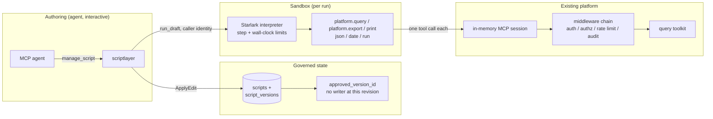

# Managed Scripts: Security Model

This document is the threat model for managed scripts: what the feature adds to
the platform's attack surface, what it deliberately does not, and where the
residual risk sits. It is the security counterpart to the platform-wide
[Threat Model](../security/threat-model.md), which this document assumes rather
than repeats, and it is revised in step with the feature: every change to the
managed-scripts surface updates it in the same change.

Every claim below carries a package or file citation a reviewer can check
against the source. Where a protection does not exist, this document says so.

Reviewed at the state of the tree that introduced the script domain, the
Starlark engine, and the authoring loop.

## What a managed script is

A managed script is a small Starlark program the platform stores, versions, and
governs, so that a process whose logic is already solved (a KPI report, a
recurring export) can be re-run without re-deriving it through a model. Scripts
are authored by an agent through the `manage_script` MCP tool, executed by an
embedded interpreter, and constrained to a small, enumerable set of host
functions.

The state of the feature at this revision is deliberately narrow:

- A script can be created, edited, validated, and dry-run.
- Nothing executes a script on its own. There is no scheduler, no run queue, and
  no run tool. The only way a script executes at all is `manage_script
  run_draft`, which runs it in the foreground under the identity of the person
  who called it.
- No script writes anything. `platform.export` reports the shape and size an
  output would have and persists nothing
  (`internal/platform/scriptrun/host.go`, `hostState.export`).

## The claim this feature makes about authority

**Managed scripts introduce no new authority at this revision.**

That is a structural property, not a policy:

- A draft run authenticates as the caller. `run_draft` reads the caller's own
  identity off the `PlatformContext` of the `manage_script` call that reached
  it, and injects exactly that identity into the run's session
  (`internal/platform/scriptlayer/rundraft.go`, `connectAuthorSession`). There
  is no service principal, no elevation, and no synthesized identity.
- A draft run crosses the full middleware chain. Each host call is one MCP tool
  call over a per-run in-memory session against the assembled server
  (`internal/platform/scriptlayer/rundraft.go`, `sessionCaller.CallTool`), so
  authentication, persona and connection authorization, per-user rate limiting,
  and audit all apply exactly as they do to an agent's call. None of it is
  re-implemented, which is what keeps it from drifting.
- Therefore a caller can do nothing through `run_draft` that they could not
  already do by calling the same tools directly. The proof is an integration
  test against the real assembled server that asserts the audit row for a
  script's query carries the author's user id, email, and persona
  (`internal/platform/scriptlayer/rundraft_integration_test.go`,
  `TestIntegration_DraftRunCarriesTheAuthorIdentityAndIsAudited`).

`middleware.SourceScript` is a label on that call, not a capability. It records
how the call arrived so audit can separate populations, and it selects three
behaviors described below; it grants nothing (`pkg/middleware/mcp.go`).

## Assets

| Asset | Why it matters |
|---|---|
| Script source and its version history | Executable code under governance; the artifact a reviewer approves |
| `scripts.approved_version_id` | The execution gate. The one pointer that will decide what the platform executes on its own |
| Data reachable through `platform.query` | Whatever the running identity's persona and connections allow |
| Run logs | Bounded free text a script chooses to emit; may echo queried data |
| Connection credentials | Never reachable from a script; held by the platform and used by the toolkit |

## Actors

| Actor | Capability at this revision |
|---|---|
| Script author (any authenticated caller) | Creates and edits their own personal scripts; runs drafts as themselves |
| Admin persona | The above at every scope, plus scope and lifecycle changes |
| Reviewer | No approval action exists yet; `validate` produces the material a review will use |
| The script itself | Only the host functions listed below, only through the running identity |

## Trust boundaries

The boundary that matters is between the interpreter and the platform. A script
reaches the outside world only by calling a host function, and every host
function crosses the middleware chain as the running identity. There is no other
edge out of the interpreter.

## Controls

### The language is the sandbox

Starlark is the engine because determinism and isolation are properties of the
language rather than of a blocklist the platform must maintain
(`internal/platform/scriptrun/scriptrun.go`). Starlark has no ambient clock, no
randomness, no filesystem, no network, and no module system; iteration order is
specified. A script can affect the world only through bindings the host chooses
to predeclare, and the predeclared set is exactly `platform`, `json`, `date`,
and `run` (`predeclared`, and `isPredeclaredName` in `validate.go`, which is the
same list validation checks against).

Two dialect switches are deliberately off:

- `while` and recursion, because both are unbounded control flow whose cost
  cannot be read off the source.

Two are deliberately on, and neither affects safety or determinism: top-level
control flow, and reassignment of a top-level name. Starlark's defaults for
those come from Bazel, where a file is a declaration loaded by other files; a
managed script is a procedure executed once, top to bottom, by one runner.

### Resource limits, stated honestly

| Limit | Mechanism | Where |
|---|---|---|
| CPU | Interpreter execution-step cap; a draft run is capped tighter than an approved run will be | `scriptrun.DraftMaxSteps` |
| Wall clock | Context deadline bridged to thread cancellation, covering time spent inside host calls | `scriptrun.DraftTimeout`, `watchCancel` |
| Result size | Hard row and byte caps on every `platform.query` result, with the row cap pushed down into the query | `scriptrun.DraftMaxRows`, `DraftMaxResultBytes`, `hostState.queryResult` |
| Truncation | A result the engine truncated at the cap FAILS the run rather than being handed over as complete | `hostState.queryResult`, `truncated` |
| Log size | Bounded capture, head kept, tail dropped with a marker | `scriptrun.MaxLogBytes`, `logBuffer` |
| Outputs per run | Capped | `maxExports` |
| Source size | Capped before the parser sees it | `script.MaxSourceBytes` |

**There is no hard memory cap.** Neither starlark-go nor any comparable embedded
interpreter offers one, and this document does not pretend otherwise. A
pathological script can grow the process heap despite the step limit, because
allocation per step is unbounded. The mitigations in place are the step limit,
the wall-clock deadline, the host-side result caps, and `GOMEMLIMIT` at the
process level. The residual risk is accepted at this revision because the only
way a script runs is a foreground call by an authenticated caller who could
issue the same expensive queries directly; it is recorded in
[Residual risks](#residual-risks) and revisited when scripts gain an unattended
execution path.

### SQL parameters are bound, never spliced

`platform.query` takes `:name` placeholders and a `params` dict, and the host
renders each value as a typed SQL literal before the statement is sent
(`internal/platform/scriptrun/bind.go`, `bindSQL`). Strings are single-quoted
with embedded quotes doubled; a NUL byte is refused rather than escaped;
numbers, booleans, null, and lists of scalars each have one rendering; anything
else is refused.

Substitution is state-aware: a `:name` inside a string literal, a quoted
identifier, or a comment is text, and `::` is a cast rather than the start of a
placeholder. Getting that wrong in either direction is a defect — a rewritten
literal, or an unbound placeholder reaching the engine — so both directions are
covered by tests (`bind_test.go`).

Binding is offered because the alternative is worse. Without a bound list an
author builds an `IN` clause by joining strings, which is exactly the
concatenation this path exists to remove. The engine that ultimately executes
the statement still applies its own read-only interception (`trino_query`
refuses writes); binding is defense in depth on top of that, not a replacement
for it.

### A partial result is a failure, not a result

The row cap is pushed down as the query's own limit, so the engine stops at
exactly that many rows. That makes a length check useless as a truncation
signal, and the failure it would have caught is the worst kind: a script that
sums the first N rows of a larger result reports a wrong total with nothing in
the output to show that anything was missing. `platform.query` therefore reads
the query tool's own truncation flag and fails the run
(`internal/platform/scriptrun/host.go`, `truncated`). Silently wrong is the one
outcome the determinism contract exists to exclude, so it is worth a hard
failure and a message that says to aggregate in SQL.

### Credentials never live in a script

Connections are named; their credentials stay in platform connection
configuration exactly as they do for every toolkit. `validate` scans source for
credential-shaped literals (`internal/platform/scriptrun/validate.go`,
`secretPatterns`), and severity follows confidence:

- A pattern matching a specific credential FORMAT — a private-key header, an AWS
  access key id, a GitHub or Slack token, a JWT, a URL with inline credentials —
  is an **error** and blocks the save. Nothing else looks like those.
- A pattern matching a NAMING convention (`password = "..."`) is a **warning**.
  That string is a credential in Go source and an ordinary predicate inside a
  SQL string, and a text scanner cannot tell them apart; blocking would refuse
  to store a legitimate query with no way around it. It is surfaced for the
  reviewer instead.

A pattern scan finds what it recognizes and nothing more; it is a tripwire that
catches the paste, not a proof of absence.

### Unparseable source is never stored

`create` and `patch` both validate before writing (`commands.go`, `content.go`).
A script that does not parse is not a draft, it is a typo, and refusing it means
every stored version is one a reviewer could meaningfully read.

### The three `SourceScript` middleware behaviors

Each is a structural consequence of a script run being a per-run in-memory
session with no model in it. All three are pinned by tests in
`pkg/middleware/script_source_test.go`.

1. **Exempt from the session and search-first gates**
   (`isStatelessShimSource`). A script cannot perform the `platform_info`
   handshake and cannot perform a discovery step, because there is no model in
   a script run to do either — the same structural reason the portal tool runner
   and the gateway REST shim are exempt. What the search-first gate steers an
   agent toward happened when a person authored the script. The function fails
   closed: an unknown source is not exempt.
2. **An isolated per-run session identity** (`connectAuthorSession`,
   `mintIsolatedRunSessionID`, `DiscoveryScopeKey`). One run is one session: the
   run id is minted with its own prefix (`pkgsession.ScriptSessionPrefix`) and
   threaded onto the run's session context, so every platform call the run makes
   records that same id and the id the author is handed back is the id in the
   audit rows. A run can never advance or read the gate, provenance, or dedup
   state of the person it runs for. The tool-call middleware mints one as a
   fail-safe when a run arrives without one, keyed on "does not already carry a
   run id" rather than on "has no session id": on a stdio deployment the
   resolved id is the per-process `stdio` sentinel rather than empty, and an
   emptiness test would leave every script run there sharing one scope. On the
   degenerate path where minting fails, the scope is empty rather than the
   user's, so isolation holds.
3. **Enrichment is skipped** (`pkg/middleware/mcp_enrichment.go`). Enrichment
   appends cross-service context that varies with catalog state, which is
   precisely the variation the determinism contract promises a script will not
   see. It is also pure cost: a script consumes structured content.

### Determinism, precisely

The contract is:

> Same script version + same parameters + same underlying data produce the same
> output.

It is not "identical forever." The warehouse changes between runs, and that is
the point of re-running. What the platform eliminates is every source of
variation it controls: no clock or randomness is reachable, the fire time is a
pinned value on `run.fire_time` rather than a clock read, enrichment is off, and
map keys are converted in sorted order so Go's randomized map iteration cannot
leak into a script's own output (`internal/platform/scriptrun/convert.go`).

Determinism is a security property here as well as a correctness one: it is what
makes a run explainable after the fact from its own record, and what makes
"never retry a script error" safe (a failure on the same inputs will recur, so
retrying only multiplies the cost).

## Threats and mitigations

| Threat | Mitigation | Citation |
|---|---|---|
| A script reaches data its runner may not see | Every host call crosses persona and connection authorization as the running identity | `rundraft.go`, `pkg/persona/filter.go` |
| A script escalates beyond its runner | No service identity exists; the run authenticates as the caller | `connectAuthorSession` |
| A script escapes the interpreter | No IO, filesystem, network, or module system is predeclared | `scriptrun.go`, `predeclared` |
| A script builds a statement out of untrusted values | Typed literal binding with a state-aware scanner | `bind.go` |
| A script carries an inline credential | Secret scan blocks it as an error at validate time | `validate.go`, `secretPatterns` |
| A script burns unbounded CPU or wall clock | Step limit and deadline, both bridged to interpreter cancellation | `scriptrun.go`, `Run` |
| A script pulls an unbounded result | Row and byte caps, row cap pushed into the query | `host.go`, `queryResult` |
| A script floods the log | Bounded capture with an explicit truncation marker, cut on a rune boundary | `host.go`, `logBuffer` |
| A script silently computes on a partial result | A truncated query result fails the run | `host.go`, `truncated` |
| A retired script keeps executing | `run_draft` refuses a disabled or superseded script | `rundraft.go`, `runnable` |
| An edit path skips the record checks | `create`, `update`, and `patch` all run `Script.Validate` on the final state | `commands.go`, `content.go` |
| A run pollutes its runner's session state | Per-run minted session identity | `pkg/middleware/mcp_session_handle.go` |
| A script edit slips past review | The edit funnel defers a substance change to a draft version once a version is approved, and refuses to mix it with unversioned changes | `pkg/script/edit.go` |
| A script's calls are invisible after the fact | Every host call is audited with the running identity and `source=script` | `pkg/middleware/audit.go` |

## Non-goals

- **A script is not a privilege boundary.** It runs with its runner's authority.
  A person who should not reach a connection must not be granted it; a script
  will not add a second gate that saves a persona misconfiguration.
- **The secret scan is not a proof.** It recognizes known credential shapes.
- **No content sanitization.** Data returned by a query and printed into a log
  is not scanned for anything.
- **No defense against a malicious admin.** As in the platform threat model.

## Residual risks

1. **No hard memory cap.** Described above under resource limits. Mitigated by
   the step limit, deadline, result caps, and `GOMEMLIMIT`; not eliminated. The
   escape hatches, if it matters later, are running script execution in
   dedicated replicas where an out-of-memory condition cannot take down serving,
   and a WASM engine with a real memory bound.
2. **Approval will be the load-bearing control, and it does not exist yet.**
   Nothing at this revision executes a script unattended, so nothing yet depends
   on a reviewer's judgement. When an execution gate arrives, a rubber-stamped
   approval becomes the way a prompt-influenced agent could get code running on
   a schedule. The mitigation is the capability and connection diff that
   `validate` already produces: the material for that review is being built
   before the review matters.
3. **A computed connection is not statically knowable.** `validate` reports
   `dynamic_connections` when a `platform.query` call computes its connection
   instead of naming one, so a reviewer is told the list is incomplete rather
   than shown a list that quietly omits it.

## Maintenance contract

This document is revised in the same change as the code, not afterwards. Any
change that adds a host function, changes a limit, changes what identity a run
carries, adds an unattended execution path, or changes the approval model must
update the corresponding section here. A change to the managed-scripts surface
that leaves this document untouched is incomplete.
