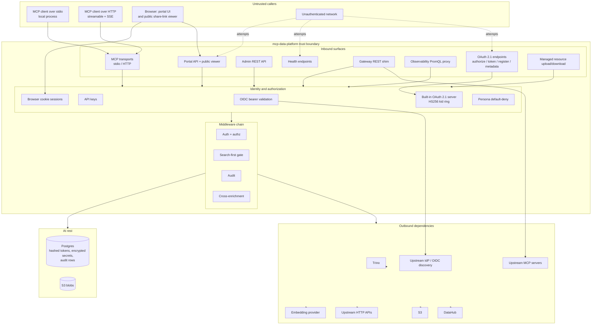

# Threat Model

This document states the security model of mcp-data-platform as a whole: the
trust boundaries, the attackers each mechanism is designed to stop, and, just
as important, what is explicitly out of scope. It complements
[SECURITY.md](https://github.com/txn2/mcp-data-platform/blob/main/SECURITY.md)
(vulnerability reporting, supported versions) and the
[Authentication Overview](../auth/overview.md) (the fail-closed model in
operational detail).

Every mitigation claim below carries a package or configuration citation that a
reviewer can verify against the source. Aspirational protections are not listed.
Where the platform cannot defend against a class of attack, this document says
so plainly.

Reviewed at v1.101.x. See [Maintenance contract](#maintenance-contract) for
when this document must be revisited.

## How to read this document

- [System context](#system-context) diagrams every trust boundary in one view.
- [Trust boundaries](#trust-boundaries) enumerates the inbound surfaces,
  identity mechanisms, outbound dependencies, and at-rest stores.
- [Attacker analysis](#attacker-analysis) works through six attacker personas,
  applying STRIDE-style reasoning to the boundaries each one can reach.
- [Mitigations](#mitigations) is a threat-to-mechanism table with citations.
- [Non-goals and residual risks](#non-goals-and-residual-risks) states what is
  deliberately not defended, and why.

Conventions: hostnames use `example.com`; the platform is vendor-neutral and
no deployment names appear here.

## System context

The platform sits between MCP clients (and a browser-based portal) on one side
and a set of data and identity services on the other. Trust changes at each
boundary crossing. Everything inside the platform box runs with the platform's
own process trust; everything outside is either an authenticated caller whose
identity the platform establishes, or an outbound dependency the platform
authenticates to with operator-supplied credentials.

## Trust boundaries

### Inbound surfaces

All HTTP surfaces are assembled in one composition root
(`internal/httpserver/server.go`, `Serve`). The transport selection happens in
`cmd/mcp-data-platform/main.go` (`startServer`): `stdio` runs
`mcpServer.Run(ctx, &mcp.StdioTransport{})` directly, while `http`/`sse` runs
`httpserver.Serve`.

| Surface | Route(s) | Authentication |
|---------|----------|----------------|
| MCP stdio transport | n/a (process pipe) | None at the transport. stdio is local-process trust; see [non-goals](#non-goals-and-residual-risks). |
| MCP streamable HTTP | `/` | Bearer or `X-API-Key`, enforced by `MCPAuthGateway` (`internal/httpserver/httpauth/authmiddleware.go`) when `auth.allow_anonymous` is false. |
| MCP SSE | `/sse`, `/message` | Same gate via `RequireAuthWithOAuth` (`internal/httpserver/httpauth/authmiddleware.go`). |
| OAuth 2.1 endpoints | `/authorize`, `/token`, `/register`, `/.well-known/oauth-authorization-server`, `/.well-known/oauth-protected-resource` | Public by design. `/token` and `/register` are rate-limited (see below); `/register` (DCR) is disabled unless configured. |
| Admin REST API | `/api/v1/admin/` | `admin.RequirePersona` (`pkg/admin/middleware.go`): unauthenticated returns 401, cookie path enforces CSRF, and the resolved persona must equal the configured admin persona. |
| Portal API | `/api/v1/portal/` | Authenticated mux (`pkg/portal/handler.go`), then the persona gate (`internal/httpserver/accessgate`). Authentication proves identity; the gate decides access. A caller whose roles map to no persona is refused 403 before any handler runs — a browser navigation gets a branded page naming the refused account, everything else gets RFC 9457 Problem Details. Without it, any account an identity provider will issue a token for would read every org-shared knowledge page and the whole federated search surface, neither of which scopes on roles. The SPA shell at `/portal/` applies the same check to a session cookie so a refused person gets the page instead of an application shell (`internal/httpserver/mounts.go`). |
| Portal public viewer | `/portal/view/` | Deliberately outside the persona gate (share links are for people with no account). Rate-limited, then gated on the share's access mode by `publicShareGate` (`pkg/portal/share_access.go`, `pkg/portal/shareaccess`), which wraps every route on the public mux. Anonymous access only for `public` shares; `authenticated` requires any signed-in user and `restricted` only the named recipient or the share's creator, both 403 otherwise. Revoked/expired tokens return 410 (`internal/portal/viewerlimit`). A refused browser navigation renders a branded landing page; email-share recipients without an account can request a single-use view link (`pkg/portal/shareguest`): sent only to the stored recipient address, SHA-256-hashed at rest, claimed atomically (15-minute expiry), opening a view-only guest session as an HMAC-signed cookie scoped to that one share, with the key domain-separated from the browser-session signing key so a guest cookie can never pose as a portal session. Share revocation is checked before guest admission, so it cuts off live guest sessions. The request endpoint answers uniformly regardless of share state (no share-existence oracle) and is capped per share per hour against mailbombing, inside the same per-IP limiter. The gate also sets the response's cache policy, since a per-caller verdict cached under a per-URL key is the same bypass by another route: every response on the surface carries `Vary: Cookie`, responses for any mode but `public` are `Cache-Control: private`, refusals are `no-store`, and only a fully public share's thumbnail is offered to shared caches, as `public` with `max-age` clamped to the smaller of an hour and the share's remaining life so no stored copy outlives the token. Revocation is the residual: it is not a time the response can be written against, so a copy a shared cache already holds is served until it goes stale, which is why that one window is an hour. |
| Notification unsubscribe | `/portal/notifications/unsubscribe` | Public by design so recipients without an account can opt out of notification emails. The `tok` parameter is an HMAC over the recipient address under a key derived from the browser-session signing key; an invalid token writes nothing, and a valid one can only set delivery mode `off` for the address it names. GET performs no mutation (it renders a confirmation page), so mail-scanner URL prefetch cannot opt a recipient out; the opt-out records only on POST, either the confirmation form or the RFC 8058 one-click body (`internal/httpserver/unsubhttp/unsubscribe.go`). |
| Share resubscribe | `POST /portal/view/{token}/resubscribe` | Public by design (its audience is opted-out recipients the share gate refuses); rate limited with the other public share routes. Answers uniformly regardless of share state (no share-existence oracle), acts only on a live, non-public share's stored recipient address, and can only restore the immediate-delivery default; it can never opt anyone out or touch category toggles (`pkg/portal/shareguest`). |
| Gateway REST shim | `/api/v1/gateway/{connection}/invoke` | Wrapped by `httpauth.RequireAuth` when auth is enabled; the request runs through an in-memory MCP session so persona and audit apply (`internal/httpserver/gatewayhttp/handler.go`). |
| Observability PromQL proxy | `/api/v1/observability/query`, `/query_range` | Requires authentication and the `observability:read` capability; unauthenticated 401, unauthorized 403 (`pkg/observability/proxy/handler.go`). |
| Health | `/healthz`, `/readyz` | Unauthenticated by design (`internal/httpserver/health/health.go`); liveness/readiness only, no data. |
| Managed resources | `POST /api/v1/resources`, `GET /api/v1/resources/{id}/content`, and CRUD | Every handler calls `authenticate` first (401 on failure, 403 on CSRF). This surface authenticates through the portal authenticator but not through the portal handler, so it applies the persona gate in its own claims builder: a caller belonging to no persona is refused 403 (`internal/httpserver/mounts.go`, `buildResourceClaims`). upload checks `CanWriteScope`, and the by-id reads (get, download, patch, delete) check `CanAccessResource` — the caller's visible scopes, OR current write authority over the scope (platform admin, or that persona's admin), so an admin can manage material they may create but do not belong to, while a revoked role revokes the access with it (the grant is re-derived from current claims, never from the stored uploader); uploads are size-bounded via `MaxBytesReader` (`pkg/resource/handler.go`). |

On the HTTP transports, a missing token yields `401` with a
`WWW-Authenticate: Bearer` challenge, and a present-but-invalid token yields
`401` with `error="invalid_token"` (`internal/httpserver/httpauth/authmiddleware.go`,
`oauthgate`). The gate fails open only on a transient validation outage
(`ErrValidationUnavailable`, e.g. a JWKS fetch failure), never on an invalid
token.

#### Identity-provider outage

Validation has three outcomes, not two: valid, definitively invalid, and
undetermined. The third arises when the identity provider cannot be reached, so
the signing keys needed to check a token are unavailable. The platform
distinguishes it with the `ErrValidationUnavailable` sentinel
(`pkg/middleware/auth.go`), which `pkg/auth/oidc.go` wraps only when a JWKS
fetch fails while the cache is expired — never for a key the issuer does not
have.

**The decision: the HTTP edge passes an undetermined credential through, and
the protocol layer refuses the call.** These are one control, not two
independent behaviors:

- The edge (`oauthGate`) does not answer `401`. A `401` asserts the credential
  is bad, which during an outage is false, and it would drive every valid user
  into an OAuth re-authentication flow that cannot complete until the provider
  returns.
- The protocol layer re-validates on every tool call and, on the same sentinel,
  answers `feature_unavailable` with a retryable hint rather than
  `unauthenticated` (`pkg/middleware/mcp.go`, `authenticateAndAuthorize`). No
  tool handler runs.

Access is therefore never granted on an unvalidated credential. What the
fail-open costs is depth: during a provider outage an unauthenticated request
reaches the protocol layer before it is refused, so the refusal there is
load-bearing for every request shape that can reach it.

What a client sees during an outage: HTTP requests succeed at the transport
level, the MCP session establishes, and every tool call returns an in-band error
result carrying `code: feature_unavailable`, the message `authentication
temporarily unavailable`, and a hint stating that this is a transient
server-side condition rather than a credential problem. Nothing signals re-auth,
so a well-behaved client retries rather than prompting the user to sign in
again. Once the provider is reachable the next call succeeds with no client
action.

Both halves are pinned end to end by
`TestStreamableHTTP_ValidationUnavailable_EdgePassesThroughProtocolRefuses`
(`internal/httpserver/validation_outage_test.go`), which drives a real HTTP
handler, gate, middleware chain and MCP client. It fails if the edge starts
rejecting, if the protocol layer stops refusing, or if the refusal stops being
categorized as retryable. Its companion,
`TestStreamableHTTP_DefinitiveRejection_EdgeFailsClosed`, holds the boundary:
pass-through applies only to an undetermined verdict, never to a credential the
platform can definitively reject.

### Identity and authorization

| Mechanism | Package | Notes |
|-----------|---------|-------|
| OIDC bearer validation | `pkg/auth/oidc.go` | RSA-only signature check, requires `kid`, validates iss/aud/exp/nbf/iat. The JWKS cache is self-healing: on a `kid` miss it triggers a single-flight, throttled refresh (`refreshForLookup`, `refreshGroup.DoChan`) and re-checks, distinguishing a transient fetch failure (fail-open) from a definitive unknown key (fail-closed). |
| API keys | `pkg/auth/apikey.go` | Config keys are matched with `subtle.ConstantTimeCompare`; database-issued keys are bcrypt-hashed and verified with `bcrypt.CompareHashAndPassword`. |
| Built-in OAuth 2.1 server | `pkg/oauth/server.go`, `pkg/oauth/signkey/signkey.go` | Access tokens are HS256 with a `kid` header. The `kid` derives from SHA-256 of the signing key; a key ring keeps verify-only previous keys so rotation does not invalidate live tokens. Unknown `kid` is rejected. |
| PKCE | `pkg/oauth/server.go`, `pkg/oauth/pkce.go` | S256 required; any other `code_challenge_method` is rejected at `/authorize`, verification hard-codes S256, and metadata advertises S256 only. `plain` is not implemented. |
| Browser cookie sessions | `pkg/browsersession/cookie.go` | Cookies are `HttpOnly`, `Secure` (default on), `SameSite=Lax` by default; the value is an HS256-signed JWT (signing key required to be at least 32 bytes) and validation rejects non-HMAC algorithms. |
| Persona default-deny | `pkg/persona/filter.go` | On every axis (tools, connections, API routes) a nil persona denies, deny rules are evaluated first and win, an explicit allow is required, and the final fallthrough denies. `FilterTools` returns nil for a nil persona. |

### Outbound dependencies

Outbound credentials are operator-authored per connection, not derived from the
calling user's identity.

| Dependency | Package | Credential / control |
|------------|---------|----------------------|
| Trino | `pkg/toolkits/trino/`, `pkg/query/trino/` | Username/password from connection config. Optional read-only mode (`read_only`, default off) rejects write SQL via `ReadOnlyInterceptor` (delegates to `trinotools.IsWriteSQL`); this is a write-verb rejection, not a SELECT-only allowlist. It applies per connection: the interceptor resolves the connection the call names, or the default when it names none, and permits writes only on a connection configured write-capable — an unresolved or unconfigured connection is refused. The interceptor runs on the toolkit's SQL tools; `pkg/query/trino/` is the enrichment read path, which issues its own fixed metadata queries and does not run the interceptor. |
| DataHub | `pkg/semantic/datahub/adapter.go` | Static bearer token from connection config. |
| S3 | `pkg/storage/s3/adapter.go` | Static access-key/secret from connection config; the adapter carries a `ReadOnly` flag. |
| Upstream MCP servers (gateway toolkit) | `pkg/toolkits/gateway/` | Remote tool descriptions and responses are re-exposed under a namespaced name. Descriptions and non-error response content flow through with enrichment applied only to structured content; there is no description sanitization. See the [malicious upstream](#malicious-or-compromised-upstream) analysis. |
| Upstream HTTP APIs (apigateway toolkit) | `pkg/toolkits/apigateway/invoke.go` | Requests target the operator-authored `base_url`; method is restricted to a closed allowlist and per-call timeout is capped. This path targets operator-configured hosts and does not run the catalog SSRF dialer guard. |
| OAuth-to-upstream | `pkg/connoauth/exchange.go` | One shared upstream identity per connection (#374). The token-exchange client refuses redirects, caps the response body, and enforces a hard timeout; tokens are attached by `authRoundTripper` in the gateway client. |
| Upstream IdP / OIDC discovery | `pkg/oidcdiscovery/`, `pkg/auth/oidc.go` | Discovery documents and JWKS are fetched from the configured issuer. |
| Embedding provider | `pkg/embedding/ollama.go` | Outbound POST to the operator-configured URL; input is byte-capped before send and error bodies are read under a limit reader. |

### At rest

| Store | Package | Protection |
|-------|---------|------------|
| OAuth authorization codes and refresh tokens | `pkg/oauth/postgres/store.go`, `pkg/oauth/storage.go` | Stored as `SHA-256(token)` hex digests (`HashToken`), looked up by hash, and consumed atomically with `DELETE ... RETURNING` so replay after use returns not-found. |
| OAuth client secrets | `pkg/oauth/dcr.go`, `pkg/oauth/server.go` | bcrypt-hashed at registration; the plaintext secret is returned to the client once and never stored. |
| Connection secrets | `pkg/platform/fieldcrypt/fieldcrypt.go` | AES-256-GCM with a single symmetric key from `ENCRYPTION_KEY` (32 bytes), random nonce per operation, stored as an `enc:`-prefixed base64 value. This is symmetric field encryption, not a DEK/KEK envelope scheme. When no key is configured, values are stored in plaintext (encryption disabled). |
| Audit rows | `pkg/audit/postgres/store.go`, `pkg/middleware/mcp_audit.go` | Tool-call arguments are stored in the `parameters` column. Configured top-level keys are replaced with `[REDACTED]` in the middleware before the event leaves the request path (`redact_keys`), `log_parameters: false` drops arguments entirely, and any value over 16KB is stored as its size rather than its content, so a payload argument does not become a second copy of that data in the audit table. A baseline sanitizer masks a fixed sensitive-key set (`pkg/audit/event.go`). |
| S3 blobs | `pkg/storage/s3/` | Stored in the operator's object store under the connection's credentials; blob-at-rest protection is a deployment responsibility (bucket encryption, access policy). |

## Attacker analysis

Each section names an attacker, the boundaries they can reach, and the
mechanisms that stop or bound them. STRIDE categories are noted where they
apply.

### Unauthenticated network attacker

Reachable surface: OAuth endpoints, health endpoints, the portal public viewer,
and (before authentication) the HTTP MCP transports.

- Denial of service / resource exhaustion on `/token` and `/register`
  (Elevation, DoS). Both endpoints are rate-limited default-on with a per-IP
  token bucket and a global backstop bucket sized at ten times the per-IP rate
  (`pkg/oauth/ratelimit.go`, `pkg/ratelimit/http.go`); over-limit callers get
  `429 slow_down`. DCR is disabled unless explicitly configured, and the
  bcrypt cost of `/register` is throttled by the same limiter.
- Spoofed `X-Forwarded-For` to defeat per-IP limits (Spoofing). The client-IP
  resolver consults `X-Forwarded-For` only when the direct peer is a configured
  trusted proxy, then walks the header right-to-left to the last untrusted hop;
  with no trusted proxies configured the header is ignored entirely
  (`pkg/ratelimit/clientip.go`).
- Public viewer scraping (Information disclosure). The `/portal/view/` path is
  share-token-gated and rate-limited; revoked or expired tokens return 410
  (`pkg/portal/public.go`, `pkg/portal/handler.go`). Only content the sharer
  chose to publish is reachable.
- Token forgery against the MCP transports (Spoofing). A missing or invalid
  bearer/API key is rejected with 401 before any handler runs
  (`internal/httpserver/httpauth/authmiddleware.go`); OAuth access tokens are HS256-signed and
  verified against the key ring.
- Health endpoints (Information disclosure). `/healthz` and `/readyz` are
  unauthenticated but return only liveness/readiness, no data
  (`internal/httpserver/health/health.go`).

### Authenticated low-privilege persona

Reachable surface: the tools their persona allows, plus probing of surfaces they
should not reach.

- Tool-allowlist escape (Elevation). Authorization is default-deny on every
  axis; deny rules win over allow, and a tool with no matching allow is denied
  (`pkg/persona/filter.go`). `FilterTools` never returns a tool the persona was
  not granted.
- Cross-persona or cross-connection data access (Information disclosure).
  Connection access is a separate default-deny axis (`IsConnectionAllowed`); a
  persona cannot reach a connection it was not granted.
- Admin-surface probing (Elevation). The admin REST API requires the resolved
  persona to equal the configured admin persona and enforces CSRF on the cookie
  path (`pkg/admin/middleware.go`). The observability proxy requires the
  `observability:read` persona capability, gated through the same default-deny
  persona tool filter (`pkg/platform/observability.go`,
  `pkg/observability/proxy/handler.go`): a persona must explicitly allow it (or
  match it via a wildcard), so in a typical configuration only the admin persona
  (`allow: ["*"]`) holds it.
- Large-scan or PII access (Information disclosure, DoS). The Trino toolkit can
  prompt for consent before a large scan (cost estimation via EXPLAIN IO above a
  row threshold) or before accessing PII columns
  (`pkg/toolkits/trino/elicitation.go`). These are user-facing elicitation
  prompts, not hard blocks, and are specific to the Trino toolkit.

### Malicious or compromised upstream

Reachable surface: whatever the gateway toolkit (upstream MCP server) or
apigateway toolkit (upstream HTTP API) returns, which flows into cross-enrichment
and on to the LLM client.

- Tool-description injection (Tampering, and prompt injection reaching the
  client). The gateway toolkit re-exposes an upstream tool's own description
  verbatim under a namespaced name (`pkg/toolkits/gateway/toolkit.go`); there is
  no description sanitization. An operator who connects a malicious upstream MCP
  server is trusting that server's tool descriptions. The mitigation is
  operational: connections are operator-authored, credentials are per-connection
  and encrypted, and every proxied call is audited. The platform does not
  neutralize adversarial content inside an upstream tool description.
- Response poisoning into the LLM (Tampering). Upstream responses flow back
  through the forwarder with enrichment applied only to structured content of
  non-error results. The platform cannot verify the semantic truthfulness of a
  response from a compromised upstream; see the [malicious query
  data](#malicious-data-in-query-results) section, which describes the same
  residual limit.

### Malicious data in query results

Reachable surface: the content of rows returned by Trino, DataHub, or S3,
carried to the LLM client through cross-enrichment.

- Prompt-injection content in data reaching the client (Tampering). Query
  results and their enriched context are returned to the calling LLM client.
  DataHub semantic metadata (descriptions, tags, glossary terms, column context)
  that flows through cross-enrichment is sanitized before exposure: control
  characters are removed, known injection patterns are stripped by default,
  strings are length-capped, and detected attempts are logged
  (`pkg/semantic/sanitize.go`, `pkg/semantic/injection_logger.go`). Raw query row
  values are a different matter: the platform does not and cannot scrub
  adversarial natural-language content out of legitimate data values, so a cell
  that contains attacker-controlled text reaches the client. What the platform
  does provide there is bounding and provenance: read-only mode can prevent the
  model from acting on injected instructions to mutate data
  (`pkg/toolkits/trino/readonly.go`), the search-first gate and persona
  allowlists bound which tools the model can reach at all, and every tool call is
  audited. Defending the client's own reasoning against injected data values is a
  shared responsibility with the client; for raw data the platform's contribution
  is blast-radius reduction, not content sanitization.

### Database reader

Reachable surface: a Postgres backup, replica, or operator with read access to
the platform database.

- Credential theft from the database (Information disclosure, Elevation). OAuth
  authorization codes and refresh tokens are stored as SHA-256 hashes, not
  plaintext, and are single-use (`pkg/oauth/postgres/store.go`); client secrets
  are bcrypt-hashed (`pkg/oauth/dcr.go`); connection secrets are AES-256-GCM
  encrypted with a key held outside the database in `ENCRYPTION_KEY`
  (`pkg/platform/fieldcrypt/fieldcrypt.go`). A database reader does not obtain
  usable bearer tokens or connection credentials from these columns.
- What a database reader still obtains. Audit rows contain tool-call arguments
  (including SQL) subject to `redact_keys` and the `log_parameters` opt-out but
  not otherwise encrypted, semantic metadata, portal content, and knowledge
  records. If `ENCRYPTION_KEY` is not configured, connection secrets are stored
  in plaintext. Protecting the audit and metadata content of a compromised
  database is a deployment responsibility (at-rest encryption, backup access
  control).

### Compromised downstream credential

Reachable surface: the blast radius of a leaked Trino, S3, or DataHub service
account.

- Downstream account misuse (Elevation, Information disclosure). Because
  outbound credentials are per-connection and operator-authored, a compromised
  credential is bounded by what that service account can do in the downstream
  system, not by the platform's own privileges. Trino read-only mode, when
  enabled, prevents write SQL through that connection
  (`pkg/toolkits/trino/readonly.go`), and the S3 adapter carries a read-only
  flag. The platform cannot constrain a downstream account beyond what the
  downstream system's own authorization enforces; scoping the service account to
  least privilege in Trino/S3/DataHub is a deployment responsibility.
- The connection is also the unit of containment, by design. Access is scoped at
  the connection rather than the end user (see
  [Authorization model](../concepts/authorization.md)), so an operator sizes
  blast radius by deciding what each credential can reach and which personas are
  granted it, before any call happens. Several connections may front the same
  downstream system under different credentials at different permission levels;
  a compromise of the read-only one does not reach what the write-capable one
  can do. That containment is only as good as the split: a single broad
  credential shared by every persona makes the boundary a formality.

## Mitigations

Each row maps a threat to the mechanism that addresses it and the code or
configuration that implements it.

| Threat | Mechanism | Citation |
|--------|-----------|----------|
| Unauthenticated call to an HTTP MCP transport | Bearer/API-key gate, 401 + `WWW-Authenticate`, fail-closed on invalid token | `internal/httpserver/httpauth/authmiddleware.go` (`MCPAuthGateway`, `RequireAuthWithOAuth`, `oauthgate`) |
| Token forgery | HS256 access tokens signed and verified against a `kid` key ring | `pkg/oauth/server.go`, `pkg/oauth/signkey/signkey.go` |
| PKCE downgrade to `plain` | S256 required and hard-coded; other methods rejected | `pkg/oauth/server.go`, `pkg/oauth/pkce.go` |
| Authorization-code or refresh-token replay | Single-use via atomic `DELETE ... RETURNING` on the hashed value | `pkg/oauth/postgres/store.go` (`ConsumeAuthorizationCode`, `ConsumeRefreshToken`) |
| `/token` and `/register` flooding | Default-on per-IP token bucket plus a global backstop; `429 slow_down` | `pkg/oauth/ratelimit.go`, `pkg/ratelimit/http.go` |
| Spoofed `X-Forwarded-For` | Trusted-proxy-aware resolver; header ignored unless the peer is trusted | `pkg/ratelimit/clientip.go` |
| DCR abuse / unbounded client growth | DCR disabled unless configured; registration rate-limited | `pkg/oauth/server.go` (`RegisterClient`), `pkg/oauth/ratelimit.go` |
| Tool-allowlist escape / cross-connection access | Persona default-deny on tools, connections, and API routes | `pkg/persona/filter.go` |
| Admin-surface access by a non-admin | Admin persona required, CSRF enforced on the cookie path | `pkg/admin/middleware.go` |
| Observability data access by a non-admin | `observability:read` capability required; 401/403 | `pkg/observability/proxy/handler.go` |
| Public share-link scraping | Share-token gate, rate limiting, 410 on revoked/expired | `pkg/portal/public.go`, `pkg/portal/handler.go`, `internal/portal/viewerlimit` |
| Guest-link abuse (mailbombing a recipient, probing share tokens, replaying emailed links) | Uniform response regardless of share state; per-share issue cap plus per-IP rate limit; single-use atomic claim of a hashed, 15-minute token; guest session scoped to one share and view-only | `pkg/portal/shareguest` |
| Forged unsubscribe (opting someone else out) | Footer token is an HMAC over the recipient address under a key derived from the browser-session signing key; only a holder of the emailed link can opt that address out | `internal/httpserver/unsubhttp/unsubscribe.go` |
| Silent unsubscribe by mail-scanner prefetch (Safe Links, Proofpoint, and similar GETting footer URLs) | GET renders a confirmation page and mutates nothing; the opt-out records only on the confirmation form POST or the RFC 8058 one-click POST, which providers fire only on a real user action | `internal/httpserver/unsubhttp/unsubscribe.go` |
| The model acting on injected instructions to mutate data | Trino read-only mode rejects write SQL on the connections that set it | `pkg/toolkits/trino/readonly.go` (opt-in per connection via `read_only`) |
| Premature or over-broad tool use | Search-first gate refuses query tools until `search` runs; `SEARCH_REQUIRED` short-circuit | `pkg/middleware/mcp_workflow_gate.go` |
| Unbounded large scans / unconsented PII access | Cost-estimation and PII-consent elicitation prompts (Trino toolkit) | `pkg/toolkits/trino/elicitation.go` |
| SSRF via catalog spec fetch by URL | https-only, DNS pre-check plus dial-time re-check blocking private/link-local/CGNAT ranges and the metadata endpoint, redirects disabled, body capped | `pkg/toolkits/apigateway/catalog/fetch.go`, applied in `pkg/admin/catalog_handler.go` |
| Outbound OAuth token-exchange abuse | Redirects refused, response body capped, hard timeout | `pkg/connoauth/exchange.go` |
| Token/credential theft from the database | Tokens SHA-256-hashed, client secrets bcrypt-hashed, connection secrets AES-256-GCM encrypted | `pkg/oauth/postgres/store.go`, `pkg/oauth/dcr.go`, `pkg/platform/fieldcrypt/fieldcrypt.go` |
| Sensitive tool arguments retained in audit | `redact_keys` masking and `log_parameters` opt-out applied in-middleware | `pkg/middleware/mcp_audit.go`, `pkg/platform/config.go` |
| Prompt injection in DataHub metadata | Semantic metadata sanitized (control-char removal, injection-pattern stripping, length cap) with injection-attempt logging | `pkg/semantic/sanitize.go`, `pkg/semantic/injection_logger.go` |
| Loss of accountability | Every tool call audited through a bounded, drained async writer | `pkg/middleware/mcp_audit.go`, `pkg/audit/asyncwriter.go` |
| IdP key rotation breaking authentication | Self-healing JWKS cache with single-flight throttled refresh | `pkg/auth/oidc.go` |

## Non-goals and residual risks

These are stated plainly. Omitting them would misrepresent the security posture.

- stdio transport trusts the invoking process. When the platform runs over
  stdio, there is no MCP-layer authentication and no in-process sandboxing; the
  server acts with the credentials the local user configured
  (`cmd/mcp-data-platform/main.go`, `docs/auth/overview.md`). stdio is for local,
  single-user use.
- The platform does not defend against a malicious platform administrator. An
  admin can author connections, read audit content, and configure personas by
  design. `ENCRYPTION_KEY` protects secrets against a database reader, not
  against an operator who holds the key.
- Audit delivery is best-effort asynchronous by default. Under a sustained store
  outage, queued events are dropped (and counted via
  `audit_events_dropped_total`) rather than retained; `sync` delivery trades
  latency for durability. The full loss model is documented in
  [Delivery semantics](../server/audit.md#delivery-semantics); it is not
  restated here.
- Downstream identity is per connection, not per user. This is the authorization
  design rather than an unmitigated gap, and the distinction matters for how a
  reader sizes it. Access is scoped at the connection: a connection is a named
  binding to one downstream system under one operator-authored credential,
  connection rules are deny-by-default and enforced on every tool call and every
  discovery surface (`pkg/persona/filter.go`, `internal/platform/connscope`), and
  several connections may front the same system under different credentials at
  different permission levels. The platform performs no per-user token exchange,
  no impersonation, and no session-user propagation to Trino, S3, DataHub,
  upstream MCP servers, or HTTP APIs, because the construct every one of those
  backends shares is a credential and an endpoint, not a caller identity the
  platform could pass through. Outbound OAuth is per connection rather than per
  user (`pkg/connoauth/exchange.go`, and the mitigations table above); the
  API-gateway case is recorded as #374. What that costs is stated without
  softening: all callers granted a connection are indistinguishable to the
  downstream system, and warehouse row policies or column masks that key off the
  end user do not follow a caller through the platform. Expressing per-person
  policy means one connection per distinct policy outcome, which is workable when
  those outcomes are few and unpleasant when they are many. Per-user attribution
  comes from the audit trail, not from distinct downstream identities: with audit
  enabled, each call records `user_id`, `user_email`, `persona`, and the
  connection it targeted, subject to the best-effort delivery model stated above.
  Rationale and the add-a-connection-not-a-role guidance:
  [Authorization model](../concepts/authorization.md).
- Content sanitization is partial, not comprehensive. DataHub semantic metadata
  is sanitized on the enrichment path (`pkg/semantic/sanitize.go`), but raw query
  row values and gateway-upstream tool descriptions and responses are not
  scrubbed; adversarial natural-language content in those reaches the LLM client.
  The platform reduces blast radius (read-only mode, persona allowlists, the
  search-first gate, audit) but does not neutralize injected content in raw data
  or upstream responses; defending the client's reasoning is a shared
  responsibility.
- TLS termination, network segmentation, and Postgres transport security are
  deployment responsibilities. The platform assumes HTTP transports are fronted
  by TLS (strongly recommended in `docs/auth/overview.md`), that the database
  connection is secured by the operator, and that S3 blob-at-rest and bucket
  policy are configured in the object store. If `ENCRYPTION_KEY` is unset,
  connection secrets are stored in plaintext.

## Maintenance contract

This document was reviewed at v1.101.x. It describes the code at that version;
citations are to package and file paths that a reviewer can open and verify.

Update this document when any of the following change, because they alter a
trust boundary or a mechanism cited here:

- `pkg/auth` (identity validation, JWKS handling, API keys).
- `pkg/oauth` (the built-in OAuth 2.1 server, token storage, PKCE, rate
  limiting).
- `pkg/middleware` (the protocol middleware chain: auth, authz, the search-first
  gate, audit, enrichment).
- `pkg/persona` (the authorization model).
- The transports or the HTTP composition root (`internal/httpserver`,
  `cmd/mcp-data-platform/main.go`), or any new inbound surface.
- `pkg/platform/fieldcrypt`, `pkg/ratelimit`, or `pkg/connoauth` (at-rest
  encryption, rate limiting, outbound OAuth).

When updating, re-verify each affected citation against the current source and
bump the reviewed-at version at the top of this document.
