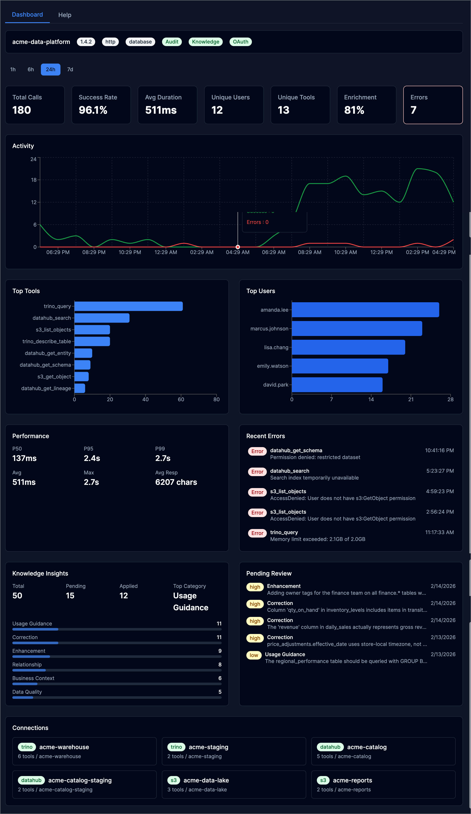

# Admin API

The Admin REST API provides HTTP endpoints for managing the platform outside the MCP protocol. All endpoints are mounted under a configurable path prefix (default: `/api/v1/admin`).

## Authentication

All admin endpoints require authentication. Pass credentials as either:

- `X-API-Key: <key>` header
- `Authorization: Bearer <token>` header

The authenticated user must resolve to the configured admin persona (set via `admin.persona` in config). Requests without valid credentials receive `401 Unauthorized`. Authenticated users whose persona does not match the admin persona receive `401 Unauthorized` (the admin API is invisible to non-admin users by design).

## Interactive API Documentation (Swagger UI)

When the admin API is enabled, an interactive Swagger UI is served at:

```
GET /api/v1/admin/docs/index.html
```

The OpenAPI specification is auto-generated from source code annotations using [swaggo/swag](https://github.com/swaggo/swag). The raw spec is available at `/api/v1/admin/docs/doc.json`. To regenerate after code changes:

```bash
make swagger
```

## Configuration

```yaml
admin:
  enabled: true
  portal: true                # Enable the admin web portal
  persona: admin              # Persona required for admin access
  path_prefix: /api/v1/admin  # URL prefix for all admin endpoints
  portal_title: "ACME Data Platform"
  portal_logo: https://example.com/logo.svg
  portal_logo_light: https://example.com/logo-for-light-bg.svg
  portal_logo_dark: https://example.com/logo-for-dark-bg.svg
```

| Field | Type | Default | Description |
|-------|------|---------|-------------|
| `enabled` | bool | `false` | Enable admin REST API |
| `portal` | bool | `false` | Enable the admin web portal |
| `persona` | string | `admin` | Persona required for admin access |
| `path_prefix` | string | `/api/v1/admin` | URL prefix for admin endpoints |
| `portal_title` | string | `Admin Portal` | Sidebar title text |
| `portal_logo` | string | `""` | Logo URL (fallback for both themes) |
| `portal_logo_light` | string | `""` | Logo URL for light theme |
| `portal_logo_dark` | string | `""` | Logo URL for dark theme |

## Admin Portal

When `admin.portal: true`, an interactive web dashboard is served at the admin path prefix (e.g., `http://localhost:8080/api/v1/admin/`). The portal provides:

- **Dashboard**: Real-time platform health with activity timelines, top tools/users, performance percentiles, and error monitoring
- **Tools**: Connection overview, tool inventory with descriptions, and interactive tool execution with semantic enrichment display
- **Audit Log**: Searchable event log with detail drawer showing full request metadata and parameters
- **Knowledge**: Insight statistics, governance workflow with approve/reject actions, and changeset tracking



The portal requires authentication — access it with the same credentials used for admin API requests. In production builds, the service worker (`mockServiceWorker.js`) is stripped automatically.

See the [Admin Portal guide](admin-portal.md) for a complete visual walkthrough.

## Error Format

All errors follow [RFC 9457 Problem Details](https://www.rfc-editor.org/rfc/rfc9457):

```json
{
  "type": "about:blank",
  "title": "Conflict",
  "status": 409,
  "detail": "knowledge is enabled but not available without database configuration"
}
```

## Operating Mode Behavior

Some endpoints are only available in certain [operating modes](operating-modes.md). When a feature is enabled in config but unavailable at runtime (e.g., no database), endpoints return `409 Conflict` with an explanation. When a feature is disabled in config, endpoints return `404 Not Found`.

| Endpoint Group | Standalone (no DB) | File + DB | Bootstrap + DB Config |
|---------------|-------------------|-----------|----------------------|
| System | available | available | available |
| Config (read) | available | available | available |
| Config (write) | 409 | 409 | available |
| Personas (read) | available | available | available |
| Personas (write) | 409 | 409 | available |
| Auth keys (read) | available | available | available |
| Auth keys (write) | 409 | 409 | available |
| Audit | 409 (if enabled) | available | available |
| Knowledge | 409 (if enabled) | available | available |

## System Endpoints

### Get System Info

```
GET /api/v1/admin/system/info
```

Returns platform identity, version, runtime feature availability, and config mode.

**Response:**

```json
{
  "name": "mcp-data-platform",
  "version": "0.17.0",
  "description": "Semantic data platform",
  "transport": "http",
  "config_mode": "file",
  "portal_title": "ACME Data Platform",
  "portal_logo": "https://example.com/logo.svg",
  "portal_logo_light": "https://example.com/logo-for-light-bg.svg",
  "portal_logo_dark": "https://example.com/logo-for-dark-bg.svg",
  "features": {
    "audit": true,
    "oauth": false,
    "knowledge": true,
    "admin": true,
    "database": true
  },
  "toolkit_count": 3,
  "persona_count": 2
}
```

Feature booleans reflect **runtime availability**, not config values. For example, `knowledge` is `false` when enabled in config but no database is configured.

### List Tools

```
GET /api/v1/admin/tools
```

Returns all registered tools across all toolkits.

**Response:**

```json
{
  "tools": [
    {
      "name": "trino_query",
      "toolkit": "prod",
      "kind": "trino",
      "connection": "prod-trino"
    }
  ],
  "total": 1
}
```

### List Connections

```
GET /api/v1/admin/connections
```

Returns all toolkit connections with their tools.

**Response:**

```json
{
  "connections": [
    {
      "kind": "trino",
      "name": "prod",
      "connection": "prod-trino",
      "tools": ["trino_query", "trino_describe_table"]
    }
  ],
  "total": 1
}
```

## Config Endpoints

### Get Config

```
GET /api/v1/admin/config
```

Returns the current configuration as JSON with sensitive values redacted.

### Get Config Mode

```
GET /api/v1/admin/config/mode
```

Returns the current config store mode.

**Response:**

```json
{
  "mode": "file",
  "read_only": true
}
```

### Export Config

```
GET /api/v1/admin/config/export
```

Returns the current configuration as downloadable YAML. Sensitive values are redacted by default.

**Query Parameters:**

| Parameter | Type | Description |
|-----------|------|-------------|
| `secrets` | string | Set to `true` to include sensitive values |

### Import Config

```
POST /api/v1/admin/config/import
```

Imports a YAML configuration into the config store. Only available in `database` config mode. Returns `409 Conflict` in `file` mode.

**Query Parameters:**

| Parameter | Type | Description |
|-----------|------|-------------|
| `comment` | string | Optional revision comment |

**Request Body:** YAML configuration (Content-Type: application/x-yaml or text/plain). Max 1MB.

**Response:**

```json
{
  "status": "saved",
  "note": "changes take effect on next restart"
}
```

### Config History

```
GET /api/v1/admin/config/history
```

Returns config revision history. Only available in `database` config mode.

**Response:**

```json
{
  "revisions": [
    {
      "version": 3,
      "author": "admin@example.com",
      "comment": "update persona definitions",
      "created_at": "2025-01-15T14:30:00Z"
    }
  ],
  "total": 3
}
```

## Persona Endpoints

### List Personas

```
GET /api/v1/admin/personas
```

Returns all configured personas with tool counts.

**Response:**

```json
{
  "personas": [
    {
      "name": "analyst",
      "display_name": "Data Analyst",
      "description": "Read-only data access",
      "roles": ["analyst"],
      "tool_count": 15
    }
  ],
  "total": 1
}
```

### Get Persona

```
GET /api/v1/admin/personas/{name}
```

Returns a single persona with resolved tool list.

**Response:**

```json
{
  "name": "analyst",
  "display_name": "Data Analyst",
  "description": "Read-only data access",
  "roles": ["analyst"],
  "priority": 0,
  "allow_tools": ["trino_*", "datahub_*"],
  "deny_tools": ["*_delete_*"],
  "tools": ["trino_query", "trino_describe_table", "datahub_search"]
}
```

### Create Persona

```
POST /api/v1/admin/personas
```

Creates a new persona. Only available in `database` config mode.

**Request Body:**

```json
{
  "name": "viewer",
  "display_name": "Data Viewer",
  "description": "Read-only access to DataHub",
  "roles": ["viewer"],
  "allow_tools": ["datahub_*"],
  "deny_tools": []
}
```

| Field | Type | Required | Description |
|-------|------|----------|-------------|
| `name` | string | yes | Unique identifier |
| `display_name` | string | yes | Human-readable name |
| `description` | string | no | Description |
| `roles` | array | no | Roles that map to this persona |
| `allow_tools` | array | no | Tool allow patterns |
| `deny_tools` | array | no | Tool deny patterns |
| `priority` | int | no | Resolution priority (higher wins) |

**Status Codes:** `201 Created`, `400 Bad Request`, `409 Conflict` (name exists or file mode)

### Update Persona

```
PUT /api/v1/admin/personas/{name}
```

Updates an existing persona. Only available in `database` config mode.

**Request Body:** Same as Create (except `name` is taken from the URL path).

**Status Codes:** `200 OK`, `400 Bad Request`

### Delete Persona

```
DELETE /api/v1/admin/personas/{name}
```

Deletes a persona. Only available in `database` config mode. Cannot delete the admin persona.

**Status Codes:** `200 OK`, `404 Not Found`, `409 Conflict` (admin persona)

## Auth Key Endpoints

### List Auth Keys

```
GET /api/v1/admin/auth/keys
```

Returns all API keys (key values are never exposed, only names and roles).

**Response:**

```json
{
  "keys": [
    {
      "name": "admin",
      "roles": ["admin"],
      "created_at": "2025-01-01T00:00:00Z"
    }
  ],
  "total": 1
}
```

### Create Auth Key

```
POST /api/v1/admin/auth/keys
```

Generates a new API key. Only available in `database` config mode. The key value is returned only once.

**Request Body:**

```json
{
  "name": "ci-pipeline",
  "roles": ["analyst"]
}
```

**Response:**

```json
{
  "name": "ci-pipeline",
  "key": "mdp_a1b2c3d4e5f6...",
  "roles": ["analyst"],
  "warning": "Store this key securely. It will not be shown again."
}
```

**Status Codes:** `201 Created`, `400 Bad Request`, `409 Conflict` (name exists or file mode)

### Delete Auth Key

```
DELETE /api/v1/admin/auth/keys/{name}
```

Deletes an API key. Only available in `database` config mode.

**Status Codes:** `200 OK`, `404 Not Found`

## Audit Endpoints

Audit endpoints require `audit.enabled: true` and a configured database. Without a database, endpoints return `409 Conflict`. See [Audit Logging](audit.md) for the audit system overview.

### List Audit Events

```
GET /api/v1/admin/audit/events
```

Returns paginated audit events with optional filtering.

**Query Parameters:**

| Parameter | Type | Description |
|-----------|------|-------------|
| `user_id` | string | Filter by user ID |
| `tool_name` | string | Filter by tool name |
| `session_id` | string | Filter by MCP session ID |
| `success` | boolean | Filter by success/failure |
| `start_time` | RFC 3339 | Events after this time |
| `end_time` | RFC 3339 | Events before this time |
| `page` | integer | Page number, 1-based (default: 1) |
| `per_page` | integer | Results per page (default: 50) |

### Get Audit Event

```
GET /api/v1/admin/audit/events/{id}
```

Returns a single audit event by ID.

### Get Audit Stats

```
GET /api/v1/admin/audit/stats
```

Returns aggregate counts for total, successful, and failed events. Supports the same time and filter parameters as list.

**Response:**

```json
{
  "total": 1500,
  "success": 1423,
  "failures": 77
}
```

### Audit Metrics: Overview

```
GET /api/v1/admin/audit/metrics/overview
```

Returns aggregated audit metrics including tool, user, and toolkit breakdowns, timeseries data, and performance statistics.

**Query Parameters:**

| Parameter | Type | Description |
|-----------|------|-------------|
| `start_time` | RFC 3339 | Start of time range |
| `end_time` | RFC 3339 | End of time range |

### Audit Metrics: Enrichment

```
GET /api/v1/admin/audit/metrics/enrichment
```

Returns enrichment statistics: how often enrichment is applied, which modes are used, and token savings from deduplication.

**Query Parameters:**

| Parameter | Type | Description |
|-----------|------|-------------|
| `start_time` | RFC 3339 | Start of time range |
| `end_time` | RFC 3339 | End of time range |

**Response:**

```json
{
  "total_calls": 1500,
  "enriched_calls": 1200,
  "enrichment_rate": 0.80,
  "full_count": 800,
  "summary_count": 300,
  "reference_count": 100,
  "none_count": 0,
  "total_tokens_full": 450000,
  "total_tokens_dedup": 120000,
  "tokens_saved": 330000,
  "avg_tokens_full": 375.0,
  "avg_tokens_dedup": 100.0,
  "unique_sessions": 45
}
```

| Field | Type | Description |
|-------|------|-------------|
| `total_calls` | int | Total tool calls in the time range |
| `enriched_calls` | int | Calls where enrichment was applied |
| `enrichment_rate` | float | Fraction of calls that were enriched (0.0–1.0) |
| `full_count` | int | Calls using `full` enrichment mode |
| `summary_count` | int | Calls using `summary` dedup mode |
| `reference_count` | int | Calls using `reference` dedup mode |
| `none_count` | int | Calls using `none` dedup mode |
| `total_tokens_full` | int64 | Sum of full enrichment tokens |
| `total_tokens_dedup` | int64 | Sum of dedup enrichment tokens |
| `tokens_saved` | int64 | Estimated tokens saved by deduplication |
| `avg_tokens_full` | float | Average tokens per full enrichment |
| `avg_tokens_dedup` | float | Average tokens per dedup enrichment |
| `unique_sessions` | int | Distinct sessions in the time range |

### Audit Metrics: Discovery Patterns

```
GET /api/v1/admin/audit/metrics/discovery
```

Returns session-level discovery patterns: how often users explore the catalog (DataHub) before querying (Trino), and which discovery tools are most popular.

**Query Parameters:**

| Parameter | Type | Description |
|-----------|------|-------------|
| `start_time` | RFC 3339 | Start of time range |
| `end_time` | RFC 3339 | End of time range |

**Response:**

```json
{
  "total_sessions": 100,
  "discovery_sessions": 75,
  "query_sessions": 80,
  "discovery_before_query": 60,
  "discovery_rate": 0.75,
  "query_without_discovery": 20,
  "top_discovery_tools": [
    {"name": "datahub_search", "count": 150},
    {"name": "datahub_get_schema", "count": 90}
  ]
}
```

| Field | Type | Description |
|-------|------|-------------|
| `total_sessions` | int | Total sessions in the time range |
| `discovery_sessions` | int | Sessions that used DataHub tools |
| `query_sessions` | int | Sessions that used Trino tools |
| `discovery_before_query` | int | Sessions where DataHub was used before Trino |
| `discovery_rate` | float | Fraction of sessions that used discovery (0.0–1.0) |
| `query_without_discovery` | int | Sessions that queried Trino without using DataHub first |
| `top_discovery_tools` | array | Most-used discovery tools, sorted by count |

## Knowledge Endpoints

Knowledge endpoints require `knowledge.enabled: true` and a configured database. Without a database, endpoints return `409 Conflict`. For the full knowledge API reference, see [Knowledge Admin API](../knowledge/admin-api.md).

**Endpoint summary:**

| Method | Path | Description |
|--------|------|-------------|
| `GET` | `/knowledge/insights` | List insights with filtering |
| `GET` | `/knowledge/insights/stats` | Insight statistics |
| `GET` | `/knowledge/insights/{id}` | Get single insight |
| `PUT` | `/knowledge/insights/{id}` | Update insight text/category |
| `PUT` | `/knowledge/insights/{id}/status` | Approve or reject |
| `GET` | `/knowledge/changesets` | List changesets |
| `GET` | `/knowledge/changesets/{id}` | Get single changeset |
| `POST` | `/knowledge/changesets/{id}/rollback` | Rollback changes |
