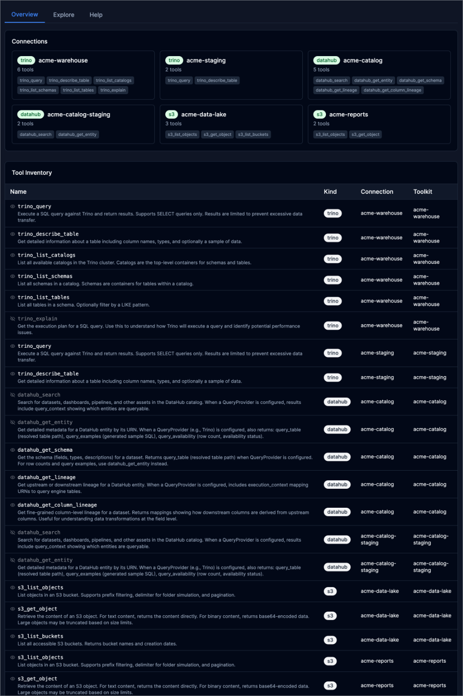
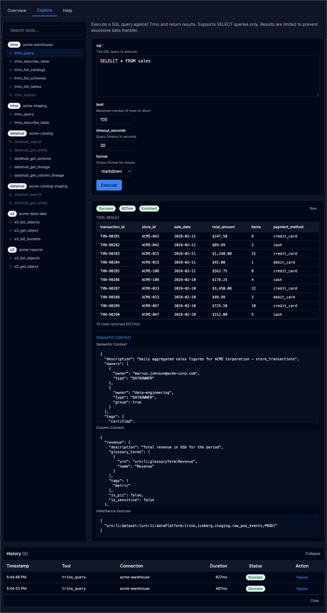
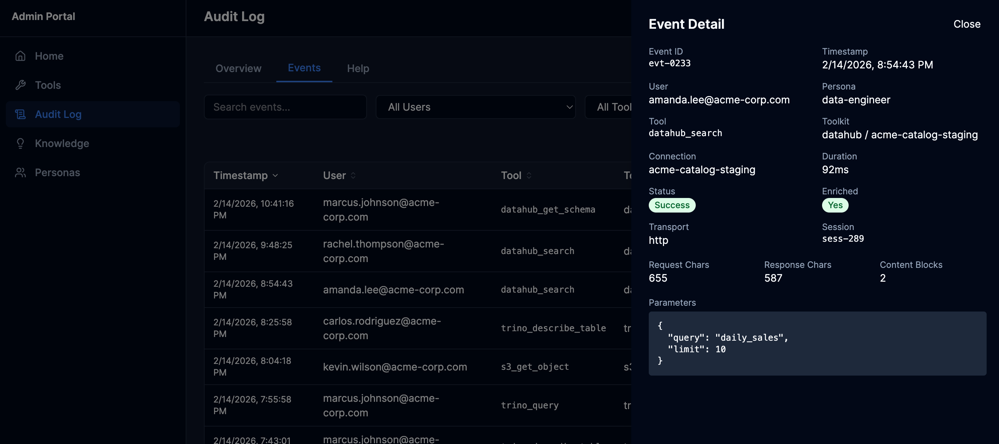
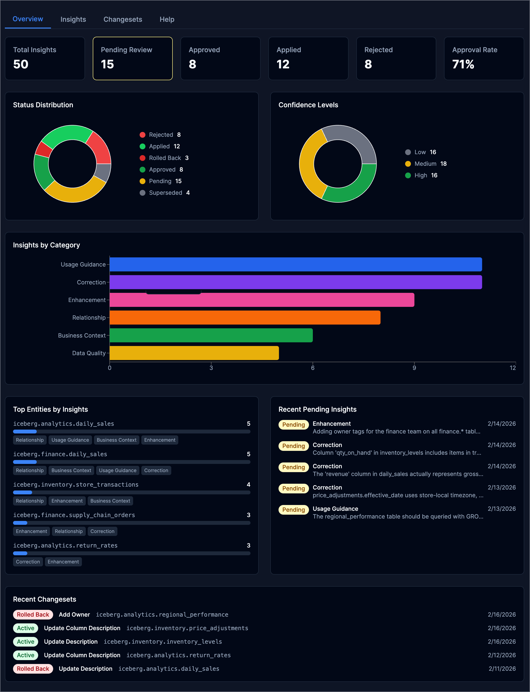
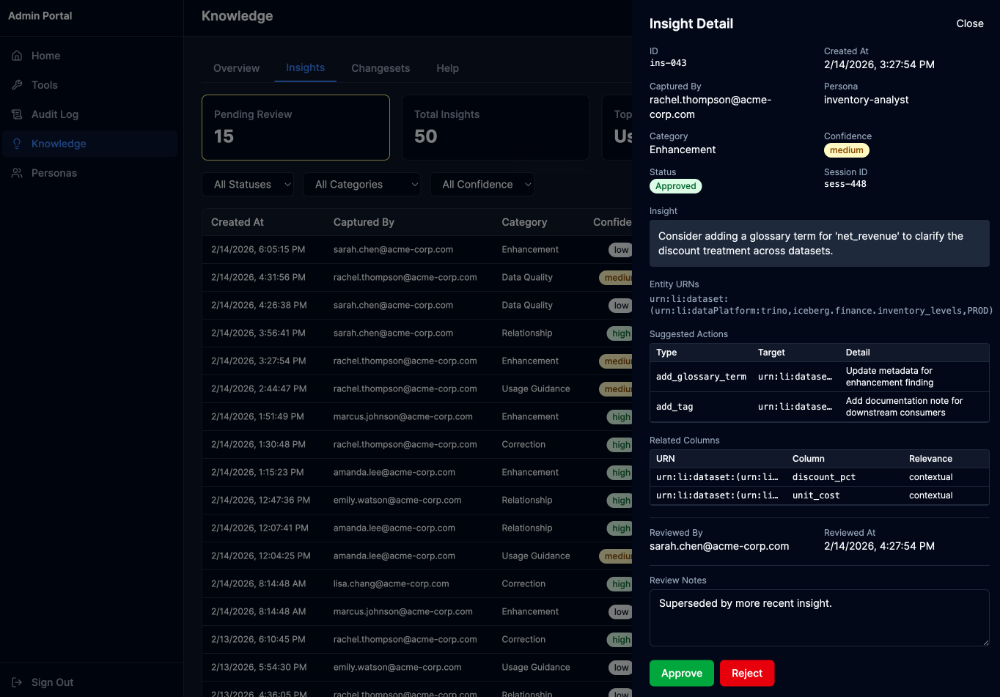

# Admin Portal

The Admin Portal is an interactive web dashboard for managing and monitoring the platform. Enable it with `admin.portal: true` in your configuration.

```yaml
admin:
  enabled: true
  portal: true
  persona: admin
```

The portal is served at the admin path prefix (default: `/api/v1/admin/`). Authentication is required — use the same credentials as the [Admin API](admin-api.md).

## Dashboard

The home page provides a real-time overview of platform health across configurable time ranges (1h, 6h, 24h, 7d).


The dashboard includes:

- **System info bar** — Platform name, version, transport, config mode, and enabled features (Audit, Knowledge, OAuth)
- **Summary cards** — Total calls, success rate, average duration, unique users, unique tools, enrichment rate, and error count
- **Activity timeline** — Tool call volume over time with error overlay
- **Top Tools / Top Users** — Horizontal bar charts showing the most active tools and users
- **Performance** — Response time percentiles (P50, P95, P99) and average response size
- **Recent Errors** — Clickable error list with detail drawer
- **Knowledge Insights** — Summary statistics and category breakdown with pending review queue
- **Connections** — All configured toolkit connections with tool counts

## Tools

### Overview

The Tools Overview tab shows all configured connections and a complete tool inventory with descriptions, visibility status, kind, and toolkit assignment.



Each connection card displays the toolkit type (Trino, DataHub, S3), connection name, and the tools it provides. The Tool Inventory table below lists every registered tool with its description pulled from the MCP schema.

### Explore

The Explore tab provides an interactive tool execution environment for testing and debugging.



Features:

- **Tool browser** — Tools grouped by connection with search filtering
- **Dynamic parameter form** — Auto-generated from each tool's JSON schema with type-appropriate inputs
- **Result display** — Rendered markdown tables for structured data, with a Raw toggle for JSON output
- **Semantic context** — Cross-injection enrichment shown below results: dataset descriptions, owners, tags, column metadata, glossary terms, and lineage sources
- **Execution history** — Timestamped log of tool calls with duration, status, and replay capability

## Audit Log

### Events

The Events tab provides a searchable, filterable audit log of every tool call. Click any event to open the detail drawer.



The Event Detail drawer shows:

- **Identity** — User email, persona, session ID
- **Execution** — Tool name, toolkit, connection, duration
- **Status** — Success/failure, enrichment status
- **Transport** — HTTP or stdio, request/response sizes, content block count
- **Parameters** — Full request parameters as JSON

The Events tab also supports filtering by user, tool, success status, and time range, with sortable columns.

## Knowledge

### Overview

The Knowledge Overview provides insight statistics, distribution charts, and recent activity.



The overview includes:

- **Summary cards** — Total insights, pending review count, approved, rejected, applied, and approval rate
- **Status Distribution** — Donut chart showing insight lifecycle states
- **Confidence Levels** — Distribution of low, medium, and high confidence insights
- **Insights by Category** — Stacked bar chart across six categories: Usage Guidance, Correction, Enhancement, Relationship, Business Context, Data Quality
- **Top Entities** — Datasets with the most associated insights, with category tags
- **Recent Pending Insights** — Queue of insights awaiting review
- **Recent Changesets** — Applied and rolled-back catalog changes

### Insights

The Insights tab lists all captured insights with filtering by status, category, and confidence. Click any insight to open the detail drawer for review.



The Insight Detail drawer shows:

- **Metadata** — ID, creation time, captured by, persona, category, confidence, session ID, status
- **Insight text** — The domain knowledge observation
- **Entity URNs** — Associated DataHub entities
- **Suggested Actions** — Proposed catalog changes (add tags, update descriptions, add glossary terms)
- **Related Columns** — Column-level associations with relevance
- **Lifecycle** — Reviewer, review timestamp, applied-by, changeset reference
- **Review Notes** — Editable textarea for review context, available regardless of insight status
- **Actions** — Approve or Reject buttons to advance the insight through the governance workflow

## Local Development

Run the Admin Portal locally with demo data using [Mock Service Worker](https://mswjs.io/):

```bash
cd admin-ui
npm install
VITE_MSW=true npm run dev
```

Open `http://localhost:5173/admin/` — no backend required. The mock data includes realistic ACME Corporation demo content with 200+ audit events, 50 knowledge insights, 6 personas, and 12 users.

For full-stack development with a real backend:

```bash
make dev-up                                        # Start PostgreSQL
go run ./cmd/mcp-data-platform --config dev/platform.yaml  # Start server
psql -h localhost -U platform -d mcp_platform -f dev/seed.sql  # Seed demo data
cd admin-ui && npm run dev                         # Start React dev server
```

See [`dev/README.md`](https://github.com/txn2/mcp-data-platform/blob/main/dev/README.md) for complete local development instructions.
