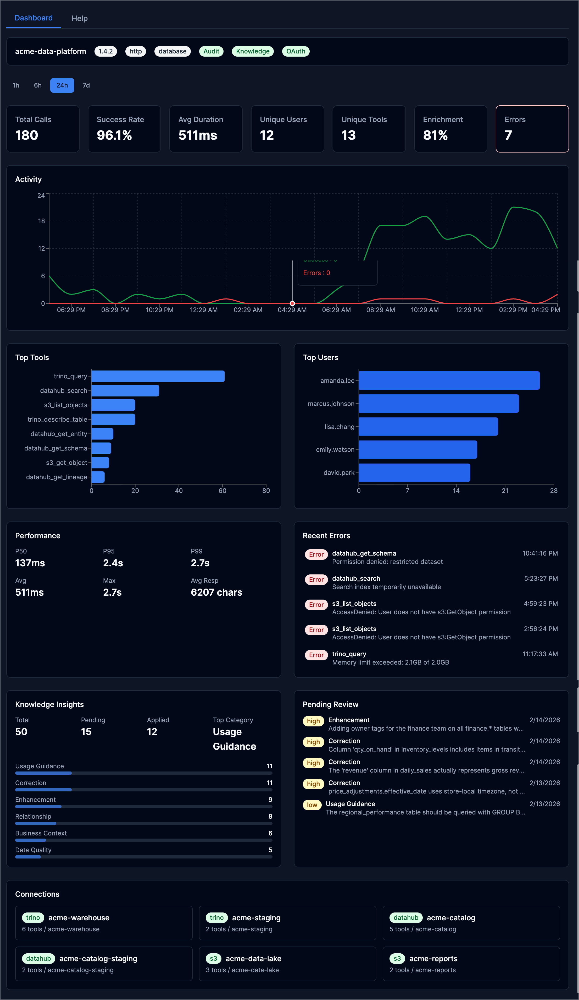
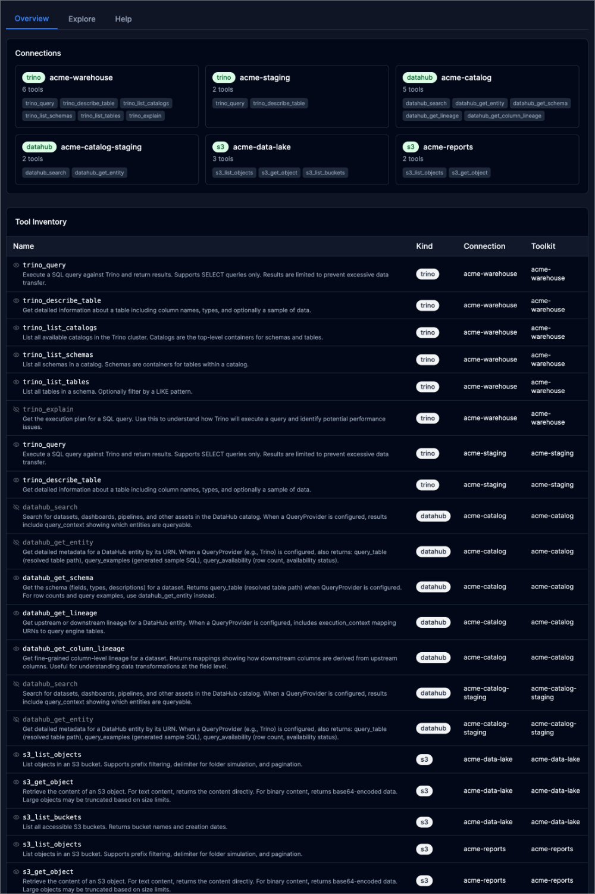
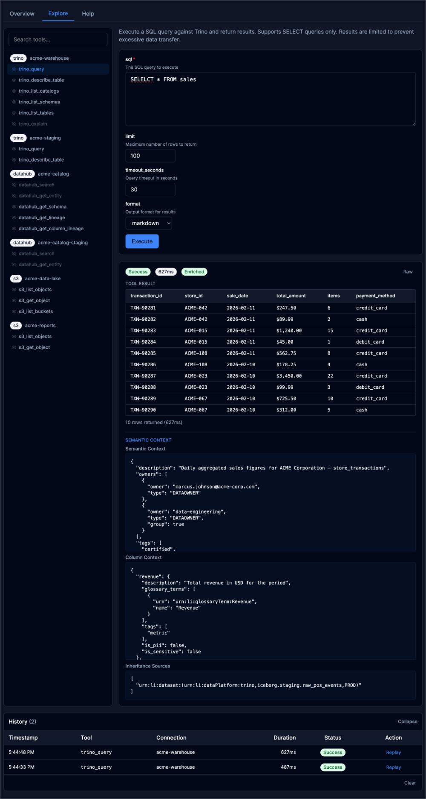
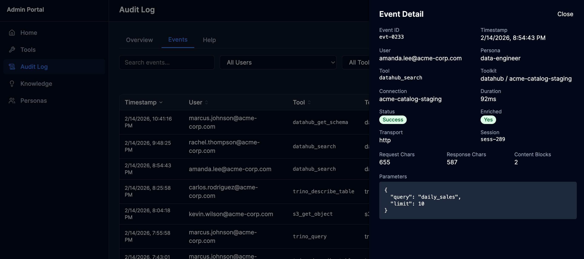
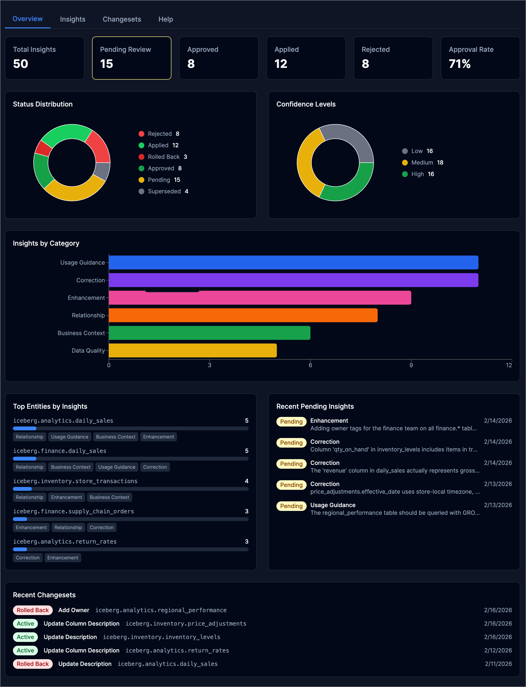
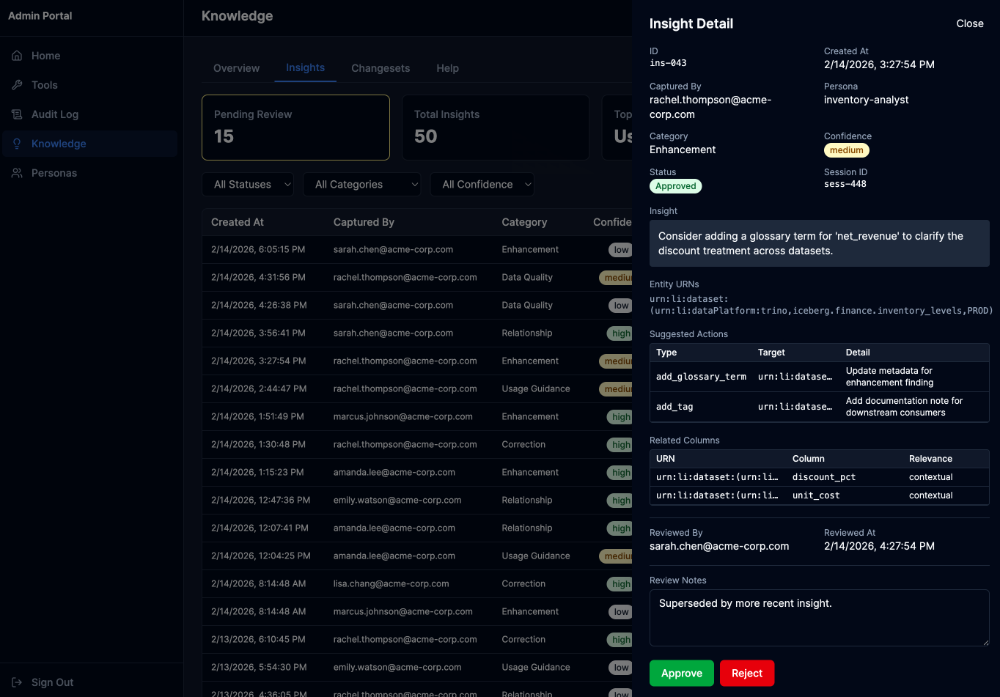

# Admin Portal

The Admin Portal is an interactive web dashboard for managing and monitoring the platform. Enable it with `portal.enabled: true` in your configuration.

```yaml
portal:
  enabled: true
  title: "ACME Data Platform"
  logo: https://example.com/logo.svg
  logo_light: https://example.com/logo-for-light-bg.svg
  logo_dark: https://example.com/logo-for-dark-bg.svg

admin:
  enabled: true
  persona: admin
```

The portal is served at `/portal/`. Authentication is required — use the same credentials as the [Admin API](admin-api.md).

### Branding

Customize the sidebar title and logo via `portal.title`, `portal.logo`, `portal.logo_light`, and `portal.logo_dark`. The portal picks the theme-appropriate logo automatically:

- **Light theme**: `logo_light` → `logo` → built-in default
- **Dark theme**: `logo_dark` → `logo` → built-in default

The resolved logo is also used as the browser favicon. A built-in activity icon is used when no logo is configured. Logos should be square SVGs for best results.

### Public Viewer Branding

Shared artifact links (the public viewer at `/portal/view/{token}`) display a two-zone header. The **right zone** shows the platform brand (`portal.title` and `portal.logo`). The **left zone** is an optional implementor brand for the organization deploying the platform:

```yaml
portal:
  implementor:
    name: "ACME Corp"                    # Display name (left zone of public viewer header)
    logo: "https://acme.com/logo.svg"    # URL to SVG logo (fetched once at startup, max 1 MB)
    url: "https://acme.com"              # Clickable link wrapping name + logo
```

All three fields are optional. When omitted, the left zone is hidden and only the platform brand appears. The logo URL must point to an SVG file; it is fetched at server startup and inlined into the HTML.

### Public Viewer Features

The public viewer includes:

- **Light/dark mode** — Defaults to the system `prefers-color-scheme` setting. A toggle button in the header allows switching; the choice is persisted to `localStorage`.
- **Expiration notice** — When the share has an expiration, a notice bar shows the relative time remaining (e.g., "This page expires in 6 hours"). Hidden when the share has no expiry or `hide_expiration` was set at share creation.
- **Notice text** — Configurable per-share via `notice_text`. Defaults to "Proprietary & Confidential. Only share with authorized viewers." Set to `""` to hide the notice entirely.

The `hide_expiration` and `notice_text` fields are set per-share when creating a share via the API:

```json
{"expires_in": "24h", "hide_expiration": true, "notice_text": "Internal use only."}
```

## Collections

Collections let users organize related assets into curated, shareable groups with rich descriptions. A collection contains ordered **sections**, each with a title, markdown description, and an ordered list of asset references.

### Creating Collections

Navigate to **Collections** in the sidebar and click **New Collection**. Provide a name and optional markdown description, then click **Create**. The editor opens where you can:

- **Add sections** — Each section has a title, markdown description, and a list of assets
- **Reorder sections** — Drag sections by their handle to change order
- **Add assets to sections** — Search your assets by name and click to add
- **Reorder assets** — Drag assets within a section to change order
- **Configure settings** — Set thumbnail size (Large, Medium, Small, None) under Settings

### Viewing Collections

The collection viewer renders:

- **Collection description** — Full markdown with headings, lists, tables, code blocks, and mermaid diagrams
- **Section descriptions** — Same markdown support per section
- **Asset cards** — Thumbnail preview, name, description excerpt, and content type badge
- **Thumbnail sizes** — Configurable per collection: large (4:3), medium (3:2), small (2:1), or no thumbnails

### Sharing Collections

Collections use the same sharing system as individual assets:

- **Public links** — Time-limited anonymous access via token URL. The public viewer renders the full collection with section navigation and asset content in a modal overlay.
- **User shares** — Share with specific email addresses with viewer or editor permission
- **Share management** — View active shares, copy public links, revoke access

The public collection viewer at `/portal/view/{token}` renders all content types (HTML, JSX, Markdown, SVG, CSV) in a full-screen modal when an asset is clicked, using the same content viewer as single-asset public shares.

### Collection API

Collections are managed via the Portal API:

| Method | Endpoint | Description |
|--------|----------|-------------|
| POST | `/api/v1/portal/collections` | Create collection |
| GET | `/api/v1/portal/collections` | List user's collections |
| GET | `/api/v1/portal/collections/{id}` | Get collection with sections and items |
| PUT | `/api/v1/portal/collections/{id}` | Update name and description |
| PUT | `/api/v1/portal/collections/{id}/config` | Update collection settings |
| PUT | `/api/v1/portal/collections/{id}/sections` | Replace all sections (full structure) |
| DELETE | `/api/v1/portal/collections/{id}` | Soft delete |
| POST | `/api/v1/portal/collections/{id}/shares` | Create share |
| GET | `/api/v1/portal/collections/{id}/shares` | List shares |
| GET | `/api/v1/portal/shared-collections` | List collections shared with current user |

## Dashboard

The home page provides a real-time overview of platform health across configurable time ranges (1h, 6h, 24h, 7d).



The dashboard includes:

- **System info bar** — Platform name, version, transport, config mode, and enabled features (Audit, Knowledge, OAuth)
- **Summary cards** — Total calls, success rate, average duration, unique users, unique tools, enrichment rate, and error count
- **Activity timeline** — Tool call volume over time with error overlay
- **Top Tools / Top Users** — Horizontal bar charts showing the most active tools and users
- **Performance** — Response time percentiles (P50, P95, P99) and average response size
- **Recent Errors** — Clickable error list with detail drawer
- **Knowledge Insights** — Summary statistics and category breakdown with pending review queue
- **Connections** — All configured toolkit connections with tool counts

## Tools

### Overview

The Tools Overview tab shows all configured connections and a complete tool inventory with descriptions, visibility status, kind, and toolkit assignment.



Each connection card displays the toolkit type (Trino, DataHub, S3), connection name, and the tools it provides. The Tool Inventory table below lists every registered tool with its description pulled from the MCP schema.

### Explore

The Explore tab provides an interactive tool execution environment for testing and debugging.



Features:

- **Tool browser** — Tools grouped by connection with search filtering
- **Dynamic parameter form** — Auto-generated from each tool's JSON schema with type-appropriate inputs
- **Result display** — Rendered markdown tables for structured data, with a Raw toggle for JSON output
- **Semantic context** — Cross-injection enrichment shown below results: dataset descriptions, owners, tags, column metadata, glossary terms, and lineage sources
- **Execution history** — Timestamped log of tool calls with duration, status, and replay capability

## Audit Log

### Events

The Events tab provides a searchable, filterable audit log of every tool call. Click any event to open the detail drawer.



The Event Detail drawer shows:

- **Identity** — User email, persona, session ID
- **Execution** — Tool name, toolkit, connection, duration
- **Status** — Success/failure, enrichment status
- **Transport** — HTTP or stdio, request/response sizes, content block count
- **Parameters** — Full request parameters as JSON

The Events tab also supports filtering by user, tool, success status, and time range, with sortable columns.

## Knowledge

### Overview

The Knowledge Overview provides insight statistics, distribution charts, and recent activity.



The overview includes:

- **Summary cards** — Total insights, pending review count, approved, rejected, applied, and approval rate
- **Status Distribution** — Donut chart showing insight lifecycle states
- **Confidence Levels** — Distribution of low, medium, and high confidence insights
- **Insights by Category** — Stacked bar chart across six categories: Usage Guidance, Correction, Enhancement, Relationship, Business Context, Data Quality
- **Top Entities** — Datasets with the most associated insights, with category tags
- **Recent Pending Insights** — Queue of insights awaiting review
- **Recent Changesets** — Applied and rolled-back catalog changes

### Insights

The Insights tab lists all captured insights with filtering by status, category, and confidence. Click any insight to open the detail drawer for review.



The Insight Detail drawer shows:

- **Metadata** — ID, creation time, captured by, persona, category, confidence, session ID, status
- **Insight text** — The domain knowledge observation
- **Entity URNs** — Associated DataHub entities
- **Suggested Actions** — Proposed catalog changes (add tags, update descriptions, add glossary terms)
- **Related Columns** — Column-level associations with relevance
- **Lifecycle** — Reviewer, review timestamp, applied-by, changeset reference
- **Review Notes** — Editable textarea for review context, available regardless of insight status
- **Actions** — Approve or Reject buttons to advance the insight through the governance workflow

## Local Development

Run the Admin Portal locally with demo data using [Mock Service Worker](https://mswjs.io/):

```bash
cd ui
npm install
VITE_MSW=true npm run dev
```

Open `http://localhost:5173/portal/` — no backend required. The mock data includes realistic ACME Corporation demo content with 200+ audit events, 50 knowledge insights, 6 personas, and 12 users.

For full-stack development with a real backend:

```bash
make dev-up                                        # Start PostgreSQL
go run ./cmd/mcp-data-platform --config dev/platform.yaml  # Start server
psql -h localhost -U platform -d mcp_platform -f dev/seed.sql  # Seed demo data
cd ui && npm run dev                               # Start React dev server
```

See [`dev/README.md`](https://github.com/txn2/mcp-data-platform/blob/main/dev/README.md) for complete local development instructions.
