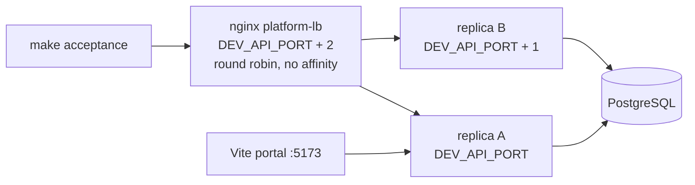

# Deployment Shapes

A deployment's shape is the set of backends it attaches. The shape determines which surfaces are available, and it is independent of the [operating mode](operating-modes.md), which is determined solely by whether `database.dsn` is set.

Cross-enrichment is the platform's core feature and needs a semantic layer. The gateways, knowledge layer, memory, portal, and `search`/`fetch` do not: they are database-backed and run with no catalog and no warehouse behind them. Both shapes are supported, and most deployments end up combining them.

## The shapes

| Shape | Backends | Core capability |
|-------|----------|-----------------|
| [Semantic stack](#semantic-stack) | DataHub, optionally Trino and S3 | Cross-enrichment: every data response carries business context |
| [API and knowledge](#api-and-knowledge) | PostgreSQL | Gateways, knowledge, memory, portal, universal search |
| [Combined](#combined) | Both | Cross-enrichment plus the database-backed surfaces |

## Semantic stack

The shape the platform was built for. DataHub supplies meaning, Trino supplies SQL access, S3 supplies object storage, and [cross-enrichment](../cross-enrichment/overview.md) wires them together so a response from one service carries context from the others. See [The Data Stack](../concepts/components.md) for why each component was chosen, and [Overview](overview.md) for the configuration.

DataHub is what cross-enrichment requires. Trino and S3 are optional additions to it.

## API and knowledge

A deployment with no data warehouse and no catalog. PostgreSQL is the one infrastructure requirement, because connections, catalogs, knowledge, memory, and portal assets are all database-backed.

What this shape provides:

- [API gateway](api-gateway.md) and [MCP gateway](gateway.md) connections, authored in the admin portal with encrypted credentials and OAuth grants
- [API catalogs](api-catalogs.md): versioned OpenAPI bundles with semantic endpoint ranking
- The [knowledge layer](../knowledge/overview.md): insight capture, human-in-the-loop review, and promotion to canonical knowledge pages
- The [memory layer](../memory/overview.md): persistent recall across sessions
- The [portal](../portal/index.md): saved assets, collections, prompts, feedback threads, sharing
- `search` and `fetch` federating over knowledge pages, assets, prompts, connections, insights, and memory
- The full security and operations envelope: OIDC and API-key auth, the OAuth 2.1 server, personas, audit logging, observability, notifications

A minimal configuration:

```yaml
server:
  name: mcp-data-platform
  transport: http
  address: ":8080"

database:
  dsn: ${DATABASE_URL}

auth:
  api_keys:
    enabled: true
    keys:
      - key: ${API_KEY_ADMIN}
        name: admin
        roles: ["admin"]

admin:
  enabled: true
  persona: admin

# API connections are authored in the admin portal and stored in the
# database; enabling the toolkit is all the YAML needs to say.
toolkits:
  api:
    enabled: true

personas:
  admin:
    display_name: "Administrator"
    roles: ["admin"]
    tools:
      allow: ["*"]
    connections:
      allow: ["*"]
```

There is no `semantic:` or `query:` block. Omitting them selects the noop providers, which is a supported configuration rather than an error, and enrichment stays enabled at no cost because it no-ops without a semantic provider.

Starting with the configuration above and an empty database, `tools/list` returns twenty tools:

```
api_discover              manage_asset       memory_capture        save_asset
api_invoke_endpoint       manage_feedback    memory_manage         search
apply_knowledge           manage_prompt      platform_find_tools   show_prompts
fetch                     manage_resource    platform_info         show_scripts
list_connections          manage_script      run_script
manage_table
```

`manage_table` and `manage_resource` are registered by the portal toolkit unconditionally, so both are listed here even though neither can act in this shape: `manage_table` reports that there is no Trino connection with a scratch target to register onto, and `manage_resource` that there is no managed-resource library to write to, since resource content needs blob storage and this configuration declares no S3 connection (see [Object storage is optional here too](#object-storage-is-optional-here-too) below). Both say so instead of reporting a write that did not happen.

### What this shape does not have

- **Cross-enrichment.** With no semantic provider there is no business context to add, so responses carry only what the called service returned.
- **Trino and S3 tools.** No `trino_*` or `s3_*` tools are registered, and no `datahub_*` tools.
- **Catalog search results.** `search` federates the database-backed sources; the technical catalog provider registers only when the semantic provider is DataHub.
- **Writing knowledge back to the catalog.** `apply_knowledge` with the default `sink: datahub` refuses on a deployment with no DataHub connection rather than reporting a write it cannot perform. Use `sink: knowledge_page` to promote captured knowledge to a canonical knowledge page, which is the catalog-free destination.

### Object storage is optional here too

Without an `s3_connection`, portal assets are stored in the database and managed-resource blob storage is disabled; the platform logs the fallback and starts normally. Add S3 when asset volume warrants it.

## Combined

Attach a warehouse and catalog to an API-and-knowledge deployment, or add API connections to a semantic-stack deployment, and both sets of surfaces are present at once. Neither addition is a migration: the semantic and query providers are selected by the `semantic:` and `query:` blocks, and API connections are database rows, so a deployment grows into this shape by configuration.

This is where cross-enrichment pays off most, because captured knowledge and proxied API responses sit alongside warehouse data under one auth, persona, and audit pipeline.

## Replicas

A database-backed deployment of any shape can run several replicas of the platform over one database, behind a load balancer. What a replica holds in the database is shared; what it holds in its own memory is not, so every piece of state a request writes has to be readable by the replica that serves the next request. Set `sessions.store: database` so an MCP session opened on one replica continues on another (see [Session Externalization](session-externalization.md)).

Every HTTP response carries an `X-Platform-Instance` header naming the process that served it: its hostname and listen port, such as `mcp-data-platform-7d9f-abcde:8080`. The hostname separates pods; the port separates two processes on one machine. When two replicas answer the same read differently, the header says which replica gave which answer.

### Connections across replicas

A connection exists because the connection store holds a row for it. That row is committed before the admin API's save returns, so every replica can see the connection from that moment; a replica also keeps a live object for each connection it serves — an HTTP client, a parsed spec set, a compiled GraphQL schema, a Trino pool — which is what answers a call, and which it builds for itself.

The two are asked different questions, and both are answered from the rows:

- **What connections exist** — `list_connections`, the portal's connection pickers and `GET /api/v1/apis` — is answered from the store, unioned with whatever this replica serves. A connection saved a moment ago on another replica is named immediately, with its description, its catalog and the number of operations that catalog exposes, because those are facts about the connection rather than about the replica that answered. Its `health` is absent until this replica has called it, health being the outcome of calls this process made.
- **A call naming a connection** takes it on from the store when this replica does not serve it yet, then answers as the saving replica answers. The connection is built at that point, not before.

A connection is therefore never listed on one replica and missing on another, and never refused as non-existent on one replica while working on another. A deleted connection disappears from the listing on every replica as soon as the row is gone.

Two mechanisms make this cheaper rather than correct, and a deployment is correct without either: at startup a replica folds the stored connections into its toolkit configuration so the common case costs no read, and a save announces itself to the other replicas over the database's notification channel so they pick the change up without waiting to be asked.

### The local two-replica lane

`make dev` runs this shape on one machine, because a defect that exists only between replicas cannot be seen with one process:



- Both processes run the same `dev/platform.yaml` against the same PostgreSQL, SeaweedFS and Keycloak, with database-backed sessions.
- The proxy (`dev/lb/platform-lb.conf.template`) sends each request to the next replica, so a request and the one after it are served by different processes.
- The proxy replaces the body of any origin 502 or 504 with `error code: <status>` as `text/plain`, which is what the CDN in front of a deployment does. A route that explains a failure in a 502 or 504 body loses that explanation behind a CDN, and it loses it locally too.
- `make acceptance` connects to the proxy by default; `MCP_BASE_URL` overrides it. A criterion about every replica discovers them from the `X-Platform-Instance` values the proxy answers with and opens a session on each directly (`forEachReplica` and `connectReplicaPair` in `test/acceptance/acceptance_test.go`).
- `DEV_REPLICAS=1 make dev` runs a single process with no proxy, for a machine that cannot afford two. The acceptance suite then connects to that process, and a criterion about two replicas fails, as it would against any single-process deployment.

## Relationship to operating modes

Shape and mode are orthogonal:

| | Standalone (no database) | Database-backed |
|---|---|---|
| **Semantic stack** | DataHub, Trino, S3 tools with cross-enrichment. No knowledge, memory, portal, or gateways. | Everything. |
| **API and knowledge** | Not available: every surface in this shape is database-backed. | The shape described above. |

See [Operating Modes](operating-modes.md) for the full feature-availability comparison.
