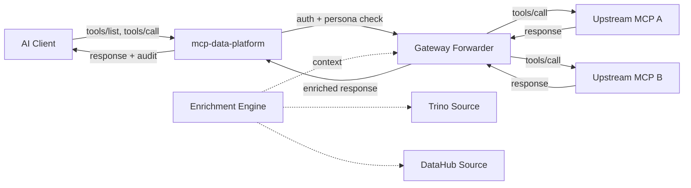

# Gateway Toolkit

The gateway toolkit lets the platform act as an MCP **client** against arbitrary upstream MCP servers and re-expose their tools through the platform's own MCP server. Every proxied tool inherits the platform's authentication, persona enforcement, and audit logging — operators get one security envelope across every MCP they integrate.

!!! info "When to use the gateway"
    Use the gateway when you want a third-party MCP (vendor APIs, internal services, partner integrations) to participate in the platform's security model without being a separately managed MCP endpoint. If you only need the platform's native data access (DataHub, Trino, S3) the gateway is not required.

## Architecture



The forwarder dials each configured upstream once at startup, discovers its tool catalog, and re-registers every tool under a connection-namespaced local name (`<connection>__<remote_tool>`). Persona rules and audit middleware see proxied tools the same way they see native tools, with no special handling required.

## Configuring connections

Gateway connections live in the database, not in `platform.yaml`. Operators add and authenticate them through the admin portal (or directly via the admin REST API). Required for the kind to be active in YAML:

```yaml
toolkits:
  gateway:
    enabled: true
    # No instances here — connections are managed via the admin portal.
```

Once enabled, create a connection through the admin REST API:

```bash
curl -X PUT \
  -H "X-API-Key: $ADMIN_KEY" \
  -H "Content-Type: application/json" \
  -d '{
    "config": {
      "endpoint": "https://vendor.example.com/mcp",
      "auth_mode": "bearer",
      "credential": "your-vendor-token",
      "connection_name": "vendor"
    },
    "description": "Vendor analytics MCP"
  }' \
  https://platform.example.com/api/v1/admin/connection-instances/gateway/vendor
```

The credential field is encrypted at rest (AES-256-GCM) when `ENCRYPTION_KEY` is set. The connection name (`vendor` above) becomes the prefix for every proxied tool: a remote `get_contact` tool surfaces as `vendor__get_contact`.

### Authentication modes

| `auth_mode` | Header injected on outbound requests   |
|-------------|----------------------------------------|
| `none`      | none                                   |
| `bearer`    | `Authorization: Bearer <credential>`   |
| `api_key`   | `X-API-Key: <credential>`              |

v1 uses a **shared service credential** per connection (one identity for all platform users hitting that upstream). User-level attribution still appears in the audit log. Per-user OAuth to upstream is planned for v2.

### Test and refresh endpoints

Two gateway-specific admin endpoints help operators manage connections:

- **Test connection** — `POST /api/v1/admin/gateway/connections/{name}/test` dials the upstream with a posted config (without saving) and returns the discovered tool list. Useful for validating credentials before persisting.
- **Refresh connection** — `POST /api/v1/admin/gateway/connections/{name}/refresh` re-dials a stored connection and re-registers its tools on the live MCP server. Use after an upstream changes its tool catalog.

Both endpoints respect the `[REDACTED]` placeholder for sensitive fields, so the admin UI can re-test an existing connection without re-entering secrets.

## Persona enforcement

Proxied tools are subject to persona rules with the same syntax as native tools. The double-underscore separator (`__`) makes gateway tools easy to target by pattern:

```yaml
personas:
  marketer:
    roles: ["marketing_team"]
    tools:
      allow:
        - "trino_query"           # Native: read warehouse
        - "vendor__list_*"        # Gateway: read vendor objects
        - "vendor__send_*"        # Gateway: trigger vendor sends
      deny:
        - "vendor__delete_*"      # Block destructive vendor calls
```

See [Tool Filtering](../personas/tool-filtering.md) for the full pattern grammar.

## Cross-enrichment rules

The gateway can run declarative enrichment rules that augment a proxied tool's response with context fetched from another platform source (Trino query, DataHub lookup). Rules let operators turn a vendor MCP from "tool that returns vendor data" into "tool that returns vendor data joined with the customer's warehouse context" — without writing Go code.

A rule has three structured fields stored as JSONB:

```json
{
  "tool_name": "vendor__get_contact",
  "when_predicate": { "kind": "response_contains", "paths": ["$.email"] },
  "enrich_action": {
    "source": "trino",
    "operation": "query",
    "parameters": {
      "connection": "warehouse",
      "sql_template": "SELECT lifetime_value, last_order_at FROM mart.customers WHERE email = :email",
      "email": "$.response.email"
    }
  },
  "merge_strategy": { "kind": "path", "path": "warehouse_signals" },
  "enabled": true
}
```

When `vendor__get_contact` returns a response containing `email`, the engine resolves `:email` from `$.response.email`, runs the SQL against the named Trino connection, and merges the result into `response.warehouse_signals`. The original response content is preserved; the enrichment lands in `StructuredContent` so the LLM sees both.

### Predicates

| `kind`               | Behavior                                                                  |
|----------------------|---------------------------------------------------------------------------|
| `always` (default)   | Rule fires on every successful tool call.                                 |
| `response_contains`  | Rule fires only when every JSONPath in `paths` resolves in the response.  |

### Sources

| Source     | Operation             | Parameters                                  |
|------------|-----------------------|---------------------------------------------|
| `trino`    | `query`               | `connection`, `sql_template`, `<bindings>`  |
| `datahub`  | `get_entity`          | `urn`                                       |
| `datahub`  | `get_glossary_term`   | `urn`                                       |

Bindings (any string parameter starting with `$.` or `$[`) are JSONPath expressions resolved against `{ args, response, user }`. SQL template `:name` placeholders are substituted with safely-quoted ANSI-SQL literals; single-quoted regions are skipped so timestamp literals are never mangled.

### Merge strategies

| `kind`         | Behavior                                                              |
|----------------|-----------------------------------------------------------------------|
| `path` (default) | Attaches the source result to `response[merge.path]`. Default path is `enrichment`. |

### Failure mode

Rule failures **never** break the parent tool call. Each warning is appended to the response as an additional `TextContent` entry prefixed `warning:`, and the unaltered response content is returned. This keeps enrichment opt-in — a misconfigured rule degrades gracefully.

### Authoring rules

Rules are persisted in `gateway_enrichment_rules` (migration `000034`) and managed through the admin REST API:

```
GET    /api/v1/admin/gateway/connections/{name}/enrichment-rules
POST   /api/v1/admin/gateway/connections/{name}/enrichment-rules
GET    /api/v1/admin/gateway/connections/{name}/enrichment-rules/{id}
PUT    /api/v1/admin/gateway/connections/{name}/enrichment-rules/{id}
DELETE /api/v1/admin/gateway/connections/{name}/enrichment-rules/{id}
POST   /api/v1/admin/gateway/connections/{name}/enrichment-rules/{id}/dry-run
```

The `dry-run` endpoint accepts a sample `{ args, response, user }` and returns the merged response plus per-rule traces (timing, errors). Use it from the admin UI's rule editor to validate bindings before going live.

## Failure isolation

A gateway upstream that's unreachable at startup logs a structured warning, records zero tools for that connection, and does **not** block platform startup. Other connections (gateway and native) keep working. Recovery requires either a platform restart (when the upstream is back) or a `refresh` admin call.

A connection that becomes unhealthy at runtime returns tool-error results prefixed `upstream:<connection>:` so the LLM can self-correct, and the audit log captures the failure with the same event shape as a successful call.

## What's next

- [Persona Tool Filtering](../personas/tool-filtering.md) — write composite personas with native + gateway tools.
- [Audit Logging](audit.md) — review proxied tool calls with the same query patterns as native tools.
- [Admin API](admin-api.md) — full REST reference for connection and enrichment-rule CRUD.
