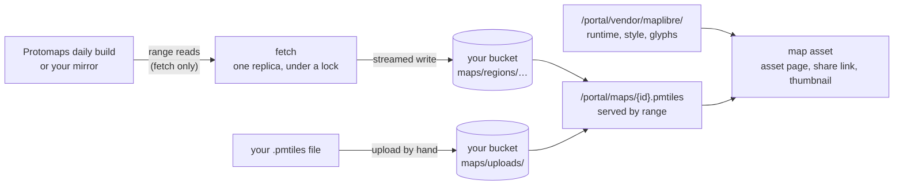

# Street Maps

A map an agent draws is an HTML asset that loads a map runtime and a street
basemap from this deployment. The platform serves both: the runtime ships in
the portal build, and the basemap is an extract of OpenStreetMap the platform
cuts to the regions you choose and writes to your own bucket. No map view and
no thumbnail calls a third party; the only outbound request is the fetch that
builds a region, made when an administrator saves one.

State and county maps need none of this. The US boundaries ship with the
runtime, and an agent draws a value by state or county from them with maps
turned off.

## Turning maps on

Maps are off by default. Open **Admin > Settings > Maps**, or use the admin
API:

| Setting | Default | What it is |
|---|---|---|
| Enabled | off | Serve the regions, run the fetch, and list the regions on the maps knowledge page. Off, the archive routes answer 404 and the archives stay in the bucket. |
| S3 connection | the managed-resources connection | The S3 toolkit instance archives are written through. |
| Bucket | the managed-resources bucket | Where archives are written. |
| Maximum zoom | 14 | The deepest zoom a fetch extracts, 1 to 15. |
| Source | the newest Protomaps daily build | A URL of a `.pmtiles` archive to extract from instead, such as a mirror you host. |

A change to the maximum zoom or the source applies to the next fetch of each
region. A change to the connection or the bucket leaves the archives already
written where they are: refresh each region to write it to the new place.

Then add a region: a preset (the contiguous United States is offered first,
then Alaska, Hawaii, Puerto Rico, Canada, Mexico, the United Kingdom and
Ireland, Europe and Australia) or a custom box with an id, a name and its
west, south, east and north edges in degrees. More than one region may be
kept. A region's id is its archive's name at `/portal/maps/{id}.pmtiles`.

Saving a region queues its fetch. The settings page shows its state as it
moves: **Queued**, **Fetching** with how much of the archive is written,
**Ready** with the build it came from, its zooms and its size, or **Failed**
with the reason. **Estimate size** reports what a region would be before it
is saved.

## How large a region is

An archive's size is known before a byte of tile data is copied, and the
estimate is exact. Measured against the 2026-10-08 Protomaps build for the
contiguous United States:

| Maximum zoom | Archive size | Directory entries |
|---|---|---|
| 12 | 1.9 GB | 250,892 |
| 14 | 8.8 GB | 3,677,037 |
| 15 | 18.8 GB | 13,719,485 |

Streets read clearly from zoom 14, and the runtime draws zoom-14 tiles at 15
and beyond, which is why 14 is the default. A city at zoom 14 is a few
megabytes.

## What a fetch does

A fetch never downloads the source build, which is about 140 GB. It reads the
build's header and the directories that address the region's tiles by byte
range, plans the extract, and then copies only those tiles, grouping
neighbors into requests of up to 16 MiB with a few in flight. The archive is
streamed straight into the bucket as a multipart upload; it needs no scratch
disk.

- **One replica fetches.** A pass takes a PostgreSQL advisory lock; a replica
  that finds it held skips the pass. A fetch left behind by a replica that
  died is queued again by the next pass.
- **A refresh replaces the archive only when the new one is complete.** The
  new archive is written beside the one being served, and the swap is the
  region's row. A refresh that fails leaves the previous build serving and
  records why.
- **The source is fixed for the fetch.** The newest daily build is resolved
  from `https://build-metadata.protomaps.dev/builds.json` when the fetch
  starts, since Protomaps keeps a week of daily builds and does not promise
  their URLs. Every read after the first asks for the same version of the
  file (`If-Match`); a source replaced mid-fetch fails the fetch rather than
  mixing two builds.
- **Stopping the platform mid-fetch** cancels the fetch, removes what it
  wrote, and leaves the region queued for the next pass on any replica.
- **A read that fails is retried** three times, after 1, 4 and 9 seconds,
  when it timed out, was refused with 429, or got a 5xx.
- **Planning holds the region's directory in memory.** For the contiguous
  United States the fetch peaked at about 350 MB at zoom 14 and about 950 MB
  at zoom 15, measured with `GOMEMLIMIT` set; give the platform's container
  room for it, or fetch at 14.

The fetch goes through the platform's outbound client, so it is traced and
counted under `http_client_requests_total{kind="maps"}`, and its writes are
counted under `storage_operations_total{purpose="maps"}`. The loop reports as
`background_loop_*{loop="map_fetch"}`, and each region's fetch as
`map_fetch_region`.

## On a closed network

Skip the fetch. Build or copy a PMTiles version 3 archive elsewhere and put
it in the bucket under `maps/uploads/`, named `{id}.pmtiles`, where the id is
lowercase letters, digits and dashes. The next pass, within 30 seconds, reads
its header and lists it as a ready region with the bounds, zooms and build
date the archive carries; a file that is not an archive is listed as failed
with the reason. Keep at most 100 files there: past one listing's worth, the
scan records what it read and forgets nothing, and logs why. Replacing the file replaces the region; deleting it removes
the region. To extract on a machine that can reach the internet, the
[pmtiles CLI](https://docs.protomaps.com/pmtiles/cli) does the same extract:
`pmtiles extract https://build.protomaps.com/20261008.pmtiles us.pmtiles
--bbox=-125,24.4,-66.9,49.4 --maxzoom=14`.

A mirror works too: set **Source** to the archive's URL on a host the
platform can reach. It must answer byte ranges.

## How a map reads it

| Path | Session | What it answers |
|---|---|---|
| `/portal/maps/regions` | none | `{"enabled": ..., "regions": [...]}`: each ready region's id, name, url, bounds, zooms, build and size |
| `/portal/maps/{id}.pmtiles` | none | the region's archive, by byte range, with an `ETag` that changes when a refresh replaces it; 404 when maps are off or the region has no archive |
| `/portal/vendor/maplibre/...` | none | MapLibre GL JS 5.24.0, the PMTiles protocol 4.5.0, the Protomaps basemap style 5.7.2, its glyphs and sprites, TopoJSON client 3.1.0 and the us-atlas 3.0.1 boundaries, each with its license |

The archive is public OpenStreetMap data and is read from a sandboxed asset
frame, whose origin is opaque, and from public share links, so these paths
need no session and answer CORS for any origin, without credentials, with
`Range` allowed and `Content-Range` exposed. The share viewer's policy needs
no change: an asset frame is an `srcdoc` document that inherits the viewer's
`connect-src 'self'`, which grants the platform's own origin on a plaintext
deployment too.

The glyphs and sprites the style draws with are not published to npm; they
are checked in under `ui/vendor/maplibre/` at a pinned commit of
`protomaps/basemaps-assets` by `scripts/sync-map-assets.sh`. The style asks
for a town hall icon that sheet does not have, so a town hall's label is
drawn without an icon and the browser console notes the missing image once.

## Thumbnails

The tile worker draws a map asset like any HTML asset, in the platform's
headless Chrome, which draws WebGL in software (SwiftShader). The page's
reads of `/portal/vendor/maplibre/` and `/portal/maps/` are answered by the
platform in-process, by range, so the tile shows the basemap and the data in
light and dark with no outbound request. Export PDF reads them the same way,
and prints a document that draws a map once every map on it has finished
drawing (MapLibre's `idle`, bounded at 20 seconds), on one page the size of
its screen layout, since a map fitted to the screen's width and printed on a
narrower paper size would be cut at the page edge.

## Telling agents

The platform ships a knowledge page, `mcp:knowledge_page:platform-maps`, and
`platform_info` names it to any caller that can save an asset. The page lists
the regions this deployment serves, or says plainly that it has no basemap,
and is rewritten whenever maps are turned on or off or a region becomes ready
or is removed. It shows the document skeleton, how to draw points, a route
and areas, how to fit the view, that the OpenStreetMap attribution stays on,
what to do when no region covers the data, and a state choropleth from the
served boundaries.

## Admin API

| Method and path | What it does |
|---|---|
| `GET /api/v1/admin/settings/maps` | the settings, every region with its state and archive, the presets, the upload prefix |
| `PUT /api/v1/admin/settings/maps` | `enabled`, `s3_connection`, `bucket`, `max_zoom`, `source_url` |
| `POST /api/v1/admin/settings/maps/regions` | `{"preset": "united-states"}`, or `{"id", "name", "bounds": {"min_lon", "min_lat", "max_lon", "max_lat"}}`; 201 with the queued region |
| `POST /api/v1/admin/settings/maps/regions/{id}/refresh` | queue a fetch of the newest build at the current maximum zoom; 409 while the region is being fetched |
| `DELETE /api/v1/admin/settings/maps/regions/{id}` | remove the region and its archive (an uploaded file included) |
| `POST /api/v1/admin/settings/maps/estimate` | `{"preset"}` or `{"bounds"}`; the exact size, tile count and build, writing nothing |

The settings live in the `maps` row of `platform_settings`; regions in the
`map_regions` table (migration 000184).

## Out of scope

The platform draws the geometry the data has. Turning a list of stops into
the streets between them is a routing engine, and turning addresses into
coordinates is a geocoder; neither is part of this. Satellite imagery,
terrain and hillshade are not served.
