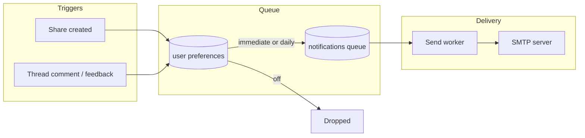

# Email Notifications

The platform emails users when something needs their attention: a teammate
shares an asset, collection, or prompt with them, or comments on something
they own. Delivery is durable (a database-backed queue with retries), never
blocks the originating request, and respects per-user preferences including
a daily digest mode.

Email notifications require a database-backed deployment. With no database
the feature is absent; everything else works unchanged.

## How it works



1. When a direct share is created or a feedback thread event is written, the
   platform consults the recipient's preferences and queues a notification
   row. The queue insert is cheap and failures are logged, never surfaced:
   a share or comment always succeeds regardless of notification state.
2. A background send worker claims due rows (immediately via Postgres
   LISTEN/NOTIFY, or on a poll interval), renders a branded HTML email with
   a plaintext alternative, and delivers it over SMTP. Failed sends retry
   with exponential backoff before being marked failed; queued rows survive
   pod restarts and expired delivery leases are reclaimed automatically.
3. Daily-digest users get one email per day summarizing that window's
   events instead of one email per event.

## Admin SMTP settings

Admins configure the mail server in the portal under **Admin, then
Settings**, or via the REST API. Settings are stored in the database
(`platform_settings`), so no config file edit or restart is needed. The
SMTP password is encrypted at rest with the platform's `ENCRYPTION_KEY`
(the same field encryption used for connection credentials) and is
write-only: no API response ever includes it.

| Field | Description |
|-------|-------------|
| `enabled` | Master switch for outbound email. |
| `host`, `port` | SMTP server address. Port 587 for STARTTLS, 465 for implicit TLS. |
| `username`, `password` | SMTP AUTH credentials. The auth mechanism is negotiated automatically from what the server advertises (SCRAM-SHA-1/256, LOGIN, PLAIN, CRAM-MD5, and others). Leave username empty for unauthenticated relays. An empty password on update keeps the stored one. |
| `from`, `from_name` | Sender address and optional display name. |
| `reply_to` | Optional Reply-To address applied to every outgoing message, so recipient replies reach a monitored mailbox instead of bouncing off a no-reply From address. Validated as a single address on save; unset leaves the header off. |
| `about_text`, `support_contact` | Optional help/about footer rendered on all outgoing mail (notifications, one-time guest links, admin tests): a sentence or two describing the platform, and an email address or http(s) URL for help. Gives first-contact recipients context about the sender and lifts short image-bearing messages out of the low-text band content filters penalize. Omitted entirely when unset. |
| `tls_mode` | `starttls` (default), `implicit`, or `none` (closed-network relays only). |

The **Send test** action delivers a test email through the stored settings
so the configuration can be verified end to end before users depend on it.
It requires an enabled, saved configuration; a disabled or unconfigured
setup gets a 409 rather than sending around the master switch. A test send
deliberately bypasses per-user preference gating (a delivery test should
deliver); when the target address has opted out of notification emails,
the admin UI shows an informational notice next to the send action so
"receives test mail but never notifications" is self-explaining rather
than a troubleshooting mystery.

```
GET  /api/v1/admin/settings/smtp                     read settings (password_set only, never the password)
PUT  /api/v1/admin/settings/smtp                     update settings
POST /api/v1/admin/settings/smtp/test                send a test email  {"to": "admin@example.com"}
GET  /api/v1/admin/settings/smtp/recipient-status    opt-out state of an address  ?to=admin@example.com
```

Like other admin configuration, writes require database config mode; in
file mode the endpoints respond 405.

## User notification preferences

Each user manages their own preferences in the portal under **Settings**
(user section, not admin), or via the self-scoped REST API. A user can only
ever read or write their own preferences.

- **Delivery mode**: `immediate` (one email per event, the default),
  `daily` (one digest email per day), or `off`.
- **Category toggles**: shares, and comments/feedback, each individually
  switchable.

Users with no stored preferences get the defaults: immediate delivery with
all categories enabled. Turning notifications off drops events at enqueue
time; nothing is queued.

```
GET /api/v1/portal/notification-prefs
PUT /api/v1/portal/notification-prefs   {"mode": "daily", "shares_enabled": true, "comments_enabled": false}
```

Preferences are keyed by bare email address, so they also apply to share
recipients who have no platform account. Because such a recipient cannot
reach the Settings page, every notification email carries an unsubscribe
footer link that works without signing in: it opens
`GET /portal/notifications/unsubscribe?tok=...`, which verifies an HMAC
token bound to the recipient address and renders a confirmation page with a
single **Unsubscribe** button. The GET itself records nothing: corporate
mail security layers (Safe Links, Proofpoint, and similar) prefetch URLs in
message bodies, and since the token is a bearer credential a mutating GET
would let a recipient's own mail infrastructure silently opt them out.
Confirming submits a form `POST` to the same URL, which records delivery
mode `off` for the address. The token is minted with a key derived from the
browser-session signing key, so only a holder of the emailed link can opt
an address out. Opting out stops notification emails only; one-time view
links requested from a share's landing page are transactional (the
recipient asks for each one) and still send.

The same token URL is emitted as an RFC 8058 one-click unsubscribe header
pair (`List-Unsubscribe` and `List-Unsubscribe-Post`) on every message that
carries the footer link, which Gmail and Yahoo require of bulk senders. A
mail provider acting on the header sends `POST` to the same endpoint with
body `List-Unsubscribe=One-Click`; the server records the opt-out and
returns a bare status with no page. Providers fire this only on a real user
action in their own UI, so it is not exposed to scanner prefetch.
Transactional sends (one-time guest links, admin SMTP tests) carry neither
the footer nor the headers.

An opted-out share recipient keeps a way back in: when the recipient of an
email share has delivery mode `off`, the share's landing page shows a
notice with a **Resume notification emails** action. The opt-back-in is a
deliberate `POST /portal/view/{token}/resubscribe` (same
no-mutation-on-GET rule as the unsubscribe endpoint it reverses), answers
uniformly for every share state, is rate limited alongside the other
public share routes, and restores the immediate-delivery default for the
share's stored recipient address.

## Branded emails

Emails are responsive, table-based HTML (broad email-client compatibility)
with a plaintext alternative part. They carry the deployment's brand name
linked to the portal, the implementor footer when configured, deep links to
the shared or discussed item (`portal.public_base_url` must be set for
links to render), and a link to the recipient's notification preferences.
When `portal.terms_url` or `portal.privacy_url` is set, the footer also
renders the corresponding legal link; useful when the portal runs on a
different domain than the mail From address, since it gives recipients and
content filters body links that associate with the sending identity. When
the admin SMTP settings carry `about_text` or `support_contact`, a small
help/about block renders below the legal links in both the HTML and plain
text parts (an email support contact links as `mailto:`, an http(s) URL
links directly). Each message's `Message-ID` domain is taken from the
configured From address rather than the server hostname, so IDs resolve to
the sending domain in containerized deployments.
Share links for assets and collections use the token viewer; prompt shares
link to the in-app prompt page. The emailed link is not a bearer credential:
a share addressed to a person is restricted to that person, so the viewer
resolves it only once the recipient is signed in (or opens a one-time guest
link requested from the share's landing page), and forwarding the message
grants nothing.

One-time guest link emails are a separate, transactional send: rendered
through the same branding but delivered directly rather than queued, so they
are never deferred into a daily digest and are not gated on notification
preferences. They exist only because the recipient pressed the request
button on the share page.

## Configuration

Notifications are enabled by default whenever a database is configured. The
YAML section controls only the enqueue/delivery machinery; the SMTP
connection itself is admin-configured at runtime as described above.

```yaml
notifications:
  enabled: false        # opt out of email notifications entirely
  digest_hour_utc: 13   # UTC hour (0-23) daily digests are sent (default: 13)
```

## Delivery semantics

- Immediate rows are picked up as soon as they are queued (LISTEN/NOTIFY)
  or within the worker's 30 second poll fallback.
- A delivery attempt is bounded by a 2 minute lease; if a worker dies
  mid-send, the row returns to claimable state and another replica picks it
  up.
- Failed sends retry up to 5 times with exponential backoff (30s doubling
  to a 32 minute cap), then are marked failed with the error recorded on
  the row.
- When SMTP is unconfigured or disabled, queued rows simply wait without
  burning retry attempts; configuring SMTP later delivers the recent
  backlog.
- Retention bounds the queue table: delivered and failed rows are purged
  after 30 days, and undelivered rows older than 7 days are dropped as
  stale (so enabling SMTP months into a deployment does not deliver an
  ancient backlog).
- A per-actor rate limit (burst of 30, 6 per minute sustained, per
  replica) bounds how much outbound email one account can generate;
  excess events are dropped with a log line, never a request failure.
