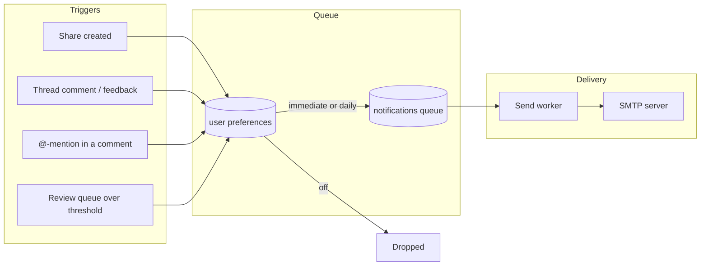

# Email Notifications

The platform emails users when something needs their attention: a teammate
shares an asset, collection, or prompt with them, comments on something they
own or that is shared with them, or names them in a comment with an
@-mention. It also alerts operators when the knowledge review queue goes
unworked. Delivery is durable (a database-backed queue with retries), never
blocks the originating request, and respects per-user preferences including
a daily digest mode.

Email is one of three ways the platform tells someone that something needs
them. The [portal activity feed](portal-user.md#activity) shows it to anyone who
opens the portal, and [session-start notices](session-notices.md) put it in
front of a person working through an agent, who may open neither.

Email notifications require a database-backed deployment running the HTTP
transport: the queue, the send worker, and SMTP are owned by the HTTP server,
which is the long-lived process they belong in. With no database, or under
stdio, the feature is absent and everything else works unchanged - including
feedback replies written through `manage_feedback`, which are stored either
way.

## How it works



1. When a direct share is created or a feedback thread event is written, the
   platform consults the recipient's preferences and queues a notification
   row. The queue insert is cheap and failures are logged, never surfaced:
   a share or comment always succeeds regardless of notification state.
   A thread event reaches the target's owner, the thread's author, and the
   people it is shared with. Anyone the comment @-mentioned is notified in the
   mention category instead, so one comment never sends the same person two
   emails, and mentions are queued first: enqueueing is rate-limited per
   author, so on a widely-shared item the people addressed by name are the ones
   that get through. The person who wrote the event is never a recipient of
   it: the actor is excluded at the enqueue seam every trigger passes through,
   comparing normalized addresses so an owner or grantee recorded as
   `Display Name <addr>` is still recognized as the author. A thread event
   whose author cannot be resolved queues no general fan-out at all -- it
   cannot be shown not to be a self-notification -- though addresses the body
   named explicitly still get their mention.
   One recipient is dropped for a reason that is not a preference: an API key
   that configured no `email` authenticates as a synthetic `name@apikey.local`
   address. That is an identity, not a mailbox, and it becomes the owner of
   every asset an agent saves under that key, so without the check each comment
   on an agent-produced asset would queue a message no mail server can accept.
   The drop happens at the same enqueue seam as the others, so it holds for
   every category. An API key configured with a real address is a real mailbox
   and receives mail normally.
2. A background send worker claims due rows (immediately via Postgres
   LISTEN/NOTIFY, or on a poll interval), renders a branded HTML email with
   a plaintext alternative, and delivers it over SMTP. Failed sends retry
   with exponential backoff before being marked failed; queued rows survive
   pod restarts and expired delivery leases are reclaimed automatically.
3. Daily-digest users get one email per day summarizing that window's
   events instead of one email per event.
4. One trigger has no human behind it: a scheduled check compares the
   knowledge review queue against the operator's staleness threshold and
   queues an alert when it crosses. See
   [Review queue alerts](#review-queue-alerts) below.

## Admin SMTP settings

Admins configure the mail server in the portal under **Admin, then
Settings**, or via the REST API. Settings are stored in the database
(`platform_settings`), so no config file edit or restart is needed. The
SMTP password is encrypted at rest with the platform's `ENCRYPTION_KEY`
(the same field encryption used for connection credentials) and is
write-only: no API response ever includes it.

| Field | Description |
|-------|-------------|
| `enabled` | Master switch for outbound email. |
| `host`, `port` | SMTP server address. Port 587 for STARTTLS, 465 for implicit TLS. |
| `username`, `password` | SMTP AUTH credentials. The auth mechanism is negotiated automatically from what the server advertises (SCRAM-SHA-1/256, LOGIN, PLAIN, CRAM-MD5, and others). Leave username empty for unauthenticated relays. An empty password on update keeps the stored one. |
| `from`, `from_name` | Sender address and optional display name. |
| `tls_mode` | `starttls` (default), `implicit`, or `none` (closed-network relays only). |

The read and update responses carry a `warnings` array describing accepted
but hazardous combinations in the stored configuration; the admin UI shows
them as a banner above the form. A save is never blocked by one. The only
warning today fires when `tls_mode: none` is stored alongside a username or
password: SMTP AUTH then runs over an unencrypted connection and the
credential crosses the network in the clear. It is evaluated against the
stored settings rather than the request body, so it still fires when the
write-only password field was left empty and the previously stored
credential was kept.

The **Send test** action delivers a test email through the stored settings
so the configuration can be verified end to end before users depend on it.
It requires an enabled, saved configuration; a disabled or unconfigured
setup gets a 409 rather than sending around the master switch. A test send
deliberately bypasses per-user preference gating (a delivery test should
deliver); when the target address has opted out of notification emails,
the admin UI shows an informational notice next to the send action so
"receives test mail but never notifications" is self-explaining rather
than a troubleshooting mystery.

A failed send answers 502 with fixed text that does not vary with the
failure mode. The host and port are admin-chosen and deliberately
unrestricted, so a reflected dial error would distinguish refused from
timed out from TLS handshake failure for any address the server can reach.
The underlying error is written to the server log instead, together with
the host and port that produced it:

```
level=ERROR msg="notification: test send failed" recipient=admin@example.com smtp_host=smtp.example.com smtp_port=587 error="..."
```

```
GET  /api/v1/admin/settings/smtp                     read settings (password_set only, never the password)
PUT  /api/v1/admin/settings/smtp                     update settings
POST /api/v1/admin/settings/smtp/test                send a test email  {"to": "admin@example.com"}
GET  /api/v1/admin/settings/smtp/recipient-status    opt-out state of an address  ?to=admin@example.com
```

Like other admin configuration, writes require database config mode; in
file mode the endpoints respond 405.

## Review queue alerts

An `apply_knowledge` review queue that nobody works erodes the knowledge
flywheel silently: captures stop becoming shared knowledge and agents keep
re-deriving facts nobody promoted. The pending count and its age are already
visible to anyone who looks (`bulk_review`, `platform_info`, and the portal's
Insights tab all report them). This is the push signal for everyone who does
not look.

A scheduled check reads the pending queue once an hour through the same
lightweight rollup `platform_info` uses -- one aggregate query, never on a
request path -- and queues an alert when the queue crosses the operator's
threshold. The alert is a normal notification: it goes through the same
preference gate, queue, worker, and branded renderer as every other email,
and a daily-mode recipient reads it as one line of their digest.

Admins configure it in the portal under **Admin, then Settings**, beside the
SMTP section, or via the REST API:

| Field | Description |
|-------|-------------|
| `enabled` | Master switch for the scheduled check. |
| `pending_threshold` | Alert once this many insights are awaiting review. `0` turns this condition off. |
| `oldest_pending_days` | Alert once the oldest pending insight reaches this age in days. `0` turns this condition off. Defaults to 30, the same age at which the portal badges an insight stale. |
| `cooldown_hours` | Minimum gap between two alerts while the queue stays over threshold (1-720, default 24). |
| `recipients` | The addresses the digest is delivered to (at most 20). |

Either threshold alone is enough to cross; an empty queue never crosses. The
recipient list is explicit rather than derived from roles: role membership
arrives with a request from the identity provider, so there is no set of
admins the platform can enumerate at check time.

Like the SMTP section, the read and update responses carry a `warnings` array
for a configuration that saves cleanly and delivers nothing -- an enabled
alert with no recipients, or with both thresholds cleared -- and the admin UI
shows them as a banner above the form. Neither blocks a save.

```
GET /api/v1/admin/settings/review-queue-alert    read the threshold, cooldown, and recipients
PUT /api/v1/admin/settings/review-queue-alert    update them
```

**Re-alert policy.** A queue that stays over threshold produces one alert per
cooldown window, not one per check. A queue worked back under the threshold
clears the marker, so the next crossing alerts immediately rather than serving
out a cooldown that belongs to a queue which has since been dealt with. The
claim is a single conditional write against a one-row table, so it also makes
the alert a cluster-wide singleton: on a multi-replica deployment exactly one
replica's check wins a given window.

**What the email says.** The pending count, the age of the oldest pending
insight, how many are past the staleness threshold, and a deep link to the
review queue itself (`<portal>/knowledge#review`) -- the queue, not the tab it
lives behind. The figures are the queue as the check saw it, so a digest
delivered hours later still reports what actually tripped the threshold. The
link opens the review queue for anyone holding `apply_knowledge`; a recipient
without that capability lands on the Insights tab's own-captures view, since
the review queue is not a surface they can act on.

**Preferences.** This category has no per-user toggle: the operator chose the
recipient list, so removing an address there is how you stop sending it.
A recipient still opts out for themselves with delivery mode `off`, including
through the unsubscribe link the email carries like any other.

## User notification preferences

Each user manages their own preferences in the portal under **Settings**
(user section, not admin), or via the self-scoped REST API. A user can only
ever read or write their own preferences.

- **Delivery mode**: `immediate` (one email per event, the default),
  `daily` (one digest email per day), or `off`.
- **Category toggles**: shares, comments/feedback, and mentions, each individually
  switchable. Review queue alerts have no toggle here; see
  [Review queue alerts](#review-queue-alerts).

Users with no stored preferences get the defaults: immediate delivery with
all categories enabled. Turning notifications off drops events at enqueue
time; nothing is queued.

```
GET /api/v1/portal/notification-prefs
PUT /api/v1/portal/notification-prefs   {"mode": "daily", "shares_enabled": true, "comments_enabled": false}
```

Both responses carry `delivery_available`, a read-only boolean derived from
the stored SMTP settings: false when SMTP has never been configured, when it
is disabled, or when its host is empty. It exposes no SMTP detail, so it is
safe for a non-admin caller, and it is the signal the Settings page uses to
render the section inert rather than offering live controls over a preference
nothing can act on. Stored preferences are untouched while delivery is
unavailable; they take effect as soon as an admin configures SMTP. Admins see
the same note with a link into **Admin > Settings**, and the SMTP section
itself states the consequence of leaving delivery off: triggers keep queueing
rows, and those rows expire undelivered after 7 days.

Preferences are keyed by bare email address, so they also apply to share
recipients who have no platform account. Because such a recipient cannot
reach the Settings page, every notification email carries an unsubscribe
footer link that works without signing in: it opens
`GET /portal/notifications/unsubscribe?tok=...`, which verifies an HMAC
token bound to the recipient address and renders a confirmation page with a
single **Unsubscribe** button. The GET itself records nothing: corporate
mail security layers (Safe Links, Proofpoint, and similar) prefetch URLs in
message bodies, and since the token is a bearer credential a mutating GET
would let a recipient's own mail infrastructure silently opt them out.
Confirming submits a form `POST` to the same URL, which records delivery
mode `off` for the address. The token is minted with a key derived from the
browser-session signing key, so only a holder of the emailed link can opt
an address out. Opting out stops notification emails only; one-time view
links requested from a share's landing page are transactional (the
recipient asks for each one) and still send.

The same token URL is emitted as an RFC 8058 one-click unsubscribe header
pair (`List-Unsubscribe` and `List-Unsubscribe-Post`) on every message that
carries the footer link, which Gmail and Yahoo require of bulk senders. A
mail provider acting on the header sends `POST` to the same endpoint with
body `List-Unsubscribe=One-Click`; the server records the opt-out and
returns a bare status with no page. Providers fire this only on a real user
action in their own UI, so it is not exposed to scanner prefetch.
Transactional sends (one-time guest links, admin SMTP tests) carry neither
the footer nor the headers.

An opted-out share recipient keeps a way back in: when the recipient of an
email share has delivery mode `off`, the share's landing page shows a
notice with a **Resume notification emails** action. The opt-back-in is a
deliberate `POST /portal/view/{token}/resubscribe` (same
no-mutation-on-GET rule as the unsubscribe endpoint it reverses), answers
uniformly for every share state, is rate limited alongside the other
public share routes, and restores the immediate-delivery default for the
share's stored recipient address.

## Sharer control over the share email

A share addressed to a person notifies its recipient by default. The sharer
can change two things about that email at the moment they share, from the
share dialog or the API:

- **`notify`** (`*bool`, omitted means notify): `false` shares quietly. No
  row is queued and no email is sent; the share itself is created exactly as
  it would be otherwise. The recipient's own preferences still apply when
  notification is on, so this only removes the sharer's ability to force one.
- **`message`** (optional, 500 characters): a plain-text note from the
  sharer, rendered in the email as a quoted block attributed to them. It is
  never persisted: it travels with the one notification the share produces
  and is stored nowhere, so a share created with `notify: false` carries no
  note anywhere.

The note is plain text and is checked as such at validation time: markup and
links are rejected with a 400 rather than escaped and delivered. Escaping
alone would stop a note from rendering as markup, but a plausible-looking
link inside a trusted platform email is a phishing vector however it is
encoded. Rendering escapes as well, so the two defenses are independent.

```
POST /api/v1/portal/assets/{id}/shares
{"shared_with_email": "colleague@example.com", "notify": false}

POST /api/v1/portal/assets/{id}/shares
{"shared_with_email": "colleague@example.com",
 "message": "Here's the Q3 revenue breakdown you asked about"}
```

Recipient addresses are accepted in both the bare form and the
`Example User <user@example.com>` form mail clients put on the clipboard;
only the bare address is stored, lowercased. A value that names no single
routable address is refused with a 400 instead of being stored raw, which
previously produced a share matching no signed-in user and a notification
addressed to a string no mail server would route. The share dialog applies
the same rule as the field loses focus, so what the sharer sees is what will
be stored and mailed.

A share addressed to a person carries no expiration: it grants that person
access until the owner revokes it. `expires_in` belongs to a public link
alone -- there the URL is the credential, and a bounded life limits what a
forwarded copy is worth -- so it is required for `access_mode: public` and
refused everywhere else, rather than silently resolved either way.

## Delivery history

Both the admin monitoring tab and each user's own notification screen read
the queue's delivery history. Both are bounded by the retention pass below:
they show recent history, not an archive, and both state the effective
window.

**Admin (Dashboard > Notifications)** lists every queue row with its
recipient, category, subject, status, attempt count, and -- on drill-in --
the error the mail server returned. Counts by status sit above the list as
an at-a-glance health read, and each count doubles as a filter. The routes
sit behind the admin persona gate:

```
GET /api/v1/admin/notifications?status=failed&recipient=user@example.com
GET /api/v1/admin/notifications/stats
```

**Users (Settings > Recent notifications)** see the notifications addressed
to them, alongside the preferences that govern them, because the two answer
one question together: what should I be told, and what was I actually told.
The endpoint is self-scoped server-side -- the authenticated caller's address
is the only recipient it queries, and there is no parameter to widen it:

```
GET /api/v1/portal/notifications
```

The user view deliberately omits the delivery error text the admin view
carries. A failed send fails for reasons belonging to the platform's mail
infrastructure (host names, credentials, relay refusals), which the recipient
can act on none of; the status alone tells them whether to expect an email.

## Branded emails

Emails are responsive, table-based HTML (broad email-client compatibility)
with a plaintext alternative part. They carry the deployment's brand name
linked to the portal, the implementor footer when configured, deep links to
the shared or discussed item (`portal.public_base_url` must be set for
links to render), and a link to the recipient's notification preferences.
When `portal.terms_url` or `portal.privacy_url` is set, the footer also
renders the corresponding legal link; useful when the portal runs on a
different domain than the mail From address, since it gives recipients and
content filters body links that associate with the sending identity. When
`portal.about_text` or `portal.support_contact` is set, a small help/about
block renders below the legal links in both the HTML and plain text parts
of every mail type (an email support contact links as `mailto:`, an
http(s) URL links directly): it gives first-contact recipients context
about the sender and lifts short image-bearing messages out of the
low-text band content filters penalize. When `portal.reply_to` is set,
every outgoing message carries it as the Reply-To header so recipient
replies reach a monitored mailbox instead of bouncing off a no-reply From
address. Like the rest of the email branding these are YAML config, owned
by the implementor rather than the runtime admin settings, so fully
managed deployments keep them out of admin hands. Each message's
`Message-ID` domain is taken from the configured From address rather than
the server hostname, so IDs resolve to the sending domain in containerized
deployments.
Share links for assets and collections use the token viewer; prompt shares
link to the in-app prompt page. The emailed link is not a bearer credential:
a share addressed to a person is restricted to that person, so the viewer
resolves it only once the recipient is signed in (or opens a one-time guest
link requested from the share's landing page), and forwarding the message
grants nothing.

One-time guest link emails are a separate, transactional send: rendered
through the same branding but delivered directly rather than queued, so they
are never deferred into a daily digest and are not gated on notification
preferences. They exist only because the recipient pressed the request
button on the share page.

## Configuration

Notifications are enabled by default whenever a database is configured. The
YAML section controls only the enqueue/delivery machinery; the SMTP
connection itself is admin-configured at runtime as described above.

```yaml
notifications:
  enabled: false        # opt out of email notifications entirely
  digest_hour_utc: 13   # UTC hour (0-23) daily digests are sent (default: 13)
```

## Delivery semantics

- Immediate rows are picked up as soon as they are queued (LISTEN/NOTIFY)
  or within the worker's 30 second poll fallback.
- A delivery attempt is bounded by a 2 minute lease; if a worker dies
  mid-send, the row returns to claimable state and another replica picks it
  up.
- Failed sends retry up to 5 times with exponential backoff (30s doubling
  to a 32 minute cap), then are marked failed with the error recorded on
  the row.
- When SMTP is unconfigured or disabled, queued rows simply wait without
  burning retry attempts; configuring SMTP later delivers the recent
  backlog.
- Retention bounds the queue table: delivered and failed rows are purged
  after 30 days, and undelivered rows older than 7 days are dropped as
  stale (so enabling SMTP months into a deployment does not deliver an
  ancient backlog).
- A per-actor rate limit (burst of 30, 6 per minute sustained, per
  replica) bounds how much outbound email one account can generate;
  excess events are dropped with a log line, never a request failure.
