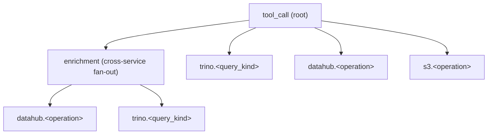

# Observability (Prometheus metrics and distributed tracing)

mcp-data-platform exposes operational metrics in Prometheus format on a
dedicated HTTP listener, plus optional OpenTelemetry distributed tracing.
Two chokepoints cover every tool call through the platform:

1. **`MCPToolCallMiddleware`** records request rate, latency, and outcome
   for every tool the platform serves (Trino, DataHub, S3, MCP gateway,
   REST shim, admin tools/call). One series per (tool, toolkit_kind,
   persona, status_category).
2. **apigateway transport** records outbound HTTP rate and latency for
   every call made by the `api` toolkit — `api_invoke_endpoint`,
   `api_export`, and the REST gateway shim. One series per (connection,
   http_status_class, status_category).

Beyond those chokepoints, toolkit and provider call paths are also
instrumented (Trino, DataHub, S3, OAuth token issuance/refresh, and
`database/sql` pool saturation — see [Exposed metrics](#exposed-metrics)
below), and each tool call can additionally be traced end-to-end — see
[Distributed tracing](#distributed-tracing).

## Configuration

Metrics are **enabled by default**. Configuration is environment-only for
Phase 1.

| Variable | Default | Purpose |
|---|---|---|
| `OTEL_METRICS_ENABLED` | `true`  | Master switch. Set to `false` (or `0`) to skip MeterProvider construction and not start the listener. |
| `OTEL_METRICS_ADDR`    | `:9090` | Bind address for the `/metrics` HTTP listener. |

The listener is intentionally separate from the platform's main MCP/HTTP
listener so:

- scrape traffic does not share the MCP/admin/portal auth path,
- the metrics port can sit behind a Kubernetes `NetworkPolicy` (or be
  unreachable from outside the cluster) without affecting client-facing
  routes,
- a slow or stuck scraper cannot starve the main accept loop.

To disable on a specific instance:

```bash
export OTEL_METRICS_ENABLED=false
mcp-data-platform --config /etc/mcp-data-platform/platform.yaml
```

## Kubernetes scrape config

Add a `ServiceMonitor` (Prometheus Operator) or a static scrape job:

```yaml
apiVersion: monitoring.coreos.com/v1
kind: ServiceMonitor
metadata:
  name: mcp-data-platform-metrics
spec:
  selector:
    matchLabels:
      app: mcp-data-platform
  endpoints:
    - port: metrics
      path: /metrics
      interval: 30s
```

Expose port `9090` from the pod and surface it as a `metrics` service port.

Plain Kubernetes manifests (no Helm, no Operator CRDs) ship in
[`deployments/observability/`](https://github.com/txn2/mcp-data-platform/tree/main/deployments/observability):
`pod-annotations.yaml` (enable the listener plus `prometheus.io/*` scrape
annotations), `recording-rules.yaml` and `alert-rules.yaml` (ConfigMaps
with starter rules in the `level:metric:operations` convention, e.g.
`mcp:tool_call_duration:p95_5m` and `apigateway:inbound_error_rate:5m`),
and a README covering how to load them and confirm scraping with
`up{job="mcp-data-platform"}`.

## Exposed metrics

| Name | Type | Labels |
|---|---|---|
| `mcp_tool_calls_total` | counter | `tool`, `toolkit_kind`, `persona`, `status_category` |
| `mcp_tool_call_duration_seconds` | histogram | `tool`, `toolkit_kind`, `persona`, `status_category` |
| `mcp_inflight_tool_calls` | gauge | (none) |
| `mcp_enrichment_bytes_total` | counter | `tool`, `toolkit_kind`, `persona` |
| `apigateway_outbound_total` | counter | `connection`, `http_status_class`, `status_category` |
| `apigateway_outbound_duration_seconds` | histogram | `connection`, `http_status_class`, `status_category` |
| `apigateway_inbound_requests_total` | counter | `connection`, `operation_id`, `method`, `status_class`, `identity` |
| `apigateway_inbound_duration_seconds` | histogram | `connection`, `operation_id`, `method`, `status_class` |
| `trino_queries_total` | counter | `status`, `query_kind` |
| `trino_query_duration_seconds` | histogram | `query_kind` |
| `datahub_requests_total` | counter | `operation`, `status` |
| `datahub_request_duration_seconds` | histogram | `operation` |
| `s3_operations_total` | counter | `operation`, `status` |
| `s3_operation_duration_seconds` | histogram | `operation` |
| `oauth_token_issuance_total` | counter | `grant_type`, `status` |
| `oauth_token_refresh_total` | counter | `status` |
| `oauth_token_refresh_duration_seconds` | histogram | (none) |
| `db_pool_open_connections` | gauge | `pool` |
| `db_pool_in_use` | gauge | `pool` |
| `db_pool_idle` | gauge | `pool` |
| `db_pool_wait_count_total` | counter | `pool` |
| `db_pool_wait_duration_seconds_total` | counter | `pool` |

Plus the free Go runtime + process metrics (`go_*`, `process_*`).

**Trino** rows are recorded for the queries and catalog/metadata calls the
query provider makes (cross-enrichment); user-facing `trino_query` tool
calls are also counted by `mcp_tool_calls_total{toolkit_kind="trino"}`.
`query_kind` is the SQL verb (`select`, `show`, `insert`, ...) for SQL
queries, or the metadata operation (`list_catalogs`, `list_schemas`,
`list_tables`, `describe_table`) for catalog calls; unknown SQL maps to
`other`. A `trino_bytes_scanned_total` metric was considered but is not
implemented: the mcp-trino client (v1.3.0) does not expose a
bytes-scanned figure in its query stats, so there is no honest source
for it.

**Enrichment overhead**: `mcp_enrichment_bytes_total` accumulates the byte
size of the cross-enrichment content (semantic context, memories, knowledge
pages, discovery notes) appended to each tool response. It is recorded only on
enriched successes, so divide by the matching `mcp_tool_calls_total` to get the
average per-call overhead an agent's context window pays:
`rate(mcp_enrichment_bytes_total[5m]) / rate(mcp_tool_calls_total[5m])`. Use it
to size the memory-enrichment budget (`enrichment.memory_context_budget_bytes`).

**DataHub** `operation` is one of `get_entity`, `get_schema`,
`get_schemas`, `get_lineage`, `get_column_lineage`, `get_glossary_term`,
`get_queries`, `search_across_entities`, `semantic_search`,
`search_documents`, `get_related_documents`, `get_document`.

**S3** `operation` is the S3 tool name (`list_buckets`, `list_objects`,
`get_object`, `get_object_metadata`, `presign_url`, ...).

**Database connection pools** are reported at scrape time from each
managed `*sql.DB`'s `Stats()`. The platform shares one pool, registered
under `pool="platform"`.

The `apigateway_inbound_*` pair measures requests hitting the REST shim
(`POST /api/v1/gateway/{connection}/invoke`, the NiFi-class ETL path),
as opposed to `apigateway_outbound_*`, which measures the platform's own
calls to the upstream API. `operation_id` is the OpenAPI operationId
resolved from the connection's catalog by path-template matching (e.g.
`GET /v1/users/123` resolves to `getUser`); it is `unknown` for
connections with no catalog or requests that match no spec path.
`identity` is the API key name or OIDC subject (`unknown` when
unauthenticated) and is recorded on the request counter only, never on
the duration histogram, to keep the histogram's bucket series from
multiplying by the identity dimension. The `connection` and `method`
labels are clamped to the registered-connection set and the supported
HTTP-method set respectively, so an arbitrary URL segment or request
body cannot mint unbounded label values (both fall back to `unknown`).

Resolving `identity` re-authenticates the request token at the metrics
layer (the REST shim does not surface the in-session identity back up to
the HTTP handler). For API-key callers this is a cheap lookup; for OIDC
it re-verifies the JWT per request. On very high-volume inbound traffic a
per-token identity cache is the planned optimization; until then the
extra verification is the cost of the `identity` label.

### Label semantics

The label set is **deliberately small and closed**. High-cardinality
fields (user id, request id, session id, raw upstream URLs, raw
error messages, free-text tool arguments) are **not** recorded as
Prometheus labels; they belong on trace spans (Phase 2) and on audit
log rows.

The one deliberate exception is the `identity` label on
`apigateway_inbound_requests_total`, which is the API key name or OIDC
subject (and may therefore be an email). Its cardinality is bounded by
the count of real callers, which is small for the NiFi-class ETL clients
this metric targets, and it is recorded on the counter only, never on a
histogram.

`status_category` values:

| Value | Meaning |
|---|---|
| `ok` | Tool returned successfully. |
| `auth_err` | Authentication failed (no/invalid credential). |
| `authz_err` | User authenticated but persona denied the tool. |
| `validation_err` | Bad arguments or the user declined an elicitation. |
| `upstream_err` | Tool reached the upstream and the upstream returned an error (Trino query failure, S3 4xx/5xx, API 4xx/5xx, etc.). |
| `internal_err` | Anything else — a platform bug. Watch this in dashboards; a healthy deployment is near zero. |

`http_status_class` for outbound calls buckets the response into `2xx`,
`3xx`, `4xx`, `5xx`, or `other`. Transport-level failures (DNS, dial,
TLS, timeout) carry status `0` and surface as `http_status_class="other"`
with `status_category="upstream_err"`.

## Sample PromQL queries

P95 latency per tool (last 5 minutes):

```promql
histogram_quantile(
  0.95,
  sum by (tool, le) (rate(mcp_tool_call_duration_seconds_bucket[5m]))
)
```

Tool error rate per minute, excluding auth/authz (those signal client
misuse, not platform health):

```promql
sum by (tool) (
  rate(mcp_tool_calls_total{status_category=~"upstream_err|internal_err"}[1m])
)
```

Outbound 5xx rate per upstream connection:

```promql
sum by (connection) (
  rate(apigateway_outbound_total{http_status_class="5xx"}[1m])
)
```

In-flight tool calls right now:

```promql
mcp_inflight_tool_calls
```

## Cardinality budget

Counter cardinality is the product of label cardinalities. With
`tool` ≈ 40 tools, `toolkit_kind` ≈ 8, `persona` ≈ 5, and
`status_category` = 6, the upper bound for
`mcp_tool_calls_total` is 40 × 8 × 5 × 6 = 9,600 series. In practice
only a fraction of combinations occur (most tools belong to one
toolkit_kind, and `status_category` is heavily skewed toward `ok`).

For outbound: `connection` ≈ 10, `http_status_class` = 5,
`status_category` = 6 → 300 series upper bound for
`apigateway_outbound_total`.

Both are well under typical Prometheus limits and well within any
managed observability backend's per-metric series budget. If you add
labels, weigh the cardinality impact carefully — a `user_id` label
would multiply series by the number of users.

## What metrics do NOT replace

- **Audit logs** answer *"who called what entity, with what
  result"* and remain the source of truth for compliance and
  user-level analytics. See `docs/server/audit.md`.
- **Application logs** (stderr / structured slog) remain the source
  of truth for free-text diagnostic detail and stack traces.

Metrics answer *"how is the system performing"* — they complement,
they do not replace.

## Disabling metrics

Setting `OTEL_METRICS_ENABLED=false` skips MeterProvider construction
entirely, leaves the listener stopped, and reduces the request-time
cost of the metrics middleware to a single nil-pointer compare per
request. There is no "lightweight" in-memory metrics mode: either
the full Prometheus exporter is running or nothing is.

## PromQL query proxy

The metrics above are scraped by Prometheus. To let the portal read
them back without exposing Prometheus to the browser (CORS, a separate
auth path, an internal service on the public edge), the platform serves
a thin authenticated proxy:

| Endpoint | Forwards to |
|---|---|
| `GET /api/v1/observability/query?query=...&time=...` | Prometheus `/api/v1/query` |
| `GET /api/v1/observability/query_range?query=...&start=...&end=...&step=...` | Prometheus `/api/v1/query_range` |

The proxy reuses the platform auth and persona model and keeps
Prometheus on the internal network. The upstream response body is
returned unchanged, so the portal can use any PromQL client library.

### Configuration

Unlike the metrics emitters (environment-only), the proxy is configured
in `platform.yaml`:

```yaml
observability:
  prometheus:
    url: "http://prometheus.observability.svc.cluster.local:9090"
    timeout: 30s
    basic_auth:
      username: "${PROM_USER}"
      password: "${PROM_PASS}"
    rate_limit_per_second: 10   # per persona; 0 selects the default (10)
```

When `url` is empty the proxy is **unconfigured**: its endpoints return
`503` with body `observability backend not configured` so the portal
renders a clean empty state instead of erroring.

### Access control

Each request must be authenticated and the caller's persona must grant
the `observability:read` capability. This capability is checked through
the same persona tool-allow filter that gates tools, so operators grant
it in the portal persona editor by adding `observability:read` to a
persona's allowed tools. Default-deny applies: a persona without it (and
without a matching wildcard) is denied with `403`. Admin personas with
`allow: ["*"]` receive it automatically.

A per-persona rate limit (default 10 queries/second) returns `429` when
exceeded, so a runaway portal session for one persona cannot starve
others. Proxy queries are not written to the audit log: the dashboards
poll these endpoints on a refresh interval, so auditing each one flooded
the audit trail and the tool-usage analytics with dashboard-internal
reads that are not MCP tool calls. Responses are not cached on the
platform; Prometheus is the cache and the portal applies its own
client-side stale-time.

## Distributed tracing

Tracing is the second half of the observability story: where metrics answer
"how is the system performing" in aggregate, traces answer "why was *this* call
slow" by capturing one MCP request as a single span tree. The platform exports
OpenTelemetry traces over OTLP/gRPC to a collector (Tempo, Jaeger, or any
OTLP-compatible backend).

Tracing is **off by default** and independent of metrics — unlike the
always-available `/metrics` scrape endpoint, traces need a collector to receive
them, so enabling without one would be pointless. When off, every span call site
is a single span-context check (the tracing middleware benchmarks at ~0.3 ns/op
disabled; ~1.8 µs/op when sampling a span — negligible against millisecond-scale
tool calls).

### Enabling tracing

| Env var | Default | Meaning |
|---|---|---|
| `OTEL_TRACES_ENABLED` | `false` | Enable the tracer and install the global OTel `TracerProvider`. |
| `OTEL_EXPORTER_OTLP_ENDPOINT` | `localhost:4317` | OTLP/gRPC collector address (`host:port`). |
| `OTEL_EXPORTER_OTLP_INSECURE` | `true` | Disable transport TLS (the common in-cluster topology). Set `false` for a TLS remote collector. |
| `OTEL_TRACES_SAMPLER_ARG` | `0.1` | Head-based sampling ratio in `[0,1]` applied to root spans. |
| `OTEL_SERVICE_NAME` | `mcp-data-platform` | `service.name` resource attribute on every span. |

The OTLP exporter connects lazily: an unreachable or unconfigured collector
never blocks or fails startup; spans are batched and dropped if undeliverable.

### Span tree

Each tool call produces one trace:



- **Root span** is opened by the tracing middleware, inner to auth so it carries
  the request's identity. Its name is the fixed, low-cardinality `tool_call`
  (the specific tool is on the `mcp.tool` attribute, not the span name, so all
  tool calls share one queryable name). It holds the bounded attributes that
  mirror the metric labels (`mcp.tool`,
  `mcp.toolkit_kind`, `mcp.persona`, `status_category`) **plus** the
  high-cardinality fields that are deliberately kept off Prometheus labels —
  `mcp.user_id`, `mcp.user_email`, `mcp.session_id`, `mcp.request_id`,
  `mcp.connection`, `mcp.transport`, `mcp.source`, and the enrichment summary.
  This is the whole point of spans: per-request detail a label set cannot carry.
- **Child spans** nest under the root via context propagation: the cross-service
  `enrichment` fan-out, and one span per upstream call to Trino
  (`trino.<query_kind>`), DataHub (`datahub.<operation>`), and S3
  (`s3.<operation>`). The Trino/DataHub/S3 spans are emitted by the same
  decorators that record the toolkit metrics, installed when **either** metrics
  or tracing is enabled.

Span status is `Error` for any non-`ok` `status_category`, with the error
recorded as a span event, so error traces stand out in Tempo/Jaeger.

> Not every external call has its own child span yet. The apigateway toolkit's
> outbound HTTP calls are captured by the root `tool_call` span (an
> `api_invoke_endpoint` call is itself a tool call) but do not yet emit a
> dedicated outbound span like Trino/DataHub/S3 do — that is a follow-up. The
> inbound OAuth 2.1 server and the asynchronous audit write run outside a tool
> call's request context entirely and so are not part of the tool-call trace;
> their latency is covered by the metrics in the tables above.

### Sampling

Head-based sampling is in-app via `OTEL_TRACES_SAMPLER_ARG` (a `ParentBased`
ratio sampler — a sampled caller's whole trace is always kept). **Tail-based**
sampling — keeping 100% of error and slow traces — belongs in the collector, not
the application, so it can be tuned without redeploying. An example collector
pipeline and OTLP export config ship in
[`deployments/observability/`](https://github.com/txn2/mcp-data-platform/tree/main/deployments/observability).

### Example trace queries

In Tempo (TraceQL), find slow Trino-backed tool calls:

```
{ name = "tool_call" && .mcp.toolkit_kind = "trino" && duration > 2s }
```

In Jaeger, filter by service `mcp-data-platform`, operation `tool_call`, and tag
`status_category=upstream_err` to see failed calls with their full child-span
breakdown.
