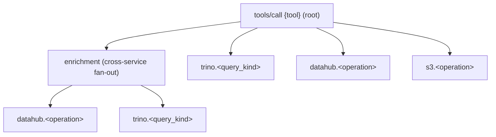

# Observability (Prometheus metrics, distributed tracing, correlated logs)

mcp-data-platform exposes operational metrics in Prometheus format on a
dedicated HTTP listener, plus optional OpenTelemetry distributed tracing.
Two chokepoints cover every tool call through the platform:

1. **The tool-call observers** record request rate, latency, and outcome
   for every `tools/call` the platform answers (Trino, DataHub, S3, MCP
   gateway, REST shim, admin tools/call), a call it refuses included: a
   failed authentication, a persona denial, a session or search-first gate
   refusal, a missing session handle or purpose, and a rate-limit refusal
   each count under their `status_category`, open a span and write an
   audit row. One series per (tool, toolkit_kind, persona, status_category,
   source).
2. **apigateway transport** records outbound HTTP rate and latency for
   every call made by the `api` toolkit — `api_invoke_endpoint`,
   `api_export`, and the REST gateway shim. One series per (connection,
   http_status_class, status_category, persona).

Beyond those chokepoints, toolkit and provider call paths are also
instrumented (Trino, DataHub, S3, OAuth token issuance/refresh, and
`database/sql` pool saturation — see [Exposed metrics](#exposed-metrics)
below), and each tool call can additionally be traced end-to-end — see
[Distributed tracing](#distributed-tracing).

## Configuration

Metrics are **enabled by default**. Configuration is environment-only for
Phase 1.

| Variable | Default | Purpose |
|---|---|---|
| `OTEL_METRICS_ENABLED` | `true`  | Master switch. Set to `false` (or `0`) to skip MeterProvider construction and not start the listener. |
| `OTEL_METRICS_ADDR`    | `:9090` | Bind address for the `/metrics` HTTP listener. |
| `OTEL_METRICS_EXPORTER` | `prometheus` | Where metrics go: `prometheus` (the `/metrics` listener), `otlp` (pushed to the collector at `OTEL_EXPORTER_OTLP_ENDPOINT`; no listener), or `both`. An unrecognized value is `prometheus`, so a typo cannot switch the scrape off. |
| `OTEL_METRIC_EXPORT_INTERVAL` | `60000` | Milliseconds between OTLP pushes, read by the SDK's periodic reader as the OpenTelemetry specification defines it. |

The OTLP push is a second reader on the same `MeterProvider`, so the two
paths see the same instruments and the same values; the endpoint is the one
the tracer and the log export use ([OTLP endpoint](#otlp-endpoint)). The
collector it reaches needs a `metrics` pipeline on its OTLP receiver (and a
`logs` one for the log export below); the example in
`deployments/observability/otel-collector.yaml` carries traces alone until
the turn-key bundle ticket of the observability epic extends it, and a
collector without the pipeline answers each push with an error the platform
logs and drops.

### Resource attributes

Every signal the platform emits, a metric, a span or a log record, carries
one resource that identifies the process it came from:

| Attribute | Source |
|---|---|
| `service.name` | `OTEL_SERVICE_NAME`, else `service.name` in `OTEL_RESOURCE_ATTRIBUTES`, else `mcp-data-platform` |
| `service.version` | the build's version |
| `service.instance.id` | the hostname (the pod name on Kubernetes), else a UUID minted at boot |
| `vcs.ref.head.revision` | the build's commit |
| `deployment.environment.name` | `MCP_PLATFORM_DEPLOYMENT_ENVIRONMENT`, else the key in `OTEL_RESOURCE_ATTRIBUTES` |
| `mcp_platform.deployment.id` | `MCP_PLATFORM_DEPLOYMENT_ID`, else the key in `OTEL_RESOURCE_ATTRIBUTES` |

`OTEL_RESOURCE_ATTRIBUTES` is merged in full, so an operator's own keys
(`team=data`) ride along; the platform's two variables win over the same
key there, as `OTEL_SERVICE_NAME` wins over `service.name` there. The key
names are from semantic conventions 1.44.0: `deployment.environment.name`
is the Stable key that replaced `deployment.environment`, and
`vcs.ref.head.revision` the Release Candidate key that replaced
`vcs.repository.ref.revision`. `mcp_platform.deployment.id` is the
platform's own: the stable name of one deployment across its replicas and
restarts, which a fleet backend receiving several deployments' signals
tells them apart by. Startup logs a warning when an OTLP exporter is on and
nothing sets it.

On `/metrics` the resource is exposed as `target_info` (the Prometheus
convention for resource attributes, with the keys' dots as underscores:
`target_info{service_name="mcp-data-platform",mcp_platform_deployment_id="a",...} 1`),
so a Prometheus reader identifies the process the same way an OTLP backend
does; join on it with `on (job, instance) group_left(...)`. The build is also
its own metric, the conventional constant gauge a dashboard reads version
drift from:

```
mcp_platform_build_info{version="1.142.0",commit="b23841b9",go_version="go1.26.6"} 1
```

The listener is intentionally separate from the platform's main MCP/HTTP
listener so:

- scrape traffic does not share the MCP/admin/portal auth path,
- the metrics port can sit behind a Kubernetes `NetworkPolicy` (or be
  unreachable from outside the cluster) without affecting client-facing
  routes,
- a slow or stuck scraper cannot starve the main accept loop.

To disable on a specific instance:

```bash
export OTEL_METRICS_ENABLED=false
mcp-data-platform --config /etc/mcp-data-platform/platform.yaml
```

## Kubernetes scrape config

Add a `ServiceMonitor` (Prometheus Operator) or a static scrape job:

```yaml
apiVersion: monitoring.coreos.com/v1
kind: ServiceMonitor
metadata:
  name: mcp-data-platform-metrics
spec:
  selector:
    matchLabels:
      app: mcp-data-platform
  endpoints:
    - port: metrics
      path: /metrics
      interval: 30s
```

Expose port `9090` from the pod and surface it as a `metrics` service port.

Plain Kubernetes manifests (no Helm, no Operator CRDs) ship in
[`deployments/observability/`](https://github.com/txn2/mcp-data-platform/tree/main/deployments/observability):
`pod-annotations.yaml` (enable the listener plus `prometheus.io/*` scrape
annotations), `recording-rules.yaml` and `alert-rules.yaml` (ConfigMaps
with starter rules in the `level:metric:operations` convention, e.g.
`mcp:tool_call_duration:p95_5m` and `apigateway:inbound_error_rate:5m`),
and a README covering how to load them and confirm scraping with
`up{job="mcp-data-platform"}`.

## Exposed metrics


The portal reads a subset of these back per node under **Admin > Dashboard >
Health**: uptime, CPU, resident memory, heap, goroutine count and in-flight
calls, with per-node CPU and memory trend charts beneath them and any metric
the scrape did not return rendered as a dash. Prometheus remains the place to
query them; the tab is the at-a-glance read.

| Name | Type | Labels |
|---|---|---|
| `mcp_tool_calls_total` | counter | `tool`, `toolkit_kind`, `persona`, `status_category`, `source` |
| `mcp_tool_call_duration_seconds` | histogram | `tool`, `toolkit_kind`, `persona`, `status_category` |
| `mcp_inflight_tool_calls` | gauge | (none) |
| `mcp_enrichment_bytes_total` | counter | `tool`, `toolkit_kind`, `persona` |
| `apigateway_outbound_total` | counter | `connection`, `http_status_class`, `status_category`, `persona` |
| `apigateway_outbound_duration_seconds` | histogram | `connection`, `http_status_class`, `status_category` |
| `apigateway_inbound_requests_total` | counter | `connection`, `operation_id`, `method`, `status_class`, `identity` |
| `apigateway_inbound_duration_seconds` | histogram | `connection`, `operation_id`, `method`, `status_class` |
| `trino_queries_total` | counter | `status`, `query_kind` |
| `trino_query_duration_seconds` | histogram | `query_kind` |
| `datahub_requests_total` | counter | `operation`, `status` |
| `datahub_request_duration_seconds` | histogram | `operation` |
| `s3_operations_total` | counter | `operation` (`s3_list.buckets`, `s3_list.objects`, `s3_object.<action>`), `status` |
| `s3_operation_duration_seconds` | histogram | `operation` |
| `script_runs_total` | counter | `script`, `trigger`, `status` |
| `script_run_duration_seconds` | histogram | `script` |
| `script_runs_running` | gauge | (none) |
| `script_missed_fires_total` | counter | `script` |
| `script_run_admission_refusals_total` | counter | `reason` (`ceiling`, `memory`, `cpu`) |
| `script_run_queue_wait_seconds` | histogram | (none) |
| `indexjob_enqueued_total` | counter | `kind`, `trigger`, `result` |
| `indexjob_jobs_total` | counter | `kind`, `trigger`, `outcome` |
| `indexjob_duration_seconds` | histogram | `kind`, `outcome` |
| `indexjob_running` | gauge | `kind` |
| `indexjob_items_total` | counter | `kind`, `result` |
| `indexjob_embed_calls_total` | counter | `kind`, `status` |
| `indexjob_embed_texts_total` | counter | `kind` |
| `indexjob_embed_call_duration_seconds` | histogram | `kind` |
| `indexjob_leases_released_total` | counter | (none) |
| `indexjob_units_deferred_total` | counter | `kind` |
| `indexjob_queue_jobs` | gauge | `kind`, `state` |
| `indexjob_failed_units` | gauge | `kind` |
| `indexjob_oldest_runnable_wait_seconds` | gauge | `kind` |
| `indexjob_vectors_indexed` | gauge | `kind` |
| `indexjob_vectors_expected` | gauge | `kind` |
| `oauth_token_issuance_total` | counter | `grant_type`, `status` |
| `oauth_token_refresh_total` | counter | `status` |
| `oauth_token_refresh_duration_seconds` | histogram | (none) |
| `audit_events_dropped_total` | counter | (none) |
| `db_pool_open_connections` | gauge | `pool` |
| `db_pool_in_use` | gauge | `pool` |
| `db_pool_idle` | gauge | `pool` |
| `db_pool_wait_count_total` | counter | `pool` |
| `db_pool_wait_duration_seconds_total` | counter | `pool` |

Plus the free Go runtime + process metrics (`go_*`, `process_*`).

**Trino** rows are recorded for the statements the query provider runs for
cross-enrichment (table resolution, availability, schema), and for nothing
else: a `trino_query` or `trino_execute` tool call is counted by
`mcp_tool_calls_total{toolkit_kind="trino"}` and is not in
`trino_queries_total`. The same holds for `datahub_requests_total`, which
measures the semantic provider, not the DataHub toolkit's tools.
`query_kind` is the SQL verb (`select`, `show`, `insert`, ...) for SQL
queries, or the metadata operation (`list_catalogs`, `list_schemas`,
`list_tables`, `describe_table`) for catalog calls; unknown SQL maps to
`other`. A `trino_bytes_scanned_total` metric was considered but is not
implemented: the mcp-trino client (v1.3.0) does not expose a
bytes-scanned figure in its query stats, so there is no honest source
for it.

**Managed scripts** are measured where a run reaches a terminal state, not
where it is enqueued, so the counter is of executions rather than intentions
and the histogram carries what the run actually took. `script` is the script's
name — bounded by what people wrote and reviewed — and `trigger` separates a
scheduled fire from a `run_script` call. `script_runs_running` is bracketed
around the execution rather than incremented at the end: a run that never
finishes never records a terminal observation, and a worker wedged on one is
what the gauge exists to show. `script_missed_fires_total` counts the fires the
misfire policy stepped over, which is the one thing the run table cannot show,
because a missed fire is precisely a run that does not exist.
`script_run_admission_refusals_total` counts the times a replica's worker
declined to claim another run while the queue held work, by the reason its
admission gave (#1843): `ceiling` is the configured maximum binding, `memory`
and `cpu` are the replica out of headroom. `script_run_queue_wait_seconds` is
how long a run waited between becoming due and being claimed; together they
tell capacity from load as what holds work back:

```promql
# automations that are failing
sum by (script) (increase(script_runs_total{status="failed"}[24h]))

# automations that are not keeping their cadence
sum by (script) (increase(script_missed_fires_total[24h]))

# the slowest 5% of runs
histogram_quantile(0.95, sum by (le) (rate(script_run_duration_seconds_bucket[24h])))
```

The portal's admin Automations page reads these on its Runs tab, beside the run
rows themselves; see [Admin portal](../portal/index.md).

**Enrichment overhead**: `mcp_enrichment_bytes_total` accumulates the byte
size of the cross-enrichment content (semantic context, memories, knowledge
pages, discovery notes) appended to each tool response. It is recorded only on
enriched successes, so divide by the matching `mcp_tool_calls_total` to get the
average per-call overhead an agent's context window pays:
`rate(mcp_enrichment_bytes_total[5m]) / rate(mcp_tool_calls_total[5m])`. Use it
to size the memory-enrichment budget (`enrichment.memory_context_budget_bytes`).

**DataHub** `operation` is one of `get_entity`, `get_schema`,
`get_schemas`, `get_lineage`, `get_column_lineage`, `get_glossary_term`,
`get_queries`, `search_across_entities`, `semantic_search`,
`search_documents`, `get_related_documents`, `get_document`.

**S3** `operation` is the S3 tool name (`list_buckets`, `list_objects`,
`get_object`, `get_object_metadata`, `presign_url`, ...).

**Audit drops**: `audit_events_dropped_total` counts audit events lost by the
async audit writer: queue-full drops plus writes that failed or were abandoned
at the per-write timeout. Audit writes run through a single background goroutine
with a per-write timeout, so a stalled database sheds audit load instead of
blocking tool calls or leaking goroutines; a growing counter means the store
cannot keep up and rows are being lost by design (audit delivery is
best-effort). Alert on `rate(audit_events_dropped_total[5m]) > 0`.

**Database connection pools** are reported at scrape time from each
managed `*sql.DB`'s `Stats()`. The platform shares one pool, registered
under `pool="platform"`.

The `apigateway_inbound_*` pair measures requests hitting the REST shim
(`POST /api/v1/gateway/{connection}/invoke`, the NiFi-class ETL path),
as opposed to `apigateway_outbound_*`, which measures the platform's own
calls to the upstream API. `operation_id` is the OpenAPI operationId
resolved from the connection's catalog by path-template matching (e.g.
`GET /v1/users/123` resolves to `getUser`); it is `unknown` for
connections with no catalog or requests that match no spec path.
`identity` is the API key's name for key auth, `oidc` for a signed-in
person, and `unknown` when unauthenticated: it is bounded by the
operator's key list, never by the number of people, and never carries an
address or subject (who the person was is on the audit row). It is
recorded on the request counter only, never on
the duration histogram, to keep the histogram's bucket series from
multiplying by the identity dimension. The `connection` and `method`
labels are clamped to the registered-connection set and the supported
HTTP-method set respectively, so an arbitrary URL segment or request
body cannot mint unbounded label values (both fall back to `unknown`).

`apigateway_outbound_total` carries `persona`: the persona the call was
authorized under, which is what separates an automated principal's
traffic from an analyst's on a connection they share. Both the MCP tool
path (`api_invoke_endpoint`, `api_export`) and the REST shim record it,
since the shim re-enters through the same tool call. It is bounded by the
deployment's persona definitions rather than by its user count -- an OIDC
subject is deliberately not a label here -- and a call the platform could
not attribute records `unknown`, the same value `mcp_tool_calls_total`
records for a call that never reached persona resolution, so the two
metrics name a principal identically. `persona` is on the call counter
only and not on `apigateway_outbound_duration_seconds` -- not the
cardinality reason that keeps `identity` off the inbound histogram
(persona is bounded, and `mcp_tool_call_duration_seconds` carries it),
but because splitting upstream latency by caller is a separate question
that costs a bucket set per persona on every connection and status pair.

**Upgrading:** a call that never reached persona resolution previously
recorded an empty `persona`, which Prometheus drops, so those samples
carried no `persona` label at all. They now record `persona="unknown"` --
on `mcp_tool_calls_total`, `mcp_tool_call_duration_seconds` and
`mcp_enrichment_bytes_total` as well as on the outbound counter, so the
two metrics agree on how an unattributable caller is named. That forks
those series at the upgrade boundary: a recording rule or alert written
to match the label's absence (`persona=""`) stops matching. The case is
rare -- it is a call rejected before authorization -- but a rule written
against it needs `persona="unknown"` instead.

A deployment that marks an automated persona as a service account, or names
it under `calls.exclude_personas` (see `docs/server/configuration.md`), stops
cataloging that principal's calls; its
volume stays visible here, which is the surface it is charted and alerted
on.

Resolving `identity` re-authenticates the request token at the metrics
layer (the REST shim does not surface the in-session identity back up to
the HTTP handler). For API-key callers this is a cheap lookup; for OIDC
it re-verifies the JWT per request. On very high-volume inbound traffic a
per-token identity cache is the planned optimization; until then the
extra verification is the cost of the `identity` label.

**Upgrading:** before #1892 the label was the caller's email address or
OIDC subject for signed-in people, one series each. Those series end at
the upgrade and `identity="oidc"` begins; a dashboard that broke the
inbound counter down by person reads the audit log for that now.

`mcp_tool_calls_total` carries `source`: how the call arrived, which is
the audit event's source (`mcp` for an agent over a real transport,
`admin` for a portal-driven run, `rest` for the gateway REST shim,
`script` for a managed script's run). It is on the call counter only, not
on `mcp_tool_call_duration_seconds`, for the reason `persona` is kept off
the outbound histogram.

The `tool` label is the registered tool's name. A `tools/call` naming a
tool no toolkit registers records `tool="unregistered"`: the name is the
caller's to choose, a persona allowing `*` admits it as far as the
handler lookup, and recording it as sent would let one caller mint a
series per invented name. The name itself is on the audit row.

### Background indexing

The background embedding queue (`pkg/indexjobs`) is measured as each job
settles, so its figures cover the whole queue however large a backlog is. The
job table holds the same history, but a page of it is its newest rows, and
during a backlog those are all pending.

- `indexjob_jobs_total` counts every claimed job once, by the `outcome` its
  settling write recorded: `succeeded`, `retried` (a retryable error,
  rescheduled with backoff), `failed` (attempts exhausted or not retryable),
  `source_gone` (the unit was deleted and resolved), `lease_lost` (another
  worker owned the lease by the time the result was written), or
  `store_error` (that write failed). `indexjob_duration_seconds` observes the
  same span, claim to settling write, on buckets that run to an hour, since a
  large API spec on a CPU-only embedder takes minutes.
- `indexjob_running` is the jobs executing on each replica; sum it.
- `indexjob_enqueued_total` counts every enqueue by `trigger` (`write`,
  `reconciler`, `manual_retry`) and `result`: `created`, or `folded` into a
  pending or running job for the same unit.
- `indexjob_items_total` splits each pass's items into `embedded` and
  `reused` (text unchanged, the persisted vector kept).
  `indexjob_embed_calls_total` counts provider calls by `status` (`ok`,
  `timeout`, `error`); a timed-out batch is halved and sent again, which is
  why `indexjob_embed_texts_total` can exceed the embedded items.
- `indexjob_leases_released_total` is the running jobs the reaper took back
  from a worker that stopped renewing its lease, and
  `indexjob_units_deferred_total` the gaps the reconciler left unqueued because
  their unit keeps failing and is parked.

The last five are read from the database when Prometheus scrapes, from one
statement over the open rows plus each kind's coverage, cached for 30 seconds:
`indexjob_queue_jobs{state}` (`pending`, `running`, `retrying`, where
`retrying` is the pending jobs waiting out a backoff), `indexjob_failed_units`,
`indexjob_oldest_runnable_wait_seconds` (how long the longest-waiting runnable
job has waited for a worker; a job in backoff is not waiting), and
`indexjob_vectors_indexed` / `indexjob_vectors_expected`. Every replica reports
them with the same value, so read them with `max by (kind)`, never `sum`.

```promql
# jobs completed per 15 minutes, all kinds
sum(increase(indexjob_jobs_total{outcome="succeeded"}[15m]))

# p95 pass duration per kind over the last day
histogram_quantile(0.95, sum by (kind, le) (rate(indexjob_duration_seconds_bucket{outcome="succeeded"}[24h])))

# the backlog, and how long its oldest runnable job has waited
max by (kind) (indexjob_queue_jobs{state="pending"})
max by (kind) (indexjob_oldest_runnable_wait_seconds)

# vectors still missing per kind
max by (kind) (indexjob_vectors_expected) - max by (kind) (indexjob_vectors_indexed)

# embedder timeouts as a share of calls
sum(rate(indexjob_embed_calls_total{status="timeout"}[1h])) / sum(rate(indexjob_embed_calls_total[1h]))
```

The admin Indexing dashboard draws its Throughput and Embed latency panels from
the first two; see [Admin dashboard](../portal/admin-dashboard.md#indexing).
`kind` is the set of registered consumers (about a dozen) and every other label
is a closed set, so the queue adds a few hundred series at most.

### Label semantics

The label set is **deliberately small and closed**. High-cardinality
fields (user id, request id, session id, raw upstream URLs, raw
error messages, free-text tool arguments) are **not** recorded as
Prometheus labels; they belong on trace spans (Phase 2) and on audit
log rows.

Every label value is drawn from a set the operator controls (the tool
registry, the persona definitions, the connection list, the API key
list) or from a closed set in the code. `TestLabelKeysAreApproved`
(`pkg/observability`) fails when an instrument declares a label key
outside the approved list, so a new high-cardinality dimension cannot
arrive unreviewed.

`status_category` values:

| Value | Meaning |
|---|---|
| `ok` | Tool returned successfully. |
| `auth_err` | Authentication failed (no/invalid credential). |
| `authz_err` | User authenticated but persona denied the tool. |
| `gate_err` | The platform refused the call before the handler ran: the session gate (`platform_info` not yet called), the search-first gate (`SEARCH_REQUIRED`), a missing session handle or purpose, or the per-user rate limit. The specific gate is the audit row's `error_category`. |
| `declined` | The user answered no to an elicitation prompt (cost or PII consent). |
| `validation_err` | Bad arguments, a missing feature or connection, or a not-found reference. |
| `upstream_err` | Tool reached the upstream and the upstream returned an error (Trino query failure, S3 4xx/5xx, API 4xx/5xx, etc.). |
| `internal_err` | Anything else — a platform bug. Watch this in dashboards; a healthy deployment is near zero. |

**Upgrading:** before #1892 a refused call was not counted at all, and a
declined elicitation counted as `validation_err`. A rule that reads
`status_category!="ok"` as the error rate now includes the refusals; one
that wants handler failures alone excludes `gate_err` as it excludes
`auth_err` and `authz_err`.

The OAuth server's `oauth_token_issuance_total` and
`oauth_token_refresh_total` carry a `status` of `ok`, `client_err` (an
expired or reused code, a mismatched `client_id`, a bad verifier, an
invalid refresh token) or `server_err` (the platform's token store or
signer failed). Before #1892 both failures were one `upstream_err` value.

`http_status_class` for outbound calls buckets the response into `2xx`,
`3xx`, `4xx`, `5xx`, or `other`. Transport-level failures (DNS, dial,
TLS, timeout) carry status `0` and surface as `http_status_class="other"`
with `status_category="upstream_err"`.

## Sample PromQL queries

P95 latency per tool (last 5 minutes):

```promql
histogram_quantile(
  0.95,
  sum by (tool, le) (rate(mcp_tool_call_duration_seconds_bucket[5m]))
)
```

Tool error rate per minute, excluding auth/authz (those signal client
misuse, not platform health):

```promql
sum by (tool) (
  rate(mcp_tool_calls_total{status_category=~"upstream_err|internal_err"}[1m])
)
```

Outbound 5xx rate per upstream connection:

```promql
sum by (connection) (
  rate(apigateway_outbound_total{http_status_class="5xx"}[1m])
)
```

Which principal a connection's outbound volume belongs to:

```promql
topk(10, sum by (persona) (
  increase(apigateway_outbound_total{connection="salesforce"}[24h])
))
```

In-flight tool calls right now:

```promql
mcp_inflight_tool_calls
```

## Cardinality budget

Counter cardinality is the product of label cardinalities. With
`tool` ≈ 40 tools, `toolkit_kind` ≈ 8, `persona` ≈ 5,
`status_category` = 8 and `source` = 4, the upper bound for
`mcp_tool_calls_total` is 40 × 8 × 5 × 8 × 4 = 51,200 series, and
`mcp_tool_call_duration_seconds` (no `source`) 12,800 series times its
bucket count. In practice only a fraction of combinations occur (most
tools belong to one toolkit_kind, almost every call arrives from one
source, and `status_category` is heavily skewed toward `ok`).

For outbound: `connection` ≈ 10, `http_status_class` = 5,
`status_category` = 6, `persona` ≈ 5 → 1,500 series upper bound for
`apigateway_outbound_total`. The persona dimension is on the counter
only, so `apigateway_outbound_duration_seconds` keeps its 300-series
bound times its bucket count; adding persona there would multiply that
by the persona count, which is what a deployment weighs if it wants
upstream latency split by principal.

Both are well under typical Prometheus limits and well within any
managed observability backend's per-metric series budget. If you add
labels, weigh the cardinality impact carefully — a `user_id` label
would multiply series by the number of users.

## What metrics do NOT replace

- **Audit logs** answer *"who called what entity, with what
  result"* and remain the source of truth for compliance and
  user-level analytics. See `docs/server/audit.md`.
- **Application logs** (stderr / structured slog) remain the source
  of truth for free-text diagnostic detail and stack traces.

Metrics answer *"how is the system performing"* — they complement,
they do not replace.

## Disabling metrics

Setting `OTEL_METRICS_ENABLED=false` skips MeterProvider construction
entirely, leaves the listener stopped, and reduces the request-time
cost of the metrics middleware to a single nil-pointer compare per
request. There is no "lightweight" in-memory metrics mode: either
the full Prometheus exporter is running or nothing is.

## PromQL query proxy

The metrics above are scraped by Prometheus. To let the portal read
them back without exposing Prometheus to the browser (CORS, a separate
auth path, an internal service on the public edge), the platform serves
a thin authenticated proxy:

| Endpoint | Forwards to |
|---|---|
| `GET /api/v1/observability/query?query=...&time=...` | Prometheus `/api/v1/query` |
| `GET /api/v1/observability/query_range?query=...&start=...&end=...&step=...` | Prometheus `/api/v1/query_range` |

The proxy reuses the platform auth and persona model and keeps
Prometheus on the internal network. The upstream response body is
returned unchanged, so the portal can use any PromQL client library.

### Configuration

Unlike the metrics emitters (environment-only), the proxy is configured
in `platform.yaml`:

```yaml
observability:
  prometheus:
    url: "http://prometheus.observability.svc.cluster.local:9090"
    timeout: 30s
    basic_auth:
      username: "${PROM_USER}"
      password: "${PROM_PASS}"
    rate_limit_per_second: 10   # per persona; 0 selects the default (10)
```

When `url` is empty the proxy is **unconfigured**: its endpoints return
`503` with body `observability backend not configured` so the portal
renders a clean empty state instead of erroring.

### Access control

Each request must be authenticated and the caller's persona must grant
the `observability:read` capability. This capability is checked through
the same persona tool-allow filter that gates tools, so operators grant
it in the portal persona editor by adding `observability:read` to a
persona's allowed tools. Default-deny applies: a persona without it (and
without a matching wildcard) is denied with `403`. Admin personas with
`allow: ["*"]` receive it automatically.

A per-persona rate limit (default 10 queries/second) returns `429` when
exceeded, so a runaway portal session for one persona cannot starve
others. Proxy queries are not written to the audit log: the dashboards
poll these endpoints on a refresh interval, so auditing each one flooded
the audit trail and the tool-usage analytics with dashboard-internal
reads that are not MCP tool calls. Responses are not cached on the
platform; Prometheus is the cache and the portal applies its own
client-side stale-time.

## Distributed tracing

Tracing is the second half of the observability story: where metrics answer
"how is the system performing" in aggregate, traces answer "why was *this* call
slow" by capturing one MCP request as a single span tree. The platform exports
OpenTelemetry traces over OTLP/gRPC to a collector (Tempo, Jaeger, or any
OTLP-compatible backend).

Tracing is **off by default** and independent of metrics — unlike the
always-available `/metrics` scrape endpoint, traces need a collector to receive
them, so enabling without one would be pointless. When off, every span call site
is a single span-context check (the tracing middleware benchmarks at ~0.3 ns/op
disabled; ~1.8 µs/op when sampling a span — negligible against millisecond-scale
tool calls).

### Enabling tracing

| Env var | Default | Meaning |
|---|---|---|
| `OTEL_TRACES_ENABLED` | `false` | Enable the tracer and install the global OTel `TracerProvider`. |
| `OTEL_EXPORTER_OTLP_ENDPOINT` | `localhost:4317` | The OTLP/gRPC collector, in either form the specification defines; see [OTLP endpoint](#otlp-endpoint). |
| `OTEL_EXPORTER_OTLP_INSECURE` | unset | Transport TLS to the collector; see [OTLP endpoint](#otlp-endpoint). |
| `OTEL_TRACES_SAMPLER_ARG` | `0.1` | Head-based sampling ratio in `[0,1]` applied to root spans. See [Sampling](#sampling): a deployment that tail-samples in its collector sets `1.0`. |
| `OTEL_SERVICE_NAME` | `mcp-data-platform` | `service.name` on every signal; see [Resource attributes](#resource-attributes). |
| `OTEL_TRACES_INCLUDE_USER_EMAIL` | `false` | Put the caller's email address on the tool-call span as `mcp.user_email`. The user id is always there; the address is personal data a trace backend would otherwise hold for every call. |

The OTLP exporter connects lazily: an unreachable or unconfigured collector
never blocks or fails startup; spans are batched and dropped if undeliverable.

### OTLP endpoint

`OTEL_EXPORTER_OTLP_ENDPOINT` is parsed once and feeds the trace exporter,
the metrics push and the log export, in either form the OpenTelemetry
specification defines:

- `host:port` (`otel-collector:4317`): plaintext, the common in-cluster
  topology, unless `OTEL_EXPORTER_OTLP_INSECURE=false`.
- a URL (`http://otel-collector:4317`, `https://collector.example.com`):
  the scheme chooses TLS. `OTEL_EXPORTER_OTLP_INSECURE`, when set, decides
  instead, for either scheme.

Unset, `OTEL_EXPORTER_OTLP_INSECURE` leaves the choice to the form; it has
no default of its own.

### Continuing a caller's trace

A `tools/call` that arrives with W3C trace context continues the caller's
trace rather than starting one: the span's trace id is the caller's and its
parent is the caller's span, and a sampled parent keeps the whole trace
through the `ParentBased` sampler whatever `OTEL_TRACES_SAMPLER_ARG` says.
The context is read from two places, the request's own winning:

1. `params._meta.traceparent` and `params._meta.tracestate`, where the MCP
   semantic conventions carry trace context;
2. the `traceparent` and `tracestate` HTTP headers of the request that
   carried the call, on the HTTP transports.

An agent runtime that opens a span per tool call and propagates it, or an
HTTP client instrumented with OpenTelemetry, gets one trace from the
agent's step through the platform's span to the Trino query, with nothing
to configure on the platform.

### Span tree

Each tool call produces one trace:


```mermaid
graph TD
    Root["tools/call {tool} (root)"] --> Enrich["enrichment (cross-service fan-out)"]
    Root --> Trino["trino.&lt;query_kind&gt;"]
    Root --> DataHub["datahub.&lt;operation&gt;"]
    Root --> S3["s3.&lt;operation&gt;"]
    Enrich --> DataHubE["datahub.&lt;operation&gt;"]
    Enrich --> TrinoE["trino.&lt;query_kind&gt;"]
```

- **Root span** is opened by the tracing middleware, outer to auth and the
  gates, so a refused call has its span too; it reads the identity auth
  resolved after the call returns. Its name follows the MCP semantic
  conventions, `{mcp.method.name} {target}`: `tools/call trino_query`. The
  target is the bounded tool name (the registered name, `unregistered` for a
  name no toolkit registers, `unknown` for a call that carried none), so a
  caller cannot mint a span name per invented tool and the name set stays
  the size of the tool set. It holds the convention's keys,
  `mcp.method.name`, `gen_ai.operation.name=execute_tool`,
  `gen_ai.tool.name`, `mcp.session.id` and `mcp.protocol.version`, with
  `error.type` (the bounded error category) on a failed call only; the
  bounded attributes that mirror the metric labels (`mcp.toolkit_kind`,
  `mcp.persona`, `status_category`); **plus** the high-cardinality fields
  that are deliberately kept off Prometheus labels — `mcp.user_id`,
  `mcp.request_id`, `mcp.connection`, `mcp.transport`, `mcp.source`, and the
  enrichment summary. This is the whole point of spans: per-request detail a
  label set cannot carry. The caller's email address is not among them unless
  the deployment sets `OTEL_TRACES_INCLUDE_USER_EMAIL=true`.

  Two keys predate the conventions and are kept for one release beside them:
  `mcp.tool` (now `gen_ai.tool.name`) and `mcp.session_id` (now
  `mcp.session.id`). A query on either should move; both are removed in the
  release after this one. Before this release the span was named `tool_call`;
  a query on that name moves to the `tools/call` prefix (the examples below).
  The conventions' metrics, `mcp.server.operation.duration` and
  `mcp.server.session.duration`, are not emitted: the first would duplicate
  `mcp_tool_call_duration_seconds` series for series, and session duration is
  on the session store's rows.
- **Child spans** nest under the root via context propagation: the cross-service
  `enrichment` fan-out, and one span per upstream call to Trino
  (`trino.<query_kind>`), DataHub (`datahub.<operation>`), and S3
  (`s3.<operation>`). The Trino/DataHub/S3 spans are emitted by the same
  decorators that record the toolkit metrics, installed when **either** metrics
  or tracing is enabled.

Span status is `Error` for any non-`ok` `status_category`, with the category
as the status description and the error recorded as a span event, so error
traces stand out in Tempo/Jaeger. The recorded error is redacted before it
leaves the platform: quoted literals (the column a query could not resolve,
the key a lookup missed) and email addresses are replaced, control
characters stripped, and the text cut at 256 bytes. The full text stays on
the audit row and in the platform's log.

> Not every external call has its own child span yet. The apigateway toolkit's
> outbound HTTP calls are captured by the root `tools/call` span (an
> `api_invoke_endpoint` call is itself a tool call) but do not yet emit a
> dedicated outbound span like Trino/DataHub/S3 do — that is a follow-up. The
> inbound OAuth 2.1 server and the asynchronous audit write run outside a tool
> call's request context entirely and so are not part of the tool-call trace;
> their latency is covered by the metrics in the tables above.

### Sampling

Head-based sampling is in-app via `OTEL_TRACES_SAMPLER_ARG` (a `ParentBased`
ratio sampler — a sampled caller's whole trace is always kept). The decision
is made when the root span starts, before its outcome is known, so at the
default of `0.1` about 90% of the platform's own traces are never exported,
errors and slow calls among them.

**Tail-based** sampling in a collector keeps every error and slow trace it
receives and down-samples the rest, and can be tuned without redeploying the
platform. It can only keep what arrives: with the head sampler at its default
the collector keeps about 10% of the error traces, not all of them. A
deployment that tail-samples sets `OTEL_TRACES_SAMPLER_ARG=1.0` on the
platform and lets the collector drop. An example collector pipeline and OTLP
export config ship in
[`deployments/observability/`](https://github.com/txn2/mcp-data-platform/tree/main/deployments/observability);
its `AuthFailureSpike` alert has promtool unit tests
(`deployments/observability/alert-rules.test.yaml`, run with
`make alert-rules-test`), one of them the deployment without an OAuth server,
where two of the alert's three series are absent.

### Example trace queries

In Tempo (TraceQL), find slow Trino-backed tool calls:

```
{ name =~ "tools/call .*" && .mcp.toolkit_kind = "trino" && duration > 2s }
```

Or one tool by its name, `{ name = "tools/call trino_query" && duration > 2s }`.

In Jaeger, filter by service `mcp-data-platform`, operation `tools/call
trino_query`, and tag `status_category=upstream_err` to see failed calls with
their full child-span breakdown.

## Logs

The platform logs JSON to stderr, one record per line, at `LOG_LEVEL`
(`debug`, `info`, `warn`, `error`; default `info`). Every record written on a
tool call's path carries `trace_id` and `span_id`: the ids of the span the
call's context carries, so a stderr line and the span of the call that wrote
it are joined by one id, in a log backend that indexes `trace_id` (Loki's
derived fields, ClickStack, Elastic) as well as by `grep`.

```json
{"time":"...","level":"WARN","msg":"tool call authorization denied","tool":"list_connections","user_id":"apikey:analyst","persona":"inventory-analyst","trace_id":"0af7651916cd43dd8448eb211c80319c","span_id":"b7ad6b7169203331"}
```

A record logged outside a tool call (a background loop, startup) has no span
and so no ids; the background-work ticket of the observability epic gives
those loops their spans.

### Exporting log records over OTLP

| Variable | Default | Purpose |
|---|---|---|
| `OTEL_LOGS_EXPORTER` | `none` | `otlp` sends every record the stderr handler accepts to the collector at `OTEL_EXPORTER_OTLP_ENDPOINT` as well, through the OpenTelemetry slog bridge, at the same `LOG_LEVEL`. Anything else keeps stderr the only sink. |

An exported record carries the [resource](#resource-attributes), the record's
attributes, and the trace and span ids of the span its context carries (as
OTLP fields, not attributes), so a backend that holds traces and logs
together joins them without parsing. The Go logs SDK (`otel/sdk/log`) is
stable at v1.47; the slog bridge (`contrib/bridges/otelslog`) is at v0.21 and
pre-v1, so its API, not the wire format, may still change between releases.
Stderr stays the primary sink either way: the export is a second copy, and
an unreachable collector costs a dropped batch, never a blocked log call.

### Collecting stderr

Where the OTLP export is off, the collector reads stderr where the runtime
put it. On Kubernetes the collector's `filelog` receiver with the `container`
parser reads `/var/log/pods/*/*/*.log`, undoes the runtime's framing and
leaves the platform's JSON line as the body; a `json_parser` operator over it
lifts `trace_id`, `span_id`, `level` and `msg` into the record. In Compose,
the `json-file` logging driver (the default) writes the same lines under
`/var/lib/docker/containers/<id>/<id>-json.log`, which the same receiver
reads. The turn-key collector bundle of the observability epic ships those
pipelines; until then the receiver configuration is the collector's own.

### Writing a log line

Every `slog` call in a function that has a `context.Context` uses the
`Context` form (`slog.InfoContext(ctx, ...)`), or the record cannot carry its
trace. The rule in `.semgrep/go-slog-context.yml`, run by `make semgrep` and
CI over `pkg/middleware`, `pkg/platform`, `internal/platform`,
`internal/httpserver`, `internal/admin`, `pkg/portal`, `pkg/admin`, `pkg/oauth`
and `pkg/auth`, refuses a context-less `slog.Info/Warn/Error/Debug` in such a
function, inside its closures too; a function with no context parameter and
the blank identifier (`_ context.Context`) are out of its scope. A package
added to the rule has every covered call converted in the same change.
