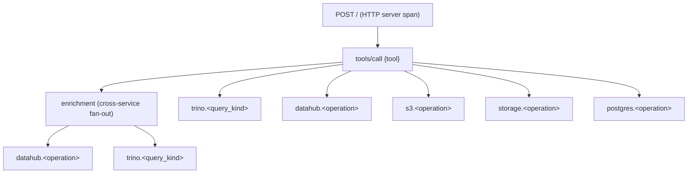

# Observability (Prometheus metrics, distributed tracing, correlated logs)

mcp-data-platform exposes operational metrics in Prometheus format on a
dedicated HTTP listener, plus optional OpenTelemetry distributed tracing.
Two chokepoints cover every tool call through the platform:

1. **The tool-call observers** record request rate, latency, and outcome
   for every `tools/call` the platform answers (Trino, DataHub, S3, MCP
   gateway, REST shim, admin tools/call), a call it refuses included: a
   failed authentication, a persona denial, a session or search-first gate
   refusal, a missing session handle or purpose, and a rate-limit refusal
   each count under their `status_category`, open a span and write an
   audit row. One series per (tool, toolkit_kind, persona, status_category,
   source).
2. **apigateway transport** records outbound HTTP rate and latency for
   every call made by the `api` toolkit — `api_invoke_endpoint`,
   `api_export`, and the REST gateway shim. One series per (connection,
   http_status_class, status_category, persona).

Beyond those chokepoints, toolkit and provider call paths are also
instrumented (Trino, DataHub, S3, OAuth token issuance/refresh, and
`database/sql` pool saturation — see [Exposed metrics](#exposed-metrics)
below), and each tool call can additionally be traced end-to-end — see
[Distributed tracing](#distributed-tracing).

## Configuration

Metrics are **enabled by default**. Configuration is environment-only for
Phase 1.

| Variable | Default | Purpose |
|---|---|---|
| `OTEL_METRICS_ENABLED` | `true`  | Master switch. Set to `false` (or `0`) to skip MeterProvider construction and not start the listener. |
| `OTEL_METRICS_ADDR`    | `:9090` | Bind address for the `/metrics` HTTP listener. |
| `OTEL_METRICS_EXPORTER` | `prometheus` | Where metrics go: `prometheus` (the `/metrics` listener), `otlp` (pushed to the collector at `OTEL_EXPORTER_OTLP_ENDPOINT`; no listener), or `both`. An unrecognized value is `prometheus`, so a typo cannot switch the scrape off. |
| `OTEL_METRIC_EXPORT_INTERVAL` | `60000` | Milliseconds between OTLP pushes, read by the SDK's periodic reader as the OpenTelemetry specification defines it. |

The OTLP push is a second reader on the same `MeterProvider`, so the two
paths see the same instruments and the same values; the endpoint is the one
the tracer and the log export use ([OTLP endpoint](#otlp-endpoint)). The
collector it reaches needs a `metrics` pipeline on its OTLP receiver (and a
`logs` one for the log export below); the example in
`deployments/observability/otel-collector.yaml` carries traces alone until
the turn-key bundle ticket of the observability epic extends it, and a
collector without the pipeline answers each push with an error the platform
logs and drops.

The Go runtime and process series the `/metrics` listener serves
(`go_goroutines`, `go_memstats_*`, `go_gc_duration_seconds`,
`process_cpu_seconds_total`, `process_open_fds`, `process_start_time_seconds`,
...) are pushed over OTLP too, under the same names (#1901), so a deployment
with `OTEL_METRICS_EXPORTER=otlp` and no listener still reports them. They are
gathered from a registry of their own: the push carries each platform
instrument once.

A self-hosted backend with dashboards and alerts over all of this, ClickStack
with a per-deployment edge collector, is in
`deployments/observability/clickstack/` (#1900, #1901); its README covers
evaluation with compose, fleets and Kubernetes.

### Resource attributes

Every signal the platform emits, a metric, a span or a log record, carries
one resource that identifies the process it came from:

| Attribute | Source |
|---|---|
| `service.name` | `OTEL_SERVICE_NAME`, else `service.name` in `OTEL_RESOURCE_ATTRIBUTES`, else `mcp-data-platform` |
| `service.version` | the build's version |
| `service.instance.id` | the hostname (the pod name on Kubernetes), else a UUID minted at boot |
| `vcs.ref.head.revision` | the build's commit |
| `deployment.environment.name` | `MCP_PLATFORM_DEPLOYMENT_ENVIRONMENT`, else the key in `OTEL_RESOURCE_ATTRIBUTES` |
| `mcp_platform.deployment.id` | `MCP_PLATFORM_DEPLOYMENT_ID`, else the key in `OTEL_RESOURCE_ATTRIBUTES` |

`OTEL_RESOURCE_ATTRIBUTES` is merged in full, so an operator's own keys
(`team=data`) ride along; the platform's two variables win over the same
key there, as `OTEL_SERVICE_NAME` wins over `service.name` there. The key
names are from semantic conventions 1.44.0: `deployment.environment.name`
is the Stable key that replaced `deployment.environment`, and
`vcs.ref.head.revision` the Release Candidate key that replaced
`vcs.repository.ref.revision`. `mcp_platform.deployment.id` is the
platform's own: the stable name of one deployment across its replicas and
restarts, which a fleet backend receiving several deployments' signals
tells them apart by. Startup logs a warning when an OTLP exporter is on and
nothing sets it.

On `/metrics` the resource is exposed as `target_info` (the Prometheus
convention for resource attributes, with the keys' dots as underscores:
`target_info{service_name="mcp-data-platform",mcp_platform_deployment_id="a",...} 1`),
so a Prometheus reader identifies the process the same way an OTLP backend
does; join on it with `on (job, instance) group_left(...)`. The build is also
its own metric, the conventional constant gauge a dashboard reads version
drift from:

```
mcp_platform_build_info{version="1.142.0",commit="b23841b9",go_version="go1.26.6"} 1
```

The listener is intentionally separate from the platform's main MCP/HTTP
listener so:

- scrape traffic does not share the MCP/admin/portal auth path,
- the metrics port can sit behind a Kubernetes `NetworkPolicy` (or be
  unreachable from outside the cluster) without affecting client-facing
  routes,
- a slow or stuck scraper cannot starve the main accept loop.

To disable on a specific instance:

```bash
export OTEL_METRICS_ENABLED=false
mcp-data-platform --config /etc/mcp-data-platform/platform.yaml
```

## Kubernetes scrape config

Add a `ServiceMonitor` (Prometheus Operator) or a static scrape job:

```yaml
apiVersion: monitoring.coreos.com/v1
kind: ServiceMonitor
metadata:
  name: mcp-data-platform-metrics
spec:
  selector:
    matchLabels:
      app: mcp-data-platform
  endpoints:
    - port: metrics
      path: /metrics
      interval: 30s
```

Expose port `9090` from the pod and surface it as a `metrics` service port.

Plain Kubernetes manifests (no Helm, no Operator CRDs) ship in
[`deployments/observability/`](https://github.com/txn2/mcp-data-platform/tree/main/deployments/observability):
`pod-annotations.yaml` (enable the listener plus `prometheus.io/*` scrape
annotations), `recording-rules.yaml` and `alert-rules.yaml` (ConfigMaps
with starter rules in the `level:metric:operations` convention, e.g.
`mcp:tool_call_duration:p95_5m` and `apigateway:inbound_error_rate:5m`),
and a README covering how to load them and confirm scraping with
`up{job="mcp-data-platform"}`.

## Exposed metrics


The portal reads a subset of these back per node under **Admin > Dashboard >
Health**: uptime, CPU, resident memory, heap, goroutine count and in-flight
calls, with per-node CPU and memory trend charts beneath them and any metric
the scrape did not return rendered as a dash. Prometheus remains the place to
query them; the tab is the at-a-glance read.

| Name | Type | Labels |
|---|---|---|
| `mcp_tool_calls_total` | counter | `tool`, `toolkit_kind`, `persona`, `status_category`, `source` |
| `mcp_tool_call_duration_seconds` | histogram | `tool`, `toolkit_kind`, `persona`, `status_category` |
| `mcp_inflight_tool_calls` | gauge | (none) |
| `mcp_enrichment_bytes_total` | counter | `tool`, `toolkit_kind`, `persona` |
| `http_server_request_duration_seconds` | histogram | `route`, `method`, `status_class` |
| `http_rate_limited_total` | counter | `limiter` |
| `mcp_requests_total` | counter | `method`, `status` |
| `mcp_request_duration_seconds` | histogram | `method`, `status` |
| `apigateway_outbound_total` | counter | `connection`, `http_status_class`, `status_category`, `persona` |
| `apigateway_outbound_duration_seconds` | histogram | `connection`, `http_status_class`, `status_category` |
| `http_client_requests_total` | counter | `kind`, `connection`, `status_class` |
| `http_client_request_duration_seconds` | histogram | `kind`, `connection`, `status_class` |
| `egress_blocked_total` | counter | `reason` |
| `upstream_retries_total` | counter | `kind` |
| `upstream_retries_exhausted_total` | counter | `kind` |
| `embedding_calls_total` | counter | `model`, `status` |
| `embedding_call_duration_seconds` | histogram | `model` |
| `embedding_fallbacks_total` | counter | `model` |
| `gateway_upstream_calls_total` | counter | `connection`, `outcome` |
| `gateway_upstream_call_duration_seconds` | histogram | `connection` |
| `gateway_session_redials_total` | counter | `connection`, `result` |
| `apigateway_inbound_requests_total` | counter | `connection`, `operation_id`, `method`, `status_class`, `identity` |
| `apigateway_inbound_duration_seconds` | histogram | `connection`, `operation_id`, `method`, `status_class` |
| `trino_queries_total` | counter | `status`, `query_kind` |
| `trino_query_duration_seconds` | histogram | `query_kind` |
| `datahub_requests_total` | counter | `operation`, `status` |
| `datahub_request_duration_seconds` | histogram | `operation` |
| `s3_operations_total` | counter | `operation` (`s3_list.buckets`, `s3_list.objects`, `s3_object.<action>`), `status` |
| `s3_operation_duration_seconds` | histogram | `operation` |
| `storage_operations_total` | counter | `purpose`, `operation`, `result`, `reason` (failures only) |
| `storage_operation_duration_seconds` | histogram | `purpose`, `operation` |
| `storage_bytes_written_total` | counter | `purpose` |
| `db_client_operation_duration_seconds` | histogram | `operation` |
| `db_client_slow_statements_total` | counter | `operation` |
| `script_runs_total` | counter | `script`, `trigger`, `status` |
| `script_run_duration_seconds` | histogram | `script` |
| `script_runs_running` | gauge | (none) |
| `script_missed_fires_total` | counter | `script` |
| `script_run_admission_refusals_total` | counter | `reason` (`ceiling`, `memory`, `cpu`) |
| `script_run_queue_wait_seconds` | histogram | (none) |
| `indexjob_enqueued_total` | counter | `kind`, `trigger`, `result` |
| `indexjob_jobs_total` | counter | `kind`, `trigger`, `outcome` |
| `indexjob_duration_seconds` | histogram | `kind`, `outcome` |
| `indexjob_running` | gauge | `kind` |
| `indexjob_items_total` | counter | `kind`, `result` |
| `indexjob_embed_calls_total` | counter | `kind`, `status` |
| `indexjob_embed_texts_total` | counter | `kind` |
| `indexjob_embed_call_duration_seconds` | histogram | `kind` |
| `indexjob_leases_released_total` | counter | (none) |
| `indexjob_units_deferred_total` | counter | `kind` |
| `indexjob_queue_jobs` | gauge | `kind`, `state` |
| `indexjob_failed_units` | gauge | `kind` |
| `indexjob_oldest_runnable_wait_seconds` | gauge | `kind` |
| `indexjob_vectors_indexed` | gauge | `kind` |
| `indexjob_vectors_expected` | gauge | `kind` |
| `oauth_token_issuance_total` | counter | `grant_type`, `status` |
| `oauth_token_refresh_total` | counter | `status` |
| `oauth_token_refresh_duration_seconds` | histogram | (none) |
| `audit_events_dropped_total` | counter | `reason` (`queue_full`, `write_failed`, `timeout`) |
| `background_loop_iterations_total` | counter | `loop`, `result` (`ok`, `error`, `skipped`) |
| `background_loop_duration_seconds` | histogram | `loop` |
| `background_loop_last_success_timestamp_seconds` | gauge | `loop` |
| `retention_rows_purged_total` | counter | `loop` |
| `background_queue_items` | gauge | `loop`, `kind`, `state` (`pending`, `running`, `waiting`) |
| `background_queue_oldest_age_seconds` | gauge | `loop`, `kind` |
| `script_run_failures_total` | counter | `cause` |
| `script_runs_shed_total` | counter | (none) |
| `script_worker_load_ratio` | gauge | `reason` (`memory`, `cpu`) |
| `notification_delivery_attempts_total` | counter | `kind`, `result` (`delivered`, `retry`, `failed`) |
| `connection_oauth_refresh_total` | counter | `kind`, `result` (`ok`, `failed`, `revoked`) |
| `connection_oauth_credentials` | gauge | `kind`, `state` (`ok`, `expiring`, `revoked`, `missing`) |
| `thumbnail_renderer_up` | gauge | (none) |
| `thumbnail_render_duration_seconds` | histogram | `kind` |
| `thumbnail_render_failures_total` | counter | `kind`, `reason` (`document`, `renderer`, `storage`, `undrawable`) |
| `audit_writer_queue_depth` | gauge | (none) |
| `audit_write_duration_seconds` | histogram | `result` (`ok`, `error`, `timeout`) |
| `pg_listen_connected` | gauge | `loop` |
| `pg_listen_reconnects_total` | counter | `loop` |
| `pg_listen_last_notification_age_seconds` | gauge | `loop` |
| `db_pool_open_connections` | gauge | `pool` |
| `db_pool_in_use` | gauge | `pool` |
| `db_pool_idle` | gauge | `pool` |
| `db_pool_wait_count_total` | counter | `pool` |
| `db_pool_wait_duration_seconds_total` | counter | `pool` |
| `db_pool_max_open_connections` | gauge | `pool` |

Plus the free Go runtime + process metrics (`go_*`, `process_*`).

### Inbound requests

Every request either listener answers is measured once, outside every
handler, under the **route template** it matched (#1889):
`http_server_request_duration_seconds{route="GET /api/v1/resources",method="GET",status_class="2xx"}`.
The `route` label is the pattern registered on the mux, never the path: a
request for `/api/v1/portal/assets/9f3c` is recorded under
`GET /api/v1/portal/assets/{id}`, so the series set is the size of the route
table and a caller cannot mint one by inventing a path. A request no pattern
answers (a 404 or 405, a CORS preflight the CORS layer answers before the
mux, a CONNECT) is `route="unmatched"`. The admin, portal, resources, REST
gateway and PromQL proxy routes live on nested muxes behind an authentication
layer that clones the request; each nested mux resolves its template on the
request as it arrives, so a request the authentication layer refuses still
reports the template it was headed for rather than the mount prefix. The
webhook receiver's own listener reports `/hooks/`.

The MCP transport at `/` is split by `method`: a `GET` is a long-lived
event stream whose duration is the client's choice, and sits in its own
series beside the `POST` messages and the `DELETE` that ends a session. The
same request carries a server span named `{method} {route}` (`GET
/api/v1/resources`), with `http.request.method`, `http.route` and
`http.response.status_code`, and the `tools/call` span of an MCP message
nests under it.

Every `429` answered by one of the platform's HTTP rate limiters is counted
by `http_rate_limited_total{limiter}`: `oauth_token` and `oauth_register`
(the OAuth server's `/token` and `/register`), `portal_viewer`,
`portal_content` and `portal_refs` (the public share viewer, its content
route and asset references), `observability_proxy` (the PromQL proxy's
per-persona limit), `pdf_export` (the public PDF routes) and `webhook` (a
source's rate limit, also in `webhook_requests_total{outcome="rate_limited"}`).
A 429 no limiter named is `limiter="unknown"`. Before #1889 the OAuth, portal
viewer and proxy refusals left no metric and no log.

A request slower than `server.slow_request_threshold` (default `5s`) is
logged at WARN with its template, method, status and duration:

```json
{"level":"WARN","msg":"slow HTTP request","route":"GET /api/v1/resources","method":"GET","status":"200","duration_ms":12480,"trace_id":"...","span_id":"..."}
```

An event stream is never slow: its duration is how long the client stayed.
The request that opened #1889, a resources listing taking 12 to 30 seconds on
one install and under a second a minute later, left nothing behind; this line
and the span it names are what would have said where the seconds went.

**MCP methods other than `tools/call`** (`tools/list`, `resources/read`,
`prompts/get`, `completion/complete`, ...) are counted and timed by
`mcp_requests_total{method,status}` and `mcp_request_duration_seconds`, and
each carries a server span named by the method, with `mcp.method.name`,
`mcp.session.id` and `mcp.protocol.version`. `status` is `ok`, `client_err`
(a JSON-RPC error the caller caused: an invalid request or params, a method
or resource that does not exist) or `internal_err`. A `tools/call` keeps
`mcp_tool_calls_total` and its own span; `initialize` is answered by the SDK
before any middleware and is not counted. The observer is the outermost
receiving middleware, so its duration covers the list decorators (icons,
descriptions, visibility, schemas) as well as the handler.

`db_pool_max_open_connections` is the pool's ceiling (`database.max_open_conns`,
`0` when unlimited): `db_pool_open_connections` at that value is a pool every
further query waits on, which `db_pool_wait_count_total` then counts.

**Trino** rows are recorded for every statement and metadata call the
platform sends to Trino (#1896): the `trino_*` tools (`trino_query`,
`trino_execute`, `trino_explain`, `trino_browse`, `trino_describe_table`,
`trino_export`), the platform's own statements (table registration DDL and
its existence lookup, the connection test, the prompt sources' queries) and the query provider's cross-enrichment reads.
`query_kind` is the statement's leading keyword (`select`, `show`, `insert`,
`create`, ...), `explain` for `trino_explain`, or the
metadata call (`list_catalogs`, `list_schemas`, `list_tables`,
`describe_table`); a keyword the platform does not know maps to `other`. The
label is never the SQL text. A statement the read-only check refuses never
reached Trino and is not counted. The tool call itself is still counted by
`mcp_tool_calls_total{toolkit_kind="trino"}`; `trino_queries_total` is what
Trino was asked, which is how a deployment sizes its coordinator. A
`trino_bytes_scanned_total` metric was considered but is not implemented: the
mcp-trino client does not expose a bytes-scanned figure (nor queued and
running time) in its query stats, so there is no honest source for it.

**DataHub** rows, `datahub_requests_total{operation,status}`, are the
semantic provider's reads, one per `datahub_*` tool call under what the tool
does (`get_lineage`, `browse`, `create`, `update`, `delete`), the two reads
the prompt and resource sources make (`get_entity`, `get_glossary_term`), and
every read and write `apply_knowledge` makes through its writer
(`get_current_metadata`, `update_description`, `apply_tag_changes`,
`create_curated_query`, `raise_incident`, ...), and the portal catalog's
reads and edits (`get_glossary_term`, `search_documents`,
`update_description`, `apply_owner_changes`, `set_domain`, `create_tag`,
`upsert_context_document`, ...), each with a `datahub.<operation>` span.

### Object storage and PostgreSQL

**Object storage.** Every object the platform puts, gets, lists or deletes in
a bucket it owns is counted by
`storage_operations_total{purpose,operation,result}` and timed by
`storage_operation_duration_seconds{purpose,operation}`, and the bytes a put
stored by `storage_bytes_written_total{purpose}` (#1896). `purpose` is what
the bucket is used for, whichever bucket a deployment named:
`portal_assets` (an asset saved through the portal or a tool),
`resources` (managed resources), `thumbnails` (the tile worker, its reads
of a document's stored file included), `script_outputs` (a managed
script's portal outputs), `exports` (`trino_export`, `api_export`,
`graphql_export`), `webhooks` (segments and compacted Parquet) and `maps`
(basemap archives: written by a region's fetch, read by range for every map
view).
`operation` is `put`, `get`, `get_range`, `list` or `delete`; `result` is `ok`
or `error`. A failure also carries `reason`, read from the store's error
code: `access_denied` (a refused credential or bucket policy),
`bucket_missing`, `quota_exceeded` (a full store), `not_found` (an absent
object) or `other` (a timeout, a refused connection, a server error), so a
credential or policy mistake reads differently from an outage. The cleanup
deletes that used to fail with only a log line (superseded tiles, deleted
resource versions, replaced asset versions) are counted here as well. The
S3 toolkit's own tools keep `s3_operations_total`, which counts what a caller
asked of a bucket the caller named. Each operation is also a `storage.<operation>`
client span under the calling span, with `storage.purpose`,
`storage.operation`, `storage.bucket` and, on a failure,
`storage.failure_reason`.

```promql
# object writes failing, by what they were for and why
sum by (purpose, reason) (rate(storage_operations_total{result="error"}[5m]))
# bytes stored per day, by purpose
sum by (purpose) (increase(storage_bytes_written_total[1d]))
```

**PostgreSQL.** The platform's pool is opened through a driver wrapper
(`otelsql`) that observes every statement (#1896).
`db_client_operation_duration_seconds{operation}` is the OpenTelemetry
database convention's histogram, labeled only by `operation`: the
statement's leading keyword (`select`, `insert`, `update`, `delete`,
`with`, ...), `vector_search` for a statement that ranks by a pgvector
distance operator, or the step (`begin`, `commit`, `rollback`, `prepare`,
`connect`, `ping`). A statement at or over
`MCP_PLATFORM_DB_SLOW_STATEMENT_THRESHOLD` (a Go duration, default `1s`;
`0` turns it off) is counted by `db_client_slow_statements_total{operation}`
and logged at WARN, on the statement's trace when it has one:

```json
{"level":"WARN","msg":"slow database statement","operation":"vector_search","duration_ms":1840,"threshold_ms":1000,"trace_id":"...","span_id":"..."}
```

Inside a traced request each statement is a client span named
`postgres.<operation>` (`postgres.select`, `postgres.vector_search`) with
`db.system.name=postgresql`, `db.operation.name` and `db.query.summary`
(the keyword and the tables the statement reads, never a literal). The SQL
text is not on the span unless `OTEL_TRACES_INCLUDE_DB_STATEMENT=true`: a
statement can quote the values it was built with, the same reason the
caller's address is off by default. A statement made outside any traced
request (a background sweep) opens no span; it is still measured.

```promql
# p95 statement latency by operation
histogram_quantile(0.95, sum by (le, operation) (rate(db_client_operation_duration_seconds_bucket[5m])))
# what vector search costs
sum(rate(db_client_operation_duration_seconds_sum{operation="vector_search"}[5m]))
```

**Managed scripts** are measured where a run reaches a terminal state, not
where it is enqueued, so the counter is of executions rather than intentions
and the histogram carries what the run actually took. `script` is the script's
name — bounded by what people wrote and reviewed — and `trigger` separates a
scheduled fire from a `run_script` call. `script_runs_running` is bracketed
around the execution rather than incremented at the end: a run that never
finishes never records a terminal observation, and a worker wedged on one is
what the gauge exists to show. `script_missed_fires_total` counts the fires the
misfire policy stepped over, which is the one thing the run table cannot show,
because a missed fire is precisely a run that does not exist.
`script_run_admission_refusals_total` counts the times a replica's worker
declined to claim another run while the queue held work, by the reason its
admission gave (#1843): `ceiling` is the configured maximum binding, `memory`
and `cpu` are the replica out of headroom. `script_run_queue_wait_seconds` is
how long a run waited between becoming due and being claimed; together they
tell capacity from load as what holds work back:

```promql
# automations that are failing
sum by (script) (increase(script_runs_total{status="failed"}[24h]))

# automations that are not keeping their cadence
sum by (script) (increase(script_missed_fires_total[24h]))

# the slowest 5% of runs
histogram_quantile(0.95, sum by (le) (rate(script_run_duration_seconds_bucket[24h])))
```

The portal's admin Automations page reads these on its Runs tab, beside the run
rows themselves; see [Admin portal](../portal/index.md).

**Enrichment overhead**: `mcp_enrichment_bytes_total` accumulates the byte
size of the cross-enrichment content (semantic context, memories, knowledge
pages, discovery notes) appended to each tool response. It is recorded only on
enriched successes, so divide by the matching `mcp_tool_calls_total` to get the
average per-call overhead an agent's context window pays:
`rate(mcp_enrichment_bytes_total[5m]) / rate(mcp_tool_calls_total[5m])`. Use it
to size the memory-enrichment budget (`enrichment.memory_context_budget_bytes`).

**DataHub** `operation` is one of `get_entity`, `get_schema`,
`get_schemas`, `get_lineage`, `get_column_lineage`, `get_glossary_term`,
`get_queries`, `search_across_entities`, `semantic_search`,
`search_documents`, `get_related_documents`, `get_document`.

**S3** `operation` is the S3 tool name (`list_buckets`, `list_objects`,
`get_object`, `get_object_metadata`, `presign_url`, ...).

**Audit drops**: `audit_events_dropped_total{reason}` counts audit events lost
by the audit writer: queue-full drops (`queue_full`), writes that failed
(`write_failed`) and writes abandoned at the per-write timeout or at shutdown
(`timeout`). Audit writes run through a single background goroutine
with a per-write timeout, so a stalled database sheds audit load instead of
blocking tool calls or leaking goroutines; a growing counter means the store
cannot keep up and rows are being lost by design (audit delivery is
best-effort). Alert on `rate(audit_events_dropped_total[5m]) > 0`.

**Database connection pools** are reported at scrape time from each
managed `*sql.DB`'s `Stats()`. The platform shares one pool, registered
under `pool="platform"`.

The `apigateway_inbound_*` pair measures requests hitting the REST shim
(`POST /api/v1/gateway/{connection}/invoke`, the NiFi-class ETL path),
as opposed to `apigateway_outbound_*`, which measures the platform's own
calls to the upstream API. `operation_id` is the OpenAPI operationId
resolved from the connection's catalog by path-template matching (e.g.
`GET /v1/users/123` resolves to `getUser`); it is `unknown` for
connections with no catalog or requests that match no spec path.
`identity` is the API key's name for key auth, `oidc` for a signed-in
person, and `unknown` when unauthenticated: it is bounded by the
operator's key list, never by the number of people, and never carries an
address or subject (who the person was is on the audit row). It is
recorded on the request counter only, never on
the duration histogram, to keep the histogram's bucket series from
multiplying by the identity dimension. The `connection` and `method`
labels are clamped to the registered-connection set and the supported
HTTP-method set respectively, so an arbitrary URL segment or request
body cannot mint unbounded label values (both fall back to `unknown`).

`apigateway_outbound_total` carries `persona`: the persona the call was
authorized under, which is what separates an automated principal's
traffic from an analyst's on a connection they share. Both the MCP tool
path (`api_invoke_endpoint`, `api_export`) and the REST shim record it,
since the shim re-enters through the same tool call. It is bounded by the
deployment's persona definitions rather than by its user count -- an OIDC
subject is deliberately not a label here -- and a call the platform could
not attribute records `unknown`, the same value `mcp_tool_calls_total`
records for a call that never reached persona resolution, so the two
metrics name a principal identically. `persona` is on the call counter
only and not on `apigateway_outbound_duration_seconds` -- not the
cardinality reason that keeps `identity` off the inbound histogram
(persona is bounded, and `mcp_tool_call_duration_seconds` carries it),
but because splitting upstream latency by caller is a separate question
that costs a bucket set per persona on every connection and status pair.

**Upgrading:** a call that never reached persona resolution previously
recorded an empty `persona`, which Prometheus drops, so those samples
carried no `persona` label at all. They now record `persona="unknown"` --
on `mcp_tool_calls_total`, `mcp_tool_call_duration_seconds` and
`mcp_enrichment_bytes_total` as well as on the outbound counter, so the
two metrics agree on how an unattributable caller is named. That forks
those series at the upgrade boundary: a recording rule or alert written
to match the label's absence (`persona=""`) stops matching. The case is
rare -- it is a call rejected before authorization -- but a rule written
against it needs `persona="unknown"` instead.

A deployment that marks an automated persona as a service account, or names
it under `calls.exclude_personas` (see `docs/server/configuration.md`), stops
cataloging that principal's calls; its
volume stays visible here, which is the surface it is charted and alerted
on.

Resolving `identity` re-authenticates the request token at the metrics
layer (the REST shim does not surface the in-session identity back up to
the HTTP handler). For API-key callers this is a cheap lookup; for OIDC
it re-verifies the JWT per request. On very high-volume inbound traffic a
per-token identity cache is the planned optimization; until then the
extra verification is the cost of the `identity` label.

**Upgrading:** before #1892 the label was the caller's email address or
OIDC subject for signed-in people, one series each. Those series end at
the upgrade and `identity="oidc"` begins; a dashboard that broke the
inbound counter down by person reads the audit log for that now.

`mcp_tool_calls_total` carries `source`: how the call arrived, which is
the audit event's source (`mcp` for an agent over a real transport,
`admin` for a portal-driven run, `rest` for the gateway REST shim,
`script` for a managed script's run). It is on the call counter only, not
on `mcp_tool_call_duration_seconds`, for the reason `persona` is kept off
the outbound histogram.

The `tool` label is the registered tool's name. A `tools/call` naming a
tool no toolkit registers records `tool="unregistered"`: the name is the
caller's to choose, a persona allowing `*` admits it as far as the
handler lookup, and recording it as sent would let one caller mint a
series per invented name. The name itself is on the audit row.

### Outbound requests

Every HTTP request the platform sends goes through one transport chain
(`internal/outbound`, #1895), whatever it is for: an API or GraphQL
connection's upstream, an MCP gateway's upstream server, the util
connection's public fetch, a token endpoint, OIDC discovery and JWKS, the
embedding provider, a notification channel's webhook, an OpenAPI document
fetched for a catalog, the PromQL proxy's Prometheus, the headless renderer,
the knowledge layer's DataHub REST writes, the portal's logo fetch. The chain
sets the platform's User-Agent, opens a client span named `{kind} {method}`
(`api POST`) under the span of the call that made the request, carries the
W3C `traceparent` to the upstream, and records the request under
`http_client_requests_total{kind, connection, status_class}` and its
duration histogram. `kind` is the closed set above (`api`, `graphql`, `mcp`,
`util`, `oauth`, `oidc`, `embedding`, `notification`, `spec_fetch`,
`promql`, `renderer`, `datahub`, `branding`, `maps`); `connection` is the operator's
connection name, empty for a kind that has none; a transport failure (DNS,
dial, TLS, timeout) is `status_class="other"`. A Semgrep rule
(`.semgrep/go-outbound-client.yml`) refuses an `http.Client` built anywhere
else, so a new client cannot bypass the chain.

`apigateway_outbound_*` stays as it was: it is the API-kind view with the
`persona` of the call and the body-level verdict a GraphQL answer carries
(a 200 with an `errors` array is `upstream_err` there), which the transport
cannot know. The two agree on the count of API and GraphQL requests; the
`http_client_*` series is where every other kind is.

**Trace propagation** is on for every connection and can be turned off on
one: `trace_propagation: false` on an `api`, `graphql` or `mcp` connection
leaves `traceparent` and `tracestate` off its requests, for an upstream that
rejects unknown headers or must not see the deployment's trace ids. The
client span is recorded either way.

**Egress refusals.** A fetch the egress guard refuses (the util connection,
the renderer's public fetch) and an OpenAPI document fetch whose host the
catalog's preflight refuses increment `egress_blocked_total{reason}` and log
`egress blocked` once at WARN with the host sanitized and the kind.
`reason` is the class of address: `loopback`, `private`, `link_local`,
`multicast`, `unspecified`, `cgnat`, `embedded_ipv4`, `internal_hostname`.
Before #1895 a blocked egress looked the same as an upstream 403.

**Retries.** `upstream_retries_total{kind}` counts a request issued again
after a 429 or 503 (`api` for a page walk's Retry-After pause, `script` for
a managed script host's retry of a temporary failure), and
`upstream_retries_exhausted_total{kind}` the requests given up on.

**Embedding.** `embedding_calls_total{model, status}` and
`embedding_call_duration_seconds{model}` count every call to the embedding
provider, a search's query and an index job's batch alike, under the model
the deployment configured; `embedding_fallbacks_total{model}` counts the
searches that ranked lexically because the call failed.
`indexjob_embed_calls_total` keeps counting the indexing path by consumer
kind; the model is on these.

**MCP gateway.** `gateway_upstream_calls_total{connection, outcome}` and
`gateway_upstream_call_duration_seconds{connection}` count every tool call
the gateway forwarded: `ok`, `tool_error` (the upstream tool answered with
an error result), `transport_error` (no answer) or `timeout` (the
connection's `call_timeout` passed). `gateway_session_redials_total{connection, result}`
counts the re-dials after the upstream dropped the session (`ok`, `failed`).
Before #1895 the gateway kept the last error in memory for
`list_connections` and nothing else.

### Authentication, configuration and platform state

Most fleet problems are a misconfiguration rather than a crash, and before
#1898 a misconfiguration was a log line. These series make it a signal.

**Authentication.** `auth_attempts_total{method, result, reason}` counts
every credential validation the platform's authenticator chain makes, and
every browser sign-in at the OIDC callback. `method` is the authenticator
that owns the credential: `oidc` (a JWT whose issuer is `auth.oidc.issuer`),
`oauth` (a JWT the platform's own OAuth server issued), `api_key` (anything
that is not a JWT), `browser` (portal sign-in), or `unknown` (no credential
at all). `result` is `success` or `failure`; `reason` is a class, never the
error text: `none`, `expired`, `revoked` (an API key the key store no longer
holds), `bad_signature`, `unknown_key` (an API key, or a token signing key,
the platform does not know), `idp_unavailable` (the identity provider did not
answer, or answered with a 5xx), `invalid_claims` (wrong issuer or audience,
not yet valid, too old), `code_rejected` (a browser sign-in whose
authorization code the identity provider refused with a 4xx: expired, already
used by a refreshed callback, or a client it does not accept) and
`malformed`. Each request is counted once: an MCP request over HTTP is counted
at the HTTP gate, and the tool-call middleware's re-validation of the same
credential is not counted again.

The HTTP gate passes a request through to the protocol layer when the
identity provider cannot be reached to validate its token (the protocol
layer then refuses its tool calls). That fail-open path was silent; it now
logs `auth gate: identity provider unavailable` at WARN and increments
`auth_fail_open_total`.

The OIDC signing-key fetch (at startup and on a cache miss) is
`oidc_jwks_fetches_total{result}`, `oidc_jwks_fetch_duration_seconds`, and
`oidc_jwks_last_success_timestamp_seconds`: a timestamp that stops advancing
while tokens keep arriving is an identity provider the platform can no
longer reach. The OAuth server counts dynamic client registration under
`oauth_client_registrations_total{result}` and a grant it does not implement
under `oauth_token_issuance_total{grant_type="unsupported"}`; its 429s are
`http_rate_limited_total{limiter="oauth_token"|"oauth_register"}`.

**Refused tool calls.** `mcp_tool_call_denials_total{persona, reason}`
counts the calls the persona authorizer refused: `tool_denied` (the
persona's tool rules), `connection_denied` (its connection rules),
`no_persona` (the caller's roles map to none, recorded under
`persona="unknown"`). A spike right after a persona change is usually the
change.

**Configuration.** `mcp_platform_config_info{toolkit_kinds, auth_methods,
tracing, metrics_exporter, sampler_ratio} 1` names what the process runs
with; values are joined, sorted sets (`toolkit_kinds="datahub,s3,trino"`).
It never carries a hostname, an address, a DSN or a secret: a value with a
scheme separator, an `@`, a `/`, a `:` or a space is dropped before it can
reach a label.

`config_validation_warnings_total{code}` counts every configuration warning
the platform logs, at boot and when a persona written through the admin API
raises one; the log line carries the same `code`. The codes:

| `code` | Raised when |
|--------|-------------|
| `persona_tool_unregistered` | a persona's `tools.allow` names, without a wildcard, a tool this deployment does not register (a retired name, or a toolkit not configured here) |
| `persona_incoherent` | a persona grants a capability it cannot complete (search without fetch, ...) |
| `unused_connection` | no persona's connection rules admit a configured connection |
| `agent_instructions_unknown_tool` | the agent instructions name a tool this deployment does not register |
| `unrecognized_keys` | the configuration file carries keys the platform ignores |
| `deprecated_api_version`, `deprecated_key` | the configuration uses a deprecated `apiVersion` or a renamed key |
| `placeholder_unexpanded` | a `${...}` placeholder named an unset variable |
| `ephemeral_oauth_signing_key` | the OAuth server signs with a per-process key |
| `portal_no_object_storage`, `resources_no_object_storage` | the portal or managed resources have no object storage |
| `memory_no_embedding` | memory runs without an embedding provider |
| `exclude_persona_unknown` | `calls.exclude_personas` names no persona |
| `deployment_id_unset` | an OTLP exporter is on with no `MCP_PLATFORM_DEPLOYMENT_ID` |

**Startup.** Initialization runs as named phases (`observability`, `data`,
`providers`, `registries`, `prompts`, `oauth_signing_key`, `auth`,
`api_keys`, `audit`, `sessions`, `oauth`, `tuning`, `workflow`,
`session_gate`, `extensions`, `finalize`, `managed_resources`). One line,
`platform initialized`, names the version, the total `duration_ms` and each
`phase_<name>_ms`; a failed boot logs `platform initialization failed` with
the phase. With tracing on, a `platform.startup` span carries a child
`platform.startup.<phase>` per phase (a root span, so subject to the head
sampler).

**Dependencies.** `dependency_up{dependency}` is 1 when a dependency
answered its last ping and 0 when it did not: `database` (a ping),
`semantic` (DataHub's ping), `query` (Trino's ping), `object_storage` (a
listing of an empty prefix of the portal bucket), `idp` (the issuer's
discovery document) and `renderer` (the thumbnail renderer). A dependency
this deployment does not configure has no series. Each replica pings for
itself, at most once per `server.state_probe_interval` (default `1m`) and
only when scraped; a scrape answers from the last result and starts the next
ping in the background, so a dependency that hangs never holds a scrape.

`/readyz` does **not** read these gauges. Readiness stays the process state
(starting, ready, draining): gating it on DataHub or the identity provider
would take every replica out of the load balancer at once during an
upstream outage, including the routes that do not need that upstream. Alert
on `dependency_up == 0` instead.

**Connections and personas.** `mcp_platform_connections{kind, state}`
counts the connections of every kind that lists them by the state the last
call through each one found it in. Nothing is sent to an upstream to find
out: the state is the outcome of the calls people and scripts already make.
`healthy` is an upstream that answered (whatever it said about the request
itself), `unreachable` one that could not be reached or answered 502, 503 or
504, `auth_failed` one that refused the connection's credential (HTTP 401 or
407 from an API, GraphQL or MCP upstream or from Trino; an S3 key or
signature the store does not accept), and `configured` a connection no call
has used on this replica since it started. The API, GraphQL and MCP kinds
are read from the outbound HTTP chain, Trino from mcp-trino's classification
of each failure, S3 from the store's error. Each replica reports the calls
it served, so read the gauge with `max by (kind, state)`.
`mcp_platform_personas` is the number of personas registered.

**Search index age.** `search_index_last_indexed_age_seconds{kind}` is how
long ago each search source last finished an index pass (read from the
index-job history; every replica reports the same value, read with `max`).

### Domain operations

The work a tool call or an admin request sets off is counted and timed by
`domain_operations_total{operation, result}` (`ok`, `error`) and
`domain_operation_duration_seconds{operation}`, and each opens a span of the
operation's name under the calling `tools/call` span:

| `operation` | What it is |
|-------------|------------|
| `knowledge.apply` | one `apply_knowledge` call, any action |
| `memory.capture` | one `memory_capture` write, or a capture the platform made |
| `memory.manage` | one `memory_manage` command (update, forget, consolidate, the reviews) |
| `search.query`, `search.fetch` | the router's fan-out for `search`, and a `fetch` dereference |
| `calls.record`, `calls.reuse`, `calls.promote`, `calls.sweep` | the call catalog: a record written, a re-run credited, a promotion, a retention sweep |
| `configstore.read`, `configstore.write` | the config store (a write also logs `config store: entry changed` with the key and author) |
| `resource.upload`, `resource.extract` | a managed resource created, and an archive extraction |
| `table.register` | a table registration |
| `prompt.serve` | a database prompt served through `prompts/get` or `use_prompt` |

`knowledge_changes_total{sink, result}` counts what `apply_knowledge`
changed: an apply to `datahub`, `knowledge_page` or `agent_instructions` is
`applied` or `failed` (a confirmation round-trip is not counted), and the
captured insight itself (`sink="insight"`) is `created` by a reviewed
`memory_capture`, `approved` or `rejected` by a review.
`search_results_returned_total` sums the hits `search` returned. An archive
extraction counts `archive_members_extracted_total` and
`archive_extracted_bytes_total`, and a refused archive
`archive_refusals_total{reason}` (`unsafe_name`, `encrypted`,
`unsupported`, `corrupt`, `no_members`, or the
`resources.managed.extract` limit it passed: `max_member_bytes`,
`max_total_bytes`, `max_members`, `max_ratio`).

### Background indexing

The background embedding queue (`pkg/indexjobs`) is measured as each job
settles, so its figures cover the whole queue however large a backlog is. The
job table holds the same history, but a page of it is its newest rows, and
during a backlog those are all pending.

- `indexjob_jobs_total` counts every claimed job once, by the `outcome` its
  settling write recorded: `succeeded`, `retried` (a retryable error,
  rescheduled with backoff), `failed` (attempts exhausted or not retryable),
  `source_gone` (the unit was deleted and resolved), `lease_lost` (another
  worker owned the lease by the time the result was written), or
  `store_error` (that write failed). `indexjob_duration_seconds` observes the
  same span, claim to settling write, on buckets that run to an hour, since a
  large API spec on a CPU-only embedder takes minutes.
- `indexjob_running` is the jobs executing on each replica; sum it.
- `indexjob_enqueued_total` counts every enqueue by `trigger` (`write`,
  `reconciler`, `manual_retry`) and `result`: `created`, or `folded` into a
  pending or running job for the same unit.
- `indexjob_items_total` splits each pass's items into `embedded` and
  `reused` (text unchanged, the persisted vector kept).
  `indexjob_embed_calls_total` counts provider calls by `status` (`ok`,
  `timeout`, `error`); a timed-out batch is halved and sent again, which is
  why `indexjob_embed_texts_total` can exceed the embedded items.
- `indexjob_leases_released_total` is the running jobs the reaper took back
  from a worker that stopped renewing its lease, and
  `indexjob_units_deferred_total` the gaps the reconciler left unqueued because
  their unit keeps failing and is parked.

The last five are read from the database when Prometheus scrapes, from one
statement over the open rows plus each kind's coverage, cached for 30 seconds:
`indexjob_queue_jobs{state}` (`pending`, `running`, `retrying`, where
`retrying` is the pending jobs waiting out a backoff), `indexjob_failed_units`,
`indexjob_oldest_runnable_wait_seconds` (how long the longest-waiting runnable
job has waited for a worker; a job in backoff is not waiting), and
`indexjob_vectors_indexed` / `indexjob_vectors_expected`. Every replica reports
them with the same value, so read them with `max by (kind)`, never `sum`.

```promql
# jobs completed per 15 minutes, all kinds
sum(increase(indexjob_jobs_total{outcome="succeeded"}[15m]))

# p95 pass duration per kind over the last day
histogram_quantile(0.95, sum by (kind, le) (rate(indexjob_duration_seconds_bucket{outcome="succeeded"}[24h])))

# the backlog, and how long its oldest runnable job has waited
max by (kind) (indexjob_queue_jobs{state="pending"})
max by (kind) (indexjob_oldest_runnable_wait_seconds)

# vectors still missing per kind
max by (kind) (indexjob_vectors_expected) - max by (kind) (indexjob_vectors_indexed)

# embedder timeouts as a share of calls
sum(rate(indexjob_embed_calls_total{status="timeout"}[1h])) / sum(rate(indexjob_embed_calls_total[1h]))
```

The admin Indexing dashboard draws its Throughput and Embed latency panels from
the first two; see [Admin dashboard](../portal/admin-dashboard.md#indexing).
`kind` is the set of registered consumers (about a dozen) and every other label
is a closed set, so the queue adds a few hundred series at most.

### Background loops and queues

Every loop the platform runs in the background -- the queue workers, the
schedulers, the retention sweeps, the alert checkers, the OAuth refresher, the
cache sweeps, the LISTEN consumers -- runs through one helper
(`internal/bgloop`, #1897), so each reports the same three series:
`background_loop_iterations_total{loop,result}` (`ok`, `error`, or `skipped`
when another replica held the work's advisory lock),
`background_loop_duration_seconds{loop}`, and
`background_loop_last_success_timestamp_seconds{loop}`, the Unix time of the
last iteration that succeeded on this replica. A loop that has stopped reads as
a timestamp that stopped advancing. Read the timestamp with `max` across
replicas for a loop that runs on one at a time (a sweep under a lock).

Each iteration of a periodic loop starts a root span named `loop {name}`, and
the iteration's log records carry its trace. A queue worker opens no span for a
poll that found nothing; each unit it claims (an index job, a notification, a
script run, a thumbnail, a compaction window) gets its own root span instead. A
managed script's run is one trace: the run's span (`loop script_run`, with
`mcp_platform.script.run_id`) is the parent of every `tools/call` span the run
makes, carried in `params._meta` across its in-process session.

`loop` is a name declared in `internal/bgloop/names.go`; a retention sweep
reports as `retention_<sweep>` and a LISTEN connection as `listen_<channel>`,
so the label is bounded by the code. `retention_rows_purged_total{loop}` counts
the rows each sweep deleted.

The queues are read from the database on each scrape, in parallel, cached ten
seconds (the thumbnail backlog, whose counts scan whole tables, a minute), and
reported as `background_queue_items{loop,kind,state}` and
`background_queue_oldest_age_seconds{loop,kind}`; every replica reports the
same value, so read them with `max`:

| `loop` | What it counts | `kind` |
|---|---|---|
| `script_worker` | runs due (`pending`), executing (`running`), queued for later (`waiting`); age of the oldest due run | (none) |
| `script_scheduler` | enabled schedules whose fire has passed and no pass has materialized; age of the oldest | (none) |
| `notification_worker` | rows due, sending, scheduled for later; age of the oldest due | `email`, `channel` |
| `webhook_compactor` | windows owed a compaction: ended, held, still open; how long ago the oldest ended | (none) |
| `thumbnail_worker` | documents owed a tile: unclaimed (`pending`), held or held back (`waiting`) | `asset`, `resource`, `collection`, `script` |

The schedule gauge is reported on every replica, the worker-off ones included:
with every replica's worker off, nothing materializes a schedule and the
oldest-due age grows while `background_loop_last_success_timestamp_seconds{loop="script_scheduler"}`
stays where it was.

Script runs add `script_run_failures_total{cause}` (`script`, `upstream`,
`memory`, `worker_lost`, `platform`, `state_conflict`),
`script_runs_shed_total` (runs stopped and requeued to relieve memory) and
`script_worker_load_ratio{reason}`, the share of the memory and CPU limits the
worker's admission reads. Notifications add
`notification_delivery_attempts_total{kind,result}`, where `kind` is `email` or
the channel's kind; the revocation, review-queue and failed-script alerts all
travel this path. The connection OAuth refresher adds
`connection_oauth_refresh_total{kind,result}` and
`connection_oauth_credentials{kind,state}`, set for every state each pass. A
credential the IdP refuses has its row deleted, and its connection is still
counted `revoked` on every later pass until a credential is stored for it
again or the connection is deleted; a kind with no connections left reads 0.
Thumbnails add `thumbnail_renderer_up`, `thumbnail_render_duration_seconds{kind}`
and `thumbnail_render_failures_total{kind,reason}`. The audit writer adds
`audit_writer_queue_depth` and `audit_write_duration_seconds{result}`.

The four LISTEN adapters (index jobs, notifications, script runs, the session
broadcaster) report `pg_listen_connected{loop}`,
`pg_listen_reconnects_total{loop}` and
`pg_listen_last_notification_age_seconds{loop}`. A connection whose peer is gone
without a reset is not pinged: `pq.Listener.Ping` holds the listener's lock for
the round trip, so a ping on a dead connection would hold shutdown until the
operating system gave up on the socket. A notification age that keeps growing on
a busy deployment is that signal instead.

```promql
# a loop that has not succeeded for an hour
time() - max by (loop) (background_loop_last_success_timestamp_seconds) > 3600

# schedules due and not materialized for more than five minutes
max(background_queue_oldest_age_seconds{loop="script_scheduler"}) > 300

# failing notification deliveries
sum by (kind) (rate(notification_delivery_attempts_total{result!="delivered"}[15m]))
```

A Semgrep rule (`.semgrep/go-background-loop.yml`) refuses `time.NewTicker`,
`time.Tick` and an infinite loop around a `select` in non-test Go outside the
helper, so a new loop cannot ship without these signals.

### Capacity and integrity

How full the platform's database and buckets are, and whether objects and rows
still agree (#1899). Every replica reports the same values, since the database
is shared and the bucket counts are kept in it: read them with `max`, never
`sum`.

| Metric | What it is |
|---|---|
| `db_table_size_bytes{table}` | On-disk size of a growing platform table with its indexes and TOAST, summed over the partitions of `audit_logs`. |
| `db_table_rows_estimate{table}` | The planner's row estimate (`pg_class.reltuples`); never a `COUNT(*)`, so it lags a burst until the next ANALYZE. |
| `db_vector_index_size_bytes{index}` | Each pgvector HNSW index, which grows and bloats apart from its table's rows. |
| `db_transaction_id_age` | `age(datfrozenxid)`: PostgreSQL refuses writes as it nears 2^31. |
| `storage_bucket_bytes{bucket,purpose,backend}`, `storage_bucket_objects{...}` | What the platform holds in each bucket it owns, by purpose: the last full listing plus the puts and deletes recorded since. |
| `storage_bucket_budget_bytes{bucket}` | The operator's byte budget for a bucket, where one is set. |
| `storage_orphaned_objects{purpose}`, `storage_dangling_references{purpose}` | Objects under a platform prefix that no row references, and rows whose object is gone, as the last listing counted them. Counts only, never keys. |
| `storage_scan_duration_seconds`, `storage_scan_objects` | The last full listing's duration and the objects it read. |
| `mcp_platform_storage_backend_info{backend}` | 1 under each object store kind the buckets are on: `seaweedfs`, `s3`, `gcs` or `other`. |

The table sampler reads the PostgreSQL catalog on every replica. The full
listing walks every platform prefix once per interval across the deployment:
each replica's timer takes an advisory lock and skips when another listed
within the interval, so a rolling restart does not list once per replica. It
sets each usage row to what it found plus what the row gained while it ran
(it skips objects modified after it began, so a write made during it is
counted once; when it began is read off the store's own clock, from a marker
object it writes first at `_mcp_platform_capacity/listing-start` in each
bucket, outside every platform prefix), removes the rows of a bucket the deployment no longer uses, and
counts the orphans and dangling references, holding only the keys rows
reference. Between listings, each put and delete the platform makes moves its
bucket's row within seconds (each replica adds its writes every ten seconds),
so an upload shows without waiting for the listing. A delete takes its object
off the count but not its bytes, which the listing corrects. Tiles are counted
by the listing alone: the thumbnail worker redraws a tile in place, so a put
there is not a new object.

A purpose is read from where an object sits: the managed-resources bucket's
`resources/`, `webhooks/` and `maps/` prefixes; under the portal's prefix
(and the older `portal/`), tile file names are `thumbnails`, a script's run
outputs are `script_outputs`, GraphQL and API exports are `exports`, and
everything else, Trino exports included (they are written in an asset's own
shape), is `portal_assets`. The reconcile compares every object key a row
records; a tile beside a referenced object belongs to it, as the purge treats
it, an archive under `maps/uploads/` is the operator's, and webhook segments,
which no row records one by one, are left out. An object written in the last
`MCP_PLATFORM_STORAGE_ORPHAN_GRACE` is not yet an orphan, since a writer stores
the object before the row.

Each bucket's `backend` is read from its own S3 connection: no endpoint is
`s3`, an amazonaws.com or googleapis.com host names itself, and anything else
is asked for the `Server` header its root answers with, again every five
minutes while it reads `other` (a store still starting when the platform did).
A deployment may keep its portal and its managed resources on different
stores.

| Variable | Default | Purpose |
|---|---|---|
| `MCP_PLATFORM_CAPACITY_INTERVAL` | `15m` | How often each replica samples the tables. |
| `MCP_PLATFORM_STORAGE_SCAN_INTERVAL` | `6h` | How often the full listing and reconcile runs. |
| `MCP_PLATFORM_STORAGE_ORPHAN_GRACE` | `15m` | How recently an object may have been written and not be counted an orphan. |
| `MCP_PLATFORM_STORAGE_BUDGETS` | none | `bucket=size,...`, sizes in bytes or with KiB, MiB, GiB, TiB (KB, MB, GB, TB). |
| `MCP_PLATFORM_STORAGE_BACKEND` | asked | Names the store kind for every bucket instead of asking. |

A malformed value is logged and its default used, keeping every variable that
parsed; capacity reporting never stops the platform.

```promql
# a bucket over 90% of its budget
sum by (bucket) (max by (bucket, purpose) (storage_bucket_bytes))
  / max by (bucket) (storage_bucket_budget_bytes) > 0.9

# the biggest tables
topk(10, max by (table) (db_table_size_bytes))

# rows whose object is missing
max by (purpose) (storage_dangling_references) > 0
```

### Label semantics

The label set is **deliberately small and closed**. High-cardinality
fields (user id, request id, session id, raw upstream URLs, raw
error messages, free-text tool arguments) are **not** recorded as
Prometheus labels; they belong on trace spans (Phase 2) and on audit
log rows.

Every label value is drawn from a set the operator controls (the tool
registry, the persona definitions, the connection list, the API key
list) or from a closed set in the code. `TestLabelKeysAreApproved`
(`pkg/observability`) fails when an instrument declares a label key
outside the approved list, so a new high-cardinality dimension cannot
arrive unreviewed.

`status_category` values:

| Value | Meaning |
|---|---|
| `ok` | Tool returned successfully. |
| `auth_err` | Authentication failed (no/invalid credential). |
| `authz_err` | User authenticated but persona denied the tool. |
| `gate_err` | The platform refused the call before the handler ran: the session gate (`platform_info` not yet called), the search-first gate (`SEARCH_REQUIRED`), a missing session handle or purpose, or the per-user rate limit. The specific gate is the audit row's `error_category`. |
| `declined` | The user answered no to an elicitation prompt (cost or PII consent). |
| `validation_err` | Bad arguments, a missing feature or connection, or a not-found reference. |
| `upstream_err` | Tool reached the upstream and the upstream returned an error (Trino query failure, S3 4xx/5xx, API 4xx/5xx, etc.). |
| `internal_err` | Anything else — a platform bug. Watch this in dashboards; a healthy deployment is near zero. |

**Upgrading:** before #1892 a refused call was not counted at all, and a
declined elicitation counted as `validation_err`. A rule that reads
`status_category!="ok"` as the error rate now includes the refusals; one
that wants handler failures alone excludes `gate_err` as it excludes
`auth_err` and `authz_err`.

The OAuth server's `oauth_token_issuance_total` and
`oauth_token_refresh_total` carry a `status` of `ok`, `client_err` (an
expired or reused code, a mismatched `client_id`, a bad verifier, an
invalid refresh token) or `server_err` (the platform's token store or
signer failed). Before #1892 both failures were one `upstream_err` value.

`http_status_class` for outbound calls buckets the response into `2xx`,
`3xx`, `4xx`, `5xx`, or `other`. Transport-level failures (DNS, dial,
TLS, timeout) carry status `0` and surface as `http_status_class="other"`
with `status_category="upstream_err"`.

## Sample PromQL queries

P95 latency per tool (last 5 minutes):

```promql
histogram_quantile(
  0.95,
  sum by (tool, le) (rate(mcp_tool_call_duration_seconds_bucket[5m]))
)
```

Tool error rate per minute, excluding auth/authz (those signal client
misuse, not platform health):

```promql
sum by (tool) (
  rate(mcp_tool_calls_total{status_category=~"upstream_err|internal_err"}[1m])
)
```

Outbound 5xx rate per upstream connection:

```promql
sum by (connection) (
  rate(apigateway_outbound_total{http_status_class="5xx"}[1m])
)
```

Which principal a connection's outbound volume belongs to:

```promql
topk(10, sum by (persona) (
  increase(apigateway_outbound_total{connection="salesforce"}[24h])
))
```

In-flight tool calls right now:

```promql
mcp_inflight_tool_calls
```

## Cardinality budget

Counter cardinality is the product of label cardinalities. With
`tool` ≈ 40 tools, `toolkit_kind` ≈ 8, `persona` ≈ 5,
`status_category` = 8 and `source` = 4, the upper bound for
`mcp_tool_calls_total` is 40 × 8 × 5 × 8 × 4 = 51,200 series, and
`mcp_tool_call_duration_seconds` (no `source`) 12,800 series times its
bucket count. In practice only a fraction of combinations occur (most
tools belong to one toolkit_kind, almost every call arrives from one
source, and `status_category` is heavily skewed toward `ok`).

For outbound: `connection` ≈ 10, `http_status_class` = 5,
`status_category` = 6, `persona` ≈ 5 → 1,500 series upper bound for
`apigateway_outbound_total`. The persona dimension is on the counter
only, so `apigateway_outbound_duration_seconds` keeps its 300-series
bound times its bucket count; adding persona there would multiply that
by the persona count, which is what a deployment weighs if it wants
upstream latency split by principal.

For inbound requests: `route` is the route table, about 300 patterns across
the admin, portal and REST surfaces, `method` is the 9 standard HTTP methods
plus `unknown` (a pattern registered with a method takes that one method, so
most routes hold a single series) and `status_class` is 5, so
`http_server_request_duration_seconds` is bounded by 300 × 10 × 5 = 15,000
series times its bucket count and in practice holds about one series per
route per status class seen. `http_rate_limited_total{limiter}` is 9
series. `mcp_requests_total` is the SDK's method table (about 14) times 3.

Both are well under typical Prometheus limits and well within any
managed observability backend's per-metric series budget. If you add
labels, weigh the cardinality impact carefully — a `user_id` label
would multiply series by the number of users.

## What metrics do NOT replace

- **Audit logs** answer *"who called what entity, with what
  result"* and remain the source of truth for compliance and
  user-level analytics. See `docs/server/audit.md`.
- **Application logs** (stderr / structured slog) remain the source
  of truth for free-text diagnostic detail and stack traces.

Metrics answer *"how is the system performing"* — they complement,
they do not replace.

## Disabling metrics

Setting `OTEL_METRICS_ENABLED=false` skips MeterProvider construction
entirely, leaves the listener stopped, and reduces the request-time
cost of the metrics middleware to a single nil-pointer compare per
request. There is no "lightweight" in-memory metrics mode: either
the full Prometheus exporter is running or nothing is.

## PromQL query proxy

The metrics above are scraped by Prometheus. To let the portal read
them back without exposing Prometheus to the browser (CORS, a separate
auth path, an internal service on the public edge), the platform serves
a thin authenticated proxy:

| Endpoint | Forwards to |
|---|---|
| `GET /api/v1/observability/query?query=...&time=...` | Prometheus `/api/v1/query` |
| `GET /api/v1/observability/query_range?query=...&start=...&end=...&step=...` | Prometheus `/api/v1/query_range` |

The proxy reuses the platform auth and persona model and keeps
Prometheus on the internal network. The upstream response body is
returned unchanged, so the portal can use any PromQL client library.

### Configuration

Unlike the metrics emitters (environment-only), the proxy is configured
in `platform.yaml`:

```yaml
observability:
  prometheus:
    url: "http://prometheus.observability.svc.cluster.local:9090"
    timeout: 30s
    basic_auth:
      username: "${PROM_USER}"
      password: "${PROM_PASS}"
    rate_limit_per_second: 10   # per persona; 0 selects the default (10)
```

When `url` is empty the proxy is **unconfigured**: its endpoints return
`503` with body `observability backend not configured` so the portal
renders a clean empty state instead of erroring.

### Access control

Each request must be authenticated and the caller's persona must grant
the `observability:read` capability. This capability is checked through
the same persona tool-allow filter that gates tools, so operators grant
it in the portal persona editor by adding `observability:read` to a
persona's allowed tools. Default-deny applies: a persona without it (and
without a matching wildcard) is denied with `403`. Admin personas with
`allow: ["*"]` receive it automatically.

A per-persona rate limit (default 10 queries/second) returns `429` when
exceeded, so a runaway portal session for one persona cannot starve
others. Proxy queries are not written to the audit log: the dashboards
poll these endpoints on a refresh interval, so auditing each one flooded
the audit trail and the tool-usage analytics with dashboard-internal
reads that are not MCP tool calls. Responses are not cached on the
platform; Prometheus is the cache and the portal applies its own
client-side stale-time.

## Distributed tracing

Tracing is the second half of the observability story: where metrics answer
"how is the system performing" in aggregate, traces answer "why was *this* call
slow" by capturing one MCP request as a single span tree. The platform exports
OpenTelemetry traces over OTLP/gRPC to a collector (Tempo, Jaeger, or any
OTLP-compatible backend).

Tracing is **off by default** and independent of metrics — unlike the
always-available `/metrics` scrape endpoint, traces need a collector to receive
them, so enabling without one would be pointless. When off, every span call site
is a single span-context check (the tracing middleware benchmarks at ~0.3 ns/op
disabled; ~1.8 µs/op when sampling a span — negligible against millisecond-scale
tool calls).

### Enabling tracing

| Env var | Default | Meaning |
|---|---|---|
| `OTEL_TRACES_ENABLED` | `false` | Enable the tracer and install the global OTel `TracerProvider`. |
| `OTEL_EXPORTER_OTLP_ENDPOINT` | `localhost:4317` | The OTLP/gRPC collector, in either form the specification defines; see [OTLP endpoint](#otlp-endpoint). |
| `OTEL_EXPORTER_OTLP_INSECURE` | unset | Transport TLS to the collector; see [OTLP endpoint](#otlp-endpoint). |
| `OTEL_TRACES_SAMPLER_ARG` | `0.1` | Head-based sampling ratio in `[0,1]` applied to root spans. See [Sampling](#sampling): a deployment that tail-samples in its collector sets `1.0`. |
| `OTEL_SERVICE_NAME` | `mcp-data-platform` | `service.name` on every signal; see [Resource attributes](#resource-attributes). |
| `OTEL_TRACES_INCLUDE_USER_EMAIL` | `false` | Put the caller's email address on the tool-call span as `mcp.user_email`. The user id is always there; the address is personal data a trace backend would otherwise hold for every call. |
| `OTEL_TRACES_INCLUDE_DB_STATEMENT` | `false` | Put a PostgreSQL statement's SQL text on its `postgres.<operation>` span as `db.query.text`. Off because a statement can quote the values it was built with (#1896). |
| `MCP_PLATFORM_DB_SLOW_STATEMENT_THRESHOLD` | `1s` | A statement at or over this duration is counted by `db_client_slow_statements_total` and logged at WARN; `0` turns both off. Read whether or not tracing is on. |

The OTLP exporter connects lazily: an unreachable or unconfigured collector
never blocks or fails startup; spans are batched and dropped if undeliverable.

### OTLP endpoint

`OTEL_EXPORTER_OTLP_ENDPOINT` is parsed once and feeds the trace exporter,
the metrics push and the log export, in either form the OpenTelemetry
specification defines:

- `host:port` (`otel-collector:4317`): plaintext, the common in-cluster
  topology, unless `OTEL_EXPORTER_OTLP_INSECURE=false`.
- a URL (`http://otel-collector:4317`, `https://collector.example.com`):
  the scheme chooses TLS. `OTEL_EXPORTER_OTLP_INSECURE`, when set, decides
  instead, for either scheme.

Unset, `OTEL_EXPORTER_OTLP_INSECURE` leaves the choice to the form; it has
no default of its own.

### Continuing a caller's trace

A `tools/call` that arrives with W3C trace context continues the caller's
trace rather than starting one: the span's trace id is the caller's and its
parent is the caller's span, and a sampled parent keeps the whole trace
through the `ParentBased` sampler whatever `OTEL_TRACES_SAMPLER_ARG` says.
The context is read from two places, the request's own winning:

1. `params._meta.traceparent` and `params._meta.tracestate`, where the MCP
   semantic conventions carry trace context;
2. the `traceparent` and `tracestate` HTTP headers of the request that
   carried the call, on the HTTP transports.

An agent runtime that opens a span per tool call and propagates it, or an
HTTP client instrumented with OpenTelemetry, gets one trace from the
agent's step through the platform's span to the Trino query, with nothing
to configure on the platform.

### Span tree

Each tool call produces one trace:


```mermaid
graph TD
    HTTP["POST / (HTTP server span)"] --> Root["tools/call {tool}"]
    Root --> Enrich["enrichment (cross-service fan-out)"]
    Root --> Trino["trino.&lt;query_kind&gt;"]
    Root --> DataHub["datahub.&lt;operation&gt;"]
    Root --> S3["s3.&lt;operation&gt;"]
    Root --> Storage["storage.&lt;operation&gt;"]
    Root --> PG["postgres.&lt;operation&gt;"]
    Enrich --> DataHubE["datahub.&lt;operation&gt;"]
    Enrich --> TrinoE["trino.&lt;query_kind&gt;"]
```

- **HTTP server span** is opened by the listener's outermost layer for every
  request (#1889), named `{method} {route}` by the route template (`POST /`
  for an MCP message, `GET /api/v1/resources` for a REST call), carrying
  `http.request.method`, `http.route` and `http.response.status_code`, in
  error on a 5xx. It continues a `traceparent` header the caller sent, and
  every span below it, the tool call's included, is its child. An MCP method
  other than `tools/call` has a span named by the method (`tools/list`,
  `resources/read`) under it, with `mcp.method.name`, `mcp.session.id` and
  `mcp.protocol.version`. On stdio there is no HTTP span and the tool call's
  span is the root.
- **Tool-call span** is opened by the tracing middleware, outer to auth and the
  gates, so a refused call has its span too; it reads the identity auth
  resolved after the call returns. Its name follows the MCP semantic
  conventions, `{mcp.method.name} {target}`: `tools/call trino_query`. The
  target is the bounded tool name (the registered name, `unregistered` for a
  name no toolkit registers, `unknown` for a call that carried none), so a
  caller cannot mint a span name per invented tool and the name set stays
  the size of the tool set. It holds the convention's keys,
  `mcp.method.name`, `gen_ai.operation.name=execute_tool`,
  `gen_ai.tool.name`, `mcp.session.id` and `mcp.protocol.version`, with
  `error.type` (the bounded error category) on a failed call only; the
  bounded attributes that mirror the metric labels (`mcp.toolkit_kind`,
  `mcp.persona`, `status_category`); **plus** the high-cardinality fields
  that are deliberately kept off Prometheus labels — `mcp.user_id`,
  `mcp.request_id`, `mcp.connection`, `mcp.transport`, `mcp.source`, and the
  enrichment summary. This is the whole point of spans: per-request detail a
  label set cannot carry. The caller's email address is not among them unless
  the deployment sets `OTEL_TRACES_INCLUDE_USER_EMAIL=true`.

  Two keys predate the conventions and are kept for one release beside them:
  `mcp.tool` (now `gen_ai.tool.name`) and `mcp.session_id` (now
  `mcp.session.id`). A query on either should move; both are removed in the
  release after this one. Before this release the span was named `tool_call`;
  a query on that name moves to the `tools/call` prefix (the examples below).
  The conventions' metrics, `mcp.server.operation.duration` and
  `mcp.server.session.duration`, are not emitted: the first would duplicate
  `mcp_tool_call_duration_seconds` series for series, and session duration is
  on the session store's rows.
- **Child spans** nest under the root via context propagation: the cross-service
  `enrichment` fan-out, and one span per upstream call to Trino
  (`trino.<query_kind>`, with `db.system.name=trino`, `db.operation.name`,
  `db.query.summary` and `trino.connection`; never the SQL text), DataHub
  (`datahub.<operation>`), the S3 toolkit (`s3.<operation>`), the platform's
  own buckets (`storage.<operation>`) and PostgreSQL
  (`postgres.<operation>`, including `postgres.vector_search` for a pgvector
  ranking). The Trino/DataHub/S3 spans are emitted by the same code that
  records their metrics, installed when **either** metrics or tracing is
  enabled.

Span status is `Error` for any non-`ok` `status_category`, with the category
as the status description and the error recorded as a span event, so error
traces stand out in Tempo/Jaeger. The recorded error is redacted before it
leaves the platform: quoted literals (the column a query could not resolve,
the key a lookup missed) and email addresses are replaced, control
characters stripped, and the text cut at 256 bytes. The full text stays on
the audit row and in the platform's log.

> Every outbound HTTP request has a client span under the span of the call
> that made it, named `{kind} {method}` (`api POST`, `mcp POST`, `oidc GET`),
> with `upstream.kind`, `mcp.connection` and the HTTP semantic convention
> attributes otelhttp emits (#1895); see [Outbound requests](#outbound-requests).
> The inbound OAuth 2.1 server and the asynchronous audit write run outside a
> tool call's request context entirely and so are not part of the tool-call
> trace; their latency is covered by the metrics in the tables above.

### Sampling

Head-based sampling is in-app via `OTEL_TRACES_SAMPLER_ARG` (a `ParentBased`
ratio sampler — a sampled caller's whole trace is always kept). The decision
is made when the root span starts, before its outcome is known, so at the
default of `0.1` about 90% of the platform's own traces are never exported,
errors and slow calls among them.

**Tail-based** sampling in a collector keeps every error and slow trace it
receives and down-samples the rest, and can be tuned without redeploying the
platform. It can only keep what arrives: with the head sampler at its default
the collector keeps about 10% of the error traces, not all of them. A
deployment that tail-samples sets `OTEL_TRACES_SAMPLER_ARG=1.0` on the
platform and lets the collector drop. An example collector pipeline and OTLP
export config ship in
[`deployments/observability/`](https://github.com/txn2/mcp-data-platform/tree/main/deployments/observability);
its `AuthFailureSpike` alert has promtool unit tests
(`deployments/observability/alert-rules.test.yaml`, run with
`make alert-rules-test`), one of them the deployment without an OAuth server,
where two of the alert's three series are absent.

### Example trace queries

In Tempo (TraceQL), find slow Trino-backed tool calls:

```
{ name =~ "tools/call .*" && .mcp.toolkit_kind = "trino" && duration > 2s }
```

Or one tool by its name, `{ name = "tools/call trino_query" && duration > 2s }`.

Slow REST requests by route template, whatever handler answered them:

```
{ span.http.route =~ "/api/v1/.*" && kind = server && duration > 5s }
```

Or one route, `{ name = "GET /api/v1/resources" && duration > 5s }`, which
is the same request the `slow HTTP request` log line names.

In Jaeger, filter by service `mcp-data-platform`, operation `tools/call
trino_query`, and tag `status_category=upstream_err` to see failed calls with
their full child-span breakdown.

## Logs

The platform logs JSON to stderr, one record per line, at `LOG_LEVEL`
(`debug`, `info`, `warn`, `error`; default `info`). Every record written on a
tool call's path carries `trace_id` and `span_id`: the ids of the span the
call's context carries, so a stderr line and the span of the call that wrote
it are joined by one id, in a log backend that indexes `trace_id` (Loki's
derived fields, ClickStack, Elastic) as well as by `grep`.

```json
{"time":"...","level":"WARN","msg":"tool call authorization denied","tool":"list_connections","user_id":"apikey:analyst","persona":"inventory-analyst","trace_id":"0af7651916cd43dd8448eb211c80319c","span_id":"b7ad6b7169203331"}
```

A record logged outside a tool call (a background loop, startup) has no span
and so no ids; the background-work ticket of the observability epic gives
those loops their spans.

### Exporting log records over OTLP

| Variable | Default | Purpose |
|---|---|---|
| `OTEL_LOGS_EXPORTER` | `none` | `otlp` sends every record the stderr handler accepts to the collector at `OTEL_EXPORTER_OTLP_ENDPOINT` as well, through the OpenTelemetry slog bridge, at the same `LOG_LEVEL`. Anything else keeps stderr the only sink. |

An exported record carries the [resource](#resource-attributes), the record's
attributes, and the trace and span ids of the span its context carries (as
OTLP fields, not attributes), so a backend that holds traces and logs
together joins them without parsing. The Go logs SDK (`otel/sdk/log`) is
stable at v1.47; the slog bridge (`contrib/bridges/otelslog`) is at v0.21 and
pre-v1, so its API, not the wire format, may still change between releases.
Stderr stays the primary sink either way: the export is a second copy, and
an unreachable collector costs a dropped batch, never a blocked log call.

### Collecting stderr

Where the OTLP export is off, the collector reads stderr where the runtime
put it. On Kubernetes the collector's `filelog` receiver with the `container`
parser reads `/var/log/pods/*/*/*.log`, undoes the runtime's framing and
leaves the platform's JSON line as the body; a `json_parser` operator over it
lifts `trace_id`, `span_id`, `level` and `msg` into the record. In Compose,
the `json-file` logging driver (the default) writes the same lines under
`/var/lib/docker/containers/<id>/<id>-json.log`, which the same receiver
reads. The turn-key collector bundle of the observability epic ships those
pipelines; until then the receiver configuration is the collector's own.

### Writing a log line

Every `slog` call in a function that has a `context.Context` uses the
`Context` form (`slog.InfoContext(ctx, ...)`), or the record cannot carry its
trace. The rule in `.semgrep/go-slog-context.yml`, run by `make semgrep` and
CI over `pkg/middleware`, `pkg/platform`, `internal/platform`,
`internal/httpserver`, `internal/admin`, `pkg/portal`, `pkg/admin`, `pkg/oauth`
and `pkg/auth`, refuses a context-less `slog.Info/Warn/Error/Debug` in such a
function, inside its closures too; a function with no context parameter and
the blank identifier (`_ context.Context`) are out of its scope. A package
added to the rule has every covered call converted in the same change.
