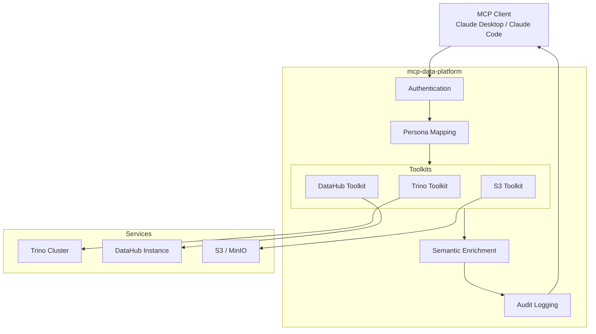

# MCP Server Overview

This MCP server connects AI assistants to your data infrastructure for exploration and analysis. It's not an API wrapper—it's a platform that understands your data's business context.

## What It Does

DataHub is required. It's the semantic layer that gives meaning to your data. Trino and S3 are optional:

- **DataHub** - Search your catalog, explore lineage, understand what data means
- **Trino** - Run SQL queries (results include DataHub context automatically)
- **S3** - Access files in object storage (with DataHub metadata when available)

The difference from standalone tools: **cross-injection**. Query a table in Trino, get DataHub's business context in the response. Search DataHub, see which datasets are queryable.

## Architecture



## Request Flow

For SSE (remote) deployments:

1. **Auth** - Validate OIDC token or API key
2. **Persona** - Map user roles to tool permissions
3. **Execute** - Run the tool
4. **Enrich** - Add DataHub context to results
5. **Audit** - Log the request

For stdio (local), skip steps 1-2. Your machine, your credentials.

## Transport

| Transport | When to use |
|-----------|-------------|
| **stdio** | Local. Claude Code, development. |
| **SSE** | Remote. Shared server, Claude Desktop connecting over network. |

## Minimal Configuration

DataHub is required. Add Trino and S3 if you have them:

```yaml
server:
  name: mcp-data-platform
  transport: stdio

toolkits:
  datahub:
    primary:
      url: https://datahub.example.com
      token: ${DATAHUB_TOKEN}

  # Optional: add Trino for SQL queries
  trino:
    primary:
      host: trino.example.com
      port: 443
      user: analyst
      ssl: true
      catalog: hive

injection:
  trino_semantic_enrichment: true
  datahub_query_enrichment: true
```

## Next Steps

- [Installation](installation.md)
- [Configuration](configuration.md)
- [Tools](tools.md)
