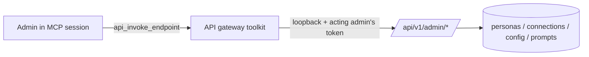

# Self-Configuration (the `platform-admin` connection)

The platform's premise is that an AI agent helps people operate their data and
infrastructure. Self-configuration turns that capability inward: an admin
connected over MCP can configure and maintain the platform itself, driving the
same `/api/v1/admin/*` REST API the Portal uses, through the existing API
gateway discovery and invoke tools.

"Create an analyst persona that can query Trino but cannot run any delete tool"
or "add an S3 connection for bucket `reports` and grant it to the finance
persona" becomes a sentence to the agent rather than a click-path through the
Portal.

## How it works

On startup the platform registers a built-in API gateway connection named
**`platform-admin`** whose OpenAPI catalog is sourced from the spec embedded in
the binary. Because that spec is generated from the same source tree at build
time, the catalog is, by construction, the exact admin API of the running
version. A release that adds admin endpoints ships a new embedded spec, which is
re-indexed automatically at startup — no URL fetch, no scheduled poll, no
operator catalog upkeep.

The connection's `base_url` is the loopback address of the platform's own admin
listener (e.g. `http://127.0.0.1:8080`), so an `api_invoke_endpoint` call is a
loopback round-trip to `/api/v1/admin/*`.

In the Portal's Connections view the built-in connection carries a fixed
description explaining its purpose and is attributed to **`system`** (it is
provisioned by the binary, not authored by an operator), distinguishing it from
connections an admin creates.



### Caller identity

Admin API mutations must be attributed to and authorized as the **acting
admin**, not a shared connection identity. The `platform-admin` connection is
configured with `identity_passthrough: true`: instead of applying a shared
credential, `api_invoke_endpoint` forwards the acting caller's inbound bearer
token (the token that authenticated the MCP session) as the `Authorization`
header on the loopback call. The admin API authenticates that token through the
same authenticator the MCP transport uses, so authorization and audit logging
attribute the change to the real admin.

A passthrough call with no caller token fails fast rather than calling
anonymously.

### Discovery and invocation

The connection behaves like any other API gateway connection:

- `api_list_specs` / `api_list_endpoints` — discover admin operations.
- `api_get_endpoint_schema` — inspect an operation's parameters and request
  body.
- `api_invoke_endpoint` — call an operation (e.g. `POST /api/v1/admin/personas`).

## Access control

The `platform-admin` connection is **admin-only by default**. It is marked
`admin_only: true`, which adds it to the authorizer's restricted set: for a
restricted connection the usual "a persona with no connection allow-rules may
use every connection" default does not apply. A non-admin persona is denied the
connection unless an admin explicitly grants it by adding the connection name to
that persona's connection `allow` list. The built-in `admin` persona allows
`*`, so it retains full access.

## Configuration

Auto-enabled when the prerequisites are met: HTTP transport with the admin API
mounted (`admin.enabled: true`), a database, and the API gateway toolkit.

```yaml
apigateway:
  self_connection:
    enabled: true            # nil/auto: on when prerequisites are met; false to opt out
    base_url: ""             # override the loopback admin URL; empty derives http://127.0.0.1:<port>
```

Set `enabled: false` to opt out. Set `base_url` only when the admin API is
reachable at a different loopback address than the main listener (for example,
when `admin.path_prefix` has been changed from its `/api/v1/admin` default and
the embedded spec's base path no longer matches the live routes).

## Security considerations

- **Default scope is admin only.** Granting the connection to another persona is
  an explicit admin action.
- **Mutations are attributed to the acting admin** through the existing audit
  middleware (identity passthrough), so the audit trail names the real user.
- Destructive admin operations run through the same audit and authorization path
  as any other admin API call.

## Related

- [API Gateway Toolkit](api-gateway.md) — connection options (`identity_passthrough`, `admin_only`).
- [API Catalogs](api-catalogs.md) — the `embedded` source kind used by the self-seeded catalog.
- [Admin API](admin-api.md) — the REST surface the connection drives.
- [Personas](../personas/overview.md) — connection allow/deny rules.
