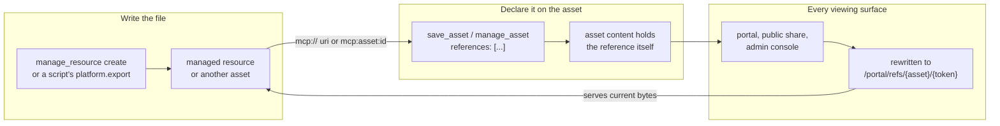
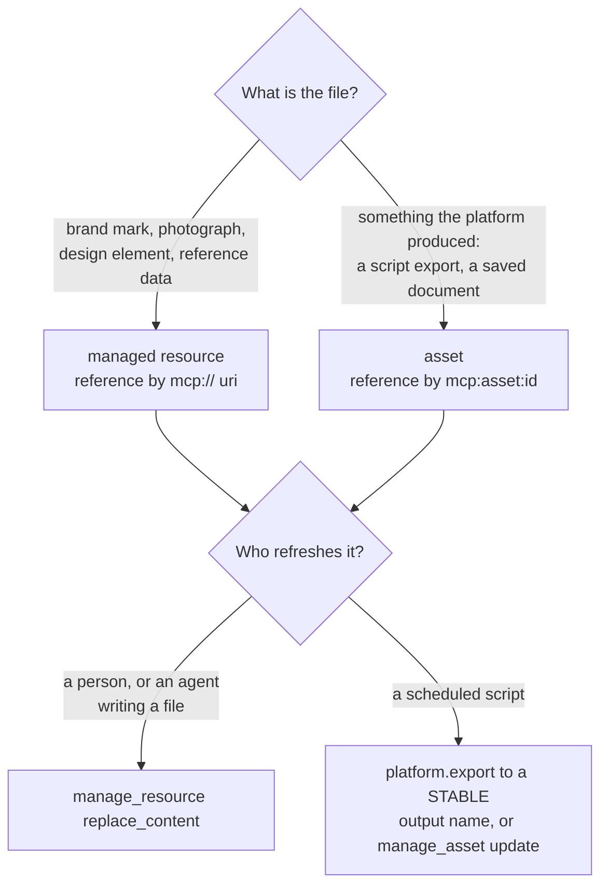
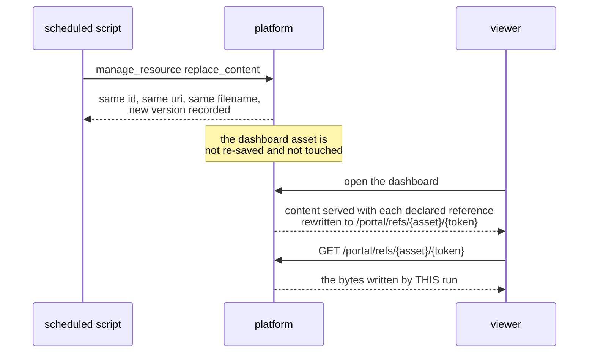
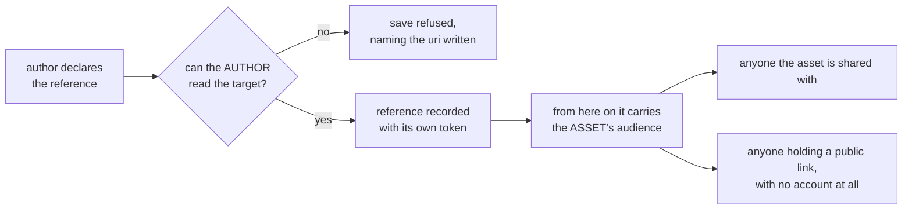

# Asset references and the refresh loop

An asset's content can NAME a file instead of carrying it. A report that needs
a logo does not embed the SVG; a dashboard that needs numbers does not carry
them in its markup. It writes the reference where the file belongs, declares
that reference on the save, and the platform serves the file to whoever opens
the asset.

Two things follow that a copy cannot do. The bytes are stored once instead of
once per saved version, and the file can be replaced without the asset being
re-saved — so a scheduled script refreshes the data and every document naming
it shows the new numbers.



## Declaring one

`save_asset` and `manage_asset` (`update` and `patch`) take a `references`
list. Two forms go in it, and they are not interchangeable:

- **A managed resource by its `mcp://` URI**: `mcp://global/brand/logo.png`,
  `mcp://user/<id>/data/orders.csv`. This is the form `manage_resource create`
  reports and the form a resource's search hit carries in its `link.uri`. The
  `mcp:resource:<id>` reference that `fetch` takes is NOT accepted here, and a
  declaration that uses it is refused naming both forms.
- **Another saved asset by its `mcp:asset:<id>` reference**, exactly as a
  search hit or a fetch document carries it.

The list is the whole declaration. Omitting it leaves the asset's references
alone, sending a list replaces them, and sending an empty list removes them
all. At most 20 per asset; a save above that is refused with the number you
declared.

Write the reference itself into the content, at the place the file belongs,
and list the same string in `references`. Only a declared reference is
rewritten: an `mcp://` URI that appears in the content and was never declared
is served exactly as written and resolves to nothing.

## What this looks like in the assets you actually write

The rewrite applies to any textual asset — `html`, `jsx`, `markdown`, `csv`,
`json`, `text` — and it rewrites a reference inside a `<script>` block exactly
as it rewrites one in an `img` `src`.

**An HTML report with the company logo.** The reference is the `src`. Do not
inline the SVG and do not emit a data URI.

```html

```

```json
{"references": ["mcp://global/brand/logo.svg"]}
```

**A JSX dashboard that loads its data at render time.** The document holds the
presentation; the numbers live in a file something else refreshes. `fetch`
works from inside the sandboxed frame an HTML or JSX asset renders in.

Import what you use: the frame resolves bare specifiers (`react`,
`react-dom`, `recharts`, `lucide-react`) through an import map, and there is no
global `React` to reach through.

```jsx
import { useEffect, useState } from "react";

export default function Dashboard() {
  const [rows, setRows] = useState([]);
  useEffect(() => {
    fetch("mcp:asset:5affca99a698be1b31dd25d0f76cb398")
      .then((r) => r.json())
      .then(setRows);
  }, []);
  return <table>{/* render from rows */}</table>;
}
```

```json
{"references": ["mcp:asset:5affca99a698be1b31dd25d0f76cb398", "mcp://global/brand/logo.svg"]}
```

**A markdown report with a chart image.** Ordinary markdown image syntax:

```markdown

```

## Which target: a resource or an asset



A resource keeps its id, its `mcp://` URI and its filename across a
`replace_content`, so the reference survives the refresh. An asset reference
resolves to that asset's current content, which is what makes a script's
stable-named export a live data file. Both are read-only through the
reference: a referenced asset is served as its stored content, not as a page
with its own controls.

## The refresh loop



The document is written once. After that the only thing that moves is the
file, and nothing re-saves the document — which is the point: no output tokens
spent re-emitting content, no new version of the report per refresh, and a
layout edit a person makes in the portal is not overwritten by the next run.

## A referencing document is not an as-of snapshot

References belong to the ASSET, not to a version of it. A read of version 3 is
rewritten against the references the asset holds now, and each one resolves to
its target's current content. Open a six-month-old version of a referencing
dashboard and you get today's numbers in it.

Choose accordingly:

- **Live is what you want**: reference the data. One document, always current.
- **A frozen record is what you want**: put the data IN the version. A script
  does that with `platform.publish_data`, which splices the numbers into the
  document's `id="data"` region as an ordinary new version — see
  `mcp:knowledge_page:platform-semi-dynamic-dashboards` for the whole choice.

The two combine in the ordinary case: reference the logo, splice the numbers.

## Reading a referencing document back

`manage_asset get_content` returns the content as STORED, with the `mcp://`
URIs intact. That is deliberate, and it is the one thing to get right when you
edit:

- The `/portal/refs/...` URL you see when VIEWING an asset is a serving detail.
  It is minted per (asset, reference) pair and it is not content.
- Never write one back into an asset. A patch that replaces the `mcp://` URI
  with the rewritten URL destroys the reference: the declaration no longer
  matches anything in the markup, and the next reader gets a path that is not
  theirs to resolve.

A patch round trip through `get_content` leaves references intact. Re-declare
`references` only when the set of files the content names actually changes.

## Who can then load the file



The author's own read is checked once, at declaration, against every URI in
the list before any of them is accepted. After that the reference carries the
referencing asset's audience rather than the target's own shares — the route
answers with no session, because a public link's reader has no identity to
resolve shares against. Declare accordingly: referencing a file into a
publicly shared report publishes that file to everyone holding the link.

Copying an asset re-runs that check as the copier. References they can read
for themselves carry over, each under a fresh token; ones they cannot are
dropped rather than refusing the copy, so the copy renders with that one file
missing.

## When a reference does not resolve

- **The target was deleted**: the route answers 404 and the document renders
  with that one file missing. The reference row survives, so the record that
  the report is now incomplete is not erased.
- **The URI was never declared**: served exactly as written, resolves to
  nothing. The grant is always the declaration, never a string that happens to
  appear in the body.
- **The target does not exist**: refused, naming the URI or reference you
  wrote. A resource and an asset answer the same way, in the terms you wrote
  them in, so a typo reads as a typo rather than as a fault below the platform.
- **More than 20**: refused, with the number you declared.
- **No managed-resource layer, no asset store, or nowhere to record
  references**: refused with that reason. A deployment that cannot record a
  reference says so rather than reporting one the asset does not have.
