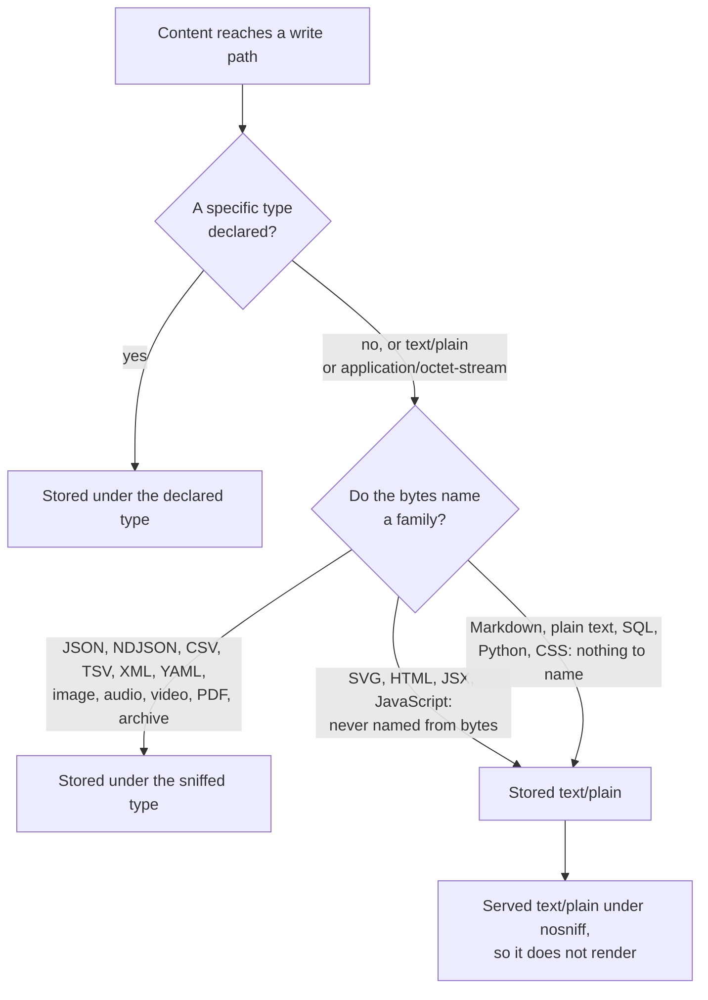

# Content types for stored files

Every file the platform stores carries a media type. That type is what a
browser is told the bytes are when the file is served, and it is what decides
which viewer opens it. A file stored under the wrong type does not fail
anywhere: it is saved, it is listed, and it silently does not render.

You declare the type when you write the file. `manage_resource action=create`
requires `content_type`, and so does `save_asset`. Creating the file is the one
moment the type is known for certain, because you chose the bytes.

## Why the platform does not work it out for you

It does try. When a declaration is missing or generic, detection reads the
first bytes and names the family. That works for JSON, NDJSON, CSV, TSV, XML
and YAML, and for every binary family with magic bytes at the front: images,
audio, video, PDF and archives.

Two groups cannot be named that way.

- **Content that renders as executing markup**: SVG, HTML, JSX, JavaScript.
  Detection never promotes content into one of these families from its bytes,
  deliberately, so that a mislabeled upload cannot turn itself into
  script-bearing content. They are stored only where an author declared them.
- **Unstructured text**: Markdown, plain text, SQL, Python, CSS. Nothing in the
  bytes tells them apart.

Both groups land on `text/plain` when nothing is declared. Raw content is
served with `X-Content-Type-Options: nosniff`, so `text/plain` is final: a
browser will not render it as an image or as a document. An `` pointing at
an SVG stored that way is a broken image on every surface it appears on, and
nothing reports a problem.

`manage_resource action=create` takes the left branch by requiring the
declaration. The upload form takes it too, because a browser declares the type
of the file a person picked.

## What to declare

Declare what the bytes ARE, not what you want done with them. The extension
column below is the extension the stored object carries for that type, which is
usually the fastest way to find the row you want.

### Content that travels as text

These are the types the platform names for content that arrives as a string.
`save_asset`, `manage_asset action=update` and the portal's inline-create
endpoint accept exactly this list and refuse everything else, because their
content travels inside a JSON document and a binary family has no way through
in the first place. Aliases normalize, so declaring `text/xml` stores
`application/xml`; membership is exact, so an invented `text/x-*` type is
refused rather than admitted by a wildcard.

`manage_resource` takes these declarations in `content` too, and is not limited
to them: the resource library keeps a denylist rather than a list of accepted
types, which the section below covers.

{{TEXT_CONTENT_TYPES}}

### Content that travels as bytes

A binary file reaches a tool as base64 in `manage_resource`'s `content_base64`,
or as an upload through the portal's resource library. These are the families
the platform names and stores an object key for. Images, audio, video and PDF
have a viewer; the rest are offered as a download.

{{BINARY_CONTENT_TYPES}}

A managed resource may hold a type on neither list. The library exists to hold
reference material of every shape -- report templates, brand files, CAD
exports -- so it keeps a denylist rather than a list of accepted types: what it
refuses is `application/xhtml+xml`, which a browser renders natively along with
the script inside it, and the executable MIME types and file extensions. Every
other declaration is stored, which is also why declaring the right one matters
here: nothing downstream will catch a type that was merely plausible.

## Replacing a file

`manage_resource action=replace_content` keeps the type the resource already
carries when you omit `content_type`. A refreshed CSV stays `text/csv` and a
refreshed SVG stays `image/svg+xml`, so every asset referencing the file keeps
rendering it the same way.

Send `content_type` on a replacement only to change what family the file is.
That is a real change: it moves the file to a different viewer everywhere it is
referenced, and it changes what a browser is told when the bytes are served.

## Where a wrong type shows up

- A public share and the private viewer both serve the raw bytes under the
  stored type, so an SVG stored `text/plain` is not rendered as an image.
- A thumbnail is captured by rendering the asset a second time in the browser,
  so a document whose referenced file does not render is captured with it
  missing.
- `manage_table` decides whether a file is a CSV from its stored type, falling
  back to the `.csv` in the object key when that type is generic. A CSV stored
  under a specific type that is not a CSV type is refused registration.

Nothing rewrites a file that was already stored under the wrong type. Write the
content again with the right declaration: `replace_content` with an explicit
`content_type` keeps the id, the `mcp://` uri and the filename, so every
reference to the file survives the correction.
