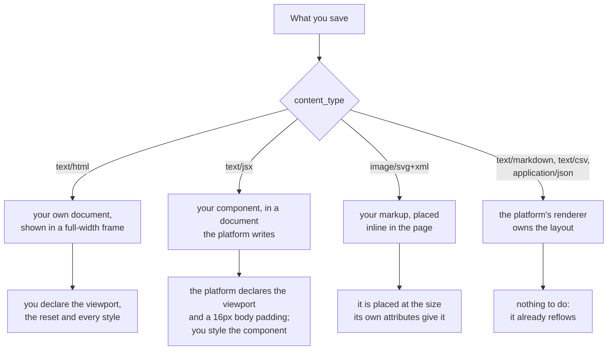

# Documents that fit any screen

A document you save is opened on whatever screen the reader has. A share link
is followed on a phone as readily as on a laptop, and the reader who gets the
narrow one cannot widen it. So the width of the reader's screen is the width
you have, and the only correct behaviour is for the document to reflow into it.

The failure this prevents is specific: the page scrolls sideways. A reader then
pans left and right to read a sentence, a heading is cut off mid-word, and
whatever you put on the right of a row -- a total, a legend, a control -- is
off the screen with nothing to say it is there.

## Who owns the frame

What you write is wrapped differently per content type, and the difference
decides what you are responsible for.



An `html` asset is a whole document of yours, shown in a frame exactly as wide
as the reader's page area. Nothing above it can correct a layout that does not
fit.

A `jsx` asset is a component. The platform writes the surrounding document, and
with it the viewport declaration, a `box-sizing: border-box` reset and 16px of
body padding, and it resolves `react`, `react-dom`, `recharts` and
`lucide-react` for you. There is no CSS framework in that document: the styles
are yours, inline or in a `<style>` you render.

An `svg` asset is inlined into the page rather than framed, so it occupies
exactly the size its own attributes ask for.

`markdown`, `csv`, `json` and the other text families are drawn by the
platform's own renderers, which already reflow. Write those without thinking
about width at all.

## The rules

**No page-holding element gets a width in pixels.** `max-width` is the
constraint to reach for, and a percentage, `rem` or `ch` is the unit. A
`width: 1200px` container, or any `min-width` wider than about 320px, is wider
than a phone and cannot shrink. Where a fixed measure genuinely belongs (an
icon, a rule, a badge), it is small enough not to hold the page open.

**An `html` document declares the viewport.** Without it a phone browser lays
the document out at a notional desktop width and then scales the whole thing
down, so the type is unreadable even though nothing overflows:

```html
<meta name="viewport" content="width=device-width, initial-scale=1">
```

The platform writes this line for a `jsx` asset. For an `html` asset it is
yours, and it is the single most common thing missing from one.

**Rows wrap or stack.** A header with a title and controls, a strip of stat
tiles, a two-column body: each is a row that must become a column on a narrow
screen. Two rules do it, and one of them is always enough:

```css
.row  { display: flex; flex-wrap: wrap; gap: 1rem; }
.grid { display: grid; gap: 1rem; grid-template-columns: repeat(auto-fit, minmax(16rem, 1fr)); }
```

`auto-fit` with a `minmax` floor is the one to prefer for tiles and cards: it
chooses the column count from the space available instead of naming a
breakpoint, so it is right at every width rather than at the two you thought
of.

**Only a table, a code block or a diagram may be wider than the screen, and
each goes in its own scroll box.** The body itself never scrolls sideways; a
wide table scrolls inside its own container while the page around it stays put.

```html
<div style="overflow-x: auto; max-width: 100%"><table>...</table></div>
```

Prefer not needing it. A table of twelve columns is unreadable on a phone
whether it scrolls or not; pick the four columns that carry the answer and put
the rest in a second view or leave them out.

**Images and SVGs are capped at the container.** `max-width: 100%` with
`height: auto` on every ``. An inline `<svg>` is placed at the size its
own attributes give it, so give it a `viewBox` and let the width come from the
page:

```html
<svg viewBox="0 0 800 400" width="100%" height="auto" role="img" aria-label="Revenue by month">
```

A `width="800" height="400"` with no `viewBox` is 800 pixels wide on a 400
pixel screen, every time.

**Type and spacing in relative units.** `rem` for both, and `clamp()` where a
heading should shrink with the page: `font-size: clamp(1.25rem, 4vw, 2rem)`. A
40px gutter is a tenth of a phone screen.

**A chart sizes to its container, and the container has a height.** In a `jsx`
document, wrap a recharts chart in `ResponsiveContainer` and give the element
around it a real height, because a percentage height inside an auto-height
parent resolves to zero and the chart does not draw at all:

```jsx
<div style={{ width: "100%", height: 320 }}>
  <ResponsiveContainer>
    <LineChart data={rows}>...</LineChart>
  </ResponsiveContainer>
</div>
```

**Long unbroken strings get a break rule.** A URN, a file path, a hash or a SQL
string in a heading will hold a column open past the screen on its own.
`overflow-wrap: anywhere` on the element that holds it, or `word-break:
break-all` for an identifier, is the fix.

## Before you save

Read back what you have written and look for the five things that break it:

1. a `width` or `min-width` in pixels on anything that holds the page,
2. an `html` document with no viewport declaration,
3. a `display: flex` row with no `flex-wrap`,
4. a `<table>` or `<pre>` that is not inside a scroll container,
5. an `<svg>` or `` with fixed pixel dimensions and no `max-width`.

Each of them is one line to fix while you are still composing, and each of them
is a document the reader has to pan across once it is saved.

A document that references a logo or a data file rather than embedding it is
covered by `mcp:knowledge_page:platform-asset-references-and-the-refresh-loop`,
and which media type to declare for what you wrote by
`mcp:knowledge_page:platform-content-types-for-stored-files`.
