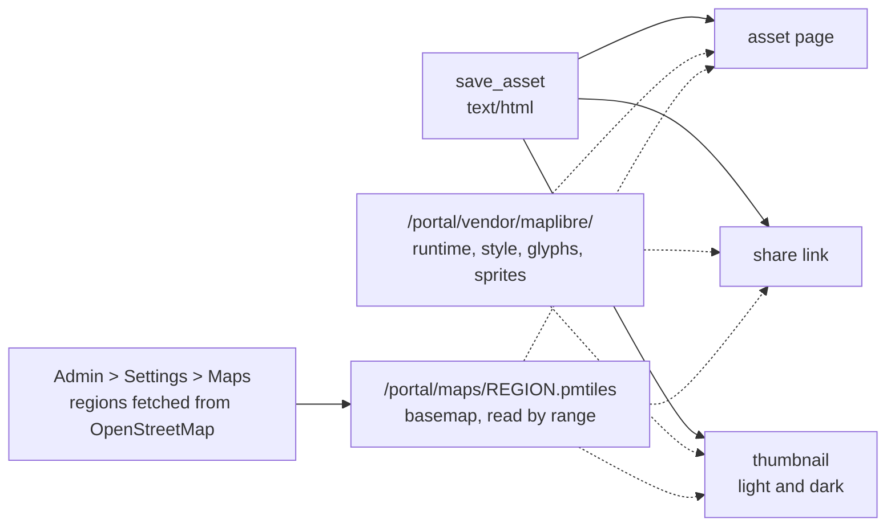

# Maps

A map is an HTML asset. A request for a map of routes, stops, sites,
territories or anything else with coordinates is a request for this: save a
document with `save_asset` as `text/html` that draws the data on the basemap
this deployment serves. There is no map file format and no map service to
call. The platform serves the map runtime and the street basemap itself, so
the map renders on the asset page, on a share link, in its thumbnail and on a
network that reaches nothing but this deployment.



Name nothing on a CDN or a public tile host. A map that loads its runtime or
its tiles from elsewhere sends every view to a third party, goes blank on a
closed network, and draws an empty thumbnail, and the reader cannot tell
which happened.

## What this deployment serves

{{MAP_REGIONS}}

A region's archive is read by the map runtime in pieces, by byte range, from
the URL above. It is OpenStreetMap data, needs no session, and is answered
for the asset frame and for share links alike.

## The runtime is served here

| Path | What it is |
|---|---|
| `/portal/vendor/maplibre/maplibre-gl.js` | MapLibre GL JS 5.24.0; defines the global `maplibregl` |
| `/portal/vendor/maplibre/maplibre-gl.css` | the map's controls and attribution styling |
| `/portal/vendor/maplibre/pmtiles.js` | the PMTiles protocol 4.5.0; defines the global `pmtiles` |
| `/portal/vendor/maplibre/basemaps.js` | the Protomaps basemap style 5.7.2; defines the global `basemaps` |
| `/portal/vendor/maplibre/fonts/{fontstack}/{range}.pbf` | the label glyphs: Noto Sans Regular, Medium and Italic |
| `/portal/vendor/maplibre/sprites/v4/light`, `.../dark` | the icon sprites for the light and dark styles |
| `/portal/vendor/maplibre/topojson-client.js` | TopoJSON client 3.1.0; defines the global `topojson` |
| `/portal/vendor/maplibre/us-atlas/states-albers-10m.json` | US state boundaries, projected (see below) |
| `/portal/vendor/maplibre/us-atlas/counties-albers-10m.json` | US county boundaries, projected |
| `/portal/vendor/maplibre/us-atlas/nation-albers-10m.json` | the US outline, projected |
| `/portal/vendor/maplibre/us-atlas/states-10m.json`, `counties-10m.json`, `nation-10m.json` | the same boundaries in longitude and latitude |

The license of each file is served beside it (`LICENSE-maplibre.txt`,
`LICENSE-pmtiles.txt`, `LICENSE-basemaps.md`, `LICENSE-fonts.txt`,
`LICENSE-sprites.md`, `LICENSE-topojson-client.txt`, `LICENSE-us-atlas.txt`).

## The skeleton

The document runs in a frame whose own origin is opaque, so every URL the map
runtime fetches is built from the platform's origin, read from
`document.baseURI`. The style follows the reader's light or dark scheme.

```html
<!DOCTYPE html>
<html lang="en">
<head>
<meta charset="utf-8">
<meta name="viewport" content="width=device-width, initial-scale=1">
<title>Tuesday delivery route</title>
<link rel="stylesheet" href="/portal/vendor/maplibre/maplibre-gl.css">
<script src="/portal/vendor/maplibre/maplibre-gl.js"></script>
<script src="/portal/vendor/maplibre/pmtiles.js"></script>
<script src="/portal/vendor/maplibre/basemaps.js"></script>
<style>
  html, body { margin: 0; height: 100%; font-family: system-ui, sans-serif; }
  body { display: flex; flex-direction: column; background: #fff; color: #111; }
  @media (prefers-color-scheme: dark) { body { background: #1b1b1b; color: #eee; } }
  header { padding: 12px 16px; }
  h1 { margin: 0; font-size: 1.1rem; }
  #map { flex: 1; min-height: 420px; }
</style>
</head>
<body>
<header><h1>Tuesday delivery route: 6 stops</h1></header>
<div id="map"></div>
<script>
const origin = new URL(document.baseURI).origin;
const REGION = "/portal/maps/REGION_ID.pmtiles";   // a ready region's archive
const dark = matchMedia("(prefers-color-scheme: dark)").matches;
const flavor = dark ? "dark" : "light";

const protocol = new pmtiles.Protocol();
maplibregl.addProtocol("pmtiles", protocol.tile);

const map = new maplibregl.Map({
  container: "map",
  style: {
    version: 8,
    glyphs: origin + "/portal/vendor/maplibre/fonts/{fontstack}/{range}.pbf",
    sprite: origin + "/portal/vendor/maplibre/sprites/v4/" + flavor,
    sources: {
      protomaps: {
        type: "vector",
        url: "pmtiles://" + origin + REGION,
        attribution: '<a href="https://www.openstreetmap.org/copyright">&copy; OpenStreetMap</a>',
      },
    },
    layers: basemaps.layers("protomaps", basemaps.namedFlavor(flavor), { lang: "en" }),
  },
  attributionControl: { compact: false },
});
</script>
</body>
</html>
```

Build the glyph and sprite URLs by joining strings, as above. `new URL()`
would escape the `{fontstack}` and `{range}` placeholders the runtime fills
in. Give the map element a height; a map in a box with no height draws
nothing.

## Drawing data on it

Add the data once the style has loaded, as GeoJSON sources and layers drawn
over the basemap. Coordinates are `[longitude, latitude]`, in that order.

A route is a `LineString` through its points in order, and its stops are
`Point` features with a name to label them by. The platform draws the
geometry the data has; it does not compute the streets between two stops.
When the data holds only the stops, the line joins them directly, and the
title or a note should say so.

```js
const stops = {
  type: "FeatureCollection",
  features: [
    [-122.4183, 37.7599, "1. Depot, 18th & Mission"],
    [-122.4212, 37.7648, "2. Valencia & 16th"],
    [-122.4130, 37.7712, "3. Folsom & 12th"],
  ].map(([lon, lat, name]) => ({
    type: "Feature", properties: { name }, geometry: { type: "Point", coordinates: [lon, lat] },
  })),
};
const route = {
  type: "Feature", properties: {},
  geometry: { type: "LineString", coordinates: stops.features.map((f) => f.geometry.coordinates) },
};

map.on("load", () => {
  map.addSource("route", { type: "geojson", data: route });
  map.addLayer({
    id: "route", type: "line", source: "route",
    layout: { "line-join": "round", "line-cap": "round" },
    paint: { "line-color": "#d6336c", "line-width": 5 },
  });
  map.addSource("stops", { type: "geojson", data: stops });
  map.addLayer({
    id: "stops", type: "circle", source: "stops",
    paint: { "circle-radius": 7, "circle-color": "#fff", "circle-stroke-color": "#d6336c", "circle-stroke-width": 3 },
  });
  map.addLayer({
    id: "stop-labels", type: "symbol", source: "stops",
    layout: { "text-field": ["get", "name"], "text-font": ["Noto Sans Medium"], "text-size": 12,
              "text-offset": [0, 1.2], "text-anchor": "top" },
    paint: { "text-color": dark ? "#eee" : "#111", "text-halo-color": dark ? "#111" : "#fff", "text-halo-width": 1.5 },
  });

  const bounds = new maplibregl.LngLatBounds();
  for (const c of route.geometry.coordinates) bounds.extend(c);
  map.fitBounds(bounds, { padding: 48, animate: false });
});
```

- **Points** are a `circle` layer, or a `symbol` layer for a label. A label's
  `text-font` must be one of the served faces: `Noto Sans Regular`,
  `Noto Sans Medium` or `Noto Sans Italic`. Any other face asks for glyphs
  this deployment does not serve.
- **Lines** are a `line` layer over a `LineString` or `MultiLineString`.
- **Areas** are a `fill` layer over a `Polygon` or `MultiPolygon`, with a
  `line` layer over the same source for the outline. Color a value by a
  property with an expression: `"fill-color": ["interpolate", ["linear"],
  ["get", "value"], 0, "#dbeafe", 100, "#1d4ed8"]`.
- **Fit the view to the data** with `fitBounds` over every coordinate, as
  above, and `animate: false`, so the asset page, the share link and the
  thumbnail all open on the data rather than on wherever the style starts.

Keep the attribution control on and uncompacted. OpenStreetMap data is
licensed under the ODbL, which requires the credit to be shown wherever the
map is.

## When no region covers the data

A region covers the box listed above, between its zooms. Outside it the map
draws background with no streets. Before drawing, check that the data's
bounds fall inside a ready region's bounds. When none covers them:

- say so in the reply rather than saving a map with an empty background;
- if the data is a value per state or county, draw it with the boundaries
  below, which need no basemap;
- otherwise give the data as a table or chart, and tell the reader that an
  administrator can add a region covering it in Admin > Settings > Maps.

## State and county maps need no basemap

The most common map is a value by state or by county. The US boundaries are
served with the runtime, and drawing them needs neither a basemap nor maps to
be turned on. `states-albers-10m.json` is already projected to a 975 by 610
frame, with Alaska and Hawaii inset, so its coordinates are SVG coordinates.
Each state's id is its two-digit FIPS code (`"06"` is California); a county's
is its five-digit FIPS code.

```html
<script src="/portal/vendor/maplibre/topojson-client.js"></script>
<svg id="map" viewBox="0 0 975 610" role="img" aria-label="Open accounts by state"></svg>
<script>
const values = { "06": 4210, "48": 3120, "12": 2875, "36": 2650 };
const steps = [[0, "#dbeafe"], [1000, "#93c5fd"], [2000, "#3b82f6"], [3000, "#1d4ed8"]];
const colorOf = (v) => v === undefined ? "#e5e7eb" : steps.filter(([min]) => v >= min).pop()[1];
const pathOf = (g) => (g.type === "Polygon" ? [g.coordinates] : g.coordinates)
  .map((poly) => poly.map((ring) => "M" + ring.map((p) => p.join(",")).join("L") + "Z").join("")).join("");

fetch("/portal/vendor/maplibre/us-atlas/states-albers-10m.json")
  .then((r) => r.json())
  .then((us) => {
    const svg = document.getElementById("map");
    for (const f of topojson.feature(us, us.objects.states).features) {
      const p = document.createElementNS("http://www.w3.org/2000/svg", "path");
      p.setAttribute("d", pathOf(f.geometry));
      p.setAttribute("fill", colorOf(values[f.id]));
      p.setAttribute("stroke", "#fff");
      const t = document.createElementNS("http://www.w3.org/2000/svg", "title");
      t.textContent = f.properties.name + ": " + (values[f.id] ?? "none");
      p.appendChild(t);
      svg.appendChild(p);
    }
  });
</script>
```

Counties are `us.objects.counties` in `counties-albers-10m.json`; the same
file holds `us.objects.states` for drawing state lines over them. Add a
legend that names each color's range, and follow the reader's scheme for the
page and the empty-state color as the skeleton above does.

## What the thumbnail and the PDF show

The thumbnail is the document drawn by the platform, from the same archive,
at the view the map opens on, light and dark. Export PDF prints the document
in the same renderer once every map on it has finished drawing, on one page
the size of the screen layout. A map that fits its view to the data in the
`load` handler has a thumbnail and a PDF showing the data.
