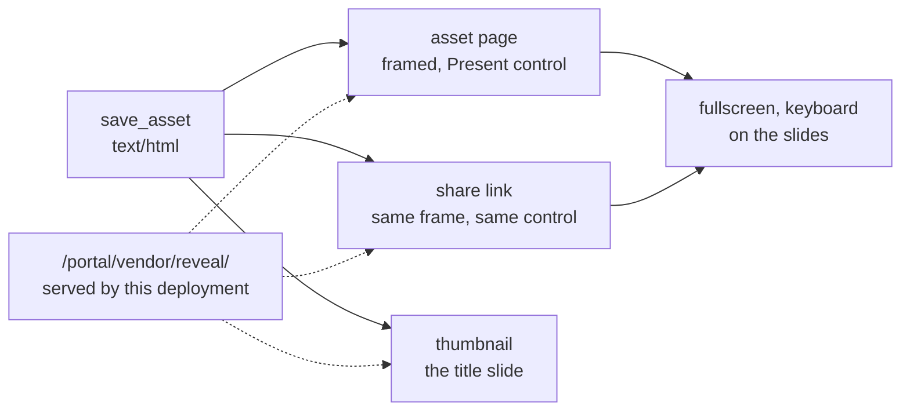

# Presentations

A presentation, a deck, a set of slides: each is an HTML asset. The platform
serves the slide runtime the document runs on, so a deck is written like any
other HTML document you save, and the portal presents it. There is no slide
file format to produce and no other tool to hand the reader; a deck is saved
with `save_asset` as `text/html`, viewed on its asset page, and shared by link
like a dashboard.



## The runtime is served here, not from a CDN

The runtime is reveal.js 6.0.2, MIT licensed, pinned in the portal build. The
document loads it from this deployment, by root-relative path:

| Path | What it is |
|---|---|
| `/portal/vendor/reveal/reveal.js` | the runtime; defines the global `Reveal` |
| `/portal/vendor/reveal/reveal.css` | the layout every deck needs |
| `/portal/vendor/reveal/reset.css` | the reset, loaded before the layout |
| `/portal/vendor/reveal/theme/white.css` | the light theme; `theme/black.css` is the dark one. Both carry their typeface inside the file; no other reveal.js theme is served, because the others fetch fonts from a CDN |
| `/portal/vendor/reveal/plugin/markdown.js` | Markdown slides; defines `RevealMarkdown` |
| `/portal/vendor/reveal/plugin/zoom.js` | alt-click to magnify a region; defines `RevealZoom` |

Name these paths exactly, and name nothing on a CDN. The paths are answered by
the same origin the asset page and the share link are served from, which is
what makes a deck render on a network that admits only this deployment, and
what keeps it inside the share viewer's script policy. A CDN script would load
on an open network and go blank on a closed one, and the reader who gets the
blank deck cannot tell which it was.

## The skeleton

One `<section>` per slide, inside the two containers reveal.js expects. A
`<section>` that holds sections is a vertical stack: the first is the slide,
the rest are detail the presenter can step down into or skip.

```html
<!DOCTYPE html>
<html lang="en">
<head>
<meta charset="utf-8">
<meta name="viewport" content="width=device-width, initial-scale=1">
<title>Q3 regional review</title>
<link rel="stylesheet" href="/portal/vendor/reveal/reset.css">
<link rel="stylesheet" href="/portal/vendor/reveal/reveal.css">
<link rel="stylesheet" href="/portal/vendor/reveal/theme/white.css">
<style>
  .reveal h1, .reveal h2 { text-transform: none; }
  .reveal img { max-width: 100%; height: auto; }
</style>
</head>
<body>
<div class="reveal">
  <div class="slides">
    <section>
      <h1>Q3 regional review</h1>
      <p>Revenue, stores and the one decision for Q4</p>
    </section>
    <section>
      <h2>Revenue by region</h2>
      <ul>
        <li>West led at $41.2M, up 6.1% on Q2</li>
        <li>Northeast flat; two stores explain the whole gap</li>
      </ul>
    </section>
    <section>
      <section><h2>The two stores</h2><p>Where the Northeast gap sits.</p></section>
      <section><p>Detail the presenter steps down into, or skips.</p></section>
    </section>
    <section data-markdown>
      <textarea data-template>
## Written in Markdown
- The markdown plugin renders this section
- One section, one slide, same as HTML
      </textarea>
    </section>
  </div>
</div>
<script src="/portal/vendor/reveal/reveal.js"></script>
<script src="/portal/vendor/reveal/plugin/markdown.js"></script>
<script src="/portal/vendor/reveal/plugin/zoom.js"></script>
<script>
  Reveal.initialize({ hash: false, plugins: [RevealMarkdown, RevealZoom] });
</script>
</body>
</html>
```

`hash: false` matters: the document is framed, and a runtime that writes the
current slide into the frame's URL is writing to nothing. Set the `width` and
`height` options only when the deck is designed at a size other than the
default 960 by 700; the runtime scales the slide to whatever frame or screen it
is shown in, which is what makes one deck right on a phone, a laptop and a
projector.

## What goes on a slide

One idea per slide, stated in the heading, with the evidence under it. A
number the room came for gets its own slide. A table wider than four columns
is a chart or a second slide; a paragraph is speaker prose, not slide text.
Where the deck ends on a recommendation, the recommendation is a slide of its
own with the evidence it rests on named beneath it.

A brand mark or a figure the platform already holds is named by reference, not
carried: `` with the URI declared in
`references` on `save_asset`, exactly as
`mcp:knowledge_page:platform-asset-references-and-the-refresh-loop` describes
for any document. The reference is rewritten to a working URL wherever the deck
is served, share links included.

Images take `max-width: 100%` so a wide figure fits the slide rather than
spilling past it. Nothing else from
`mcp:knowledge_page:platform-documents-that-fit-any-screen` applies to the
slide body, because the runtime owns the slide's size and scales the whole
thing; what does apply is the viewport declaration, which is still yours.

## How the portal presents it

The asset page and the share viewer frame the deck as they frame any HTML
document, and each carries a **Present** control. Present fullscreens the frame
and moves the keyboard into it: arrow keys and space advance, Esc leaves
fullscreen. Without Present, a click on the deck gives it the keyboard and the
same keys work at the page's own size.

The thumbnail on the asset card is the title slide. Write the first section as
the slide you want on the tile.

## What the frame does not allow

The deck runs in a sandboxed frame with no window-opening permission. The
reveal.js speaker view, which opens a second window, is not available inside
the portal, so speaker notes written as `<aside class="notes">` are kept with
the document but not shown to a presenter. Put what the presenter needs to say
in the slide's own detail, or in a vertical slide beneath it.

A deck is a document with a fixed origin for its runtime, so a downloaded copy
opened from disk has no runtime to load and shows its sections stacked. The
deck is presented from the portal or from a share link, not from a file.
