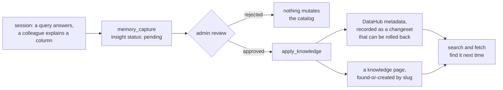

# Provenance, call references, and the capture loop

Every data-access call you make through this platform mints a record, every
asset you save says which calls produced it, and knowledge worth keeping can be
captured, reviewed, and promoted into the catalog. This page is how those three
fit together and what you should do at each step.

## Name your sources

Every data call's result carries its own identifier:

```json
{"call_reference": {"call_id": "8kQ2f1uVQ2S1p0aT4Hn2Zw", "reference": "mcp:call:8kQ2f1uVQ2S1p0aT4Hn2Zw"}}
```

Passing those ids as `sources` on `save_asset`, on a `manage_asset` content
edit, or on `memory_capture` records exactly the calls that produced the
content. Without them, the asset's capture defaults to every data call the
session made since its previous capture — a record of what the session did, not
a claim about what produced the asset. Naming is the only evidence the platform
has that a call answered anything: a named call reads as `satisfied` in the
call catalog and lists the asset as its artifact; a call the default window
swept up merely reads `ran`.

A cited id resolves only among your own calls, and `trino_export` /
`api_export` name their own statement automatically — the statement is the
content, so those need no `sources`.

## What a capture holds

A capture stores both references (the audit event ids) and a snapshot of the
calls as they stood at write time: kind, tool, connection, statement or request
line, stated purpose, outcome, and timing. For an API call the request is the
path it addressed with the values it passed substituted in, the query string it
sent, and its request body, so two calls to one operation read differently. Failed calls are captured too, with
their error — a query that failed is part of how an answer was reached. The
snapshot outlives audit retention, so an old asset can still answer "what fed
this?" after its audit rows aged out.

The **purpose** on each call is the one sentence you state when making it. It
is why an asset can say not only what ran but what it was for; write it for the
person who will read the provenance panel, not for the tool.

## The capture loop: from conversation to catalog

Domain knowledge shared during a session — what a column actually means, which
table is reliable, how a metric is calculated — evaporates when the session
ends unless it is captured:



1. **Capture** it with `memory_capture` when it surfaces. Reviewed classes
   (`business_knowledge`, `schema_entity`, `operational_rule`) create insights
   with status `pending`; nothing mutates catalog state yet.
2. **Review**: an admin approves or rejects pending insights, via
   `apply_knowledge` or the portal.
3. **Promote**: `apply_knowledge` applies approved insights — to DataHub as
   metadata changes (recorded as changesets, so they can be rolled back), or to
   a knowledge page (find-or-create by slug, so a topic consolidates onto one
   living page instead of accumulating near-duplicates).

Promoted knowledge is then found the way everything is found: `search` fans
across knowledge pages, memory, insights, the technical catalog, assets, and
more, and `fetch` dereferences any result. Capture what you learned when a
query failed and a later one worked — the platform also mints some of those
corrections automatically, but only for a narrow class of errors, and a stated
correction with its reasoning is better evidence than a mined one.
