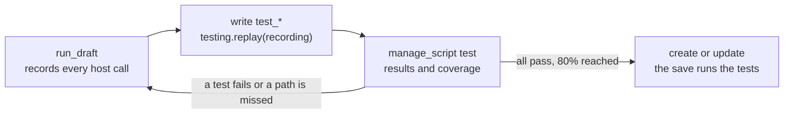

# The reference script

This is a whole automation written the way a saved one is: the idioms every
job needs, and the tests it is saved with. `manage_script get` returns it by
name (`example-weekly-revenue`), and it passes every check a save makes.

```python
{{REFERENCE_SCRIPT}}
```

## What each part is for

- **Constants and functions at the top level, the work in `main()`.** The
  platform calls `main()`; everything above it only declares. That is what
  lets a test call `window` and `summarize` on their own.
- **Every function opens with a one-sentence docstring** in plain words. The
  flow diagram labels its box with it.
- **Dates come from `run.fire_time`**, which is pinned when the run is
  created. Re-running a week months later computes the same window.
- **The watermark is read from `run.state` and written with
  `platform.save_state`.** A failed run does not move it, so the next run picks
  up where the last good one stopped.
- **SQL takes its values as `params`**, never by building the string.
- **A DECIMAL column arrives as a string**, so `summarize` converts it before
  adding.
- **`fail()` names why.** An empty week is refused with the window it looked
  at, which is what the run record and its notification say.
- **`platform.export` writes the output, `platform.result` hands back the
  answer** to whoever ran the script.

## How its tests are written

A save runs the tests, and a new script is saved only with at least one test,
every test passing, and at least 80% of its statements reached.



1. Draft the script with `manage_script run_draft`. The draft records every
   host call it makes with the answer it got, and returns the recording's id
   as `recording`.
2. Write a `test_*` function that names that id with
   `testing.replay("<id>")`, calls `main()`, and asserts on
   `testing.outputs()`: the rows exported, the state saved, the result. Every
   host call is answered from the recording, so a test never reaches the
   warehouse.
3. For a path the first draft did not take, draft again with the inputs that
   take it and write a test for that recording, as `test_an_empty_week_fails`
   does for a week with no orders.
4. Test pure functions directly, with rows written into the test, as
   `test_summarize_keeps_regions_with_orders` does.
5. Run `manage_script test` until every test passes and the coverage it
   reports names no missed line you care about; then save.

A test must assert on what the script produced. A test with no assertion is
refused, and so is one that still passes when the recorded rows are changed
under it: its assertions are not reading the data.

## Changing it later

A new version replays the script's recent runs through the old and the new
source and compares what they produced, and what each reaches. A refactor that
changes nothing saves as it is. A version that changes an exported column, the
state it saves, what it posts or which tools it reaches is refused until it
carries `change_summary`, what the automation will now do differently in plain
words, and `user_agreed=true` once the person it runs for has agreed.
`validate` shows the same differences before anything is saved.
