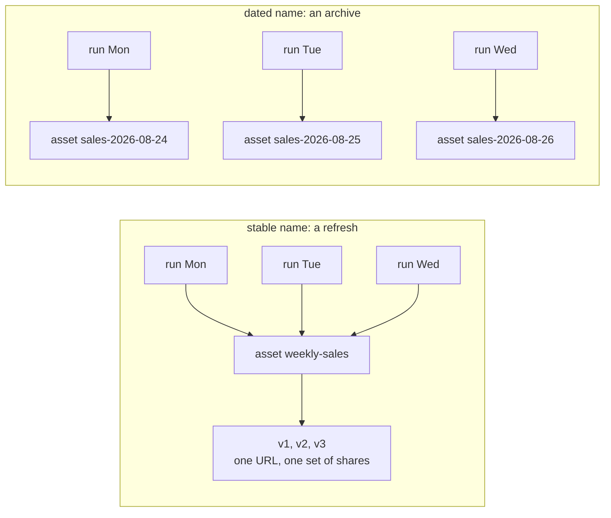

# Script outputs: export identity, stable names, and dated series

`platform.export(name, rows, format=...)` is how a managed script produces an
OUTPUT: a thing the platform keeps, versions, and records on the run. Where it
lands and what identity it keeps are decided by two things you choose: the
destination and the name.

It is not the only way a script writes. A script calls the tools its author can
call, so `platform.call("s3_object", {"action": "put", ...})` or `platform.call("trino_execute",
...)` writes too — but what those produce is not an output in this sense: it is
not versioned, it does not appear on the run as an output, and it is recorded in
the audit log like any other tool call. Use `platform.export` for the thing the
report IS; use a tool call for a side effect somewhere else.

## Why your export is not a new asset every day

Output identity at the portal is stable: the pair of **(script, output name)**
maps to **one** asset, and each run writes a new version of it. Two patterns
follow, and both are legitimate — choose by what the output is for:

- **A stable name is a refresh.** `platform.export(name="weekly-sales", ...)`
  keeps one asset with its URL, its shares, and its whole version history; a
  year of runs leaves one asset with a year of versions. Use it for the living
  report or dashboard people bookmark and share.
- **A dated series is an archive.** Composing the period into the name —
  `"sales-{}".format(run.params["report_date"])` — produces one asset per
  period, each frozen as of its run. Use it when each period's output is a
  separate deliverable (a monthly close, a statement), not a newer copy of the
  same thing.



If you see a new asset appearing every morning and expected one asset gaining
versions, the name is changing per run; make it a literal.

## rows: a table or a document, decided by format

`rows` carries the content in one of two shapes, and the declared format
decides which are valid:

- **A list of dicts**, serialized in the declared format. `csv` and `json`
  accept **only** this shape — passing a string body to `format="csv"` or
  `"json"` is refused, so a data feed another system parses stays well-formed
  by construction.
- **A string body, written verbatim**, so a script can compose a document: an
  HTML or JSX dashboard, a prose report, a hand-assembled markdown page. `html`
  and `jsx` accept **only** a string body; `markdown` and `text` accept either.

So: tabular data goes out as `csv` or `json` from a list of dicts; a composed
document goes out as `html`, `jsx`, `markdown`, or `text` from a string. An
empty document body is refused rather than published, so a conditionally
assembled document that ends up blank fails the run loudly instead of silently
replacing the current version of a shared dashboard.

Composing the whole document is one of three shapes a document output takes;
the others leave the presentation where a person can edit it and move only the
data. Which one fits is decided before the script is written; see
`mcp:knowledge_page:platform-semi-dynamic-dashboards` for the discriminator.

## An exported asset is something other documents can reference

A stable output name gives the asset a durable identity, and that is what makes
it usable as a data file: another asset can name it with its
`mcp:asset:<id>` reference and load it at render time, and each load gets the
content the latest run wrote. So a script that exports `format="json"` under a
stable name is publishing a feed, not only a file people download — one
dashboard, or several, can read it with no run of their own and no re-save.

A dated series is the wrong target for that: each run makes a NEW asset with a
new id, so a reference to yesterday's stays pinned to yesterday's data. Point a
reference at a stable name, and use the dated series for the archive.

`mcp:knowledge_page:platform-asset-references-and-the-refresh-loop` covers
declaring the reference, and the same page covers the other direction: a script
writing a managed resource with `manage_resource replace_content`, which keeps
one file's id and URI across every refresh.

## The zero-data guard

The zero-rows case is yours to decide, and deciding it explicitly is the idiom:

```python
rows = platform.query(connection="warehouse", sql="SELECT ...")["rows"]
if not rows:
    fail("no rows for {}; refusing to overwrite the current version".format(run.params["day"]))
platform.export(name="weekly-sales", rows=rows, format="csv")
```

Publish the empty structure when empty is a true answer; `fail("why")` when it
means the upstream data is missing and the current version should stand. A
failed run is recorded with its reason; a silently empty publish is not.

## Destinations

`destination` defaults to `portal` (the versioned asset). A bucket destination
the deployment declares in configuration (`scripts.destinations`) receives the
same bytes instead; the script names only the destination — the connection,
bucket, and prefix come from the configuration. That declaration bounds where an
EXPORT may address, which is not the same as bounding the script: a persona
holding an S3 connection reaches `s3_object` directly. What the
configuration buys is that a named destination can be repointed without touching
the script. `destination` and `key` must be
passed **by name**, not positionally. One output name may be written once per destination
in a run, so sending one result to the portal and to a bucket is two calls with
one name.

In a draft run nothing is written anywhere: each export reports the shape and
size it would have.
