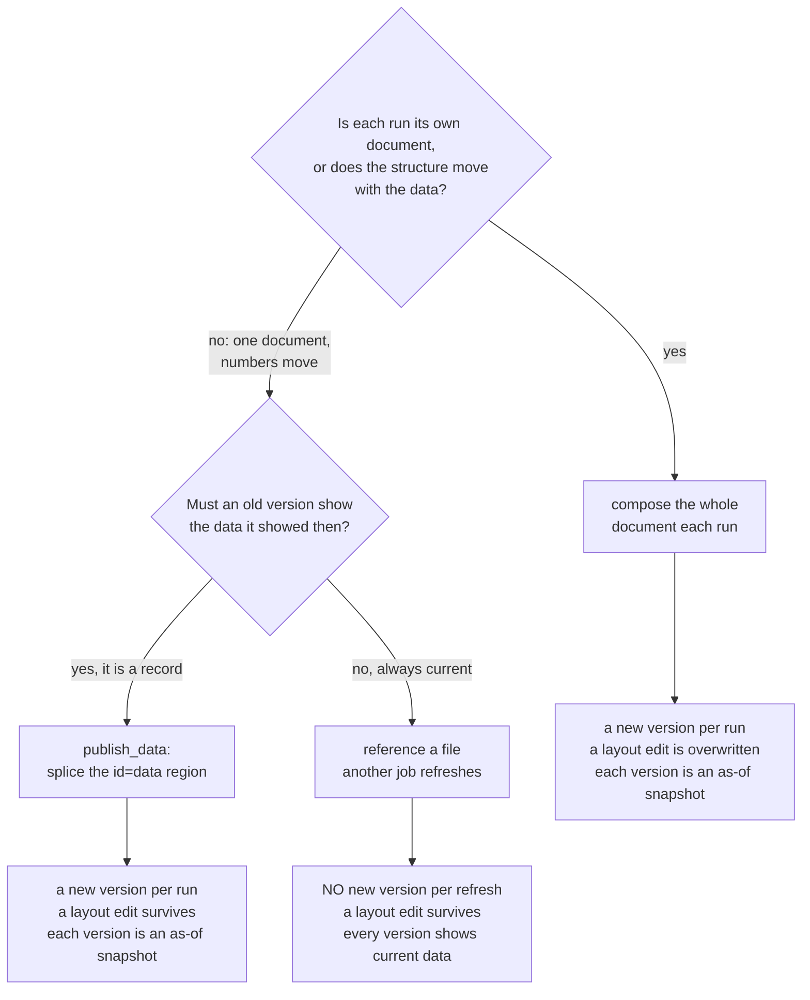

# Semi-dynamic dashboards: publish_data and the data region

A semi-dynamic dashboard is a presentation that stays put while its data tracks
a schedule: one portal asset at one URL, authored once as an HTML, JSX, or
markdown document with real visualizations, whose numbers a managed script
refreshes on a cadence.

## Which shape: whole document, spliced region, or referenced file

A script produces a document in one of three shapes, and the choice is made
before the first line of it is written. They differ on who owns the layout and
on what an old version of the document shows.



**Compose the whole document in the script** when each run is its own kept
document (a dated archive series, where a run's output is never revised),
when the structure varies with the data (a section that appears only if a
threshold trips), or when nobody will hand-edit the presentation. The cost is
that every fire overwrites the current version wholesale, so a layout edit made
in the portal is destroyed by the next scheduled run, and changing a chart
color or a heading means editing the script.

**Publish the document once and refresh only its data region** when there is
one stable-named asset at one URL whose layout a person may edit and whose
numbers alone move per run. That is the semi-dynamic dashboard: the template
stays in the asset, where a layout change is an ordinary document edit that
survives the schedule, and the data stays in the script. The cost is that the
structure is fixed by the document's author, so a report whose sections have to
appear and disappear with the data leaves a data region the markup cannot
render.

**Reference the data instead of writing it into the document** when the
numbers must always be current and no version of the report needs to preserve
what it once showed. The document names a CSV or JSON file — a managed
resource, or another asset a script exports under a stable name — and loads it
at render time; refreshing the file refreshes every document naming it, with
no new version of the document at all. The cost is that a version of the
document is no longer a record: opening last quarter's version shows this
morning's numbers. See
`mcp:knowledge_page:platform-asset-references-and-the-refresh-loop`.

The three are not exclusive. The ordinary dashboard references its logo and
splices its numbers.

`platform.publish_data` is the second shape:

```python
data = {"regions": platform.query(connection="warehouse", sql="SELECT ...")["rows"]}
platform.publish_data("revenue-dashboard", data)
```

## How it works

- `name` resolves through the same output identity `platform.export` uses: one
  (script, output name) pair is one asset. The asset must **already exist** and
  be an `html`, `jsx`, or `markdown` document — this call refreshes a region of
  a presentation and can never create one. Publish the dashboard once with
  `platform.export(name, body, format="html")` (or `"jsx"`, or `"markdown"`),
  then let the schedule refresh only the numbers.
- The document marks its **data region**: exactly one element with `id="data"`,
  conventionally `<script type="application/json" id="data">...</script>`,
  whose text content is the JSON the dashboard's own code reads and renders.
  The platform serializes `data` (a dict or a list) as JSON and structurally
  replaces that element's interior, leaving every other byte of the document
  exactly as its author wrote it.
- A document without the marked region — or with more than one — fails the run
  with a message naming what is missing. A markdown document carries the island
  as a raw-HTML block; an `id="data"` occurrence quoted inside a fenced code
  block is example text, and a refresh that would land there is refused rather
  than spliced into the fence.
- The write is an ordinary new version of the asset, with the same provenance
  an export gets, so each version is a faithful as-of snapshot: a public share
  works with no view-time fetch, and an old version still shows exactly the
  data it showed. That belongs to this shape and to composing the whole
  document. A document that REFERENCES its data has neither half of it: it
  fetches when it is read, and a reference resolves to its target's current
  content on every load.
- The zero-rows case is yours, as with any export: publish the empty structure
  or `fail("why")`.
- In a draft run nothing is written; the call reports the payload size it
  would splice.

## The dashboard reads its own island

```html
<script type="application/json" id="data">{"regions": []}</script>
<script>
  const data = JSON.parse(document.getElementById("data").textContent);
  // render from data
</script>
```

Author the document with a plausible initial payload in the island so it
renders before the first refresh, and make the rendering code tolerate an
empty structure.
