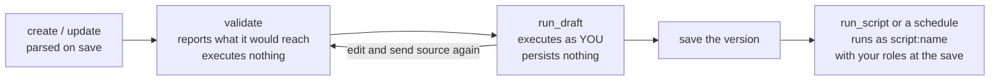

# Writing a managed script

A managed script is a small Starlark program the platform stores, versions, and
runs unattended: a KPI report, a recurring export, a dashboard refresh. Write
one when the logic is settled and the work will repeat; keep using the query
tools directly while you are still exploring. The tool is `manage_script`, and
`manage_script command=help` returns the full dialect contract plus worked
examples you can copy.

## The loop



1. `manage_script command=create` (or `update`) stores the source. It is parsed
   on save, so code that cannot run is refused at the keyboard.
2. `command=validate` parses the source and reports the capabilities,
   connections, and destinations it would reach. It executes nothing.
3. `command=run_draft` executes the draft for real under your own identity and
   persona, with tighter limits, persisting nothing: `platform.export` reports
   the shape and size of each output instead of writing it.

Steps 2 and 3 act on the `source` you send with the call, and on the saved
version when you send none. That is what makes them a loop: a save is
immediately the version `run_script` executes and a schedule fires, so sending
the edit is how you try a change without making it live.
4. Once saved, `run_script` executes the latest saved version — on demand or
   on a schedule — as the script's own principal, presenting the roles you held
   at the save.

## The dialect is deliberately smaller than Python

Starlark looks like Python but has no `import`, no `try/except`, no `while`, no
recursion, no f-strings, no classes, no clock, no randomness, no filesystem,
and no network. Each absence is deliberate: errors fail the run so the failure
is recorded, unbounded control flow is off so a script's cost is readable from
its source, and a script with no clock reproduces exactly. The full contract,
as `manage_script command=help` states it, is appended below.

## The mistakes that cost a round trip

- **A SQL DECIMAL column arrives in the rows as a string, not a number.** Pass
  it through `float()` before arithmetic:
  `sum([float(r["total"]) for r in rows])`. Comparing or summing the raw value
  fails or, worse, concatenates.
- **Bind parameters, never concatenate SQL.** `platform.query` takes `:name`
  placeholders and a `params` dict; the platform renders each value as a typed
  SQL literal. A date binds as a quoted string, so compare it against a DATE
  column as `DATE :day`.
- **A truncated query result fails the run** rather than returning a partial
  answer. Aggregate in SQL, or narrow the query.
- **`platform.query` is the read tool.** A statement that modifies state is
  refused by it, and the write tool is reached by name:
  `platform.call("trino_execute", {"connection": ..., "sql": ...})`.
- **f-strings do not exist.** Use `"{}".format(x)` or `"%s" % x`.
- **A destination has to be one this deployment declares.** `platform.export`
  writes to `portal` unless it names a bucket destination the operator
  configured under `scripts.destinations`. `validate` reports a name the
  deployment cannot serve, which is worth checking after an upgrade: the
  declared set changes without the script changing.

## A script calls the tools its author can call

`platform.query`, `platform.export`, and `platform.publish_data` are named
helpers for the three things a report usually does. Everything else the
platform can do is reached by name:

```python
resp = platform.call("api_invoke_endpoint", {
    "connection": "util",
    "operation_id": "fetch_forecast",
    "body": {"office": "PSR"},
})
platform.call("manage_asset", {
    "action": "patch",
    "asset_id": "5affca99a698be1b31dd25d0f76cb398",
    "edits": [{
        "op": "replace_content",
        "selector": "#data",
        "text": json.encode({"as_of": run.fire_time, "periods": resp["body"]["periods"]}),
    }],
})
```

**A statement passed to `trino_execute` is not parameter-bound.**
`platform.query` renders `:name` values as typed SQL literals;
`platform.call("trino_execute", ...)` has no such argument, so there is no safe
way to put an outside value into one. Never build the statement by
concatenation or `%` formatting — one apostrophe upstream breaks it, and an
upstream field can append statements. Write a statement whose text your script
controls.

Every host binding, the helpers included, is one ordinary platform tool call
over the run's own MCP session. There is no script allowlist in front of it: a
call is authorized by the persona filter at the moment it is made, presenting
the roles the author held when they saved the version, so a script reaches what
its author reaches and a tool the persona does not allow is refused in the
persona filter's own words.

Name the tool with a string literal, and write the args dict out in the call.
`validate` reads both: the literal tool names go into the `tools` list, a
connection named literally inside the args dict joins the `connections` list,
and what cannot be read is reported as `dynamic_tools` or
`dynamic_connections` rather than quietly left out.

Two things a generic call does not get: a write made by tool call is not one of
the run's outputs (the run's output list covers `platform.export` and
`platform.publish_data`, and everything else is in the audit log), and a query
issued by tool call carries no row cap pushed into the statement. That is why
the three helpers are still the way to do the three things they do. A tool that
answers with plain text rather than a structured object arrives as
`{"text": "..."}`.

A run acts on what you own. It authenticates as `script:<name>` — which is what
its own exported assets belong to — and carries your address, so a script can
refresh or patch a dashboard you own the same way you would. An asset merely
SHARED with you is not inherited, and `manage_asset list` from a script shows
that script's outputs rather than your whole library.

`run_script` and `manage_script run_draft` are the two refusals, and they are
about runaway work rather than authority: a run executes one at a time, so a
script waiting on a run it started would be waiting on the worker running it.
Give the second script its own schedule.

## A saved script runs

Saving a version makes it the version that runs, immediately, under the access
you hold at the save. There is no approval step: every call a run makes is
authorized against your captured roles by the same persona filtering an
interactive session gets, so the script can reach exactly what you can reach
and nothing more — including the tools that write. A disabled, deprecated, or
superseded script is the only thing the run gate refuses.

A script is yours: you are the only person who sees it, edits it, runs it, and
schedules it, and administrators do all four on every script. An administrator
can also move a script to another owner, which hands over all of that at once.

## The dialect contract

The following is the same text `manage_script command=help` returns, shipped
with this release:

```text
{{DIALECT_CONTRACT}}
```
